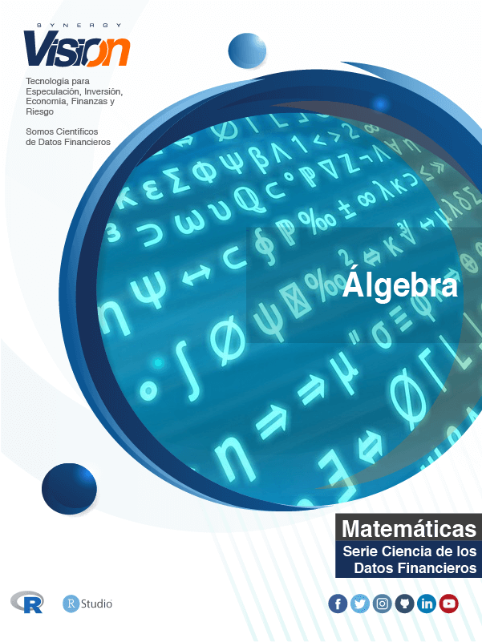

<script src="https://cdn.datacamp.com/datacamp-light-latest.min.js"></script>

--- 
title: "Álgebra Lineal"
subtitle: "Ciencia de los Datos Financieros"
author: "Synergy Vision"
date: "2019-01-16"
knit: "bookdown::render_book"
documentclass: krantz
bibliography: [book.bib, packages.bib]
biblio-style: apalike
link-citations: yes
colorlinks: yes
lot: yes
lof: yes
fontsize: 12pt
monofontoptions: "Scale=0.8"
keep_md: yes
site: bookdown::bookdown_site
description: ""
url: 'http\://synergy.vision/Algebra/'
github-repo: synergyvision/Algebra/
cover-image: images/cover.png
---


# Prefacio {-}

<a href="https://synergy.vision/LibrosInteractivos/" target="_blank"></a>


  
La versión en línea de este libro se comparte bajo la licencia [Creative Commons Attribution-NonCommercial-ShareAlike 4.0 International License](http://creativecommons.org/licenses/by-nc-sa/4.0/).

## ¿Por qué  leer este libro? {-}

Este libro es el resultado de enfocarnos en proveer la mayor cantidad de material sobre Probabilidad y Estadística Matemática con un desarrollo teórico lo más explícito posible, con el valor agregado de incorporar ejemplos de las finanzas y la programación en `R`. Finalmente tenemos un libro interactivo que ofrece una experiencia de aprendizaje distinta e innovadora.

Es mucha la literatura, pero son pocas las opciones donde se pueda navegar el libro de forma amigable y además contar con ejemplos en `R` y ejercicios interactivos, además del contenido multimedia. Esperamos que ésta sea un contribución sobre nuevas prácticas para publicar el contenido y darle vida, crear una experiencia distinta, una experiencia interactiva y visual. El reto es darle vida al contenido asistidos con las herramientas de Internet.

Finalmente este es un intento de ofrecer otra visión sobre la enseñanza y la generación de material más accesible. Estamos en un mundo multidisciplinado, es por ello que ahora hay que generar contenido que conjugue en un mismo lugar las matemáticas, estadística, finanzas y la computación.

Lo dejamos público ya que las herramientas que usamos para ensamblarlo son abiertas y públicas.

## Estructura del libro {-}

## Información sobre los programas y convenciones {-}

Este libro es posible gracias a una gran cantidad de desarrolladores que contribuyen en la construcción de herramientas para generar documentos enriquecidos e interactivos. En particular al autor de los paquetes Yihui Xie xie2015.

## Prácticas interactivas con R {-}

Vamos a utilizar el paquete [Datacamp Tutorial](https://github.com/datacamp/tutorial) que utiliza la librería en JavaScript [Datacamp Light](https://github.com/datacamp/datacamp-light) para crear ejercicios y prácticas con `R`. De esta forma el libro es completamente interactivo y con prácticas incluidas. De esta forma estamos creando una experiencia única de aprendizaje en línea.

<div data-datacamp-exercise data-height="300" data-encoded="true">eyJsYW5ndWFnZSI6InIiLCJwcmVfZXhlcmNpc2VfY29kZSI6ImIgPC0gNSIsInNhbXBsZSI6IiMgQ3JlYSB1bmEgdmFyaWFibGUgYSwgaWd1YWwgYSA1XG5cblxuIyBNdWVzdHJhIGVsIHZhbG9yIGRlIGEiLCJzb2x1dGlvbiI6IiMgQ3JlYSB1bmEgdmFyaWFibGUgYSwgaWd1YWwgYSA1XG5hIDwtIDVcblxuIyBNdWVzdHJhIGVsIHZhbG9yIGRlIGFcbmEiLCJzY3QiOiJ0ZXN0X29iamVjdChcImFcIilcbnRlc3Rfb3V0cHV0X2NvbnRhaW5zKFwiYVwiLCBpbmNvcnJlY3RfbXNnID0gXCJBc2VnJnVhY3V0ZTtyYXRlIGRlIG1vc3RyYXIgZWwgdmFsb3IgZGUgYGFgLlwiKVxuc3VjY2Vzc19tc2coXCJFeGNlbGVudGUhXCIpIn0=</div>


## Agradecimientos {-}

A todo el equipo de Synergy Vision que no deja de soñar. Hay que hacer lo que pocos hacen, insistir, insistir hasta alcanzar. Lo más importante es concretar las ideas. La idea es sólo el inicio y solo vale cuando se concreta.


\BeginKnitrBlock{flushright}<p class="flushright">Synergy Vision, Caracas, Venezuela</p>\EndKnitrBlock{flushright}


<!--chapter:end:index.Rmd-->


# Acerca del Autor {-}

Este material es un esfuerzo de equipo en Synergy Vision, (<http://synergy.vision/nosotros/>).		 

El propósito de este material es ofrecer una experiencia de aprendizaje distinta y enfocada en el estudiante. El propósito es que realmente aprenda y practique con mucha intensidad. La idea es cambiar el modelo de clases magistrales y ofrecer una experiencia más centrada en el estudiante y menos centrado en el profesor. Para los temas más técnicos y avanzados es necesario trabajar de la mano con el estudiante y asistirlo en el proceso de aprendizaje con prácticas guiadas, material en línea e interactivo, videos, evaluación contínua de brechas y entendimiento, entre otros, para procurar el dominio de la materia.
  		  
Nuestro foco es la Ciencia de los Datos Financieros y para ello se desarrollará material sobre: **Probabilidad y Estadística Matemática en R**, **Programación Científica en R**, **Mercados**, **Inversiones y Trading**, **Datos y Modelos Financieros en R**, **Renta Fija**, **Inmunización de Carteras de Renta Fija**, **Teoría de Riesgo en R**, **Finanzas Cuantitativas**, **Ingeniería Financiera**, **Procesos Estocásticos en R**, **Series de Tiempo en R**, **Ciencia de los Datos**, **Ciencia de los Datos Financieros**, **Simulación en R**, **Desarrollo de Aplicaciones Interactivas en R**, **Minería de Datos**, **Aprendizaje Estadístico**, **Estadística Multivariante**, **Riesgo de Crédito**, **Riesgo de Liquidez**, **Riesgo de Mercado**, **Riesgo Operacional**, **Riesgo de Cambio**, **Análisis Técnico**, **Inversión Visual**, **Finanzas**, **Finanzas Corporativas**, **Valoración**, **Teoría de Portafolio**, entre otros.

Nuestra cuenta de Twitter es (https://twitter.com/bysynergyvision) y nuestros repositorios están en GitHub (https://github.com/synergyvision).
  		  
 **Somos Científicos de Datos Financieros**

<!--chapter:end:000-author.Rmd-->

\mainmatter

# Introducción 


<!--chapter:end:010-introduction.Rmd-->

# Estructuras algebraicas

## Conjuntos

Abordaremos los temas relacionados con la teoría de conjuntos desde una perspectiva intuitiva, más bien oparacional para abordar los conceptos básicos necesarios para desarrollar el resto de los capítulos.

### Definiciones Iniciales

Entenderemos por *conjunto* a una colección de objetos cualesquiera. Las palabras *conjunto, colección, familia* suelen ser usadas para denotar este objeto matemático. Los objetos que conforman un conjunto son llamados comunmente *elementos* (o *miembros*) del conjunto. Los conjuntos suelen denotarse con letras mayúsculas $A, B, C, P,\cdots$, mientras que los miembros que los conforman generalmente se denotan con letras minúsculas $a,b, x, y,\cdots$. Si $C$ es un conjunto y $x$ es un elemento de $C$, escribiremos $x\in C$ (o equivalentemente $C\ni x$) lo que se lee *$x$ pertenece al conjunto $C$*. Para denotar lo contrario usaremos el símbolo $\notin$, así $x\notin C$ significa que *$x$ no pertenece a $C$ o $x$ no es miembro de $C$*.

Puede ocurrir que elementos de un conjunto también pertenezcan a otro conjunto. En el caso que todo elemento de un conjunto $A$ es miembro del conjunto $C$ decimos que *$A$ es subconjunto de $C$* (o $C$ contiene a $A$), lo que denotaremos $A\subseteq C$. Es decir, si $x\in A$, entonces $x\in C$ para todo $x$, implica que $A\subseteq C$. Note que es posible que $A$ y $C$ tengan exactamente los mismos elementos, en este caso diremos que los conjuntos $A$ y $C$ son iguale y lo denotaremos por $A=C$. Sin embargo debemos comprobar que $A\subseteq C$ y $C\subseteq A$ para asegurar que $A=C$. En otro caso, cuando $A\subseteq C$ pero $A$ no es igual al conjunto $C$, diremos que *$A$ es un subconjunto propio de $C$* (o *$A$ está propiamente contenido en $C$*).

\BeginKnitrBlock{example}<div class="example"><span class="example" id="exm:unnamed-chunk-8"><strong>(\#exm:unnamed-chunk-8) </strong></span>El conjunto formado por 0, 1, 2, 3, 4, etc. es el llamado conjunto de los *números naturales* y se denota por $\mathbb{N}$.
Se debe saber que podemos definir un conjunto describiendo uno a uno sus miembros. Esto se hace encerrándolos entre llaves. Así, el conjunto de los números naturales es $\mathbb{N}=\{0, 1, 2, 3, 4,\cdots\}$.
Denotaremos por $\mathbb{N}^{*}=\{ 1, 2, 3, \cdots \}$.
</div>\EndKnitrBlock{example}

\BeginKnitrBlock{example}<div class="example"><span class="example" id="exm:unnamed-chunk-9"><strong>(\#exm:unnamed-chunk-9) </strong></span>Dado el conjunto de los números enteros $\mathbb{Z}=\{\cdots,-3,-2,-1,0,1,2,3,\cdots \}$, el conjunto de los números pares (enteros pares) es el conjunto de los números de la forma $2k$ donde $k$ es un entero.
También se puede describir el conjunto anterior así: 

$$\{p\in\mathbb{Z}| p=2k \mbox{ para algú n } k\in\mathbb{Z} \}$$ 
  
lo cual se lee: _el conjunto formado por todos los números enteros_ $p$ _tales que_ $p=2k$ _para algún número entero_ $k$.
</div>\EndKnitrBlock{example}

\BeginKnitrBlock{example}<div class="example"><span class="example" id="exm:unnamed-chunk-10"><strong>(\#exm:unnamed-chunk-10) </strong></span>Denotaremos el conjunto de los números reales po $\mathbb{R}$. El conjunto de las soluciones de la ecuación $7x^{2}+4x-32=0$ es $C=\{x\in\mathbb{R}| x \mbox{ es solució n de } 7x^{2}+4x-32=0 \}$.
  </div>\EndKnitrBlock{example}

### Operaciones entre conjuntos

Dados dos conjuntos $A$ y $B$ podemos definir nuevos conjuntos a partir de estos, con las operaciones entre conjuntos que definiremos a continuación.

\BeginKnitrBlock{definition}<div class="definition"><span class="definition" id="def:uniondeconjuntos"><strong>(\#def:uniondeconjuntos) </strong></span>Dados dos conjuntos $A$ y $B$, el conjunto **unión** de $A$ y $B$ es el conjunto $A\cup B = \{ x| x\in A \mbox{ o } x\in B \}$.
</div>\EndKnitrBlock{definition}

Es decir, la unión de los conjuntos $A$ y $B$ es el conjunto formados por aquellos elementos que pertenezcan a al menos uno de los dos conjuntos, así un elemento que pertenezca tanto a $A$ como a $B$, es miembro de $A\cup B$.

\BeginKnitrBlock{definition}<div class="definition"><span class="definition" id="def:intersecciondeconjuntos"><strong>(\#def:intersecciondeconjuntos) </strong></span>Dados dos conjuntos $A$ y $B$, el conjunto *intersección* de $A$ y $B$ es el conjunto $A\cap B = \{ x| x\in A \mbox{ y } x\in B \}$.
</div>\EndKnitrBlock{definition}

En otras palabras, la intersección de $A$ y $B$ es el conjunto formado por aquellos elementos que pertenecen a ambos conjuntos simultaneamente.

\BeginKnitrBlock{example}<div class="example"><span class="example" id="exm:unnamed-chunk-11"><strong>(\#exm:unnamed-chunk-11) </strong></span>Dados los conjuntos $A$ y $B$, tales que $B\subseteq A$ ($B$ es subconjunto de $A$).  Se tiene que $A\cup A=A$, más aún $A\cup B=A$. Además $A\cap A=A$ y $A\cap B=B$. 
</div>\EndKnitrBlock{example}

\BeginKnitrBlock{example}<div class="example"><span class="example" id="exm:unnamed-chunk-12"><strong>(\#exm:unnamed-chunk-12) </strong></span>Sean $A=\{a,b,c\}$ y $B=\{c,d,e\}$. $A\cup B=\{a,b,c,d,e\}$ y $A\cap B=\{c\}$.  Además $\mathcal{P}(A)=\{\ \emptyset, \{a\}, \{b\}, \{c\}, \{a,b\}, \{a,c\}, \{c,b\}, \{a,b,c\}\}$.
</div>\EndKnitrBlock{example}

\BeginKnitrBlock{example}<div class="example"><span class="example" id="exm:unnamed-chunk-13"><strong>(\#exm:unnamed-chunk-13) </strong></span>Dado el conjunto de los números enteros, $\mathbb{Z}$. Los subconjuntos $\mathbb{Z}^{+}=\{p\in\mathbb{Z}| p \mbox{ es un entero positivo} \}$ y $\mathbb{Z}^{-}=\{p\in\mathbb{Z}| p \mbox{ es un entero negativo} \}$. Se tiene que $\mathbb{Z}\cap \mathbb{Z}^{+}=\mathbb{Z}^{+}$ y  $\mathbb{Z}\cup \mathbb{Z}^{-}=\mathbb{Z}$.

Ahora bien, pensemos en el conjunto $\mathbb{Z}^{+}\cap\mathbb{Z}^{-}$. Note que no existe número entero que pertenezca a $\mathbb{Z}^{+}$ y $\mathbb{Z}^{-}$ simultaneamente. Para que la intersección esté bien definida, el resultado debería ser un conjunto. Con ese fin daremos la siguiente definición.
</div>\EndKnitrBlock{example}

\BeginKnitrBlock{definition}<div class="definition"><span class="definition" id="def:conjuntovacio"><strong>(\#def:conjuntovacio) </strong></span>Diremos que un conjunto es *vacío* si no posee elementos y lo denotaremos por $\emptyset$.
</div>\EndKnitrBlock{definition}

\BeginKnitrBlock{remark}<div class="remark">\iffalse{} <span class="remark"><em>Nota. </em></span>  \fi{}El conjunto vacío es único. Basta con demostrar que dados dos conjuntos $\emptyset$ y $\emptyset_{1}$, se cumple que $\emptyset\subseteq \emptyset_{1}$ y $\emptyset_{1}\subseteq\emptyset$.
</div>\EndKnitrBlock{remark}

\BeginKnitrBlock{definition}<div class="definition"><span class="definition" id="def:conjuntodiferencia"><strong>(\#def:conjuntodiferencia) </strong></span>Dados dos conjuntos $A$ y $B$, el *conjunto diferencia* $A-B$ es el conjunto $\{x\in A | x\notin B \}$.
</div>\EndKnitrBlock{definition}

\BeginKnitrBlock{example}<div class="example"><span class="example" id="exm:unnamed-chunk-15"><strong>(\#exm:unnamed-chunk-15) </strong></span>Dados los conjuntos de los números enteros, $\mathbb{Z}$ y el conjunto de los números naturales $\mathbb{N}=\{0,1,2,3,4,\cdots \}$, el conjunto diferencia $\mathbb{Z}-\mathbb{N}=\{p\in\mathbb{Z}| p\notin \mathbb{N} \}$ es decir, el conjunto de los números enteros que no son números naturales, que no es más que $\mathbb{Z}^{-}$.
</div>\EndKnitrBlock{example}

*Generalización de unión e intersección*

Las operaciones entre conjuntos definidas antes consideran solo dos conjuntos, sin embargo podemos extender las nociones de unión e intesección de conjuntos a una cantidad cualquiera de conjuntos, finita o no.

Dado $n\in\mathbb{N}$. La unión de $n$ conjuntos $A_{1}, A_{2},\cdots,A_{n}$, puede definirse claramente a partir de la unión de dos conjuntos así:

1. Hallamos el conjunto unión de los primeros dos conjuntos $A_{1}\cup A_{2}$ (definición \@ref(def:uniondeconjuntos)).

2. Ahora unimos el conjunto obtenido en el paso i. con el siguiente conjunto $A_{3}$, esto es $(A_{1}\cup A_{2})\cup A_{3}$.

3. Repetimos el paso anterior hasta unir todos los conjuntos.

El algoritmo anterior nos muestra que es posible unir una cantidad finita cualquiera de conjuntos. Análogamente se pueden intersectar $n$ conjuntos, siendo $n$ un número natural cualquiera.

Ahora bien, la unión e intersección de una cantidad arbitraria (no necesariamente finita) también se puede definir.

Dado $I$ un conjunto de índices. Una familia indexada por $I$ es una colección $\mathcal{F}=\{A_{\alpha} | \, \alpha\in I \}$. Note que esta definición permite que el conjunto $I$ sea cualquier conjunto, finito o infinito. Se suele usar el conjunto de los números enteros positivos como conjunto de índices (para numerar) cuando el conjunto es infinito numerable, pero se puede usar cualquier otro conjunto.

La *unión* de los conjuntos $A_{\alpha}$, con $\alpha\in I$, el el conjunto $\bigcup\mathcal{F}=\bigcup_{\alpha\in I} A_{\alpha}=\{x|\, x\in A_{\alpha} \mbox{ para algú n } \alpha\in I \}$. De forma análoga, la *intersección* de los conjuntos $A_{\alpha}$, con $\alpha\in I$, es el conjunto $\bigcap A_{\alpha}=\{x|\, x\in A_{\alpha} \mbox{ para todo } \alpha\in I \}$. Vale resaltar que cuando $I$ es un conjunto finito, digamos $I=\{1,2,\cdots, n\}$, se tiene que $\bigcup A_{\alpha}=\{x|\, x\in A_{\alpha} \mbox{ para algú n } \alpha\in I \}=\{x|\, x\in A_{1} \mbox{ o } x\in A_{2}\mbox{ o }\cdots \mbox{ o } x\in A_{n} \}=A_{1}\cup A_{2},\cdots , A_{n}$.

### Producto cartesiano

\BeginKnitrBlock{definition}<div class="definition"><span class="definition" id="def:unnamed-chunk-16"><strong>(\#def:unnamed-chunk-16) </strong></span>Dados $a$ y $b$ miembros de los conjuntos $A$ y $B$ respectivamente, llamaremos *par ordenado al arreglo $(a,b)$. Diremos que dos pares ordenados $(a,b)$ y $(c,d)$ son iguales (es decir $(a,b)=(c,d)$ si y solo si $a=c$ y $b=d$.</div>\EndKnitrBlock{definition}

\BeginKnitrBlock{definition}<div class="definition"><span class="definition" id="def:unnamed-chunk-17"><strong>(\#def:unnamed-chunk-17) </strong></span>Sean $A$ y $B$ dos conjuntos. El *producto cartesiano de $A$ y $B$* es el conjunto $A\times B$ formado por todos los pares ordenados $(a,b)$, donde $a\in A$ y $b\in B$. Es decir $A\times B=\{(a,b)| \, a\in A \mbox{ y } b\in B \}$.
</div>\EndKnitrBlock{definition}

\BeginKnitrBlock{example}<div class="example"><span class="example" id="exm:unnamed-chunk-18"><strong>(\#exm:unnamed-chunk-18) </strong></span>Si $A=\{1,2,3\}$ y $B=\{3,4,5\}$, entonces el producto cartesiano de $A$ y $B$ es el conjunto

$A\times B=\{ (1,3), (1,4), (1,5), (2,3), (2,4), (2,5), (3,3), (3,4), (3,5)\}$.
</div>\EndKnitrBlock{example}

\BeginKnitrBlock{remark}<div class="remark">\iffalse{} <span class="remark"><em>Nota. </em></span>  \fi{}Dados los conjuntos $A$ y $B$, podemos considerar los conjuntos $A\times B$ y $B\times A$. Como conjuntos son distintos, aunque existe una relación entre ellos (se discutirá mas adelante cuando se definan correspondencias biyectivas ). De igual forma se puede definir el producto cartesiano de una cantidad finita de conjuntos (de forma análoga a la unión de conjuntos). Si $A$, $B$ y $C$ son conjuntos, podemos definir el conjunto $A\times B\times C$ formado por los arreglos (terna ordenada) del tipo $(a,b,c)$, donde $a\in A$, $b\in B$ y $c\in C$. Más aun, se puede definir el producto cartesiano para una cantidad arbitraria de conjuntos. Dado un conjunto de índices $I$, el producto cartesiano de una familia indexada por $I$, $\mathcal{F}=\{A_{\alpha}|\, \alpha\in I \}$, es el conjunto de aplicaciones $f:I\longrightarrow \bigcup\mathcal{F} \mbox{ tales que } f(\alpha)\in A_{\alpha}$, es decir $\prod_{\alpha \in I} A_{\alpha}=\{f:I\longrightarrow\bigcup \mathcal{F} |\, f(\alpha)\in A_{\alpha} \}$. Por último, queremos recalcar que es posible hacer el producto cartesiano de un conjunto consigo mismo, esto es $A\times A$ formado, como es natural por los pares $(a,b)$, con  $a$ y $b$ elementos de $A$. En este caso se puede denotar $A^{2}$ al producto cartesiano de $A$ consigo mismo (y se denota $A^{n}$ al producto cartesiano de $A$ consigo mismo $n$ veces). Para $A^{2}$ llamamos **diagonal** al conjunto formado por los pares de la forma $(a,a)$ y se denota por $\Delta$, es decir, $\Delta=\{(a,a)|\, a\in A \}$.
</div>\EndKnitrBlock{remark}

## Relaciones de Equivalencia

\BeginKnitrBlock{definition}<div class="definition"><span class="definition" id="def:unnamed-chunk-20"><strong>(\#def:unnamed-chunk-20) </strong></span>Dados dos conjuntos $A$ y $B$, una *relación de $A$ sobre $B$*, es un subconjunto $R$ del producto cartesiano $A\times B$. En el caso que $R\subseteq A\times A$, se dice que $R$ es una relación sobre $A$.
</div>\EndKnitrBlock{definition}

\BeginKnitrBlock{definition}<div class="definition"><span class="definition" id="def:unnamed-chunk-21"><strong>(\#def:unnamed-chunk-21) </strong></span>Dada un relación $R$ sobre un conjunto no vacío $A$. Decimos que:

1. $R$ es **reflexiva** si para todo $a\in A$, se tiene que $(a,a)\in R$ (es decir, la diagonal $\Delta$ es subconjunto de $R$).

2. $R$ es **simétrica** si para todo $a,b \in A$, se cumple que: $(a,b)\in R \Leftrightarrow  (b,a)\in R$.

3. $R$ es **transitiva** si para todo $a,b, c \in A$, se cumple que: $(a,b)\in R$ y  $(b,c)\in R$ $\Rightarrow (a,c)\in R$.
</div>\EndKnitrBlock{definition}

\BeginKnitrBlock{definition}<div class="definition"><span class="definition" id="def:unnamed-chunk-22"><strong>(\#def:unnamed-chunk-22) </strong></span>Una relación $R$ sobre un conjunto no vacío $A$, que es reflexiva, simétrica y transitiva, se dice *de equivalencia*.
</div>\EndKnitrBlock{definition}

\BeginKnitrBlock{remark}<div class="remark">\iffalse{} <span class="remark"><em>Nota. </em></span>  \fi{}Si $R$ es una relación sobre $A$, el hecho de que $(a,b)\in R$ se puede denotar como $aRb$ o como $a\simeq b$ cuando el contexto lo permita y quede claro cual es la relación.
De este modo, $R$ es una relación de equivalencia si para todo $a,b,c\in A$ se tiene que: 
  
1. $aRa$,

2. $aRb\Leftrightarrow bRa$ y 

3. $aRb$ y $bRc\Rightarrow aRc$.
</div>\EndKnitrBlock{remark}

\BeginKnitrBlock{example}<div class="example"><span class="example" id="exm:ejm1-9"><strong>(\#exm:ejm1-9) </strong></span>*La igualdad* es una relación de equivalencia.
Dado el conjunto de los números reales $\mathbb{R}$, la igualdad es la relación $aRb$ siempre que $a$ y $b$ sean el mismo número real y se denota por $a=b$. Es claramente reflexiva ya que $a=a$; simétrica pues $a=b$ implica que $a$ y $b$ son el mismo número real y por lo tanto $b=a$ y es transitiva ya que si $a=b$ y $b=a$, entonces $a,b$ y $c$ son el mismo número real, lo que implica que $a=c$.
Note que el conjunto donde definimos la igualdad (los reales $\mathbb{R}$) es irrelevante. Esta relación puede (y de hecho está) definida sobre cualquien conjunto.
</div>\EndKnitrBlock{example}
	
\BeginKnitrBlock{example}<div class="example"><span class="example" id="exm:ejm1-10"><strong>(\#exm:ejm1-10) </strong></span>Dado el conjunto de los números enteros $\mathbb{Z}$, definamos la siguiente relación $R$: $(a,b)\in R$ si y solo si $b-a$ es un número par (o lo que es igual, es un múltiplo de $2$).
$R$ es una relación reflexiva, ya que $a-a=0$ y cero es múltiplo de $2$. Es simétrica ya que si $b-a$ es un número par, entonces $a-b$ también lo es. Ahora mostremos que es transitiva, sean $a, b$ y $c$ números enteros tales que $(a,b)\in R$ y $(b,c)\in R$, entonces $b-a$ y $c-b$ son números pares como también su suma $c-a=(c-b)+(b-a)$, por lo tanto $(a,c)\in R$. En consecuencia, $R$ es una relación de equivalencia.
</div>\EndKnitrBlock{example}

\BeginKnitrBlock{example}<div class="example"><span class="example" id="exm:ejm1-11"><strong>(\#exm:ejm1-11) </strong></span>*La congruencia modular*. Definiremos la siguiente relación sobre el conjunto de los números enteros, $\mathbb{Z}$. Dado un número natural $n$, para cuales quiera enteros $a$ y $b$, decimos que $aRb$ si y solo si $b-a$ es divisible por $n$ (o equivalentemente, $b-a$ es múltiplo de $n$); lo denotamos por $a\cong b\mbox{ mod } n$ y se lee *$a$ congruente con $b$ módulo $n$*.
Es fácil demostrar que la relación es reflexiva.
Supongamos que $a\cong b \mbox{ mod } n$, entonces $b-a=kn$ para algún $k\in\mathbb{Z}$. Luego, $a-b=-kn$ por lo tanto $b\cong a \mbox{ mod } n$. Entonces la relación es simétrica.
Ahora supongamos que $a\cong b \mbox{ mod } n$ y $b\cong c \mbox{ mod } n$. Se tiene así que existen $k,q\in\mathbb{Z}$ tales que $b-a=kn$ y $c-b=qn$. De este modo $c-a=(c-b)+(b-a)=(q-k)n$, de donde se sigue que $a\cong c \mbox{ mod } n$.
De lo anterior se sigue que la relación de congruencia módulo $n$ es una relación de equivalencia.
</div>\EndKnitrBlock{example}

\BeginKnitrBlock{definition}<div class="definition"><span class="definition" id="def:unnamed-chunk-24"><strong>(\#def:unnamed-chunk-24) </strong></span>Dados una relación de equivalencia $R$ sobre un conjunto $A$ y $a\in A$. Definimos *la clase de equivalencia de $a$* como el conjunto $[a]=\{b\in A | aRb\}$. También se denota por $cl(a)$ o $\tilde{a}$.
</div>\EndKnitrBlock{definition}

Pensemos en las clases de equivalencias de los ejemplos anteriores. La clase de equivalencia de $a$ para la relación *igualdad* \@ref(exm:ejm1-9) es el conjunto cuyo único elemento es $a$. Mientras que en el ejemplo \@ref(exm:ejm1-10), la relación solo define dos clases de equivalencia, el conjunto de los números enteros pares y el conjunto de los números enteros impares. En el caso de la *congruencia módulo $n$* \@ref(exm:ejm1-11), la clase de equivalencia de un entero $a$ es el conjunto $\{b\in\mathbb{Z}| a\cong b\mbox{ mod } n \}=\{b\in\mathbb{Z}| b-a=kn\mbox{ para algún } k\in\mathbb{Z} \}=\{b\in\mathbb{Z}| b=kn+a\mbox{ para algún } k\in\mathbb{Z} \}$ es decir, todos los enteros $b$ que tienen por resto $a$ al ser divididos por $n$.


\BeginKnitrBlock{definition}<div class="definition"><span class="definition" id="def:unnamed-chunk-25"><strong>(\#def:unnamed-chunk-25) </strong></span>Dado un conjunto $A$, *una partición de $A$* es una colección de subconjuntos no vacíos de $A$, disjuntos dos a dos, tales que la unión de ellos es todo $A$. Es decir, $\{ B_{i}\subseteq A |\,, i\in I\}$, donde $I$ es un conjunto de índices y se tiene que: 
  
1.  $B_{i}\neq\emptyset$ para todo $i\in I$.

2. $B_{i}\neq B_{j}$, para $i,j\in I$ y $i\neq j$.

3. $\bigcup_{i\in I} B_{i}=A$.
	
Cada subconjunto $B_{i}$ es una parte de $A$.
</div>\EndKnitrBlock{definition}


\BeginKnitrBlock{theorem}<div class="theorem"><span class="theorem" id="thm:unnamed-chunk-26"><strong>(\#thm:unnamed-chunk-26) </strong></span>Las clases de equivalencia definidas por una relación de equivalencia sobre un conjunto $A$ definen una partición de $A$. Recíprocamente, una partición de un conjunto $A$, induce una relación de equivalencia sobre $A$ de forma que las clases de equivalencia corresponden a las partes de la partición.
</div>\EndKnitrBlock{theorem}

\BeginKnitrBlock{proof}<div class="proof">\iffalse{} <span class="proof"><em>Demostración. </em></span>  \fi{}Sea $R$ una clase de equivalencia sobre $A$. Por la reflexividad de $R$ se tiene que $a\in[a]$, por lo tanto $\bigcup_{a\in A} [a]= A$ y $[a]$ es no vacío. Supongamos que $[a]\cap [b]\neq\emptyset$, entonces existe $c\in A$ tal que $c\in [a]\cap [b]$, por transitividad, $aRb$, por lo tanto $[a]=[b]$, es decir, si dos clases no son disjuntas, son iguales.
Recíprocamente, sea  $\{ B_{i}\subseteq A |\,, i\in I\}$ una partición. Definimos la relación $R$, sobre $A$, así: para $a,b\in A$, $aRb$ si y solo si existe $i\in I$ tal que $a,b\in B_{i}$, esto es, $a$ y $b$ pertenecen a la misma parte $B_{i}$. Es muy fácil ver que esta relación es de equivalencia.
</div>\EndKnitrBlock{proof}

## Funciones

Veamos ahora la definición de función (o aplicación), concepto importantísimo en toda la matemática y bastante conocido y usado en la educación matemáticas desde los niveles más básicos. Digamos que una *función* es una regla de asignación entre conjuntos, por ejemplo la función  que asigna a cada número real $r$ su parte entera $\lVert n \rVert$ (el mayor entero menor o igual que $r$), es una función del conjunto de los números reales $\mathbb{R}$ al conjunto de los números enteros y su regla de asignación es la antes descrita. La relación $y=x^{2}$, es una función de $\mathbb{R}$ en si mismo que a cada número real $x$ le relaciona su cuadrado $x^{2}$, desde otro punto de vista, los pares $(x,y)$ pertenecen a la función si $y=x^{2}$, dicho de otro modo, los pares $(x,x^{2})$ forman parte de la función.

\BeginKnitrBlock{definition}<div class="definition"><span class="definition" id="def:unnamed-chunk-28"><strong>(\#def:unnamed-chunk-28) </strong></span>Dados dos conjuntos no vacíos $A$ y $B$, una *función de $A$ en $B$* es un subconjunto $G$ de $A\times B$ tal que para cada $a\in A$, existe un único $b\in B$, tal que $(a,b)\in G$. Lo denotamos por $f: A\longrightarrow B$, con $f(a)=b$. Llamaremos *dominio de $f$* al conjunto $A$ (y se denota $dom(f$) y *codominio* al conjunto $B$. También se suelen llamar conjunto de partida y conjunto de llegada respectivamente.
                                          </div>\EndKnitrBlock{definition}

\BeginKnitrBlock{example}<div class="example"><span class="example" id="exm:identidad"><strong>(\#exm:identidad) </strong></span>Dado un conjunto $A$ no vacío, la *función identidad* es aquella que a cada $a$, le asigna el mismo elemento $a$. Esto es, $i: A\longrightarrow A$ definida por $i(a)=a$ para todo $a\in A$, que no es más que la diagonal de $A\times A$.
</div>\EndKnitrBlock{example}

\BeginKnitrBlock{example}<div class="example"><span class="example" id="exm:ejm1-12"><strong>(\#exm:ejm1-12) </strong></span>Sea $f: \mathbb{R}\longrightarrow\mathbb{R}$ definida por $f(x)=x^{2}$. Los pares de la forma $(x,x^{2})$ forman parte de la función. El conjunto $dom(f)=\mathbb{R}$ y su codominio es $\mathbb{R}$.
</div>\EndKnitrBlock{example}

\BeginKnitrBlock{example}<div class="example"><span class="example" id="exm:ejm1-13"><strong>(\#exm:ejm1-13) </strong></span>Dados $\mathbb{Z}$ el conjunto de los números enteros, y $\mathbb{Q}$ el conjunto de los números racionales, definimos $f:\mathbb{Z}\times\mathbb{Z}\longrightarrow\mathbb{Q}$ de la siguiente forma $f((m,n))=\frac{m}{n}$.
</div>\EndKnitrBlock{example}

\BeginKnitrBlock{example}<div class="example"><span class="example" id="exm:ejm1-14"><strong>(\#exm:ejm1-14) </strong></span>Dados $\mathbb{Z}$ el conjunto de los números enteros, y $\mathbb{Q}$ el conjunto de los números racionales, definimos $f:\mathbb{Q}\longrightarrow \mathbb{Z}\times\mathbb{Z}$ de la siguiente forma. Dado un número racional $q\in\mathbb{Q}$, existen enteros sin factores comunes $m$ y $n$ tales que $q=\frac{m}{n}$. Así, $f(q)=(m,n)$.
</div>\EndKnitrBlock{example}

\BeginKnitrBlock{example}<div class="example"><span class="example" id="exm:ejm1-15"><strong>(\#exm:ejm1-15) </strong></span>Sean $A$ y $B$ conjuntos no vacíos tales que $A\subseteq B$, $\imath: A \longrightarrow B$ dada por $\imath(a)=a$ es la función \textit{inclusión de $A$ en $B$}.
</div>\EndKnitrBlock{example}

\BeginKnitrBlock{example}<div class="example"><span class="example" id="exm:ejm1-16"><strong>(\#exm:ejm1-16) </strong></span>Sea $C$ el conjunto $\{a,b,c\}$. Podemos definir la siguiente función $f:C\longrightarrow C$, donde $f(a)=b$, $f(b)=c$ y $f(c)=a$.
</div>\EndKnitrBlock{example}

\BeginKnitrBlock{example}<div class="example"><span class="example" id="exm:ejm1-17"><strong>(\#exm:ejm1-17) </strong></span>Sean $A$ y $B$ conjuntos no vacíos. $\pi: A\times B\longrightarrow A$ dada por $\pi((a,b))=a$ es la función *proyección de $A\times B$ sobre $A$*. Se puede definir de forma análoga la proyección sobre $B$.
</div>\EndKnitrBlock{example}

\BeginKnitrBlock{example}<div class="example"><span class="example" id="exm:ejm1-18"><strong>(\#exm:ejm1-18) </strong></span>Dado un conjunto $C$ sobre el cual está definida una relación de equivalencia $R$. Llamaremos *conjunto cociente* al conjunto de las clases de equivalencia definidas por $R$, esto es $C/R=\{[a] | a\in C \}$. Definimos $f:C\longrightarrow C/R$, como $f(a)=[a]$.
</div>\EndKnitrBlock{example}

\BeginKnitrBlock{definition}<div class="definition"><span class="definition" id="def:unnamed-chunk-29"><strong>(\#def:unnamed-chunk-29) </strong></span>Una función $f:A\longrightarrow B$ se dice *sobreyectiva* si para todo $b\in B$, existe $a\in A$ tal que $f(a)=b$.
</div>\EndKnitrBlock{definition}

Otra forma de entender la sobreyectividad es pensar que la función "cubre" todo el conjunto de llegada (el codominio).
También podemos entenderla en términos de la imagen de la función, que definiremos a continuación: dada $f:A\longrightarrow B$, si $C\subseteq A$, definimos la *imagen de un conjunto $C$* como el conjunto $\{f(a) | a\in C \}$, al cual denotamos por $f[C]$ o $f''C$. El conjunto imagen del dominio se llamará *Imagen de $f$* a secas, este es $f[A]$ y también se denota $Img(f)$. Entonces la  sobreyectividad es equivalente a que la imagen de $f$ sea igual al codominio, es decir $f[A]=B$.

\BeginKnitrBlock{definition}<div class="definition"><span class="definition" id="def:unnamed-chunk-30"><strong>(\#def:unnamed-chunk-30) </strong></span>Una función $f:A\longrightarrow B$ se llamará *inyectiva* si para todo $a\mbox{ y }b\in A$, si $a\neq b$, entonces $f(a)\neq f(b)$.
</div>\EndKnitrBlock{definition}

Un función inyectiva es pues una función que a cada elemento del dominio le asocia elementos distintos del codominio. Para entender mejor esta definición, definiremos imagen inversa: dada $f:A\longrightarrow B$, si $C\subseteq B$, definimos la *imagen inversa de un conjunto $C$* como el conjunto $\{a | f(a)\in C \}$ y se denota por $f^{-1}[C]$. De este modo, una función es inyectiva si la imagen inversa de los subconjuntos unitarios del codominio tienen a lo sumo un elemento, es decir, $f^{-1}[\{b\}]$ tiene un elemento o es vacío, para todo $b\in B$.

En los ejemplos que antes vimos, la función identidad es sobreyectiva e inyectiva, es decir *biyectiva* (cuando una función es inyectiva y sobreyectiva se le llama biyectiva). La función del ejemplo \@ref(exm:ejm1-12) no es inyectiva, basta ver que $f(1)=f(-1)$. Tampoco es sobreyectiva, no existe número real que tenga un cuadrado negativo. Los ejemplos \@ref(exm:ejm1-15) y \@ref(exm:ejm1-16) muestran funciones biyectivas. Pero los ejemplos \@ref(exm:ejm1-13) y \@ref(exm:ejm1-18) son funciones sobreyectivas que no son inyectivas, mientras que el ejemplo \@ref(exm:ejm1-15) muestra una función inyectiva que no es sobreyectiva.

A continuación definirimos cuando dos funciones son iguales. Intiutivamente, dos funciones serán iguales cuando expresen la misma regla de asignación sobre los mismos objetos. En seguida la definición formal:

\BeginKnitrBlock{definition}<div class="definition"><span class="definition" id="def:unnamed-chunk-31"><strong>(\#def:unnamed-chunk-31) </strong></span>Dos *funciones* $f$ y $g$ de $A$ en $B$, se dicen que son *iguales* si $f(a)=g(a)$ para todo $a\in A$.
</div>\EndKnitrBlock{definition}

Podemos también plantear la situación en la que se relacionen los elementos de dos conjuntos pasando por un tercer conjunto haciendo uso de dos funciones. Es decir, una regla de asignación entre los elementos de un conjunto $A$, en otro conjunto $B$, y otra regla que relacione a los elementos de $B$ con un conjunto $C$ se pueden componer para obtener una regla (una función) de $A$ a $C$.

\BeginKnitrBlock{definition}<div class="definition"><span class="definition" id="def:unnamed-chunk-32"><strong>(\#def:unnamed-chunk-32) </strong></span>Sean $f:A\longrightarrow B$ y $g:B\longrightarrow C$ dos funciones. La composición de $f$ y $g$ es una función de $A$ en $B$ que asigna a cada $a\in A$ el elemento $g(f(a))\in C$. Se denota por $g\circ f$. Entonces $g\circ f: A\longrightarrow B$, definido por $(g\circ f)(a)=g(f(a))$.
</div>\EndKnitrBlock{definition}

\BeginKnitrBlock{remark}<div class="remark">\iffalse{} <span class="remark"><em>Nota. </em></span>  \fi{}Note que el dominio de la función $g$ (la segunda en ser aplicada) debe ser igual al codominio de la función $f$ (pudiése ser un subconjunto del codominio).

Es importante el orden de las funciones, en el contexto general descrito en la definición, no tiene sentido pensar en la composición $f\circ g$, ya que $g(b)$ es un elemento del conjunto $C$ que no es el dominio de $f$, por lo tanto la expresión $f(g(b))$ carece de sentido, salvo que $B$ sea subconjunto de $A$.
</div>\EndKnitrBlock{remark}

\BeginKnitrBlock{example}<div class="example"><span class="example" id="exm:unnamed-chunk-34"><strong>(\#exm:unnamed-chunk-34) </strong></span>Sea $A=\{a,b,c\}$. Sean $f:A\longrightarrow A$ y $g:A\longrightarrow A$ funciones definida por $f(a)=b$, $f(b)=c$ y $f(c)=a$ y $g(a)=a$, $g(b)=c$ y $g(c)=b$. Entonces $(g\circ f)(a)=g(f(a))=g(b)=c$, $(g\circ f)(b)=g(f(b))=g(c)=b$ y $(g\circ f)(c)=g(f(c))=g(a)=a$. Análogamente,  $(f\circ g)(a)=b$, $(f\circ g)(b)=a$ y $(f\circ g)(c)=c$. Aunque ambas funciones compuestas, $g\circ f$ y $f\circ g$ son funciones de $A$ en si mismo, no son iguales ya que  $(g\circ f)(a)=c$ y $(f\circ g)(a)=b$, es decir $(g\circ f)(a)\neq (f\circ g)(a)$
  </div>\EndKnitrBlock{example}

\BeginKnitrBlock{example}<div class="example"><span class="example" id="exm:unnamed-chunk-35"><strong>(\#exm:unnamed-chunk-35) </strong></span>Sea $A=\{a,b,c\}$. Sean $f:A\longrightarrow A$ y $g:A\longrightarrow A$ funciones definida por $f(a)=b$, $f(b)=c$ y $f(c)=a$ y $g(b)=a$, $g(c)=b$ y $g(a)=c$. Entonces $g\circ f$  (y $f\circ g$) es la función identidad de $A$.
</div>\EndKnitrBlock{example}

\BeginKnitrBlock{example}<div class="example"><span class="example" id="exm:unnamed-chunk-36"><strong>(\#exm:unnamed-chunk-36) </strong></span>Dadas las siguientes funciones $f:\mathbb{R}\longrightarrow \mathbb{Z}:x\longmapsto \lVert x\rVert$, la notación que sigue de los dos puntos, $x\longmapsto \lVert x\rVert$ nos indica la regla de asignación, esto es $f(x)=\lVert x\rVert$, donde $\lVert x\rVert$ denota la \textit{parte entera} del número real $x$, a saber: \textit{el mayor entero menor o igual a $x$}. Y la función $g:\mathbb{Z}\longrightarrow \{0,e\}$, definida por 

\begin{equation}
	g(p) = \left\{
	\begin{array}{ll}
	0      & \mbox{ si } p \mbox{ es un nú mero par } \\
	e      & \mbox{ si } p \mbox{ es un nú mero impar }
 \end{array}
	\right.
\end{equation}
	
Entonces, la función $g\circ f$ aplica números reales en $\{0,e\}$. Sin embargo $f\circ g$ no puede definirse, ya que el codominio de $g$ no es un subconjunto del dominio de $f$.
	
Calculemos $g\circ f$ para algunos números: $(g\circ f)(\frac{1}{2})=g(\lVert \frac{1}{2} \rVert)=g(0)=0$, $(g\circ f)(\frac{-3}{2})=g(\lVert \frac{-3}{2} \rVert)=g(-2)=0$ y $(g\circ f)(\pi)=g(\lVert \pi \rVert)=g(3)=e$.
</div>\EndKnitrBlock{example}

Al igual que se pueden componer dos funciones, $f$ y $g$, también se puede hacer con una cantidad cualquiera (finita) de funciones. Dadas las funciones  $f:A\longrightarrow B$, $g:B\longrightarrow C$ y $h:\longrightarrow D$, podemos componer $f$ y $g$ y obtener una función de $A$ en $C$. Y a su vez, componer esta función (la compuesta $g\circ f$ de $A$ en $C$) con la función $h$ y así obtener $h\circ (g\circ f)$ de $A$ en $D$, que es la compuesta de las tres funciones.  En este caso cabe preguntarse si es igual $h\circ (g\circ f)$ que $(h\circ g)\circ f$. El siguiente resultado contesta esta pregunta.

\BeginKnitrBlock{lemma}<div class="lemma"><span class="lemma" id="lem:unnamed-chunk-37"><strong>(\#lem:unnamed-chunk-37) </strong></span>Sean $f:A\longrightarrow B$, $g:B\longrightarrow C$ y $h:\longrightarrow D$ funciones. Entonces $h\circ (g\circ f)=(h\circ g)\circ f$.
</div>\EndKnitrBlock{lemma}

\BeginKnitrBlock{proof}<div class="proof">\iffalse{} <span class="proof"><em>Demostración. </em></span>  \fi{}Lo primero que debemos notar es que tanto $h\circ (g\circ f)$ como $(h\circ g)\circ f$ tienen el mismo dominio y codominio. Efectivamente, $h\circ (g\circ f)$ tiene por dominio el conjunto $A$, porque es dominio de $g\circ f$ (ya vimos antes que el dominio y el codominio de $g\circ f$ son el dominio de $f$ y el codominio de $g$ respectivamente), y su codominio es $D$, el codominio de $h$. Del mismo modo $(h\circ g)\circ f$ tiene dominio $A$ (al ser $dom(f)=A$) y codominio $D$ (que es el codominio de $h\circ g$).
Ahora demostremos que para cada $a\in A$, $(h\circ (g\circ f))(a)=((h\circ g)\circ f)(a)$. Y es muy fácil de ver, $$(h\circ (g\circ f))(a)=h(g\circ f)(a)=h(g(f(a)))=(h\circ g)(f(a))=((h\circ g)\circ f)(a)$$ lo que demuestra lo que queríamos.
</div>\EndKnitrBlock{proof}

Qué sucederá con la composición de dos funciones inyectivas, o sobreyectivas. Esto se muestra en este resultado:

\BeginKnitrBlock{lemma}<div class="lemma"><span class="lemma" id="lem:lema1-2"><strong>(\#lem:lema1-2) </strong></span>Sean $f:A\longrightarrow B$ y $g:B\longrightarrow C$ dos funciones. Entonces:
  
1. $g\circ f$ es sobreyectiva si $f$ y $g$ lo son.

2. $g\circ f$ es inyectiva si $f$ y $g$ lo son.
</div>\EndKnitrBlock{lemma}

\BeginKnitrBlock{proof}<div class="proof">\iffalse{} <span class="proof"><em>Demostración. </em></span>  \fi{}
1) Supongamos que $f$ y $g$ son funciones sobreyectivas. Sea $c\in C$, como $g$ es sobreyectiva, existe $b\in B$ tal que $c=g(b)$. Y como $f$ es sobreyectiva, existe $a\in A$ tal que $b=f(a)$. Se tiene que dado $c$ existe $a$ tal que $c=g(b)=g(f(a))=(g\circ f)(a)$, por lo tanto $g\circ f$ es sobreyectiva.

2) Supongamos que $f$ y $g$ son funciones inyectivas. Sean $a_{1}, a_{2}\in A$, tales que $a_{1}\neq a_{2}$. Como $f$ es inyectiva, se tiene que $f(a_{1})\neq f(a_{2})$. Ahora, como $f(a_{1}) \mbox{ y }f(a_{2})\in B$ y $f(a_{1})\neq f(a_{2})$, de la inyectividad de $g$ se sigue que $g(f(a_{1}))\neq g(f(a_{2}))$, es decir, $(g\circ f)(a_{1})\neq (g\circ f)(a_{2})$, por lo tanto $g\circ f$ es inyectiva.
</div>\EndKnitrBlock{proof}

Si una función $f$ de $A$ en $B$ es biyectiva, para cada $b\in B$ existe $a\in A$ tal que $f(a)=b$, y de la inyectividad se tiene que $a$ es único. De esta manera se puede definir una nueva función de $B$ en $A$ que guarda una extrecha relación con $f$ (pues se define a partir de ella). Dicha función es la *inversa* de $f$. Definámosla formalmente.

\BeginKnitrBlock{definition}<div class="definition"><span class="definition" id="def:unnamed-chunk-40"><strong>(\#def:unnamed-chunk-40) </strong></span>Dada una función biyectiva $f: A \longrightarrow B$, la \textit{función inversa de $f$} es la función $f^{-1}$, definida así $f^{-1}(b)=a$ si y solo si $f(a)=b$.
</div>\EndKnitrBlock{definition}

Además, para cada $a\in A$, sea $b=f(a)$, de donde $(f^{-1}\circ f)(a)=f^{-1}(f(a))=f^{-1}(b)=a$. Es decir, $f^{-1}\circ f$ es la identidad de $A$ (en sí mismo). Análogamente se puede probar que $f\circ f^{-1}$ es la identidad de $B$. Esto es la demostración del siguiente resultado.

\BeginKnitrBlock{lemma}<div class="lemma"><span class="lemma" id="lem:unnamed-chunk-41"><strong>(\#lem:unnamed-chunk-41) </strong></span>Dada una función $f:A\longrightarrow B$ biyectiva, las funciones $f^{-1}\circ f$ y $f\circ f^{-1}$ son iguales a la función identidad (correspondiente a los conjuntos $A$ y $B$).
</div>\EndKnitrBlock{lemma}

Recíprocamente, si dada una función $f: A\longrightarrow B$, existe una función $g:B\longrightarrow A$ tal que $g\circ f$ y $f\circ g$ son la función identidad (sobre $A$ y $B$ respectivamente), entonces se tiene que $f$ es sobreyectiva, en efecto, dado $b\in B$, $b=(f\circ g)(b)$, ya que $f\circ g$ es la identidad (sobre $B$) por lo tanto $b=f(g(b))=f(a)$ para algún $a\in A$ (donde $a=g(b)$). Observemos también que $f$ es inyectiva, ya que si $f(a_{1})=f(a_{2})$ se tiene que $g(f(a_{1}))=g(f(a_{2}))$, como $g\circ f$ es la identidad (sobre $A$) se tiene que $a_{1}=a_{2}$. Esto se puede expresar como sigue.

\BeginKnitrBlock{lemma}<div class="lemma"><span class="lemma" id="lem:unnamed-chunk-42"><strong>(\#lem:unnamed-chunk-42) </strong></span>La función $f:A\longrightarrow B$ es biyectiva si y solo si existe una función $g:B\longrightarrow A$ tal que $g\circ f$ y $f\circ g$ son la función identidad sobre $A$ y $B$ respectivamente.
</div>\EndKnitrBlock{lemma}

\BeginKnitrBlock{definition}<div class="definition"><span class="definition" id="def:unnamed-chunk-43"><strong>(\#def:unnamed-chunk-43) </strong></span>Sea $C$ un conjunto no vacío. $\mathcal{A}(C)$ es el conjunto de todas las funciones biyectivas de $C$ sobre sí mismo.
</div>\EndKnitrBlock{definition}

Respecto a este conjunto, si consideramos la operación *composición de funciones*, tenemos que $\mathcal{A}(C)$ es cerrado bajo esta operación, esto lo demostramos ya en el lema \@ref(lem=lema1-2). Además, como vimos antes, la composición de funciones es asociativa. Sabemos que la identidad y la función inversa son funciones biyectivas (pertenecen también al conjunto $\mathcal{A}(C)$). Es decir, tenemos un conjunto ($\mathcal{A}(C)$) con una operación (la composición de funciones) que tiene una estructura especial (la de grupo). Profundizaremos en esto en la siguiente sección.

## Cardinales

En esta sección demostraremos solo algunos resultados referidos a cardinalidad y números cardinales, solo aquellos que nos sean realmente útiles para el tema que nos ocupa en este trabajo. Quien desee ver las otras demostraciones y ahondar en este tema puede referirse a <añadir bibliografia...Kunen>.

\BeginKnitrBlock{definition}<div class="definition"><span class="definition" id="def:unnamed-chunk-44"><strong>(\#def:unnamed-chunk-44) </strong></span>Dos conjuntos $A, B$ son equipotentes si existe una biyección $f:A \longrightarrow B$ y se denota por $A\sim B$.
</div>\EndKnitrBlock{definition}

\BeginKnitrBlock{theorem}<div class="theorem"><span class="theorem" id="thm:teo1-2"><strong>(\#thm:teo1-2) </strong></span>La equipotencia es una relación de equivalencia.
</div>\EndKnitrBlock{theorem}
\BeginKnitrBlock{proof}<div class="proof">\iffalse{} <span class="proof"><em>Demostración. </em></span>  \fi{}La función identidad (de un conjunto en si mismo) es una biyección, por lo tanto la equipotencia es una relación reflexiva. Si $A\sim B$, existe una biyección $f:A\longrightarrow B$. Ya vimos antes que una función biyectiva es invertible y su inversa es $f^{-1}$ es una biyección de $B$ en $A$, lo que muestra que la simetría. Dadas dos biyecciones $f: A\longrightarrow B$ y $g:B\longrightarrow C$, la composición $g\circ f$ es una biyección de $A$ en $C$, por lo tanto la equipotencia es transitiva.
</div>\EndKnitrBlock{proof}

Podemos preguntarnos cuántos elementos tiene un conjunto. Una forma de "contar" los elementos que tiene un conjunto es la siguiente: Sean $A_{0}=\emptyset$ y para cada número natural $n$, sea $A_{n}=\{1,2,..., n\}$. Es fácil ver que $A_{n}=A_{m}$ si y solo si $n=m$ \@ref(exr:ejc1). De este modo, para ver que un conjunto $C$ tiene $n$ elementos basta ver que es equipotente con $A_{n}$, es decir $C\sim A_{n}$. Diremos que un conjunto es *finito* si es equipotente con algún $A_{n}$ para algún $n\in\mathbb{N}$. Si un conjunto no es finito diremos que es *infinito*. 

Lo anterior nos da una idea del concepto de cardinalidad, que formalmente se definiría como sigue.

\BeginKnitrBlock{definition}<div class="definition"><span class="definition" id="def:unnamed-chunk-46"><strong>(\#def:unnamed-chunk-46) </strong></span>Dado un conjunto $C$, la clase de equivalencia definida por la relación de equipotencia se conoce como el *cardinal* (o *cardinalidad* o *número cardinal*) de $C$ y se denota por $|C|$.
</div>\EndKnitrBlock{definition}

En algunos libros pueden conseguirse otras definiciones de cardinalidad. Los números cardinales pueden ser definidos mas formalmente como un objeto matemático y son de gran importancia en teoría de conjuntos, teniendo ellos mismos una importancia intrínseca, Sin embargo, la definición que presentamos se adecua perfectamente a los temas que trabajaremos aquí.
De la definición anterior y el teorema \@ref(thm:teo1-2) podemos ver los cardinales tienen las siguientes propiedades:

1. Todo conjunto tiene un único número cardinal.
2. Dos conjuntos tienen el mismo número cardinal si y solo si son equipotentes.
3. El cardinal de un conjunto finito es la cantidad de elementos que lo conforman.

\BeginKnitrBlock{example}<div class="example"><span class="example" id="exm:unnamed-chunk-47"><strong>(\#exm:unnamed-chunk-47) </strong></span>La cardinalidad de los conjuntos $A_{n}$ definidos antes es $n$ (la cantidad de elementos que tiene el conjunto).
La cardinalidad del conjunto de los números naturales es $\aleph_{0}$ (se lee alef cero) (también puede conseguirse en alguna literatura que $|\mathbb{N}|=\omega$ y así el primer cardinal infinito $\aleph_{0}$, es igual el ordinal omega). Cualquier conjunto de cardinalidad $\aleph_{0}$, se dice *numerable*. Si un conjunto no es numerable, diremos que es un conjunto *no numerable*.
El número cardinal del conjunto de los números enteros $\mathbb{Z}$ es $\aleph_{0}$, por lo tanto es un conjunto numerable, al igual que el conjunto de los números racionales $\mathbb{Q}$. Por otro lado, el conjunto de los números reales no es numerable.
</div>\EndKnitrBlock{example}

\BeginKnitrBlock{definition}<div class="definition"><span class="definition" id="def:unnamed-chunk-48"><strong>(\#def:unnamed-chunk-48) </strong></span>	Sean $\alpha$ y $\beta$ dos números cardinales. La *suma $\alpha +\beta$* está definida como el número cardinal del conjunto $A\cup B$, donde $\alpha=|A|$ y $\beta=|B|$ y $A$ y $B$ son disjuntos. El producto $\alpha\beta$ está definido como el número cardinal $|A\times B|$, con $\alpha=|A|$ y $\beta=|B|$.
</div>\EndKnitrBlock{definition}

\BeginKnitrBlock{remark}<div class="remark">\iffalse{} <span class="remark"><em>Nota. </em></span>  \fi{}	No es necesario que los conjuntos $A$ y $B$ sean disjuntos para la definición del producto $\alpha\beta$. Dados dos cardinales $\alpha$ y $\beta$, siempre se pueden hallar conjuntos disjuntos $A$ y $B$ tales que $\alpha=|A|$ y $\beta=|B|$. De la definición de cardinal y de los teoremas anteriores, se sigue que las definiciones de suma $\alpha +\beta$ y producto $\alpha\beta$ son independientes de la elección de los conjuntos $A$ y $B$.
</div>\EndKnitrBlock{remark}

Las operaciones de suma y productos de números cardinales son asociativas y commutativa, además se cumple la ley distributiva. Esto no lo demostraremos aquí porque escapa del alcance de este texto. De esto se tiene que la suma y el productos de cardinales finitos es coincidente con la suma y el producto de números naturales no negativos, por lo que existe el elemento identidad para la suma, no es más que el cardinal del conjunto vacío, $0=|\emptyset|$. Pero el producto de cardinales infinitos no coincide con el álgebra natural, por ejemplo el producto del cardinal $\aleph_{0}$ con él mismo, es $\aleph_{0}$. Así, si $A$ y $B$ son conjuntos numerables, $A\times B$ es un conjunto numerable. Para más detalle sobre este tema pueden referirse a HACER REFERENCIA AQUÍ- KUNEN Y DI PRISCO.

\BeginKnitrBlock{definition}<div class="definition"><span class="definition" id="def:unnamed-chunk-50"><strong>(\#def:unnamed-chunk-50) </strong></span>	Sean $\alpha$ y $\beta$ números cardinales y sean $A$ y $B$ conjuntos tales que $\alpha=|A|$ y $\beta=|B|$. Decimos que \textit{$\alpha$ es menor o igual que $\beta$} y lo denotamos así $\alpha\leq\beta$, si y solo si $A$ es equipotente con un subconjunto de $B$ (es decir, existe una función inyectiva $f:A\longrightarrow B$). Decimos que *$\alpha$ es estrictamente menor que $\beta$* y lo denotamos así $\alpha<\beta$, si $\alpha\leq\beta$ y $\alpha\neq\beta$.
</div>\EndKnitrBlock{definition}
Es claro que la definición de $\leq$ no depende de la elección de los conjuntos $A$ y $B$.
 
 \BeginKnitrBlock{theorem}<div class="theorem"><span class="theorem" id="thm:unnamed-chunk-51"><strong>(\#thm:unnamed-chunk-51) </strong></span>	Sea $A$ un conjunto. Entonces $|A|\leq|\mathcal{P}(A)$.
 </div>\EndKnitrBlock{theorem}
 
 \BeginKnitrBlock{proof}<div class="proof">\iffalse{} <span class="proof"><em>Demostración. </em></span>  \fi{}	 Sea $f:A\longrightarrow \mathcal{P}(A)$ la función $f(a)=\{a\}$. Dados $a,b\in A$, si $\{a\}\neq\{b\}$, por definición de igualdad de conjuntos, se tiene que $a\neq b$, por lo tanto $A\leq \mathcal{P}(A)$. Ahora veamos que $A\neq\mathcal{P}(A)$, note que el conjunto $B=\{a\in A: a\notin f(a) \}\subseteq A$ no pertenece al conjunto $Img(A)$, es decir, no existe $a\in A$ tal que $f(a)=B$. 
 </div>\EndKnitrBlock{proof}

Enunciaremos el conocido *Teorema de Schroeder-Bernstein* sin demostración. El lector interesado en estos temas puede remitirse a HACER REFERENCIA AQUí.

\BeginKnitrBlock{theorem}\iffalse{-91-84-101-111-114-101-109-97-32-100-101-32-83-99-104-114-111-101-100-101-114-45-66-101-114-110-115-116-101-105-110-93-}\fi{}<div class="theorem"><span class="theorem" id="thm:unnamed-chunk-53"><strong>(\#thm:unnamed-chunk-53)  \iffalse (Teorema de Schroeder-Bernstein) \fi{} </strong></span>Si $A$ y $B$ son conjuntos tales que $|A|\leq |B|$ y $|B|\leq |A|$. Entonces $|A|=|B|$.
</div>\EndKnitrBlock{theorem}
A continuación veremos resultados que nos permiten caracterizar los grupos cíclicos.

\BeginKnitrBlock{theorem}<div class="theorem"><span class="theorem" id="thm:unnamed-chunk-54"><strong>(\#thm:unnamed-chunk-54) </strong></span>	Sea $H$ un subgrupo del grupo aditivo $\mathbb{Z}$. $H$ es cíclico, además $H=\langle 0\rangle$ o $H=\langle m\rangle$ donde $m$ es el menor entero positivo de $H$.
</div>\EndKnitrBlock{theorem}

\BeginKnitrBlock{proof}<div class="proof">\iffalse{} <span class="proof"><em>Demostración. </em></span>  \fi{}Supongamos que $H\neq \langle 0\rangle$. Entonces existe $m\in H$ mínimo. Como $H$ es subgrupo, es fácil ver que $\langle m\rangle\subseteq H$. Ahora bien, para todo $h\in H$ se tiene que $h=km+r$ para algún entero $k$ y un entero no negativo $r<m$ (algoritmo de la división). De lo anterior se tiene que $r=h-km$ es un elemento de $H$. Como $m$ es el mínimo de $H$, se tiene que $r=0$ de donde se sigue que $h$ es un elemento de $\langle m\rangle$.
</div>\EndKnitrBlock{proof}

\BeginKnitrBlock{remark}<div class="remark">\iffalse{} <span class="remark"><em>Nota. </em></span>  \fi{}En el teorema anterior, si $H\neq \langle 0\rangle$, entonces es infinito.</div>\EndKnitrBlock{remark}

Note que si $G$ es un grupo cíclico, la función que aplica a cada entero $k$ en el elemento $a^{k}$, es un epimorfismo. Además, si el núcleo es $0$, se tiene que $G\cong \mathbb{Z}$; si no, el núcleo es un subgrupo no trivial de $\mathbb{Z}$, por el teorema anterior, será un grupo cíclico, es decir, de la forma $\langle m\rangle$, con $m$ el menor entero positivo tal que $a^{m}=e$. Por otro lado, como $a^{r}=a^{s}\Leftrightarrow a^{r-s}=e$, se tiene que $r-s$ pertenece al núcleo, por lo que $r-s=km$ para algún entero $k$, de donde se tiene que $[r]=[s]\in\mathbb{Z}_{m}$. Por lo que la función que asigna a cada clase de equivalencia $[k]$ de $\mathbb{Z}_{m}$ al elemento $a^{k}$ está bien definida y es un isomorfismo. Esto es lo podemos escribir como el siguiente:

\BeginKnitrBlock{theorem}<div class="theorem"><span class="theorem" id="thm:unnamed-chunk-57"><strong>(\#thm:unnamed-chunk-57) </strong></span>Todo grupo cíclico infinito es isomorfo al grupo aditivo $\mathbb{Z}$ y todo grupo cíclico finito de orden $m$ es isomorfo al grupo aditivo $\mathbb{Z}_{m}$.
</div>\EndKnitrBlock{theorem}

\BeginKnitrBlock{proof}<div class="proof">\iffalse{} <span class="proof"><em>Demostración. </em></span>  \fi{}Sea $G=\langle a\rangle$. Sea $f:\mathbb{Z}\longrightarrow G$ la función definida por $f(k)=a^{k}$. Para cada $b\in G$, existe $r\in\mathbb{Z}$ tal que $b=a^{r}$ por lo tanto $f(r)=a^{r}=b$, esto muestra que $f$ es sobreyectiva. Se tiene que $Ker f=\{0\}$, en caso contrario se tiene que $Ker f=\langle m\rangle$, luego $G$ sería finito.

Si $G$ es un grupo finito, $Ker f=\langle m\rangle$. Sea $g:\mathbb{Z}_{m}\longrightarrow G$ como $g([k])=a^{k}$ está bien definida ya que para todo $r,s\in\mathbb{Z}$, $a^{r}=a^{s}\Leftrightarrow a^{r-s}=e\Leftrightarrow r-s\in Ker f=\langle m\rangle$ por lo tanto $r-s=km$ para algún entero $k$ y así $[r]=[s]$. Es claro que es un epimorfismo, además, como $g([k])=e\Leftrightarrow a^{k}=e=a^{0}\Leftrightarrow [k]=[0]$, entonces $Ker g=\{[0]\}$, por lo tanto $g$ es un isomorfismo. 
</div>\EndKnitrBlock{proof}


### Ejercicios

\BeginKnitrBlock{exercise}<div class="exercise"><span class="exercise" id="exr:ejc1"><strong>(\#exr:ejc1) </strong></span>Dados los conjuntos $A_{0}=\emptyset$ y para cada número natural $n$, sea $A_{n}=\{1,2,..., n\}$. Demuestre que $A_{n}=A_{m}$ si y solo si $n=m$.

Supongamos que $A_{n}=A_{m}$, entonces es fácil ver que $n=M$ (en caso contrario se tendría que $n<m$ o $n>m$). Recíprocamente, si $n=m$, por definición es claro que $A_{n}\subseteq A_{m}$ y $A_{m}\subseteq A_{n}$.
</div>\EndKnitrBlock{exercise}

\BeginKnitrBlock{exercise}<div class="exercise"><span class="exercise" id="exr:ejc2"><strong>(\#exr:ejc2) </strong></span>Denuestre que los conjuntos $\mathbb{Z}$, $\mathbb{Q}$ son conjuntos numerables.

Basta probar que $\mathbb{Z}\sim \mathbb{N}$ y $\mathbb{Q}\sim \mathbb{N}$. Para esto debemos hallar biyecciones entre los conjuntos. Sea $f:\mathbb{Z}\longrightarrow \mathbb{N}$ definida así: 
$$f(n) = \left\{
	\begin{array}{ll}
	-2n-1      & \mbox{ si } n<0\\
	2n      & \mbox{ si } n>=0
	\end{array}
\right.$$
    
Es fácil ver que $f$ es una biyección, ya que $f$ asigna cada número entero negativo a los números naturales impares (1, 3, 5, ...) y cada número entero positivo a los números naturales pares (0, 2, 4, ...).
  
Por otro lado, la función $g:\mathbb{Z}\times\mathbb{N} \longrightarrow \mathbb{Q}$ definida por $f(a,n)=\frac{a}{n}$ es sobreyectiva. Se puede hallar una función inyectiva $\hat{g}$ de $\mathbb{Z}\times\mathbb{N}$ en $\mathbb{Q}$. Por lo tanto $|\mathbb{Q}|\leq |\mathbb{Z}\times\mathbb{N}|$. Como $\mathbb{Z}\times\mathbb{N}$ es numerable, se tiene que $\mathbb{Q}$ es numerable.
    </div>\EndKnitrBlock{exercise}

## Teoría de Grupos

En esta sección estudiaremos un objeto matemático de gran importancia, los grupos. En la sección anterior vimos un grupo que surgió de manera natural, $\mathcal{C}$ junto a la operación composición de funciones, pero el grupo más familiar es el de los números enteros (con la operación suma), con el que nos topamos desde la infancia; en ambos ejemplos vemos que la operación es asociativa, tiene un elemento neutro (la función identidad en el primer caso y el número cero en el caso de los números naturales) y un elemento inverso (la función inversa en un caso y el opuesto en el caso de los naturales).

A continuación presentaremos la definición formal de grupo así como un amplio repertorio de resultados bien conocidos en álgebra respecto a este objeto.

Dado un conjunto no vacío $G$, una *operación binaria* es una función $G\times G\longrightarrow G$. Comunmente se usan las notaciones $a\ast b$ o  $a\cdot b$ para denotar la imagen de $(a,b)$ por la función, aunque puede también usarse $ab$ (obviando el punto como se hace para expresar el producto de dos números) o incluso $a+b$ cuando la operación es la suma usual (como sucede con los números enteros).

\BeginKnitrBlock{definition}<div class="definition"><span class="definition" id="def:unnamed-chunk-59"><strong>(\#def:unnamed-chunk-59) </strong></span>Un par $(G,\ast)$, donde $G$ es un conjunto no vacío y una operacón binaria $\ast:G\times G\longrightarrow G$, forman un *grupo* si:
  
1. Para todo $a,b,c\in G$, $(a\ast b)\ast c=a\ast (b\ast c)$. Es decir, la operación es *asociativa*.
		
2. Existe un elemento $e\in G$ tal que $a\ast e=e\ast a=a$. Llamaremos a tal elemento *neutro (o identidad) bilateral* de $G$.
		
3. Para todo $a\in G$, existe un elemento $a^{-1}\in G$ tal que $a^{-1}\ast a=a\ast a^{-1}=e$, llamado *inverso* de $a$.
</div>\EndKnitrBlock{definition}

\BeginKnitrBlock{remark}<div class="remark">\iffalse{} <span class="remark"><em>Nota. </em></span>  \fi{}Puede hacerse referencia al grupo nombrando solo el conjunto $G$ cuando quede claro cual es la operación.
Si una operacón binaria $\ast:G\times G\longrightarrow G$ es asociativa (1), se dice que $(G,\ast)$ es un *semigrupo*. Llamaremos *monoide* a un semigrupo con identidad (2). De este modo, se puede decir que un grupo es un monoide con inverso (bilateral).
</div>\EndKnitrBlock{remark}

Un semigrupo $G$ se llamará *abeliano* o *commutativo* si la operación es

4. Commutativa, es decir, $a*b=b*a$, para todo $a, b\in G$.
   
El *orden* de un grupo $G$ es la cantidad de elementos que tiene el grupo, es decir, la cardinalidad de $G$ ($|G|$). También se denota $o(G)$ Decimos que un grupo es de *orden finito* (o simplemente finito) si $|G|$ es finito. En caso contrario decimos que el grupo es *infinito*.

\BeginKnitrBlock{example}<div class="example"><span class="example" id="exm:unnamed-chunk-61"><strong>(\#exm:unnamed-chunk-61) </strong></span>El conjunto de los números enteros con el producto usual es un monoide ya que el producto es una operación asociativa y el número uno (1) es el elemento identidad. Como ya lo hemos mencionado, el conjunto de los números enteros, $\mathbb{Z}$ con la operación suma (la suma usual de enteros), forman un grupo. El lector podrá verificar fácilmente que la operación suma es cerrada, es asociativa, que el cero es el elemento neutro ($e$ en la definición) y que cada elemento tiene un inverso ($a^{-1}=-a$). Además es claro que se trata de un grupo abeliano (la suma es una operación commutativa). A un grupo cuya operación es la suma, como en este ejemplo, lo llamaremos *grupo aditivo*, si es el producto, lo denominaremos *grupo multiplicativo*.
</div>\EndKnitrBlock{example}

\BeginKnitrBlock{example}<div class="example"><span class="example" id="exm:unnamed-chunk-62"><strong>(\#exm:unnamed-chunk-62) </strong></span>Dado el conjunto $G={1,-1}$. Definimos la operación $\ast:G\times G \longrightarrow G$ como el producto de números reales usual. El par $(G,\ast)$ forman un grupo abeliano de orden $2$.
</div>\EndKnitrBlock{example}

\BeginKnitrBlock{example}<div class="example"><span class="example" id="exm:unnamed-chunk-63"><strong>(\#exm:unnamed-chunk-63) </strong></span>El conjunto de los números racionales $\mathbb{Q}$ con la suma usual, es un grupo abeliano.
</div>\EndKnitrBlock{example}

\BeginKnitrBlock{example}<div class="example"><span class="example" id="exm:unnamed-chunk-64"><strong>(\#exm:unnamed-chunk-64) </strong></span>Consideremos un cuadrado cuyos vértices estan numerados consecutivamente $1,2,3,4$ centrado en el origen del palno cartesiano y de lados paralelos a los ejes coordenados.

Sea $C_{4}$ el conjunto formado por las siguientes transformaciones: $R$, una rotación de $90º$ del cuadrado. $R^{2}$ una rotación de $180º$ del cuadrados. $R^{3}$ una rotación de $270º$ del cuadrado (todas en el sentido de las agujas del reloj, centradas en el origen). $I$, una rotación de $360º$ (igual que antes en sentido horario, centrada en el origen). $T_{x}$ y $T_{y}$, reflexiones sobre los ejes $x$ y $y$ respectivamente y $T_{I}$ y $T_{II}$ reflexiones sobre las diagonales que pasan por los vértices que están en el primer y tercer cuadrante (la primera) y en el segundo y cuarto cuadrante (la segunda). Con la operación *composición de funciones*, el conjunto $C_{4} = {R, R^{2}, R^{3}, I, T_{x}, T_{y}, T_{I}, T_{II}}$ es un grupo no abeliano de orden $8$ llamado el *grupo de simetría del cuadrado*.
</div>\EndKnitrBlock{example}

\BeginKnitrBlock{example}<div class="example"><span class="example" id="exm:unnamed-chunk-65"><strong>(\#exm:unnamed-chunk-65) </strong></span>Sea $C$ un conjunto no vacío y $\mathcal{A}(C)$ el conjunto de todas las biyecciones de $C$ en si mismo. Con la operación composición de funciones vista en la sección anterior, $\mathcal{A}(C)$ forma un grupo (no abeliano). En efecto, la composición de funciones biyectivas es asociativa, la identidad es una función biyectiva y toda biyección tiene una inversa. Los elementos de $\mathcal{A}(C)$ son llamados *permutaciones* y $\mathcal{A}(C)$ es llamado el grupo de permutaciones sobre $C$. Si $C=\{1,2, ..., n\}$, entonces $\mathcal{A}(C)$ es llamdo el *grupo simétrico sobre $n$ letras* y se denota $S_{n}$. Se puede ver que $|S_{n}|=n!$ (ejercicio \@ref(exr:ejc3)).
</div>\EndKnitrBlock{example}

\BeginKnitrBlock{remark}<div class="remark">\iffalse{} <span class="remark"><em>Nota. </em></span>  \fi{}Dado un elemento $f\in S_{n}$, podemos representarlo por 

$$\left(  {\begin{array}{ccccc}
	1 & 2 & 3 & \cdots & n \\
	i_{1} & i_{2} & i_{3} & \cdots & i_{n}\\
	\end{array} } \right) $$
  
Y el producto de dos de estos elementos, $f, g\in\mathcal{C}$ es la composición de dos biyecciones $f\circ g$, y puede representarse por un arreglo como el anterior tomando en cuenta que $(f\circ g)(k)=f(g(k))=f(i_{k})$. Si suponemos que $f,g\in S_{5}$, donde $f$ está representado por 

$$\left(  {\begin{array}{ccccc}
	1 & 2 & 3 & 4 & 5 \\
	3 & 4 & 1 & 2 & 5 \\
	\end{array} } \right)$$
  
Y $g$ es la biyección

$$\left(  {\begin{array}{ccccc}
	1 & 2 & 3 & 4 & 5 \\
	5 & 4 & 3 & 2 & 1 \\
	\end{array} } \right)$$
  
Entonces  $f\circ g$ es  tal que $(f\circ g)(1)=f(g(1))=f(5)=5$, análogamente con los números del $2$ al $5$, por lo tanto, $f\circ g$ es 

$$\left(  {\begin{array}{ccccc}
	1 & 2 & 3 & 4 & 5 \\
	5 & 2 & 1 & 4 & 3 \\
	\end{array} } \right)$$
  
Mientras que $g\circ f$ es 

$$\left(  {\begin{array}{ccccc}
	1 & 2 & 3 & 4 & 5 \\
	3 & 2 & 5 & 4 & 1 \\
	\end{array} } \right)$$
  
Lo que evidencia que $S_{n}$ no es necesariamente un grupo abeliano.
</div>\EndKnitrBlock{remark}

\BeginKnitrBlock{example}<div class="example"><span class="example" id="exm:ejm1-21"><strong>(\#exm:ejm1-21) </strong></span>Dados $G$ y $H$ dos grupos con identidades $e_{G}$ y $e_{H}$ respectivamente. Consideremos el producto cartesiano $G\times H$ y la operación binaria $(a,b)\ast (c,d)=(a\ast c,b\ast d)$ donde $a\ast c\in G$ y $b\ast d\in H$. Con esta operación $G\times H$ es un grupo con identidad $(e_{G}, e_{H})$ y con inverso $(a^{-1}, b^{-1})$ para cada elemento $(a,b)\in G\times H$.
</div>\EndKnitrBlock{example}

\BeginKnitrBlock{definition}<div class="definition"><span class="definition" id="def:unnamed-chunk-67"><strong>(\#def:unnamed-chunk-67) </strong></span>Una relación de equivalencia sobre un monoide $G$ que satisface que si $a_{1}\sim a_{2}$ y $b_{1}\sim b_{2}$, entonces $a_{1}b_{1}\sim a_{2}b_{2}$ para todo $a_{1},a_{2},b_{1},b_{2}\in G$, se llama *relación de congruencia*.</div>\EndKnitrBlock{definition}

\BeginKnitrBlock{theorem}<div class="theorem"><span class="theorem" id="thm:unnamed-chunk-68"><strong>(\#thm:unnamed-chunk-68) </strong></span>Si $\sim$ es una relación de congruencia sobre un monoide $G$, entonces el conjunto $G/\sim$ de todas las clases equivalencia de $(G,\sim)$ es un monoide con la operación binaria definida por $[a][b]=[ab]$. Si $G$ es un grupo abeliano, entoces $(G,\sim)$ lo és.</div>\EndKnitrBlock{theorem}

\BeginKnitrBlock{proof}<div class="proof">\iffalse{} <span class="proof"><em>Demostración. </em></span>  \fi{}Como $\sim$ es una relación de equivalencia, se tiene que:
  
(1) Si $[a_{1}]=[a_{2}]$ y $[b_{1}]=[b_{2}]$, $a_{1}\sim a_{2}$ y $b_{1}\sim b_{2}$, entonces $a_{1}b_{1}\sim a_{2}b_{2}$, es decir, $[a_{1}b_{1}]= [a_{2}b_{2}]$. Entonces la operación está bien definida. $G/\sim$ tiene un elemento neutro, para todo $a\in G$ se tiene que $[a][e]=[ae]=[a]=[ea]=[e][a]$, donde $e\in G$ es el elemento neutro del monoide. La operación es asociativa, en efecto, $[a]([b][c])=[a][bc]=[a(bc)]=[(ab)c]=[ab][c]=([a][b])[c]$. De aquí concluímos que $G/\sim$ es un monoide.
Supongamos que $G$ es un grupo abeliano, entonces cada $a\in G$ tiene un elemento inverso  $a^{-1}\in G$. De este modo, para cada $[a]\in G/\sim$, se tiene que $[a^{-1}]\in G/\sim$ es el inverso de $[a]$ ya que $[a][a^{-1}]=[aa^{-1}]=[e]=[a^{-1}][a]=[a^{-1}][a]$. Así $G/\sim$ es un grupo. Se ve fácilmente que si $G$ es abeliano, entonces $G/\sim$ lo és, ya que $[a][b]=[ab]=[ba]=[b][a]$. 
</div>\EndKnitrBlock{proof}

Este teorema dota de otros ejemplos, tanto de monoides como de grupos:

\BeginKnitrBlock{example}<div class="example"><span class="example" id="exm:unnamed-chunk-70"><strong>(\#exm:unnamed-chunk-70) </strong></span>Para un entero fijo, la relación de congruencia modular es una relación de congruencia sobre el grupo aditivo $\mathbb{Z}$. Como $(\mathbb{Z}, +)$ es un grupo abeliano, se tiene que $\mathbb{Z}_{n}$ es un grupo aditivo abeliano, con la operación natural $[a]+[b]=[a+b]$.
</div>\EndKnitrBlock{example}

\BeginKnitrBlock{example}<div class="example"><span class="example" id="exm:unnamed-chunk-71"><strong>(\#exm:unnamed-chunk-71) </strong></span>$(Z,\ast)$ es un monoide sobre $\mathbb{Z}$ con la multiplicación usual de enteros. por lo tanto $\mathbb{Z}_{n}$ es un monoide, con la operación $[a]\ast[b]=[a\ast b]$.
</div>\EndKnitrBlock{example}

Veremos algunos resultados muy técnicos que nos serán útiles mas adelante.

\BeginKnitrBlock{lemma}<div class="lemma"><span class="lemma" id="lem:unnamed-chunk-72"><strong>(\#lem:unnamed-chunk-72) </strong></span>Sea $G$ un grupo, entonces se tiene que:
  
1. el elemento identidad de $G$ es único;

2. para cada $a\in G$, el inverso $a^{-1}$ es único;

3. para todo $a\in G$, se tiene que $(a^{-1})^{-1}=a$;
  
4. para $a,b\in G$, se tiene que $(a*b)^{-1}=b^{-1}*a^{-1}$.
  </div>\EndKnitrBlock{lemma}

\BeginKnitrBlock{proof}<div class="proof">\iffalse{} <span class="proof"><em>Demostración. </em></span>  \fi{}
1. Supongamos que $e, f\in G$ son tales que, $\forall a\in G$, $a*e=e*a=a$ y $a*f=f*a=a$. En particular, $f*e=f$ y $f*e=e$, de donde se sigue que $e=f$.

2. Sea $a\in G$, veamos que si $a*x=a*y$, entonces $x=y$; en efecto, sea $b$ un inverso de $a$, es decir, $a*b=b*a=e$. De la igualdad $a*x=a*y$ se tiene que $b*(a*x)=b*(a*y)$ y así $(b*a)*x=(b*a)*y$, por lo tanto $x=y$. De este modo, si dos elemento $b,c\in G$ son dos inversos de $a$ se tiene que $a*b=e=a*c$ y de lo anterior se sigue que $b=c$.

3. Sabemos que $a^{-1}*(a^{-1})^{-1}=e=a^{-1}*a$, por lo que demostramos en la parte b), se sigue fácilmente que $(a^{-1})^{-1}=a$.

4. De la asociatividad se tiene la igualdad $(a*b)*(b^{-1}*a^{-1})=(a*(b*b^{-1})*a^{-1})=a*e*a^{-1}=e$. Y por la unicidad del elemento inverso (demostrada justo antes) se sigue que $(a*b)^{-1}$ es igual a $b^{-1}*a^{-1}$.
</div>\EndKnitrBlock{proof}

\BeginKnitrBlock{definition}<div class="definition"><span class="definition" id="def:unnamed-chunk-74"><strong>(\#def:unnamed-chunk-74) </strong></span>Un subconjunto $H$ de un grupo $G$, se llama *subgrupo* de $G$ si respecto a la operación definida sobre $G$, él mismo forma un grupo. Esto se denota por $H< G$.
</div>\EndKnitrBlock{definition}

Suponga que $G$ es un grupo y $H\subseteq G$ es un subconjunto cerrado bajo la operación de grupo definida sobre G, es decir, para todo $a,b\in H$ se tiene que $ab\in H$. Y cada elemento de $H$ tiene su inverso también en $H$, esto es, si $a\in H$, entonces $a^{-1}\in H$. Es claro que $H$ será un semigrupo de $G$.
 Esto lo mostramos en el siguiente resultado:

\BeginKnitrBlock{lemma}<div class="lemma"><span class="lemma" id="lem:unnamed-chunk-75"><strong>(\#lem:unnamed-chunk-75) </strong></span>Un subconjunto no vacío $H$ de un grupo $G$, es un subgrupo si y solo si:
  
1. para cada $a,b\in H$, $ab\in H$.

2. para cada $a\in H$, $a^{-1}\in H$.
</div>\EndKnitrBlock{lemma}

\BeginKnitrBlock{proof}<div class="proof">\iffalse{} <span class="proof"><em>Demostración. </em></span>  \fi{}Es claro que si $H\subseteq G$ es un subgrupo de $G$, cumple 1 y 2.
Recíprocamente, supongamos que $H\subseteq G$, cumple con (1) y (2) Faltaría ver que la operación es asociativa en $H$ y que el elemento neutro está en $H$. La ley asociativa se hereda de $G$ (si la operación es asociativa en $G$, de igual forma lo será en $H$). Como para cada elemento de $H$ tiene un inverso, existen $a, a^{-1}\in H$; además se tiene que la operación es cerrada en $H$, luego $e=aa^{-1}\in H$. Por lo tanto se tiene que $H$ es un grupo (con la operación heredada de $G$). 
</div>\EndKnitrBlock{proof}

\BeginKnitrBlock{lemma}<div class="lemma"><span class="lemma" id="lem:unnamed-chunk-77"><strong>(\#lem:unnamed-chunk-77) </strong></span>Si $H$ es un subconjunto finito no vacío de un grupo $G$ y $H$ es cerrado bajo la operación de grupo, entonces $H$ es un subgrupo de $G$.
</div>\EndKnitrBlock{lemma}

\BeginKnitrBlock{proof}<div class="proof">\iffalse{} <span class="proof"><em>Demostración. </em></span>  \fi{}Note que, dado $a\in H$, $a, a^{2}, a^{3},\cdots , c^{n},\cdots \in H$. Pero $H$ es finito, por lo tanto existen enteros positivos $r>s>0$ tales que $a^{r}=a^{s}$, entonces se tiene que $a^{r}a^{-s}=a^{s}a^{-s}$ de donde se sigue a $a^{r-s}=e$, lo que muestra que $e\in H$. Por otro lado, $a^{r-s-1}$ está en la lista de elementos de $H$, por lo tanto, dado $a\in H$ se tiene que $a^{-1}=ea^{-1}=a^{r-s-1}\in H$ ya que $aa^{-1}=aa^{r-s-1}=a^{r-s}=e=a^{r-s}=a^{r-s-1}a=a^{-1}a$. Por el lema anterior, se tiene que $H$ es un subgrupo de $G$.
</div>\EndKnitrBlock{proof}

Este lema nos permite saber si un subconjunto finito de un grupo es un subgrupo tan solo probando que la operación de grupo es cerrada en el subconjunto finito. 

Veamos a continuación algunos ejemplos de subgrupos.

\BeginKnitrBlock{example}<div class="example"><span class="example" id="exm:unnamed-chunk-79"><strong>(\#exm:unnamed-chunk-79) </strong></span>Dado un grupo $G$. El mismo $G$ es un subgrupo. El conjunto cuyo único elemento es la identidad del grupo, $\{e\}$ es un subgrupo. Estos dos se conocen con el nombre de *subgrupos triviales* del grupo $G$.
</div>\EndKnitrBlock{example}

\BeginKnitrBlock{example}<div class="example"><span class="example" id="exm:unnamed-chunk-80"><strong>(\#exm:unnamed-chunk-80) </strong></span>Consideremos el grupo aditico de los números enteros. Sea $n\in\mathbb{N}$ un entero positivo. El conjunto $H_{n}$ formado por los múltiplos de $n$ es un subgrupo. Es fácil ver que si sumamos dos múltiplos de $n$, es resultado es un múltiplo de $n$, $kn+qn=(k+q)n$. Además $k\ kn$ y $-kn$ están en $H$ y $kn+(-kn)=0=-kn+kn$.

Es interesante pensar en el conjunto intersección de dos de estos subgrupos, es decir, $H_{n}\cap H_{m}$. 
</div>\EndKnitrBlock{example}

\BeginKnitrBlock{example}<div class="example"><span class="example" id="exm:unnamed-chunk-81"><strong>(\#exm:unnamed-chunk-81) </strong></span>Sea $G$ un grupo cualquiera, sea $a\in G$ un elemento cualquiera. El conjunto $\rangle a\langle =\{a^{n}|n\in\mathbb{Z} \}$ es un subgrupo de $G$ llamado el \textit{grupo cíclico generado por $a$}. Efectivamente, claramente la operación es cerrada, para cuales quiera $a^{n}, a^{m}\in (a)$, $a^{n}a^{m}=a^{n+m}\in (a)$. por definición de $(a)$, $a^{n}$ y $a^{-n}$ están en $(a)$. Si para algún $a\in G$, $G=(a)$, entonces decimos que $G$ es un grupo cíclico. El orden de un elemento $a\in G$ es el orden del grupo generado por $a$, es decir el orden de $|\rangle a\langle|$.
</div>\EndKnitrBlock{example}

\BeginKnitrBlock{theorem}<div class="theorem"><span class="theorem" id="thm:unnamed-chunk-82"><strong>(\#thm:unnamed-chunk-82) </strong></span>Sea $G$ un grupo y sea $\{H_{i}|i\in I \}$ una familia no vacía de subgrupos de $G$, entonces $\bigcap_{i\in I} H_{i}$ es un subgrupo de $G$.
</div>\EndKnitrBlock{theorem}

La demostración queda como ejercicio.

\BeginKnitrBlock{definition}<div class="definition"><span class="definition" id="def:unnamed-chunk-83"><strong>(\#def:unnamed-chunk-83) </strong></span>Sea $G$ un grupo y sea $X$ un subconjunto de $G$. Sea $I$ una familia de índices, entonces $\bigcap_{i\in I} \{H_{i}|X\subseteq H_{i}< G \}$ es el ***subgrupo generado por $X$** y se denota por $\langle X \rangle$.
</div>\EndKnitrBlock{definition}

\BeginKnitrBlock{remark}<div class="remark">\iffalse{} <span class="remark"><em>Nota. </em></span>  \fi{}Es importante hacer notar que el subgrupo $\langle X\rangle$ puede ser generado por otro conjunto de elementos de $G$, es decir, puede ocurrir que $\angle X\rangle=\langle Y\rangle$, con $X\neq Y$. Si en conjunto $X$ es un conjunto finito, en lugar de $\langle X\rangle$ escribimos $\langle x_{1},x_{2},\cdots , x_{n}\rangle$, donde $X=\{x_{1}, x_{2},\cdots ,x_{n}\}$.

Si un grupo es generado por un conjunto finito de elementos, es decir, $G=\langle a_{1}, a_{2},\cdots ,a_{n}\rangle$, donde $a_{i}\in G$ decimos que $G$ es un grupo *finitamente generado*.
</div>\EndKnitrBlock{remark}

\BeginKnitrBlock{theorem}<div class="theorem"><span class="theorem" id="thm:unnamed-chunk-85"><strong>(\#thm:unnamed-chunk-85) </strong></span>Si $G$ es un grupo y $X$ un subconjunto no vacío de $G$, entonces el subgrupo $\langle X\rangle$ generado por $X$ está contituído por los productos de la forma $a_{1}^{m_{1}}a_{2}^{m_{2}}\cdots a_{n}^{m_{n}}$ donde $a_{i}\in X$, $m_{i}\in\mathbb{Z}$ y $n$ es un número entero positivo cualquiera. En particular $\langle a\rangle=\{a^{n}|n\in\mathbb{Z} \}$.
</div>\EndKnitrBlock{theorem}

\BeginKnitrBlock{proof}<div class="proof">\iffalse{} <span class="proof"><em>Demostración. </em></span>  \fi{}Veamos que $H=\{a_{1}^{m_{1}}a_{2}^{m_{2}}\cdots a_{n}^{m_{n}} | n\in\mathbb{N}, a_{i}\in X$ \mbox{ y } $m_{i}\in\mathbb{Z}\}$ es un subgrupo de $G$ que contiene a $X$. En efecto, claramente $X\subseteq H$. Además, si $a\in X$, $a^{-1}\in H$ por lo tanto para $b,c\in H$, por definición de $H$ se tiene que  $b=a_{1}^{m_{1}}a_{2}^{m_{2}}\cdots a_{n}^{m_{n}}$ y $c=a_{1}^{r_{1}}a_{2}^{r_{2}}\cdots a_{k}^{r_{k}}$ por lo tanto $b^{-1}=a_{n}^{-m_{n}}\cdots  a_{2}^{m_{2}}a_{1}^{m_{1}} \in H$ y $bc=a_{1}^{m_{1}}a_{2}^{m_{2}}\cdots a_{n}^{m_{n}}a_{1}^{r_{1}}a_{2}^{r_{2}}\cdots a_{k}^{r_{k}}In H$. De donde se concluye que $H$ es un subgrupo que contine a $G$.

Ahora note que $H$ está contenido en todo subgrupo que contenga a $X$. Por lo tanto $H=\bigcap_{i\in I} \{H_{i}|X\subseteq H_{i}< G \}$.
</div>\EndKnitrBlock{proof}

\BeginKnitrBlock{definition}<div class="definition"><span class="definition" id="def:unnamed-chunk-87"><strong>(\#def:unnamed-chunk-87) </strong></span>Sean $G$ y $H$ dos semigrupos. Una función $f:G\longrightarrow H$ es un *homomorfismo* si y solo si $f(ab)=f(a)f(b)$ para todo $a,b\in G$.

Si $f$ es inyectiva, decimos que $f$ es un *monomorfismo*. Si $f$ es sobreyectiva, diremos que $f$ es un *epimorfismo*. Cuando $f$ es una función biectiva diremos que $f$ es un *isomorfismo* y esto lo denotaremos por $G\cong H$.
	</div>\EndKnitrBlock{definition}

\BeginKnitrBlock{remark}<div class="remark">\iffalse{} <span class="remark"><em>Nota. </em></span>  \fi{}Un homomorfimos de $G$ en si mismo es llamado *endomorfismo de $G$*. Y un isomorfismo de $G$ en si mismo se conoce como *automorfismo de $G$*. 

Como todo grupo es un semigrupo, la definición de homomorfismo de grupo aplica perfectamente a grupos, al igual que el resto de las definiciones.
</div>\EndKnitrBlock{remark}

Note que dados dos homomorfismos de semigrupos $f:G\longrightarrow H$ y $g:H\longrightarrow K$, la composición $g\circ f:G\longrightarrow K$ es un homomorfismo de semigrupo. Por lo tanto se tiene que la composición de monomorfismos, es un monomorfismo, análogamente para epimorfismos e isomorfismos. Si $f:G\longrightarrow H$ es un homomorfismo de grupos y $e_{G}$ y $e_{H}$ son los elementos identidad de los grupos $G$ y $H$ respectivamente, entonces se tiene que $f(e_{G})=e_{H}$, por lo tanto $f(a^{-1})=f(a)^{-1}$. No obstante, si $G$ y $H$ son monoides, esto no es cierto.

\BeginKnitrBlock{definition}<div class="definition"><span class="definition" id="def:unnamed-chunk-89"><strong>(\#def:unnamed-chunk-89) </strong></span>Dado $f:G\longrightarrow H$ un homomorfismo de grupo. El *núcleo* de $f$ (también conocido por su nombre en inglés *kernel*) es el conjunto $\{a\in G| f(a)=e_{H} \}$ y se denota $Ker f$. Dado $A\subseteq G$, *la imagen de $A$* es el conjunto $\{f(a)| a\in A \}$ y se denota por $f(A)$; al conjunto imagen de $G$, lo llamaremos *imagen de $f$* y le daremos una notación especial, $Im f$. Dado un conjunto $B\in H$, la imagen inversa de $B$ es el conjunto $f^{-1}(B)=\{a\in G|f(a)\in B \}$.
</div>\EndKnitrBlock{definition}

\BeginKnitrBlock{theorem}<div class="theorem"><span class="theorem" id="thm:1homomorfismo"><strong>(\#thm:1homomorfismo) </strong></span>Sea $f:G\longrightarrow H$ un homomorfismo de grupos. Entonces:

1. $f$ es un monomorfismo si y solo si $Ker f=\{e_{G}\}$.

2. $f$ es un isomorfismo si y solo si existe un homomorfismo $g:H\longrightarrow G$ tal que $f^{-1}\circ f=\mathbb{I}_{G}$ y $f\circ f^{-1}=\mathbb{I}_{H}$.
	</div>\EndKnitrBlock{theorem}

\BeginKnitrBlock{proof}<div class="proof">\iffalse{} <span class="proof"><em>Demostración. </em></span>  \fi{}	
1. Supongamos que $f$ es un monomorfismo. Sea $a\in Ker f$, entonces $f(a)=e_{H}$. Como $f(e_{g})=e_{H}$ y $f$ es inyectiva, se tiene que $a=e_{G}$. Ahora supongamos que $Ker f=\{e_{G} \}$ y sean $a, b\in G$ tales que $f(a)=f(b)$. Entonces $=f(ab^{-1})f(a)f(b^{-1})=f(a)f(b)^{-1}=f(b)f(b)^{-1}=e_{H}$, por lo tanto $ab^{-1}=e_{G}$ de donde se sigue que $a=b$ y así $f$ es un monomorfismo.

2. Ya vimos en la sección de funciones que existe la función inversa y que ella es biyectiva, además en \@ref{lema1.48} vimos que $f^{-1}\circ f=\mathbb{I}_{G}$ y $f\circ f^{-1}=\mathbb{I}_{H}$. El recíproco se tiene del lema siguiente \ref{lema1.49}.
</div>\EndKnitrBlock{proof}

A continuación veremos resultados que nos permiten caracterizar los grupos cíclicos.

\BeginKnitrBlock{theorem}<div class="theorem"><span class="theorem" id="thm:unnamed-chunk-91"><strong>(\#thm:unnamed-chunk-91) </strong></span>Sea $H$ un subgrupo del grupo aditivo $\mathbb{Z}$. $H$ es cíclico, además $H=\langle 0\rangle$ o $H=\langle m\rangle$ donde $m$ es el menor entero positivo de $H$.
</div>\EndKnitrBlock{theorem}

\BeginKnitrBlock{proof}<div class="proof">\iffalse{} <span class="proof"><em>Demostración. </em></span>  \fi{}Supongamos que $H\neq \langle 0\rangle$. Entonces existe $m\in H$ mínimo. Como $H$ es subgrupo, es fácil ver que $\langle m\rangle\subseteq H$. Ahora bien, para todo $h\in H$ se tiene que $h=km+r$ para algúno entero $k$ y un entero no negativo $r<m$ (algoritmo de la división). De lo anterior se tiene que $r=h-km$ es un elemento de $H$. Como $m$ es el mínimo de $H$, se tiene que $r=0$ de donde se sigue que $h$ es un elemento de $\langle m\rangle$.
</div>\EndKnitrBlock{proof}

\BeginKnitrBlock{remark}<div class="remark">\iffalse{} <span class="remark"><em>Nota. </em></span>  \fi{}En el teorema anterior, si $H\neq \langle 0\rangle$, entonces es infinito.
</div>\EndKnitrBlock{remark}

Note que si $G$ es un grupo cíclico, la función que aplica a cada entero $k$ en el elemento $a^{k}$, es un epimorfismo. Además, si el núcleo es $0$, se tiene que $G\cong \mathbb{Z}$; si no, el núcleo es un subgrupo no trivial de $\mathbb{Z}$, por el teorema anterior, será un grupo cíclico, es decir, de la forma $\langle m\rangle$, con $m$ el menor entero positivo tal que $a^{m}=e$. Por otro lado, como $a^{r}=a^{s}\Leftrightarrow a^{r-s}=e$, se tiene que $r-s$ pertenece al núcleo, por lo que $r-s=km$ para algún entero $k$, de donde se tiene que $[r]=[s]\in\mathbb{Z}_{m}$. Por lo que la función que asigna a cada clase de equivalencia $[k]$ de $\mathbb{Z}_{m}$ al elemento $a^{k}$ está bien definida y es un isomorfismo. Esto es lo podemos escribir como el siguiente:

\BeginKnitrBlock{theorem}<div class="theorem"><span class="theorem" id="thm:teo1-86"><strong>(\#thm:teo1-86) </strong></span>Todo grupo cíclico infinito es isomorfo al grupo aditivo $\mathbb{Z}$ y todo grupo cíclico finito de orden $m$ es isomorfo al grupo aditivo $\mathbb{Z}_{m}$.
</div>\EndKnitrBlock{theorem}

\BeginKnitrBlock{proof}<div class="proof">\iffalse{} <span class="proof"><em>Demostración. </em></span>  \fi{}Sea $G=\langle a\rangle$. Sea $f:\mathbb{Z}\longrightarrow G$ la función definida por $f(k)=a^{k}$. Para cada $b\in G$, existe $r\in\mathbb{Z}$ tal que $b=a^{r}$ por lo tanto $f(r)=a^{r}=b$, esto muestra que $f$ es sobreyectiva. Se tiene que $Ker f=\{0\}$, en caso contrario se tiene que $Ker f=\langle m\rangle$, luego $G$ sería finito.

Si $G$ es un grupo finito, $Ker f=\langle m\rangle$. Sea $g:\mathbb{Z}_{m}\longrightarrow G$ como $g([k])=a^{k}$ está bien definida ya que para todo $r,s\in\mathbb{Z}$, $a^{r}=a^{s}\Leftrightarrow a^{r-s}=e\Leftrightarrow r-s\in Ker f=\langle m\rangle$ por lo tanto $r-s=km$ para algún entero $k$ y así $[r]=[s]$. Es claro que es un epimorfismo, además, como $g([k])=e\Leftrightarrow a^{k}=e=a^{0}\Leftrightarrow [k]=[0]$, entonces $Ker g=\{[0]\}$, por lo tanto $g$ es un isomorfismo. 
</div>\EndKnitrBlock{proof}

\BeginKnitrBlock{theorem}<div class="theorem"><span class="theorem" id="thm:unnamed-chunk-95"><strong>(\#thm:unnamed-chunk-95) </strong></span>Sea $G$ un grupo cíclico. Si $f:G\longrightarrow H$ es un homomorfismo de grupo, entonces $Im f$ es cíclico.</div>\EndKnitrBlock{theorem}

\BeginKnitrBlock{proof}<div class="proof">\iffalse{} <span class="proof"><em>Demostración. </em></span>  \fi{}Supongamos que $G$ es un grupo cíclico, entonces $G=\langle a\rangle$ para algún $a\in G$. Se tiene entonces que $Im f=\langle f(a) \rangle$.
</div>\EndKnitrBlock{proof}

\BeginKnitrBlock{remark}<div class="remark">\iffalse{} <span class="remark"><em>Nota. </em></span>  \fi{}Note que si $k$ es un subgrupo del grupo cíclico $G=\langle a \rangle$, y sea $m$ el menor entero positivo tal que $a^{m}\in H$. Entonces $H=\langle a^{m} \rangle$.
</div>\EndKnitrBlock{remark}

Note que un grupo cíclico puede ser generado por dos elementos distintos.

\BeginKnitrBlock{theorem}<div class="theorem"><span class="theorem" id="thm:unnamed-chunk-98"><strong>(\#thm:unnamed-chunk-98) </strong></span>Sea $G=\langle a\rangle$ un grupo cíclico. Si $G$ es infinito entonces $a$ y $a^{-1}$ son los únicos generadores de $G$. Si $G$ es finito de orden $m$, entonces $a^{k}$ es un generador de $G$ si y solo si el mínimo común múltiplo $(m,k)=1$.
</div>\EndKnitrBlock{theorem}
	
\BeginKnitrBlock{proof}<div class="proof">\iffalse{} <span class="proof"><em>Demostración. </em></span>  \fi{}Si $G$ es infinito, en virtud del teorema \@ref{thm:teo1.86} podemos suponer que $G$ es el grupo aditivo $\mathbb{Z}$ y en este caso es muy fácil ver que es generado solo por $1$ y $-1$. Si $G$ es finito de orden $m$, podemos suponer que $\mathbb{Z}_{m}$. Así, si $(m,k)=1$, entonces $xk+ym=1$ para enteros $x,y$. Por lo tanto se tiene que para todo $bm\in G$ se tiene que $bm\in [k]$.
</div>\EndKnitrBlock{proof}

\BeginKnitrBlock{definition}<div class="definition"><span class="definition" id="def:unnamed-chunk-100"><strong>(\#def:unnamed-chunk-100) </strong></span>Sea $H$ un subgrupo de un grupo $G$ y sean $a,bIn G$. Decimos que *$a$ es congruente por la derecha con $b$ módulo $H$*, si y solo $ab^{-1}\in H$ y se denota $a\cong_{r} b mod H$. Decimos que *$a$ es congruente por la izquierda con $b$ módulo $H$*, si y solo $a^{-1}b\in H$ y se denota $a\cong_{l} b mod H$. 
</div>\EndKnitrBlock{definition}

\BeginKnitrBlock{remark}<div class="remark">\iffalse{} <span class="remark"><em>Nota. </em></span>  \fi{}Note que si un grupo $G$ es abeliano y $H$ es un subgrupo, como $ab^{-1}\in H\Leftrightarrow (ab^{-1})^{-1}\in H \Leftrightarrow ba^{-1}\in H\Leftrightarrow a^{-1}b\in H$, entonces la congruencia derecha e izquierda módulo $H$ coinciden. Ahora bien, aunque existen grupos $G$ y subgrupos $H$ no abelianos en los que pueden coincidir la congruencia derecha e izquierda, módulo $H$, esto no es verdad en general.
</div>\EndKnitrBlock{remark}

\BeginKnitrBlock{theorem}<div class="theorem"><span class="theorem" id="thm:unnamed-chunk-102"><strong>(\#thm:unnamed-chunk-102) </strong></span>Sea $H$ un subgrupo de un grupo $G$.

1. La congruencia por la derecha (respectivamente, por la izquierda) módulo $H$ es una relación de equivalencia sobre $G$.

2. Las clases de equivalencia de $a\in G$ bajo la congruencia por la derecha (respectivamente por la izquierda) módulo $H$ es el conjunto $Ha=\{ha : h\in H \}$ (respectivamente $aH=\{ah :h\in H \}$). A los conjuntos del tipo $Ha$ y $aH$ se les llama *clase lateral derecha módulo $H$* y  *clase lateral izquierda módulo $H$*. En general, una clase lateral derecha no es una clase lateral izquierda.

3. $|Ha|=|H|=|aH|$, para todo $a\in G$.
</div>\EndKnitrBlock{theorem}

\BeginKnitrBlock{proof}<div class="proof">\iffalse{} <span class="proof"><em>Demostración. </em></span>  \fi{}Sean $a,b,c\in G$.
	
1. Claramente $a\cong_{r} a mod H$, ya que $aa^{-1}=e\in H$, de donde se tiene que la relación es reflexiva. Como $ba^{-1}=(ab^{-1})^{-1}$, se tiene que la relación es reflexiva. Supongamos que $a\cong_{r} b mod H$ y que $b\cong_{r} c mod H$, esto es $ab^{-1}\in H$ y $bc^{-1}\in H$, por lo tanto $ac^{-1}=a(b^{-1}b)c^{-1}=(ab^{-1})(bc^{-1})\in H$, se tiene que $a\cong_{r} c mod H$, por lo que la relación es transitiva.

2. La clase de equivalencia de $a$ es el conjunto $[a]=\{b\in G : b\cong a mod H \}=\{b\in G: ba^{-1}\in H \}=\{b\in G: b=ha \mbox{ para algún } h\in H \}=\{ha: h\in H \}=Ha$.

3. Es fácil ver que la función de $Ha$ sobre $H$, que aplica a cada $ha$ en $h$, es una biyección.
	
Para la congruencia por la izquierda se procede de forma análoga.
</div>\EndKnitrBlock{proof}

\BeginKnitrBlock{remark}<div class="remark">\iffalse{} <span class="remark"><em>Nota. </em></span>  \fi{}En la literatura puede hallarse que a los conjuntos $Ha$ (resp. $aH$) se les llama *coset derecho (resp. izquierdo) de $H$ en $G$*, término proveniente del idioma inglés (right coset y left coset) pero que se ha hecho popular en la literatura en otras lenguas, en particular en la española, por su simplicidad. El prefijo co indica con o en compañía. De este punto en adelante usaremos este término para referirinos a las clases laterales módulo $H$.
</div>\EndKnitrBlock{remark}

\BeginKnitrBlock{corollary}<div class="corollary"><span class="corollary" id="cor:unnamed-chunk-105"><strong>(\#cor:unnamed-chunk-105) </strong></span>Sea $H$ un subgrupo de un grupo $G$.

1. $G$ es la unión de los coset derechos (resp. izquierdos) de $H$ en $G$.

2. Dos coset derechos (rersp. izquierdos) de $H$ en $G$ son disjuntos o iguales.

3. Para todo $a,b\in G$, $Ha=Hb\Leftrightarrow ab^{-1}\in H$ y $aH=bH\Leftrightarrow a^{-1}b\in H$.

4. Si $\mathcal{D}$ es el conjunto de los coset derechos de $H$ en $G$ y $\mathcal{I}$ es el conjunto de los coset izquierdos de $H$ en $G$, entonces $|\mathcal{D}|=|\mathcal{I}|$.
	</div>\EndKnitrBlock{corollary}

\BeginKnitrBlock{proof}<div class="proof">\iffalse{} <span class="proof"><em>Demostración. </em></span>  \fi{}Los apartados del (1) al (3) son consecuencia inmediata del teorema anterior y del teorema \ref{teo1.27} (sección 2).

(4) Sea $f:\mathcal{D}\longrightarrow\mathcal{L}$ la función definida por $f(Ha)=Ha^{-1}$ es una biyección, ya que $Ha=Hb\Leftrightarrow ab^{-1}\in H\leftrightarrow (a^{-1})^{-1}b^{-1}\in H\leftrightarrow a^{1}H=b^{-1}H$.
</div>\EndKnitrBlock{proof}

\BeginKnitrBlock{remark}<div class="remark">\iffalse{} <span class="remark"><em>Nota. </em></span>  \fi{}*La notación aditiva*. Si $G$ es un subgrupo aditivo y $H$ un subgrupo de $G$, la congruencia por la derecha módulo $H$ es $a\cong_{r}b mod H$ si y solo si $a-b\in H$. Las clases laterales derechas (coset derechos) son los conjuntos $H+a=\{h+a:h\in H \}$, para $a\in G$. De forma análoga, para la congruencia por la izquierda módulo $H$, $a\cong_{l}b mod H$ si y solo si $b-a\in H$. Las clases laterales izquierdas (coset izquierdos) son los conjuntos de la forma  $a+H=\{h+a:h\in H \}$.
</div>\EndKnitrBlock{remark}

De la parte (4) del corolario se puede ver $|\mathcal{D}|=|\mathcal{I}|$. Podemos entonces dar la siguiente definición:
 
\BeginKnitrBlock{definition}<div class="definition"><span class="definition" id="def:unnamed-chunk-108"><strong>(\#def:unnamed-chunk-108) </strong></span>Sea $H$ un subgrupo de un grupo $G$. El *índice de $H$ en $G$* es el cardinal del conjunto de los coset derechos de $H$ en $G$. Lo denotamos por $[G:H]$.
</div>\EndKnitrBlock{definition}

\BeginKnitrBlock{theorem}<div class="theorem"><span class="theorem" id="thm:unnamed-chunk-109"><strong>(\#thm:unnamed-chunk-109) </strong></span>Si $K,H, G$ son subgrupos tales que $K<H<G$, entonces $[G:K]=[G:H][H:K]$.
</div>\EndKnitrBlock{theorem}

\BeginKnitrBlock{proof}<div class="proof">\iffalse{} <span class="proof"><em>Demostración. </em></span>  \fi{}Sea $a_{i}\in G$, con $i\in I$ un representante de cada coset de $H$ en $G$, donde la familia de índices $I$ cumple que $|I|=[G:H]$. Por el corolario anterior se tiene que $G=\bigcup_{i\in I} Ha_{i}$. Note que los coset derechos $Ha_{i}$ son disjuntos (esto es $Ha_{i}=Ha_{j}\leftrightarrow i=j$). Análogamente $H=\bigcup_{j\in J} Kb_{j}$, con $b_{j}\in H$ y $|J|=[H:K]$, donde los conjuntos $Kb_{j}$ son disjuntos dos a dos. De esta forma se tiene que $G=\bigcup_{i\in I} Ha_{i}=\bigcup_{i\in I}(\bigcup_{j\in J} Kb_{j})a_{i}=\bigcup_{(i,j)\in I\times J} Kb_{j}a_{i}$. Basta probar que los conjuntos $Kb_{j}a_{i}$ son disjuntos dos a dos porque así, del corolario se tiene $[G:K]=|I\times J|=|I||J|=[G:K][K:H]$. Si $Kb_{j}a_{i}=Kb_{s}a_{r}\Leftrightarrow b_{j}a_{i}=kb_{s}a_{r}$ para algún $k\in K$. Como $b_{j},b_{r},k\in H$ se tiene que $Ha_{i}=Hb_{j}a_{i}=Hkb_{s}a_{r}=Ha_{r}$, por lo que $i=r$ y $b_{j}=kb_{s}$. Así $Kb_{j}=Kkb_{s}=Kb_{s}$ por lo tanto $j=s$. De este modo los coset $Kb_{j}a_{i}$ son disjuntos dos a dos. 
</div>\EndKnitrBlock{proof}

\BeginKnitrBlock{remark}<div class="remark">\iffalse{} <span class="remark"><em>Nota. </em></span>  \fi{}Si dos de estos índices son finitos, también lo será el tercero.
</div>\EndKnitrBlock{remark}

\BeginKnitrBlock{corollary}\iffalse{-91-76-97-103-114-97-110-103-101-93-}\fi{}<div class="corollary"><span class="corollary" id="cor:unnamed-chunk-112"><strong>(\#cor:unnamed-chunk-112)  \iffalse (Lagrange) \fi{} </strong></span>Si $H$ es un subgrupo de un grupo $G$, entonces $|G|=[G:H]|H|$. En particular si $G$ es finito, el orden de $a\in G$ divide al orden de $G$.
</div>\EndKnitrBlock{corollary}

\BeginKnitrBlock{proof}<div class="proof">\iffalse{} <span class="proof"><em>Demostración. </em></span>  \fi{}Considerando el subgrupo $\langle e\rangle$, del teorema anterior se tiene el resultado. En particular, si se considera además el subgrupo $\langle a\rangle$, se sigue que $|\langle a\rangle|$ divide a $|G|$.
</div>\EndKnitrBlock{proof}

Dados dos subconjuntos $H$ y $K$ de un grupo $G$, el conjunto $HK$ es el formado por todos los productos del tipo $ab$ donde $a\in H$ y $b\in K$, es decir, $HK=\{ab|a\in H \mbox{ y }b\in K \}$. Los coset derecho e izquierdo son un caso particular de estos conjuntos. Puede que los subconjuntos $H$ y $K$ sean subgrupos, en este caso, el conjunto $HK$ no es necesariamente un subgrupo.

Dados dos subconjuntos $H$ y $K$ de un grupo $G$, el conjunto $HK$ es el formado por todos los productos del tipo $ab$ donde $a\in H$ y $b\in K$, es decir, $HK=\{ab|a\in H \mbox{ y }b\in K \}$. Los coset derecho e izquierdo son un caso particular de estos conjuntos. Puede que los subconjuntos $H$ y $K$ sean subgrupos, en este caso, el conjunto $HK$ no es necesariamente un subgrupo.

\BeginKnitrBlock{theorem}<div class="theorem"><span class="theorem" id="thm:unnamed-chunk-114"><strong>(\#thm:unnamed-chunk-114) </strong></span>Sea $H$ y $K$ subgrupos finitos de un grupo $G$. Entonces $|HK|=|H||K|/|H\cap K|$.
</div>\EndKnitrBlock{theorem}

\BeginKnitrBlock{proof}<div class="proof">\iffalse{} <span class="proof"><em>Demostración. </em></span>  \fi{}Sea $C=H\cap K$, $C$ es un subgrupo de $K$ de índice $n=|K|/|C|$ y $K$ es la unión disjunta de coset derechos $Ck_{1}\cup Ck_{2}\cdots Ck_{n}$ para algunos $k_{i}\in K$. Como $HC=H$, se tiene que $HK$ es la unión disjunta $Hk_{1}\cup Hk_{2}\cdots Hk_{n}$. Por lo tanto, $|HK|=|H|n=|H||K|/|H\cap K|$.
</div>\EndKnitrBlock{proof}

\BeginKnitrBlock{proposition}<div class="proposition"><span class="proposition" id="prp:unnamed-chunk-116"><strong>(\#prp:unnamed-chunk-116) </strong></span>Si $H$ y $K$ son subgrupos de un grupo $G$, entonces $[H:H\cap K]\leq [G:K]$. Si $[G:K]$ es finito, entonces $[H:H\cap K]= [G:K]$ si y solo si $G=KH$.
</div>\EndKnitrBlock{proposition}

\BeginKnitrBlock{proof}<div class="proof">\iffalse{} <span class="proof"><em>Demostración. </em></span>  \fi{}Sean $A$ y $B$ los conjuntos de coset´s de $H\cap K$ en $H$ y de $K$ en $G$ respectivamente. Sea $\phi:A\longleftarrow B$ la función definida por $\phi((H\cap K)h)=Kh$.  Veamos que está bien definida. Si $(H\cap K)h=(H\cap K)h´$, entonces $h´h^{-1}\in H\cap K\subseteq K$ y así $Kh=Kh´$. Además $\phi$ es inyectiva. Entonces $|A|\leq |B|$, es decir $[H:H\cap K]\leq [G:K]$.

Si $[G:K]$ es finito, entonces $\phi$ es sobreyectiva si y solo si $G=KH$. Nótese que para $h\in H$, $k\in K$, $Kkh=Kh$.
</div>\EndKnitrBlock{proof}

Ahora estuadiaremos algunos subgrupos $N$ (de un grupo $G$) para los que la congruencia derecha e izquierda módulo $N$ coinciden. 

\BeginKnitrBlock{theorem}<div class="theorem"><span class="theorem" id="thm:unnamed-chunk-118"><strong>(\#thm:unnamed-chunk-118) </strong></span>Si $N$ es un subgrupo de un grupo $G$, entonces las siguientes condiciones son equivalentes:

1. La congruencia por laderecha módulo $N$ y la congruencia por la izquierda módulo $N$ coinciden (es decir, definen la misma relación de equivalencia sobre G).

2. Todo coset derecho de $N$ en $G$ es un coset izquierdo de $N$ en $G$.

3. $aN=Na$ para todo $a\in G$.

4. Para todo $a\in G$, $\{ana^{-1}| n\in N \}=aNa^{-1}\subseteq N$.

5. Para todo $a\in G$, $aNa^{-1}=N$.
</div>\EndKnitrBlock{theorem}

\BeginKnitrBlock{proof}<div class="proof">\iffalse{} <span class="proof"><em>Demostración. </em></span>  \fi{}Es inmediato ver que (1) es equivalente a (3) ya que dos relaciones son idénticas si y solo si definen las mismas clases de equivalencias, en este caso los coset derechos e izquierdos de $N$. Veamos que (2) implica (3), si $aN=Nb$ para algún $b\in G$, entonces $a\in Nb\cap Na$, por lo que $Nb=Na$ ya que los cosets derechos (e izquierdos) son disjuntos o iguales. (3) implica (4) trivialmene, basta multiplicar por la derecha $a^{-1}$. Para ver que (4) implica (5), basta notar que (4) es cierto para el elemento $a^{-1}$, así $a^{-1}Na\subseteq N$ po lo que para todo $n\in N$, se tiene que $n=a(a^{-1}na)a^{-1}\in aNa^{-1}$ y así $N\subseteq aNa^{-1}$. Es trivial ver que (5) implica (2) multiplicando por $a$ a la derecha.
</div>\EndKnitrBlock{proof}

\BeginKnitrBlock{definition}<div class="definition"><span class="definition" id="def:unnamed-chunk-120"><strong>(\#def:unnamed-chunk-120) </strong></span>Un subgrupo $N$ de un grupo $G$ que satisfaga las condiciones equivalentes del teorema anterior se llama *subgrupo normal de $G$* (o se dice que es *normal en $G$*) y se denota por $N\triangleleft G$.
</div>\EndKnitrBlock{definition}

Cuando se tiene un subgrupo normal $N$, por el teorema anterior, podemos omitir el subíndice "i" y "d" en la congruencia módulo $N$ ya que la las congruencias izquierda y derechas coinciden. 

\BeginKnitrBlock{remark}<div class="remark">\iffalse{} <span class="remark"><em>Nota. </em></span>  \fi{}
1. Note que todo subgrupo de un grupo abeliano es normal.

2. La intersección de subgrupos normales, es un subgrupo normal.

3. Si $N$ es un subgrupo normal de un grupo $G$, entonces es normal en todo subgrupo de $G$ que lo contenga, sin embargo, si $H$ es un subgrupo normal de $K$ y $K$ es un subgrupo normal de $G$, no necesariamente se tiene que $H\triangleleft G$.

4. Denotaremos por $H\bigvee K$ al subgrupo generado por el conjunto  unión $H\cup K$, es decir $H\bigvee K=\langle H\cup K\rangle$.
</div>\EndKnitrBlock{remark}

\BeginKnitrBlock{theorem}<div class="theorem"><span class="theorem" id="thm:teorema53"><strong>(\#thm:teorema53) </strong></span>Sean $K$ y $N$ subgrupos de un grupo $G$, con $N$ normal en $G$. Entonces:

1. $N\cap K$ es un subgrupo normal de $K$.
	
2. $N$ es un subgrupo normal de $N\bigvee K$.
	
3. $NK=N\bigvee K=KN$.
	
4. Si $K$ es normal en $G$ y $K\cap N=\langle e\rangle$, entonces $nk=kn$ para todo $k\in K$ y $n\in N$.
	</div>\EndKnitrBlock{theorem}

\BeginKnitrBlock{proof}<div class="proof">\iffalse{} <span class="proof"><em>Demostración. </em></span>  \fi{}1. Sea $n\in N\cap K$ y $a\in G$. Entonces $ana^{-1}\in N$ (porque $N$ es normal) y $ana^{-1}\in K$ (ya que $K<G$). De este modo $a(N\cap K)a^{-1}\subseteq N\cap K$ y $N\cap K \vartriangleleft K$. 

2. Se sigue trivialmente de $N< N\bigvee K$. 

3. Es claro que $NK\subseteq N\bigvee K$; un elemento $b$ de $N\bigvee K$ es de la forma $b=n_{1}k_{1}n_{2}k_{2}\cdots n_{r}k_{r}$ donde $n_{i}\in N$ y $k_{i}\in K$. Como $N$ es normal en $G$, se tiene que $n_{i}k_{i}=k_{i}m$ para algún $m\in N$ y de este modo $b=n(k_{1}k_{2}\cdots k_{r})$ con $n\in N$, por lo que $N\bigvee K\subseteq NK$. De forma análoga se tiene que $N\bigvee K=KN$. 

4. Sea $k\in K$ y $n\in N$, entonces $nkn^{-1}\in K$ ya que $K$ es normal en $G$ y $kn^{-1}k^{-1}\in N$ ya que $N$ es normal en $G$. Entonces $(nkn^{-1})k^{-1}=n(kn^{-1}k^{-1})\in N\cap K=\left\langle e\right\rangle$, por lo tanto $kn=kn$.
</div>\EndKnitrBlock{proof}

\BeginKnitrBlock{theorem}<div class="theorem"><span class="theorem" id="thm:unnamed-chunk-123"><strong>(\#thm:unnamed-chunk-123) </strong></span>Sea $N$ un subgrupos normal en $G$. Sea $G/N$ el conjunto de coset (izquierdas) de $N$ en $G$. Entonces $G/N$ es un grupo de orden $[G:N]$ bajo la operación $(aN)(bN)=abN$.
</div>\EndKnitrBlock{theorem}

\BeginKnitrBlock{proof}<div class="proof">\iffalse{} <span class="proof"><em>Demostración. </em></span>  \fi{}Veamos que la congruencia módulo $N$ es una relación de congruencia. Sean $a_{1}\cong a mod N$ y $b_{1}\cong b mod N$. Sean $n_{1}=a_{1}a^{-1}$ y $n_{2}=b_{1}b^{-1}$ donde $n_{1}$ y $n_{2}\in N$. Se tiene que $(a_{1}b_{1})(ab)^{-1}=a_{1}b_{1}b^{-1}a^{-1}=a_{1}n_{2}a^{-1}$. Como $N$ es normal, $a_{2}N=Na_{1}$ por lo tanto $a_{1}n_{2}=ma_{1}$ para algún $m\in N$, de este modo $(a_{1}b_{1})(ab)^{-1}=(a_{1}n_{2})a^{-1}=ma_{1}a^{-1}=mn_{1}\in N$, de donde $a_{1}b_{1}\cong ab mod N$.</div>\EndKnitrBlock{proof}

Si $N$ es un grupo normal, entonces el grupo $G/N$ es llamado *grupo cociente (o grupo factor) de $G$ por $N$*. Si $G$ es un grupo aditivo, entonces la operación de grupo en $G/N$ está dada por $(a+N)+(b+N)=(a+b)+N$.

\BeginKnitrBlock{theorem}<div class="theorem"><span class="theorem" id="thm:teorema55"><strong>(\#thm:teorema55) </strong></span>Si $f:G\longrightarrow H$ es un homomorfismo de grupos. Entonces el núcleo de $f$ es un subgrupo normal de $G$. Inversamente, si $N$ es un subgrupo normal de $G$, entonces la función $\pi: G\longrightarrow G/N$ definida por $\pi(a)=aN$ es un epimorfismo de núcleo $N$.
</div>\EndKnitrBlock{theorem}

\BeginKnitrBlock{proof}<div class="proof">\iffalse{} <span class="proof"><em>Demostración. </em></span>  \fi{}Sea $b\in Ker f$ y $a\in G$. Entonces $f(aba^{-1})=f(a)f(b)f(a^{-1})=f(a)ef(a)^{-1}=e$ por lo que $aba^{-1}\in Kerf$. Así $aKerfa^{-1}\subseteq Kerf$. Ya hemos visto que la función $\pi:G\longrightarrow G/N$ definida por $\pi(a)=aN$ es sobreyectiva. Luego $Ker\pi =\{a\in G: \pi(a)=eN=N \}=\{a\in G: aN=N \}=N$.
</div>\EndKnitrBlock{proof}

La función $\pi:G\longrightarrow G/N$ es llamada *epimorfismo canónico* (la proyeccón canónica).

\BeginKnitrBlock{theorem}<div class="theorem"><span class="theorem" id="thm:unnamed-chunk-126"><strong>(\#thm:unnamed-chunk-126) </strong></span>Si $f:G\longrightarrow H$ es un homomorfismo de grupo y $N$ es un subgrupo normal de $G$ contenido en el núcleo de $f$, entonces existe un único homomorfismo $\hat{f}: G/N\longrightarrow H$ tal que $\hat{f}(aN)=f(a)$ para todo $a\in G$, $Im f=Im \hat{f}$ y $Ker\hat{f}=(Kerf)/N$. Además $\hat{f}$ es un isomorfismo si y solo si $f$ es un epimorfismo y $N=Ker f$.
</div>\EndKnitrBlock{theorem}

\BeginKnitrBlock{proof}<div class="proof">\iffalse{} <span class="proof"><em>Demostración. </em></span>  \fi{}	Si $b\in aN$, $b=an$ para algún $n\in N$ y $f(b)=f(a)f(n)=f(a)$ por lo tanto para todo $b\in aN$, $f(b)=f(a)$, es decir la función $\hat{f}$ está bien definida. Ahora, $\hat{f}(aNbN)=\hat{f}(abN)=f(ab)=f(a)f(b)=\hat{f}(aN)\hat{f}(bN)$, luego $\hat{f}$ es un homomorfismo. Es evidente que $Im f=Im \hat{f}$ (ya que $\hat{f}(aN)=f(a)$) y $aN\in Ker\hat{f}\Leftrightarrow f(a)=e\Leftrightarrow a\in Ker f\Leftrightarrow Ker f/N=Ker\hat{f}$ ($Ker\hat{f}=\{aN: a\in Ker f \}=Ker f/N$). Al estar $\hat{f}$ definisa a partir de $f$, se tiene la unicidad. Es claro que $\hat{f}$ es un epimorfismo si y solo si $f$ lo es. Por el teorema \@ref(thm:1homomorfismo), $\hat{f}$ es un monomorfismo si y solo si $Ker\hat{f}(=Ker f/N)$ es el subgrupo trivial de $G/N$, esto es $\hat{f}$ es un monomorfismo si y solo si $Ker f=N$.
</div>\EndKnitrBlock{proof}

\BeginKnitrBlock{corollary}\iffalse{-91-80-114-105-109-101-114-32-116-101-111-114-101-109-97-32-100-101-32-105-115-111-109-111-114-102-105-115-109-111-93-}\fi{}<div class="corollary"><span class="corollary" id="cor:unnamed-chunk-128"><strong>(\#cor:unnamed-chunk-128)  \iffalse (Primer teorema de isomorfismo) \fi{} </strong></span>Si $f:G\longrightarrow H$ es un homomorfismo de grupos, entonces $f$ induce un isomorfismo $G/Ker f\cong Im f$.</div>\EndKnitrBlock{corollary}

\BeginKnitrBlock{proof}<div class="proof">\iffalse{} <span class="proof"><em>Demostración. </em></span>  \fi{}Como $f$ es un epimorfismo, tomando $N=Ker f$ en el teorema anterior se tiene el resultado.
</div>\EndKnitrBlock{proof}

\BeginKnitrBlock{corollary}<div class="corollary"><span class="corollary" id="cor:unnamed-chunk-130"><strong>(\#cor:unnamed-chunk-130) </strong></span>Si $f:G\longrightarrow H$ es un homomorfismo de grupos, $N$ es normal en $G$, $M$ es normal en $H$ y $f(N)$ es un subgrupo de $M$; entonces $f$ induce un homomorfismo $\hat{f}:G/N\longrightarrow H/M$ donde $\hat{f}(aN)=f(a)M$. $\hat{f}$ es un isomorfismo si y solo si $Im f\bigvee M=H$ y $f^{-1}(M)\subseteq N$. En particular, si $f$ es un epimorfismo tal que $f(N)=M$ y $Ker f\subseteq N$, entonces $\hat{f}$ es un isomorfismo.
</div>\EndKnitrBlock{corollary}

\BeginKnitrBlock{proof}<div class="proof">\iffalse{} <span class="proof"><em>Demostración. </em></span>  \fi{}Haremos un esquema de la demostración. Dada la función $f:G\longrightarrow H$ y la proyección $\pi:H\longrightarrow H/M$, consideramos la  composición $\pi f:G\longrightarrow H/M$. Se tiene que $N\subseteq f^{-1}(M)=Ker \pi f$. Por el teorema anterior, se tiene que la función $g:G/N\longrightarrow H/M$ dada por $g(aN)=(\pi f)(a)=f(a)M$ es un homomorfismo que es un isomorfismo si y solo si $\pi f$ es un isomorfismo y $N=Ker f$. Pero la última condición es cierta si y solo si $Im f\bigvee M=H$ y $f^{-1}(M)\subseteq N$. Si $f$ es un epimorfismo, entonces $H=Im f=Im f\bigvee M$. Si $f(N)=M$ y $Ker f\subseteq N$, entonces $f^{-1}(M)\subseteq N$, de donde se tiene que $\hat{f}$ es un isomorfismo. 
</div>\EndKnitrBlock{proof}

\BeginKnitrBlock{corollary}\iffalse{-91-83-101-103-117-110-100-111-32-116-101-111-114-101-109-97-32-100-101-32-105-115-111-109-111-114-102-105-115-109-111-93-}\fi{}<div class="corollary"><span class="corollary" id="cor:unnamed-chunk-132"><strong>(\#cor:unnamed-chunk-132)  \iffalse (Segundo teorema de isomorfismo) \fi{} </strong></span>	Si $K$ y $N$ son subgrupos de un grupo $G$, donde $N$ es normal en $G$. Entonces $K/(N\cap K)\cong NK/N$.
</div>\EndKnitrBlock{corollary}

\BeginKnitrBlock{proof}<div class="proof">\iffalse{} <span class="proof"><em>Demostración. </em></span>  \fi{}	Del teorema \@ref(thm:teorema53) se tiene que $N\vartriangleleft NK=N\bigvee K$. Consideremos las funciones inclusión $i:K\longrightarrow NK$ y la proyección $\pi: NK\longrightarrow NK/K$; la composición $f:K\longrightarrow NK/K$ ($f=\pi i$) es un homomorfismo y su núcleo es $Ker f=K\cap N$, de donde $\hat{f}$ es un isomorfismo de $K/(K\cap N)$ en $Imf$, esto es $K/(K\cap N)\cong Imf$ (por el primer teorema de isomorfismo). Todo elemento en $NK/N$ tiene la forma $nkN$, con $n\in N$ y $k\in K$. Como $N$ es normal, se tiene que $nk=kn_{1}$ para algún $n_{1}\in N$, de donde $nkN=kn_{1}N=kN=f(k)$, por lo tanto $f$ es un epimorfismo y así $Im f=NK/N$.
</div>\EndKnitrBlock{proof}

\BeginKnitrBlock{corollary}\iffalse{-91-84-101-114-99-101-114-32-116-101-111-114-101-109-97-32-100-101-32-105-115-111-109-111-114-102-105-115-109-111-93-}\fi{}<div class="corollary"><span class="corollary" id="cor:unnamed-chunk-134"><strong>(\#cor:unnamed-chunk-134)  \iffalse (Tercer teorema de isomorfismo) \fi{} </strong></span>	Si $K$ y $H$ son subgrupos normales de un grupo $G$, donde $K< H$, entonces $H/K$ es un subgrupo normal de $G/K$ y $(G/K)/(H/K)\cong GH$.
</div>\EndKnitrBlock{corollary}

\BeginKnitrBlock{proof}<div class="proof">\iffalse{} <span class="proof"><em>Demostración. </em></span>  \fi{}	Consideremos la función identidad $i_{G}:G\longrightarrow G$, se tiene que $i(K)<H$ y por lo tanto induce un epimorfismo $I:G/K\longrightarrow G/H$ con $I(aK)=aH$. Como $H=I(aK)$ si y solo si $a\in H$, $Ker I=\{aK : a\in H \}=H/K$. Por lo tanto $H/K\vartriangleleft G/K$; del teorema \@ref{thm:teorema55} y el primer teorema de isomorfismo, como $G/H=Im I$ se tiene que $G/H=Im I\cong (G/H)/Ker I=(G/K)/(H/K)$. 
	</div>\EndKnitrBlock{proof}

### Ejercicios

\BeginKnitrBlock{exercise}<div class="exercise"><span class="exercise" id="exr:unnamed-chunk-136"><strong>(\#exr:unnamed-chunk-136) </strong></span>Sea $G$ un grupo y $C$ un conjunto no vacío. Sea $M(C,G)$ el conjunto de todas las funciones $f:C\longrightarrow G$. Definamos la operación de grupo como la suma de funciones, es decir, para cada $f,g\in M(C,G)$, $f\ast g = f +g$. Demuestre que $M(C,G)$ es un grupo, es abeliano si $G$ lo es.

Respuesta: Es claro que la suma de funciones es cerrada en $M(C,G)$. Sean $f,g,h\in M(C,G)$, para cada $a\in C$, $(f+(g+h))(a)=f(a)+((g+h)(a))=f(a)+(g(a)+h(a))$ como $G$ es un grupo, la suma es asociativa, luego $f(a)+(g(a)+h(a))=(f(a)+g(a))+h(a)=((f+g)(a))+h(a)=((f+g)+h)(a)$; por lo tanto la suma de funciones es asociativa.
</div>\EndKnitrBlock{exercise}

\BeginKnitrBlock{exercise}<div class="exercise"><span class="exercise" id="exr:unnamed-chunk-137"><strong>(\#exr:unnamed-chunk-137) </strong></span>Demuestre que el grupo del ejemplo \@ref(exm:ejm1-21) es un grupo de orden $|G||H|$. Además muestre que $G\times H$ es un grupo abeliano si $G$ y $H$ lo son.
Respuesta: Sabemos que $|G\times H|=|G||H|$, lo que demuestra que el orden del grupo es el producto $|G||H|$. Ahora supongamos que $G$ y $H$ son abelianos, luego $(a,b)\ast (c,d)=(a\ast c,b\ast d)=(c\ast a,d\ast b)=(c,d)\ast (a,b)$.
</div>\EndKnitrBlock{exercise}

\BeginKnitrBlock{exercise}<div class="exercise"><span class="exercise" id="exr:ejc3"><strong>(\#exr:ejc3) </strong></span>Demuestre que el grupo simétrico sobre $n$ letras es de orden $n!$.

Respuesta: Pensemos en el grupo simétrico $S_{3}$. El orden del grupo es equivalente a contar todas las posibles biyecciones de un conjunto de $3$ elementos, a saber:

$$
\left(
\begin{array}{ccc}
		1 & 2 & 3\\
		i_{1} & i_{2} & i_{3}\\
\end{array}
\right) $$
	  
Nótese que $1$ tiene $3$ posibles imágenes $i_{1}$, luego de fijada la imagen de $1$, restas $2$ posibles imágenes de $2$, $i_{2}$ y luego de fijadas las imágenes de $1$ y $2$, le queda una sola posibilidad a $3$. De donde podemos concluír que existen $3!$ posibles biyecciones de $\{1,2,3\}$ en sí mismo.
	
Análogamente, contar los elementos de $S_{n}$ es equivalente a contar las posibles permutaciones del conjunto $\{1,2,3,\cdots, n\}$.
</div>\EndKnitrBlock{exercise}

\BeginKnitrBlock{exercise}<div class="exercise"><span class="exercise" id="exr:unnamed-chunk-138"><strong>(\#exr:unnamed-chunk-138) </strong></span>Demuestre que el grupo simétrico sobre $n$ letras es de orden $n!$.

Respuesta: Pensemos en el grupo simétrico $S_{3}$. El orden del grupo es equivalente a contar todas las posibles biyecciones de un conjunto de $3$ elementos, a saber:
  
$$
\left(  
\begin{array}{ccc}
		1 & 2 & 3\\
		i_{1} & i_{2} & i_{3}\\
\end{array}
\right)
$$
  
Nótese que $1$ tiene $3$ posibles imágenes $i_{1}$, luego de fijada la imagen de $1$, restas $2$ posibles imágenes de $2$, $i_{2}$ y luego de fijadas las imágenes de $1$ y $2$, le queda una sola posibilidad a $3$. De donde podemos concluír que existen $3!$ posibles biyecciones de $\{1,2,3\}$ en sí mismo.

Análogamente, contar los elementos de $S_{n}$ es equivalente a contar las posibles permutaciones del conjunto $\{1,2,3,\cdots, n\}$.
	</div>\EndKnitrBlock{exercise}

\BeginKnitrBlock{exercise}<div class="exercise"><span class="exercise" id="exr:unnamed-chunk-139"><strong>(\#exr:unnamed-chunk-139) </strong></span>Demuestre que el grupo del ejemplo \ref{ejm1-21} es un grupo de orden $|G||H|$. Además muestre que $G\times H$ es un grupo abeliano si $G$ y $H$ lo son.

Respuesta: Sabemos que $|G\times H|=|G||H|$, lo que demuestra que el orden del grupo es el producto $|G||H|$. Ahora supongamos que $G$ y $H$ son abelianos, luego $(a,b)\ast (c,d)=(a\ast c,b\ast d)=(c\ast a,d\ast b)=(c,d)\ast (a,b)$.</div>\EndKnitrBlock{exercise}

\BeginKnitrBlock{exercise}<div class="exercise"><span class="exercise" id="exr:unnamed-chunk-140"><strong>(\#exr:unnamed-chunk-140) </strong></span>Demuestre que la intersección de subgrupos es un subgrupo.

Respuesta: Sea $G$ un grupo y sea $\{H_{i}|i\in I \}$ una familia no vacía de subgrupos de $G$. Sea $a,b\in\bigcap_{i\in I}H_{i}$. Entonces para cada $i\in I$, $a,b\in H_{i}$, como cada $H_{i}$ es un subgrupo de $G$, se tiene que $a^{-1}, ab\in H_{i}$, por lo tanto $a^{-1}, ab\in\bigcap_{i\in I} H_{i}$.
	</div>\EndKnitrBlock{exercise}

\BeginKnitrBlock{exercise}<div class="exercise"><span class="exercise" id="exr:ejc5"><strong>(\#exr:ejc5) </strong></span>Sea $G$ un grupo y $a,b\in G$ de orden finito. Demuestre que se cumplen las siguientes propiedades:

1. $a^{k}=e \Leftrightarrow |\langle a\rangle||k$.
	
2. $a=e \Leftrightarrow |\langle a\rangle|=1$.
	
3. $|\langle a\rangle|=|\langle a^{-1}\rangle|$.
	
4. $|\langle a^{k}\rangle|=\frac{|a|}{(|a|,k)}$. Donde $(m,n)$ denota el máximo común divisor de $m$ y $n$.
	
5. Si $|ab|$ es finito, entonces $|ab|=|ba|$.
	
6. Si $|ab|=|ba|$, entonces $|ab||[|a|,|b|]$. Además si $|a|$ y $|b|$ son coprimos, entonces $|ab|=|a||b|$. Donde $[m,n]$ denota el mínimo común múltiplo de $m$ y $n$.
	
Respuesta:

1. Sea $n$ el oreden de $a$. Note que si $k=qn+r$ para algunos enteros $0\leq r< n$, $a^{k}=a^{qn}a^{r}$. Si $a^{k}=e$, entonces $e=a^{k}=a^{qn}a^{r}=a^{r}$, de donde se sigue que $r$ es necesariamente $0$ .Si $n|k$, $k=qn\Leftrightarrow a^{k}=a^{qn}=e^{q}=e$.
	
2. Si el orden de $a$ es $1$, se tiene que $a=a^{1}=e$. Recíprocamente, si $a=e$, $\langle a\rangle=\langle e\rangle$, por lo tanto el orden de $a$ es $1$.
	
3. Se sigue del hecho que $(a^{-1})^{m}=(a^{m})^{-1}$.
	
4. Sea $n=|\langle a\rangle|$ y $d=(n,k)$. Entonces $n=sd$ y $k=td$. Si $(a^{k})^{m}=a^{km}=e=a^{n}$, entonces $n|km$, por lo tanto $s|tm$. Como $(s,t)=1$, entonces $s|m$, por lo tanto $|\langle a^{k}\rangle|=s$.
	
5. Sea $m$ el orden de $ab$. Esto es $(ab)^{m}=e$ por lo tanto $(ab)(ab)\cdots (ab)=e\Leftrightarrow a(ba)(ba)\cdots (ba)b=e\Leftrightarrow (ba)^{m-1}=a^{-1}b^{-1}=(ba)^{-1}\Leftrightarrow (ba)^{m}=e$
	  
6. Sean $n=|\langle a\rangle|$, $m=|\langle b\rangle|$, $s=|\langle (ab)\rangle|$ y $M=[n,m]$. Si $(ab)$ commuta, $(ab)^{M}=a^{M}b^{M}$. De la parte (a) se tiene que $(ab)^{M}=a^{M}b^{M}=e$ y que $s|M$. Si $(m,n)=1$, $(ab)^{s}=a^{s}b^{s}=e$ entonces $a^{s}=b^{-s}$ por lo tanto $|\langle a^{s}\rangle|=|\langle b^{s}\rangle|$; de los apartados anteriores se sigue que $\frac{n}{(n,s)}=\frac{m}{m,s}\Leftrightarrow n|s\mbox{ y }m|s$ de donde se tiene que $M|s$, y como $s|M$, entonces $s=M$.
	</div>\EndKnitrBlock{exercise}

\BeginKnitrBlock{exercise}<div class="exercise"><span class="exercise" id="exr:unnamed-chunk-141"><strong>(\#exr:unnamed-chunk-141) </strong></span>Demuestre que si $f:G\longrightarrow H$ es un epimorfismo de grupos, entonces la signación $K\mapsto f(K)$ define una correspondencia uno a uno entre el conjunto $S_{f}(G)$ de todos los subgrupos $K$ de $G$ que contienen al núcleo de $f$ y el conjunto $S(H)$ de todos los subgrupos de $H$. Bajo esta correspondencia, subgrupos normales corresponden a subgrupos normales. Además, si $N$ es un  subgrupo normal de $G$, entonces todo subgrupo de $G/N$ es de la forma $K/N$, donde $K$ es un subgrupo de $G$ que contiene a $N$. Por lo tanto, $K/N$ es normal en $G/N$ si y solo si $K$ es normal en $G$.
	
Respuesta:
La asiganación $K\mapsto f(K)$ define una función $\phi: S_{f}(G)\longrightarrow S(H)$ y $f^{-}(J)$ es un subgrupo de $G$ para todo subgrupo $J$ de $H$. $J<H$ implica que $Ker f< f^{-1}(J)$ y $f(f^{-1}(J))=J$, $\phi$ es sobreyectiva. Como $f(f^{-1}(K))=K$ si y solo si $Ker f<K$, se tiene que $f$ es inyectiva. Si $K\vartriangleleft G$, entonces $f(K)\vartriangleleft H$, al igual que si $J\vartriangleleft H$ entonces $f^{-1}(J)\vartriangleleft G$, de donde se tiene el resultado. Adicionalmente, si se considera el epimorfismo canónico $\pi: G\longrightarrow G/N$, si $N<K<G$, entonces $\pi(K)=K/N$.
</div>\EndKnitrBlock{exercise}

## Anillos

En esta sección estudiaremos otro concepto fundamental para el álgebra, el concepto de *anillo*, concepto básico en el estudio de los temas mas actuales del álgebra moderna. Se estudiarán las definiciones de anillo, dominios de integridad y homomorfismo de anillos, así como la definición de subanillo, ideal y se presentarán los resultados correspondientes a estos. Muchos de los resultados son una generalización directa de los vistos en la sección de grupos. Veremos algunos resultados sobre anillos commutativos, anillos euclideanos, divisibiliadad y factorización única. Por último, se verán algunos resultados sobre anillos cocientes.

\BeginKnitrBlock{definition}<div class="definition"><span class="definition" id="def:unnamed-chunk-142"><strong>(\#def:unnamed-chunk-142) </strong></span>Un *anillo* es un conjunto no vacío $A$ junto con dos operaciones binarias (usualmente denotada por el símbolo de suma, $+$ y la multiplicación) tales que:
  
1. $(A,+)$ es un grupo abeliano.

2. $(ab)c=a(bc)$ para todo $a,b,c\in A$ (multiplicación asociativa).

3. $a(b+c)=ab+ac$ y $(a+b)c=ac+bc$, para todo $a,b,c\in A$ (leyes distributivas, izquierda y derecha).

Si adicionalmente se tiene que:
	  
4. $ab=ba$ para todo $a,b\in A$, se dice que $A$ es un *anillo commutativo*.

5. Si existe un elemento $1_{A}\in A$ tal que $1_{A}a=a1_{A}=a$ para todo $a\in A$, entonces decimos que $A$ es un *anillo con identidad*.
</div>\EndKnitrBlock{definition}

\BeginKnitrBlock{remark}<div class="remark">\iffalse{} <span class="remark"><em>Nota. </em></span>  \fi{}La identidad para la suma en un anillo es llamado cero y denotado por $0$. Si $A$ es un anillo, $a\in A$ y $n\in\mathbb{Z}$, entonces $na$ denota la suma de de $a$ consigo mismo, $n$ veces, siempre que $n>0$.
</div>\EndKnitrBlock{remark}

\BeginKnitrBlock{theorem}<div class="theorem"><span class="theorem" id="thm:teorema61"><strong>(\#thm:teorema61) </strong></span>Sea $A$ un anillo, entonces:
	
1. $0a=a0=0$ para todo $a\in A$.

2. $(-a)b=a(-b)=-(ab)$ para todo $a,b\in A$.

3. $(-a)(-b)=ab$ para todo $a,b\in A$.

4. $(na)b=a(nb)$ para todo $a,b\in A$.

5. $(\sum_{i=1}^{n} a_{i})(\sum_{j=1}^{m}b_{j})=\sum_{i=1}^{n}\sum_{j=1}^{m}a_{i}b_{j}$ para todo $a_{i},b_{j}\in A$.
</div>\EndKnitrBlock{theorem}

\BeginKnitrBlock{proof}<div class="proof">\iffalse{} <span class="proof"><em>Demostración. </em></span>  \fi{}1. $0a=(0+0)a=0a+0a$, por unicidad del elemento neutro se sigue que $0a=0$.

2. $ab+(-a)b=(a-a)b=0b=0$, por unicidad del elemento inverso, se sigue que $(-a)b=-(ab)$.

3. Por lo demostrado en (2) se tiene que $(-a)(-b)=-(-(ab))=ab$.

4. Haciendo inducción sobre $n$ y de la propiedad distributiva, se obtiene el resultado.

5. Haciendo inducción sobre $n$ y $m$ se obtiene el resultado.
	</div>\EndKnitrBlock{proof}

\BeginKnitrBlock{definition}<div class="definition"><span class="definition" id="def:unnamed-chunk-145"><strong>(\#def:unnamed-chunk-145) </strong></span>Un elemento $a$ de un anillo $A$ no cero es un *divisor izquierdo* (respectivamente *divisor derecho*) *de cero* si existe un elemento $b\in A$ no cero tal que $ab=0$ (respectivamente $ba=0$). Un *divisor de cero* es un elemento de un anillo $A$ que es a la vez un divisor izquierdo y derecho de cero.
</div>\EndKnitrBlock{definition}

\BeginKnitrBlock{remark}<div class="remark">\iffalse{} <span class="remark"><em>Nota. </em></span>  \fi{}Es fácil verificar que en un anillo $A$ se cumples las leyes de cancelación izquierda y derecha si y solo si no tiene divisores de cero.
</div>\EndKnitrBlock{remark}

\BeginKnitrBlock{definition}<div class="definition"><span class="definition" id="def:unnamed-chunk-147"><strong>(\#def:unnamed-chunk-147) </strong></span>Un elemento $a$ en un anillo con identidad $A$ se dice que es *invertible izquierdo* (resp. *invertible derecho*) si existe $c\in A$ (resp. $b\in A$) tal que $ca=1_{A}$ (resp. $ab=1_{A}$). El elemento $c$ (resp. $b$) es llamado *inverso izquierdo* (resp. *inverso derecho*) de $a$. Si es es invertible izquierdo y derecho simultáneamente, se dice que es *invertible* o es una *unidad*.
</div>\EndKnitrBlock{definition}

\BeginKnitrBlock{remark}<div class="remark">\iffalse{} <span class="remark"><em>Nota. </em></span>  \fi{}1. Los inverso derechos e izquierdos de una unidad $a$ en un anillo con identidad $A$, son necesariamente iguales. 

2. El conjunto de unidades de un anillo con identidad $A$, forma un grupo bajo la multiplicación.
	</div>\EndKnitrBlock{remark}

\BeginKnitrBlock{definition}<div class="definition"><span class="definition" id="def:unnamed-chunk-149"><strong>(\#def:unnamed-chunk-149) </strong></span>Un anillo $A$ con identidad $1_{A}\neq 0$ y sin divisores de cero, se llama *dominio de identidad*. Un anillo $D$ con identidad $1_{D}\neq 0$ en el que todo elemento no cero es una unidad, se llama *anillo con división*. Un *cuerpo (o campo)* es un anillo commutativo con división.
	</div>\EndKnitrBlock{definition}

\BeginKnitrBlock{remark}<div class="remark">\iffalse{} <span class="remark"><em>Nota. </em></span>  \fi{}1. Todo dominio de integridad y todo anillo con división tiene al menos dos elementos, denotados $0$ y $1_{A}$.

2. Un anillo $A$ con identidad es un anillo con división si y solo si los elementos no nulos forman un grupo bajo la multiplicación.

3. Todo cuerpo $F$ es un dominio de integridad ya que $ab=0$ y $a\neq 0$ implica que $b=1_{F}b=(a^{-1}a)b=a^{-1}(ab)=a^{-1}0=0$.
</div>\EndKnitrBlock{remark}

\BeginKnitrBlock{example}<div class="example"><span class="example" id="exm:unnamed-chunk-151"><strong>(\#exm:unnamed-chunk-151) </strong></span>El conjunto de los números enteros es un anillo, más aun, es un dominio de integridad. El conjunto de los enteros pares es un anillo commutativo sin identidad. Los conjuntos de los números racionales, $\mathbb{Q}$, de los números reales $\mathbb{R}$ y de los números complejos $\mathbb{C}$ con las operaciones usuales de suma y multiplicación, son cuerpos. 
</div>\EndKnitrBlock{example}

\BeginKnitrBlock{remark}<div class="remark">\iffalse{} <span class="remark"><em>Nota. </em></span>  \fi{}Las matrices sobre $\mathbb{Q}$ (o sobre $\mathbb{R}$ o $\mathbb{C}$) con las operaciones suma y multiplicación de matrices, forman una anillos no commutativo con identidad. (más adelante se estudiará este tema).
</div>\EndKnitrBlock{remark}

\BeginKnitrBlock{example}<div class="example"><span class="example" id="exm:unnamed-chunk-153"><strong>(\#exm:unnamed-chunk-153) </strong></span>Dados $n\in \mathbb{Z}$ positivo, el conjunto de los enteros módulo $n$, $\mathbb{Z}_{n}$, con las operaciones usuales, es un anillo. Si $n$ no es un número primo, entonces $n=kr$ para enteros $k>1$ y $r>1$, por lo tanto $[k]\neq [0]$, $[r]\neq [0]$ y $[k][r]=[n]=[0]$, entonces $[k]$ y $[r]$ son divisores de cero. Si $n=p$ es un número primo, entonces $\mathbb{Z}_{p}$ es un cuerpo.
</div>\EndKnitrBlock{example}

\BeginKnitrBlock{example}<div class="example"><span class="example" id="exm:unnamed-chunk-154"><strong>(\#exm:unnamed-chunk-154) </strong></span>Sea $G$ un grupo abeliano. Sea $End(G)$ el conjunto de endomorfismos de $f:G\longrightarrow G$. Definimos la suma en $End(G)$ como $(f+g)(a)=f(a)+g(a)$, para todo $f,g\in End(G)$. Se verifica que $f+g\in End(G)$. De este modo $End(G)$ es un grupo abeliano. Si definimos la multiplicación en $End(G)$ como la composición de funciones, $(f\circ g)(a)=f(g(a))$ para todo $f,g\in End(G)$; claramente $f\circ g\in End(G)$. Con estas dos operaciones, $End(G)$ es un anillos con identidad $I_{G}:G\longrightarrow G$, $I_{G}(a)=a$ (no necesariamente commutativo).
</div>\EndKnitrBlock{example}

\BeginKnitrBlock{example}<div class="example"><span class="example" id="exm:unnamed-chunk-155"><strong>(\#exm:unnamed-chunk-155) </strong></span>Los *cuaterniones* (o *cuaternios*): Sea el conjunto $\mathcal{Q}$ de elementos de la forma $\alpha=a_{0}+a_{1}i+a_{2}j+a_{3}k$, con $a_{0}, a_{1}, a_{2}, a_{3}\in \mathbb{R}$, definimos a las operaciones:

1. *Suma* definida por
		\begin{equation*}
		\begin{split}
			\alpha+\beta&=(a_{0}+a_{1}i+a_{2}j+a_{3}k)+(b_{0}+b_{1}i+b_{2}j+b_{3}k)\\
			&=(a_{0}+b_{0})+(a_{1}+b_{1})i+(a_{2}+b_{2})j+(a_{3}+b_{3})k
		\end{split}
		\end{equation*}

2. *Multiplicación* definada por
		\begin{equation*}
			\begin{split}
			\alpha\beta & =(a_{0}+a_{1}i+a_{2}j+a_{3}k)(b_{0}+b_{1}i+b_{2}j+b_{3}k)\\
			&=(a_{1}b_{1}-a_{2}b_{2}-a_{3}b_{3}-a_{4}b_{4})+(a_{1}b_{2}+a_{2}b_{1}+a_{3}b_{4}-a_{4}b_{3})i\\
			&+(a_{1}b_{3}-a_{2}b_{4}+a_{3}b_{1}+a_{4}b_{2})j+(a_{1}b_{4}+a_{2}b_{3}-a_{3}b_{2}+a_{4}b_{1})k
			\end{split}
		\end{equation*}

La multiplicación se puede hacer mediante la propiedad distributiva y usando las siguientes reglas:
		

1. $i^{2}=j^{2}=k^{2}=ijk=-1$;

2. $ij=-ji=k$;

3. $jk=-kj=i$:

4. $ki=-ik=j$.
		 
El conjunto de los elementos $\{\mbox{\textpm} 1,\mbox{\textpm} i, \mbox{\textpm} j,\mbox{\textpm} k \}$ forman un grupo no abeliano  de orden 8 con la multiplicación.

El conjunto $\mathcal{Q}$ junto a las operaciones suma y multiplicación antes definidas forman un anillos no commutativo con división, donde el elemento cero (nulo para la suma) es $0+0i+0j+0k$, la unidad es $1+0i+0j+0k$ y el inverso multiplicativo de un elemnto no nulo $\alpha=a_{0}+a_{1}i+a_{2}j+a_{3}k$ es $(a_{0}/d)+(a_{1}/d)i+(a_{2}/d)j+(a_{3}/d)k$ con $d=a_{0}^{2}+a_{1}^{2}+a_{2}^{2}+a_{3}^{2}$.
</div>\EndKnitrBlock{example}

Nóte que los elemento de un anillo $A$ bajo la operación de multiplicación, forman un semigrupo y si $A$ tiene unidad, forman un monoide. Por lo tanto puede definirse la potenciación. Para cada $a\in A$ y $n\in\mathbb{N}$ no nulo, $a^{n}=a\cdots a$ ($n$ factores) y $a^{0}=1_{A}$ si $A$ tiene identidad. Además $a^{m}a^{n}=a^{m+n}$ y $(a^{m})^{n}=a^{mn}$.La resta en un anillo $A$ está definida como de la menera usual, $a-b=a+(-b)$, por lo tanto $a(b-c)=ab-ac$ y $(a+b)c=ac+bc$ para cualesquiera $a,b,c\in A$.

\BeginKnitrBlock{definition}<div class="definition"><span class="definition" id="def:unnamed-chunk-156"><strong>(\#def:unnamed-chunk-156) </strong></span>Una aplicación $\phi$ de un anillo $A$ en un anillo $A´$ se dice que es un *homomorfismo* si:

1. $\phi(a+b)=\phi(a)+\phi(b)$,
	
2. $\phi(ab)=\phi(a)\phi(b)$.
	
Para cualesquiera $a,b\in A$.

Si la función $\phi$ es inyectiva, diremos que es un *isomorfismo*. en este caso se dice que los anillos $A$ y $A´$ son *isomorfos*.
</div>\EndKnitrBlock{definition}

Note que tal homomorfismo de anillos es un homormorfismo de grupos considerando $A$ como un grupo bajo la suma, por lo tanto todos los resultados para homomorfismo de grupos se aplican a los homomorfismo de anillos. En particular,

\BeginKnitrBlock{theorem}<div class="theorem"><span class="theorem" id="thm:unnamed-chunk-157"><strong>(\#thm:unnamed-chunk-157) </strong></span>Si $\phi$ es un homomorfismo de anillos de $A$ en $A´$, entonces:
	
1. $\phi(0)=0$.

2. $\phi(-a)=-\phi(a)$, para todo $a\in A$.
	</div>\EndKnitrBlock{theorem}

\BeginKnitrBlock{remark}<div class="remark">\iffalse{} <span class="remark"><em>Nota. </em></span>  \fi{}Si los anillos $A$ y $A´$ tienen unidades $1_{A}$ y $1_{A´}$, no se tiene en general que $\phi(1_{A})=1_{A´}$. Pero si $A´$ es un dominio de integridad se tiene que $\phi(1_{A})=1_{A´}$. También, si $A´$ es cualquier anillo y $\phi$ es sobreyectiva, entonces $\phi(1_{A})=1_{A´}$. 
</div>\EndKnitrBlock{remark}

\BeginKnitrBlock{definition}<div class="definition"><span class="definition" id="def:unnamed-chunk-159"><strong>(\#def:unnamed-chunk-159) </strong></span>Si $\phi$ es un homomorfismo de anillos de $A$ en $A´$, el *núcleo* de $\phi$ es el conjunto $\{a\in A: \phi(a)=0 \mbox{ el elemento nulo de } A´\}$ y se denota $I(\phi)$.
</div>\EndKnitrBlock{definition}

\BeginKnitrBlock{lemma}<div class="lemma"><span class="lemma" id="lem:unnamed-chunk-160"><strong>(\#lem:unnamed-chunk-160) </strong></span>Si $\phi$ es un homomorfismo de anillo de $A$ en $A´$ con núcleo $I(\phi)$, entonces:
	
(1) $I(\phi)$ es un subgrupo de $A$ bajo la suma.

(2) Si $r\in I(\phi)$ y $a\in A$, entonces $ra, ar\in I(\phi)$.
	</div>\EndKnitrBlock{lemma}

\BeginKnitrBlock{proof}<div class="proof">\iffalse{} <span class="proof"><em>Demostración. </em></span>  \fi{}La parte (1) se sigue de los resultados de homomorfismo de grupo. 

Veamos (2), sean $r\in I(\phi)$ y $a\in A$, entonces $\phi(ra)=\phi(r)\phi(a)=0\phi(a)=0$, por lo tanto $ra\in I(\phi)$. Análogamente se tiene que $ar\in I(\phi)$.
</div>\EndKnitrBlock{proof}

\BeginKnitrBlock{example}<div class="example"><span class="example" id="exm:unnamed-chunk-162"><strong>(\#exm:unnamed-chunk-162) </strong></span>Sea $\phi:A\longrightarrow A´$, donde $\phi(a)=0$ para todo $a\in A$. Claramente $\phi$ es un homomorfismo (de anillos) y $I(\phi)=A$. A tal función se le llama *homomorfismo cero*.
</div>\EndKnitrBlock{example}

\BeginKnitrBlock{example}<div class="example"><span class="example" id="exm:unnamed-chunk-163"><strong>(\#exm:unnamed-chunk-163) </strong></span>Dada la función $\phi: A\longrightarrow A$, definida por $\phi(a)=a$ para todo $a\in A$. Es claramente un homomorfismo de anillos y su núcleo está formado por el cero $0$.

En general, a un homomorfismo de $A$ en si mismo se le llama *automorfismo* (al igual que en los grupos). 
</div>\EndKnitrBlock{example}

\BeginKnitrBlock{example}<div class="example"><span class="example" id="exm:unnamed-chunk-164"><strong>(\#exm:unnamed-chunk-164) </strong></span>Sea $J(\sqrt{2})$ el conjunto de todos los números de la forma $m+n\sqrt{2}$, con $n,m\in\mathbb{Z}$. Verifique que $J(\sqrt{2})$ forman un anillo bajo la suma y la multiplicación usuales de los números reales. Definamos $\phi:J(\sqrt{2})\longrightarrow J(\sqrt{2})$ definida por $\phi(m+n\sqrt{2})=m-n\sqrt{2}$. $\phi$ es un homomorfismo de anillo y su núcleo solo contiene al elemento cero.
</div>\EndKnitrBlock{example}

\BeginKnitrBlock{example}<div class="example"><span class="example" id="exm:unnamed-chunk-165"><strong>(\#exm:unnamed-chunk-165) </strong></span>La función canónica $\mathbb{Z}\longrightarrow \mathbb{Z}_{m}$ dada por $k\mapsto [k]$ es un *epimorfismo de anillo*, esto es un homomorfismo sobreyectivo.
</div>\EndKnitrBlock{example}

Así como el lema anterios se obtiene directamente de los resultados de grupo, el teorema que sigue es la traduccción natural del correspondiente a la teoría de grupo, razón por la cual lo presentaremos sin demostración.

\BeginKnitrBlock{theorem}<div class="theorem"><span class="theorem" id="thm:unnamed-chunk-166"><strong>(\#thm:unnamed-chunk-166) </strong></span>El homomorfismo $\phi$ de anillos de $A$ en $A´$ es un isomorfismo si y solo si $I(\phi)=\{0\}$.
</div>\EndKnitrBlock{theorem}

\BeginKnitrBlock{definition}<div class="definition"><span class="definition" id="def:unnamed-chunk-167"><strong>(\#def:unnamed-chunk-167) </strong></span>Un subconjunto no vac?o $I$ de $A$ se dice que es un ideal (bilateral) de $A$ si:

1. $I$ es un subgrupo de $A$ bajo la suma.

2. Para todo $u\in I$ y $a\in A$, tanto $ua$ como $au$ pertenecen a $I$.
	</div>\EndKnitrBlock{definition}

\BeginKnitrBlock{lemma}<div class="lemma"><span class="lemma" id="lem:unnamed-chunk-168"><strong>(\#lem:unnamed-chunk-168) </strong></span>Si $I$ es un ideal de un anillo $A$, entonces $A/I$ es un anillo y es una imagen homomorfa de $A$.
</div>\EndKnitrBlock{lemma}

\BeginKnitrBlock{proof}<div class="proof">\iffalse{} <span class="proof"><em>Demostración. </em></span>  \fi{}Recordemos que los elementos de $A/I$ son las clases laterales $a+I$, con $a\in A$, la suma está definida como $(a+I)+(b+I)=(a+b)+I$ y la multiplicación $(a+I)(b+I)= (ab)+I$ (ya demostramos que están bien definidas). Ver que $A/I$ es un anillo basta probar los axiomas que corresponden a la operación de multiplicación (para la suma ya lo demostramos antes). Se puede verificar fácilemente la propiedad asociativa, ya que $((a+I)(b+I))(c+I)=(((ab)c)+I)=((a(bc))+I)=(a+I)((bc)+I)$. La propiedad distributiva es igualmente sencilla, $(a+I)((b+I)+(c+I))=(a(b+c))+I=(ab+ac)+I=(ab+I)+(ac+I)=((a+I)(b+I))+((a+I)(c+I))$. Considerando la función que a cada $a$ le asigna $a+I$, por la definición de las operaciones se sigue que dicha función es un homomorfismo cuyo núcleo es exactamente $I$.
</div>\EndKnitrBlock{proof}

### Ejercicios

\BeginKnitrBlock{exercise}<div class="exercise"><span class="exercise" id="exr:unnamed-chunk-170"><strong>(\#exr:unnamed-chunk-170) </strong></span>Complete los detalles de la demostración de las partes (4) y (5) del teorema \@ref{thm:teorema61}.

Repuesta: 
  
(4) Obviamente la proposición es cierta si $n=1$. Supongamos que $(ka)b=a(kb)$ para todo $k\leq n$, $((k+1)a)b=((ka)+a)b=((ka)b+ab)=(a(kb)+ab)=a((kb)+b)=a((k+1)b)$. (5) De lo anterior tenemos que $(\sum_{i=1}^{n} a_{i})b=\sum_{i=1}^{n}a_{i}b$ para todo $a_{i},b\in A$. Haremos inducción sobre $m$. Claramente la proposición es cierta para $m=1$. Supongamos $(\sum_{i=1}^{n} a_{i})(\sum_{j=1}^{k}b_{j})=\sum_{i=1}^{n}\sum_{j=1}^{k}a_{i}b_{j}$ para todo $k\leq m$. 

\begin{equation} 
	\begin{split}
	(\sum_{i=1}^{n} a_{i})(\sum_{j=1}^{k+1}b_{j}) & = (\sum_{i=1}^{n} a_{i})(\sum_{j=1}^{k}b_{j}+b_{k+1}) \\
	& = ((\sum_{i=1}^{n} a_{i})(\sum_{j=1}^{k}b_{j}))+((\sum_{i=1}^{n} a_{i})b_{k+1})) \\
	& = (\sum_{i=1}^{n}\sum_{j=1}^{k}a_{i}b_{j})+(\sum_{i=1}^{n} a_{i}b_{k+1}) \\
	& = \sum_{i=1}^{n}(\sum_{j=1}^{k}a_{i}b_{j}+a_{i}b_{k+1}) \\
	& = \sum_{i=1}^{n}\sum_{j=1}^{k+1}a_{i}b_{j}
	\end{split}
\end{equation}
	</div>\EndKnitrBlock{exercise}

\BeginKnitrBlock{exercise}<div class="exercise"><span class="exercise" id="exr:unnamed-chunk-171"><strong>(\#exr:unnamed-chunk-171) </strong></span>Sea $A$ un anillo. Demuestre que en $A$ se cumples las leyes de cancelación izquierda y derecha si y solo si $A$ no tiene divisores de cero.
	
Respuesta: 
  
Supongamos que en $A$ se cumplen las leyes derechas e izquierdas de cancelación, sean $a,b\in A$, tales que $ab=0$, supongamos que $a\neq 0$, entonces $ab=0=a0=0b$ por lo tanto $b=0$ (o $a=0$). Por lo tanto $A$ no tiene divisores de cero. Inversamente, supongamos que $A$ no tiene divisores de cero. Sean $a,b,c\in A$, supongamos que $a\neq o$. Si $ab=ac$, entonces $a(b-c)=ab-ac=0$, por lo tanto $b=c$. Análogamente se demuestra la ley de cancelación derecha.
</div>\EndKnitrBlock{exercise}

\BeginKnitrBlock{exercise}<div class="exercise"><span class="exercise" id="exr:unnamed-chunk-172"><strong>(\#exr:unnamed-chunk-172) </strong></span>Sea $A$ un anillo con identidad y sea $C=\{a\in A: a \mbox{ una identidad de } A \}$. Demuestre que $C$ junto con la multiplicación (definida en el anillo $A$) forman un grupo.

Respuesta: Claramente el producto es asociativo, el elemento identidad existe y por definición de unidad, los elementos de $C$ tienen inverso.
	</div>\EndKnitrBlock{exercise}

\BeginKnitrBlock{exercise}<div class="exercise"><span class="exercise" id="exr:unnamed-chunk-173"><strong>(\#exr:unnamed-chunk-173) </strong></span>Si $p\in \mathbb{Z}$ es un número primo, demuestre que $\mathbb{Z}_{p}$ es un cuerpo.

Respuesta: $p$ es primo si y solo si $(m,p)=1$ si y solo si $[m]$ tiene inverso.
	</div>\EndKnitrBlock{exercise}

<!--chapter:end:020-estructuras-algebraicas.Rmd-->

# Vectores

En este capítulo estudiaremos los vectores, objetos muy usados en la física para representar distintas nociones en las que se deben representar magnitudes,  direcciones y orientación, como lo son el desplazamiento, la velocidad, la fuerza, etc.  Sin embargo, se puden definir los vectores desde una perspectiva más abstracta, como los elementos de un espacio vectorial. En este capítulo nos centraremos en la noción más natural (como en la física) para desrrollar y mostrar las propiedades y operaciones de los vectores, estudiando los vectores en espacios euclideanos.

## Representación geométrica

\BeginKnitrBlock{definition}<div class="definition"><span class="definition" id="def:unnamed-chunk-174"><strong>(\#def:unnamed-chunk-174) </strong></span>Un *vector* $v$ en $\mathbb{R}^{n}$ de dimensión $n$ es una n-tupla de $n$ números reales, de la forma $v=(a_{1}, a_{2},\cdots, a_{n})$. Llamaremos componente $i-$ésima al número $a_{i}$ ($1\leq i\leq n$).
</div>\EndKnitrBlock{definition}

\BeginKnitrBlock{remark}<div class="remark">\iffalse{} <span class="remark"><em>Nota. </em></span>  \fi{}Nos centraremos en estuiar vectores en $\mathbb{R}^{2}$ o en $\mathbb{R}^{3}$. Los vectores en $\mathbb{R}^{2}$ o en $\mathbb{R}^{3}$ pueden representarse como un segmento de recta dirigido (una flecha) determinado por dos puntos en el espacio, $A$ de coordenadas $(x_{A},y_{A})$ y $B$ de coordenadas $(x_{B},y_{B})$, en los que uno es el origen del vector y el otro el extremo, en este caso se denota $\vec{AB}$ y sus coordenadas en el plano serían $\vec{AB}=(x_{B}-x_{A}, y_{B}-y_{A})$. también se puede denotar el vector con una letra minúscula $v=\vec{AB}$. La recta por la que pasa el vector es la **dirección** del vector.</div>\EndKnitrBlock{remark}

La longitud del segmento de recta que define el vector (es decir, la flecha) es la *magnitud* del vector y se denota por $|\vec{AB}|$ (o $|v|$). La *dirección* del vector corresponde a la inclinación de la recta sobre la cual está el vector, esto es el ángulo que forma el vector con la horizontal. La *orientación* o *sentido* del vector representa el sentido en que se recorre el segmento de recta (determina hacia donde apunta la flecha). 

\BeginKnitrBlock{remark}<div class="remark">\iffalse{} <span class="remark"><em>Nota. </em></span>  \fi{}Los vectores $\vec{AB}$ y $\vec{BA}$ tienen la misma magnitud, la misma dirección pero sentidos contrarios, por lo que $\vec{BA}=-\vec{AB}$. 

Las coordenadas de un vector describen un rectángulo en el plano $\mathbb{R}^{2}$ en el que el vector es una de las diagonales.</div>\EndKnitrBlock{remark}

\includegraphics[width=0.5\textwidth]{suma-vectores.eps}

\BeginKnitrBlock{definition}<div class="definition"><span class="definition" id="def:unnamed-chunk-177"><strong>(\#def:unnamed-chunk-177) </strong></span>Dado el vector $v$ de coordenadas $(x,y)$, *la magnitud* puede calcularse usando el teorema de pitágoras, con $|v|=\sqrt{x^{2}+y^{2}}$, la dirección es el *ángulo* $\theta$ que forma con el eje de las abscisas y se calcula con $\theta=\arctan(\frac{y}{x})$. El sentido es una noción referencial y se representan sentidos contrarios con los signos positivos ($+$) y negativos ($-$) (el signo $+$ suele omitirse)
</div>\EndKnitrBlock{definition}

\BeginKnitrBlock{remark}<div class="remark">\iffalse{} <span class="remark"><em>Nota. </em></span>  \fi{}En general, la *magnitud* de un vector $v$ en $\mathbb{R}^{n}$ es $|v|=\sqrt{\sum_{k=1}^{n}a_{k}^{2}}$.</div>\EndKnitrBlock{remark}

\BeginKnitrBlock{definition}<div class="definition"><span class="definition" id="def:unnamed-chunk-179"><strong>(\#def:unnamed-chunk-179) </strong></span>Dos *vectores* son *paralelos* si forman iguales ángulos con el eje de las abscisas. Es decir, $v_{1}=(x_{1},y_{1})$ y $v_{2}=(x_{2},y_{2})$ son paralelos si $\theta_{1}=\arctan(\frac{y_{1}}{x_{2}})=\theta_{2}=\arctan(\frac{y_{2}}{x_{2}})$.</div>\EndKnitrBlock{definition}

## Operaciones entre vectores

Ya vimos que los vectores pueden representar conceptos físicos como lo son la distancia, la velocidad o la fuerza. Entonces es conveniente poder sumar estos objetos, para representar suma de distancias o suma de fuerzas, por ejemplo. También podemos pensar en multiplicar un vector por un escalar, como sería multiplicar la magnitud de una fuerza. En esta sección veremos que podemos definir varias operaciones entre vectores, sumar, restar y multiplicar vectores como lo hacemos con los números reales. Pero también definiremos operaciones propias de estos objetos, como lo son el producto punto y el producto cruz de vectores.

\BeginKnitrBlock{definition}<div class="definition"><span class="definition" id="def:unnamed-chunk-180"><strong>(\#def:unnamed-chunk-180) </strong></span>Dados los vectores $v_{1}=(x_{1},y_{1})$ y $v_{2}=(x_{2},y_{2})$, *la suma* de $v_{1}$ y $v_{2}$ está dada por la suma de las componentes correspondientes, es decir, $v_{1}+v_{2}=(x_{1}+x_{2},y_{1}+y_{2})$. En general, la suma de dos vectores $v=(a_{1}, a_{2},\cdots, a_{n})$ y $u=(b_{1}, b_{2},\cdots, b_{n})$ en $\mathbb{R}^{n}$ se define como $v+u=(a_{1}, a_{2},\cdots, a_{n})+(b_{1}, b_{2},\cdots, b_{n})=(a_{1}+b_{1},a_{2}+b_{2},\cdots a_{n}+b_{n})$.
</div>\EndKnitrBlock{definition}

La suma de vectores tiene las siguientes propiedades:

(1) Es commutativa, es decir, $v_{1}+v_{2}=v_{2}+v_{1}$, para cuales quiera vectores $v_{1}, v_{2}$.
		
(2) Es asociativa, esto es, $(v_{1}+v_{2})+v_{3}=v_{1}+(v_{2}+v_{3})$, para todo $v_{1}, v_{2}$ y $v_{3}$.
		
(3) Existencia del elemento neutro o vector cero,  $v+\vec{0}=v$, para todo vector $v$. 
		
(4) Para todo vector $v$, existe un vector $v´$ tal que $v+(v´)=\vec{0}$. 


\BeginKnitrBlock{definition}<div class="definition"><span class="definition" id="def:unnamed-chunk-181"><strong>(\#def:unnamed-chunk-181) </strong></span>Dado el vector $v=(x,y)$ y un escalar $\lambda\in\mathbb{R}$, *el producto* de $v$ *por un escalar* $\lambda$ está dada por la multiplicaión de cada una de las componentes por el escalar, es decir, $\lambda v=(\lambda x,\lambda y)$. En general, si $v=(a_{1},a_{2},\cdots, a_{n})$, entonces $\lambda v=(\lambda a_{1},\lambda a_{2},\cdots, \lambda a_{n})$.
</div>\EndKnitrBlock{definition}

\BeginKnitrBlock{definition}<div class="definition"><span class="definition" id="def:unnamed-chunk-182"><strong>(\#def:unnamed-chunk-182) </strong></span>Dado el vector $v=(x,y)$ , el *vector opuesto* a $v$ es el vector $-v$ dado por el producto de $v$ por el escalar $-1$, es decir, $-v=-1 v=(-x,-y)$. En general, si $v=(a_{1},a_{2},\cdots, a_{n})$, entonces $-v=(-a_{1},-a_{2},\cdots, -a_{n})$.</div>\EndKnitrBlock{definition}

El producto de vectores por un escalar tiene las siguientes propiedades:

(1) Es commutativa, es decir, $\lambda v=v\lambda$, para cualquier vector $v$ y cualquier escalar $\lambda$.

(2) Es distributiva, esto es, $\lambda(v_{1}+v_{2})=\lambda v_{1}+\lambda v_{2}$, para todo $v_{1}, v_{2}$ y todo $\lambda$.

(3) Existencia del elemento neutro,  $1v=v$, para todo vector $v$. 

\BeginKnitrBlock{definition}<div class="definition"><span class="definition" id="def:unnamed-chunk-183"><strong>(\#def:unnamed-chunk-183) </strong></span>Dados los vectores $v_{1}=(x_{1},y_{1})$ y $v_{2}=(x_{2},y_{2})$, *la resta* de $v_{1}$ y $v_{2}$ está dada por la suma de $v_{1}$ con el opuesto de $v_{2}$, es decir, $v_{1}-v_{2}=(x_{1},y_{1})-(x_{2},y_{2})=(x_{1}-x_{2},y_{1}-y_{2})$. En general, $v-u=(a_{1}, a_{2},\cdots, a_{n})-(b_{1}, b_{2},\cdots, b_{n})=(a_{1}-b_{1},a_{2}-b_{2},\cdots a_{n}-b_{n})$, cuando $v=(a_{1}, a_{2},\cdots, a_{n})$ y $u=(b_{1}, b_{2},\cdots, b_{n})$ son vectores de $\mathbb{R}^{n}$.
</div>\EndKnitrBlock{definition}

\BeginKnitrBlock{example}<div class="example"><span class="example" id="exm:unnamed-chunk-184"><strong>(\#exm:unnamed-chunk-184) </strong></span>Dados los vectores $v_{1}=(10,2)$, $v_{2}=(-5,4)$ y $v_{3}=(-1,-2)$, entonces 

$$v_{1}+v_{2}=(10,2)+(-5,4)=(10-5,2+4)=(5,6),$$
	 
$$v_{1}-v_{2}=(10,2)-(-5,4)=(10-(-5),2-4)=(15,-2) \mbox{ y}$$ 
  
$$v_{3}+v_{2}-v_{1}=(-1,-2)+(-5,4)-(10,2)=(-1-5-10,-2+4-2)=(-16,0).$$ 
  
También	 

$$-2v_{1}=-2(10,2)=(-20,-4)\mbox{ y }$$ 
  
$$-2v_{1}+3v_{2}-v_{3}=-2(10,2)+3(-5,4)-1(-1,-2)=(-20-15+1,-4+12+2)=(-34,10).$$</div>\EndKnitrBlock{example}

### Producto escalar y producto vectorial

Las operaciones que definiremos en esta parte son propias de los vectores. En la mayor parte de los conceptos nos remitiremos a los espacios $\mathbb{R}^{2}$ y $\mathbb{R}^{3}$.

\BeginKnitrBlock{definition}<div class="definition"><span class="definition" id="def:unnamed-chunk-185"><strong>(\#def:unnamed-chunk-185) </strong></span>Sean $v_{1}$ y $v_{2}$ vectores, el *producto escalar* de $v_{1}$ y $v_{2}$ es el producto de los módulos $|v_{1}|$ y $|v_{2}|$ y el coseno del ángulo que forman los vectores y se denota $v_{1}\cdot v_{2}$. Es decir, $v_{1}\cdot v_{2}=|v_{1}||v_{2}|\cos \theta$, donde $\theta$ es el ángulo entre $v_{1}$ y $v_{2}$.</div>\EndKnitrBlock{definition}

\BeginKnitrBlock{remark}<div class="remark">\iffalse{} <span class="remark"><em>Nota. </em></span>  \fi{}La proyección de $v_{1}$ sobre $v_{2}$ es $proy_{v_{2}} v_{1}=|v_{1}|\cos\theta$ donde $\theta$ es el ángulo que forman ambos vectores. Por lo tanto, $v_{1}\cdot v_{2}=|v_{2}| proy_{v_{2}} v_{1}$.

También podemos calcular el producto escalar del siguiente modo: Sean $v_{1}=(x_{1}, y_{1})$ y $v_{2}=(x_{2}, y_{2})$ vectores, $v_{1}\cdot v_{2}=x_{1}x_{2}+y_{1}y_{2}$. En general, si $v_{1}$ y $v_{2}$ son vectores en $\mathbb{R}^{n}$ tales que $v_{1}=(x_{1},x_{2},\cdots, x_{n})$ y $v_{2}=(y_{1},y_{2},\cdots, y_{n})$, $v_{1}\cdot v_{2}=\sum_{i=1}^{n} x_{i}y_{i}$.</div>\EndKnitrBlock{remark}

\BeginKnitrBlock{example}<div class="example"><span class="example" id="exm:unnamed-chunk-187"><strong>(\#exm:unnamed-chunk-187) </strong></span>Dados los vectores $v=(\sqrt{3},1)$ y $u=(\frac{3}{2},\frac{3\sqrt{3}}{2})$, y sabiendo que el ángulo que ellos forman es 30\textdegree, entonces el producto escalar entre ellos $$v\cdot u=|v||u|\cos 30^{o}=2\cdot 3\cdot\frac{\sqrt{3}}{2}=3\sqrt{3}$$ ya que $|v|=\sqrt{\sqrt{3}^{2}+1^{2}}=\sqrt{4}=2$ y $|u|=\sqrt{(\frac{3}{2}^{2})+(\frac{3\sqrt{3}}{2})^{2}}=\sqrt{\frac{36}{4}}=3$. Note que si usamos la fórmula analítica podemos calcular el producto escalar $v\cdot u=(\sqrt{3}\cdot \frac{3}{2}) + (1\cdot \frac{3\sqrt{3}}{2})=3\sqrt{3}$.</div>\EndKnitrBlock{example}

\BeginKnitrBlock{example}<div class="example"><span class="example" id="exm:unnamed-chunk-188"><strong>(\#exm:unnamed-chunk-188) </strong></span>Dados los vectores $v=(1,2)$ y $u=(-3,4)$, el producto escalar es $v\cdot u=1\cdot (-3)+(2\cdot 4)$. Si queremos calcular el ángulo $\alpha$ entre los vectores, usamos la fórmula $v\cdot u=|v||u|\cos\alpha$, como $|v|=\sqrt{1^{2}+2^{2}}=\sqrt{5}$ y $|v|=\sqrt{(-3)^{2}+4^{2}}=5$, entonces $\cos\alpha=\frac{5}{\sqrt{5}\cdot 5}$, por lo tanto $\alpha=\arccos\frac{1}{\sqrt{5}}$.</div>\EndKnitrBlock{example}

\BeginKnitrBlock{remark}<div class="remark">\iffalse{} <span class="remark"><em>Nota. </em></span>  \fi{}Dos *vectores* $v_{1}, v_{2}$ son *perpendiculares* si y solo si forman un ángulo de $90^{o}$ entre ellos, esto lo denotamos con $v_{1}\perp v_{2}$. Como $\cos 90^{o}=0$ se puede ver que dos vectores no nulos son perpendiculares si y solo si el producto escalar entre ellos es cero. Es decir $v_{1}\perp v_{2}$ si y solo si $v_{1}\cdot v_{2}=0$, siempre que $u\neq 0$ o $v\neq 0$.</div>\EndKnitrBlock{remark}

El producto escalar tiene las siguientes propiedades:

(1) Conmutativa: Para todo par de vectores $v$ y $u$, se tiene $v\cdot u= u\cdot v$.
	
(2) Distributiva respecto a la suma: Para cualesquiera vectores $u$, $v$ y $w$, se tiene que $u\cdot(v+w)=u\cdot v + u\cdot w$.
	
(3) Asociatividad respecto al producto por un escalar: Para todo par de vectores $v$ y $u$ y todo escalar $\lambda$, se tiene que: $\lambda(u\cdot v)=(\lambda u)\cdot v=u\cdot (\lambda v)$.


\BeginKnitrBlock{definition}<div class="definition"><span class="definition" id="def:unnamed-chunk-190"><strong>(\#def:unnamed-chunk-190) </strong></span>Dados dos vectores, $u$ y $v$, el producto vectorial de $u$ y $v$ está definido como $u\times v=(|u||v| sen \theta) n$, donde $n$ es un vector de módulo uno (1) y perpendicular a los vectores $u$ y $v$, cuya dirección está dada por la regla de la mano derecha y $\theta$ es el ángulo entre los vectores $u$ y $v$.</div>\EndKnitrBlock{definition}

\BeginKnitrBlock{remark}<div class="remark">\iffalse{} <span class="remark"><em>Nota. </em></span>  \fi{}La regla de la mano derecha consiste en dar el mismo sentido al producto vectorial de $u\times v$ que el avance de un sacacorchos al girar desde el vector $u$ al vector $v$. (insertar imagen)

Desde el punto de vista geométrico, el módulo del producto vectorial corresponde al área del paralelogramo que forman los vectores $u$ y $v$ y las rectas paralelas a estos. (insertar imagen)</div>\EndKnitrBlock{remark}

Otra forma de calcular el producto vectorial entre dos vectores $u=(a_{1},a_{2}, a_{3})$ y $v=(b_{1}, b_{2}, b_{3})$ es esta $u\times v=(a_{2}b_{3}-a_{3}b_{2}, a_{3}b_{1}-a_{1}b_{3}, a_{1}b_{2}-a_{2}b_{1})$, la cual resulta muy práctica en el caso de conocer las componetes de los vectores. 

\BeginKnitrBlock{remark}<div class="remark">\iffalse{} <span class="remark"><em>Nota. </em></span>  \fi{}Si definimos el determinante de una matriz $2x2$ como sigue: 

$$\left|  \begin{array}{ll} 
	a & b\\ 
	c & d
	\end{array} \right| = ad-bc$$,
	
entonces el producto vectorial se pude calcular como sigue:
	  
$u\times v=(x,y,z)$ donde 
$x=\left|  \begin{array}{ll} 
	a_{2} & a_{3}\\ 
	b_{2} & b_{3}
	\end{array} \right|$, $x=\left|  \begin{array}{ll} 
	a_{1} & a_{3}\\ 
	b_{1} & b_{3}
	\end{array} \right|$, $x=\left|  \begin{array}{ll} 
	a_{1} & a_{2}\\ 
	b_{1} & b_{2}
	\end{array} \right|$.
	
En el capítulo de matrices veremos mas formalmente el concepto de determinante de una matriz.</div>\EndKnitrBlock{remark}

Note que $u\cdot (u\times v)=a_{1}(a_{2}b_{3}-a_{3}b_{2})+ a_{2}(a_{3}b_{1}-a_{1}b_{3})+ a_{3}(a_{1}b_{2}-a_{2}b_{1})=0$ lo que implica que $u\perp u\times v$. De forma análoga se muestra que $v\perp u\times v$.

El producto vectorial tiene las siguientes propiedades:

Sean $u,v, w\in \mathbb{R}^{3}$ vectores en el espacio y $\lambda\in \mathbb{R}$ un escalar, se tiene que:

(1) $u\times \vec{0}=\vec{0}$,

(2) $u\times u=\vec{0}$,

(3) $u\times v= -(v\times u)$,

(4) $\lambda (u\times v)= (\lambda u)\times v=u\times (\lambda v)$,

(5) $u\times (v+w)=(u\times v) + (u\times w)$,

(6) $u\times (v\times w)=(u\cdot w)v-(u\cdot v)w$,

(7) $u\cdot (v\times w)=(u\times v)\cdot w$.

Por último definiremos el *producto mixto* o *triple producto escalar*:

\BeginKnitrBlock{definition}<div class="definition"><span class="definition" id="def:unnamed-chunk-193"><strong>(\#def:unnamed-chunk-193) </strong></span>Dados los vectores $u,v, w\in \mathbb{R}^{3}$, el **producto mixto** es la operación que denotaremos $[u,v,w]=u\cdot(v\times w)$.</div>\EndKnitrBlock{definition}

El producto mixto tiene las siguientes propiedades:
Sean $u,v, w,\in \mathbb{R}^{3}$ vectores en el espacio, se tiene que:

(1) $[u,v,w]=[v,w,u]=[w,u,v]$,

(2) $[u,v,w]=u\cdot(v\times w)=v\cdot(w\times u)=w\cdot(u\times v)$,

(3) $[u,v,w]=0$ si y solo si $u$, $v$ y $w$ son coplanares,

(4) es trilineal, es decir: 

  (i) $[(\lambda u+ \delta u'),v,w]=[\lambda u,v,w]+[\delta u',v,w]$, para cualquier vector $u'$ y cualesquiera escalares $\lambda$ y $\delta$.
	
  (ii) $[u,(\lambda v+ \delta v'),w]=[u,\lambda v,w]+[u,\delta v',w]$, para cualquier vector $v'$ y cualesquiera escalares $\lambda$ y $\delta$.
	
  (iii) $[u,v,(\lambda w+ \delta w')]=[u,v,\lambda w]+[u,v,\delta w']$, para cualquier vector $w'$ y cualesquiera escalares $\lambda$ y $\delta$.
  
(5) es antisimétrica: $[u,v,w]=-[v,u,w]=-[u,w,v]=[w,v,u]$.

\BeginKnitrBlock{remark}<div class="remark">\iffalse{} <span class="remark"><em>Nota. </em></span>  \fi{}Interpretación geométrica del producto mixto: así como el módulo del producto vectorial $u\times v$ corresponde al área del paralelogramo que forman los vectores $u$ y $u$; el producto mixto $[u,v,w]$ es igual al volumen del paralelepípedo que ellos forman. Esto es fácil de demostrar pues el  volumen $V$ es igual a la base del paralelogramo, que es igual al módulo del producto vectorial, por la altura $h$ que es igual a $|w|\cos\theta$, por lo tanto $V=A h=|(u\times v)||w|\cos\theta=|(u\times v)\cdot w|=|[u,v,w]|$.
	(INSERTAR IMAGEN)</div>\EndKnitrBlock{remark}

## Rectas y Planos

### Rectas en el espacio

En esta sección estudiaremos las rectas como objetos en el espacio $\mathbb{R}^{3}$. Una recta es un conjunto infinito de puntos que siguen una determinada  dirección y que pasa por un punto conocido en el espacio. Más formalmente:

\BeginKnitrBlock{definition}<div class="definition"><span class="definition" id="def:unnamed-chunk-195"><strong>(\#def:unnamed-chunk-195) </strong></span>Dado un punto $P(x_{0},y_{0},z_{0})$ y un vector $u=(a,b,c)$, la recta que pasa por $P$ y está en la misma dirección que el vector $u$, es el conjunto de puntos $X(x,y,z)$ que cumplen que $\vec{PX}=\lambda u$, para algún número real $\lambda$, es decir, el vector $\vec{PX}$ es un múltiplo escalar del vector $u$. En este caso el vector $u$ se llamará **vector director** de la recta.</div>\EndKnitrBlock{definition}

Note que la ecuación $\vec{PX}=\lambda u$ es equivalente a $X=P+\lambda u$, es decir 

\begin{equation}
(x,y,z)=(x_{0},y_{0},z_{0})+\lambda(a,b,c)
(\#eq:ecvecesp)
\end{equation}

a la que llamaremos **ecuación vectorial** de la recta.

De la ecuación vectorial, podemos deducir que un punto $X(x,y,z)$ pertenece a la recta si y solo si cumple simultaneamente las ecuaciones para cada una de sus componentes del vector:

\begin{equation}  
\left\{ \begin{array}{ll}
x=&x_{0}+\lambda a\\
y=&y_{0}\lambda b\\
z=&z_{0}\lambda c  
\end{array}
\right.
(\#eq:ecparesp)
\end{equation}

Estas se llaman **ecuaciones paramétricas** de la recta.

Note que el escalar $\lambda$ es el mismo para todas las ecuaciones anteriores, para cada punto $X(x,y,z)$ sobre la recta. Si despejamos $\lambda$ de las ecuaciones paramétricas e igualamos obtenemos la **ecuación continua** de la recta: 

\begin{equation}
\frac{x-x_{0}}{a}=\frac{y-y_{0}}{b}=\frac{z-z_{0}}{c}
(\#eq:ecconesp)
\end{equation}

Otra manera de escribir esta cadena de desigualdades es como este sistema de ecuaciones:

$$\left\{ \begin{array}{ll}
\frac{x-x_{0}}{a}=&\frac{y-y_{0}}{b}\\
\frac{x-x_{0}}{a}=&\frac{z-z_{0}}{c}  
\end{array}
\right.$$ 

O equivalentemente, agrupando términos y renombrando los coeficientes, podemos escribirlo como:

\begin{equation}
\left\{ \begin{array}{ll}
Ax+By+Cz+D=&0\\
A'x+B'y+C'z+D'=&0  
\end{array}
\right.
(\#eq:eccaresp)
\end{equation}

Estas últimas son las **ecuaciones implícitas** de la recta o **ecuaciones cartesianas**, las cuales representan la intersección de dos planos (veremos este tema más adelante).

\BeginKnitrBlock{example}<div class="example"><span class="example" id="exm:unnamed-chunk-196"><strong>(\#exm:unnamed-chunk-196) </strong></span>La recta que pasa por el punto $P(1,0,1)$ y tiene la dirección del vector $u=(4,5,-1)$ tiene la siguiente ecuación vectorial:  $(x,y,z)=(1,0,1)+\lambda(4,5,-1)$.

La ecuaciones paramétricas son:

$$\left\{ \begin{array}{ll}
	x=&1+4\lambda\\
	y=&5\lambda\\
	z=&1-\lambda
	\end{array}
	\right.$$

De dónde se tiene que la ecuación continua es $\frac{x-1}{4}=\frac{y}{5}=\frac{z-1}{-1}$ y de acá se sigue que 

$$\left\{ \begin{array}{ll}
		\frac{x-1}{4}=&\frac{y}{5}\\
		\frac{x-1}{4}=&\frac{z-1}{-1}
		\end{array}
		\right. \Leftrightarrow
		\left\{ \begin{array}{ll}
		5x-4y-5=&0\\
		x-4z-5=&0
		\end{array}
		\right.$$ 

corresponde a la ecuación cartesiana de la recta.</div>\EndKnitrBlock{example}

\BeginKnitrBlock{example}<div class="example"><span class="example" id="exm:unnamed-chunk-197"><strong>(\#exm:unnamed-chunk-197) </strong></span>La recta que pasa por los puntos $A(1,0,1)$ y $B(0,1,1)$ viene dada por la ecuación vectorial  $(x,y,z)=(1,0,1)+\lambda(-1,1,0)$, ya que un vector director es $\vec{AB}$.

La ecuaciones paramétricas son:

$$\left\{ \begin{array}{ll}
	x=&1-\lambda\\
	y=&\lambda\\
	z=&1
	\end{array}
	\right.$$
	  
Por lo tanto la ecuación cartesiana es 

$$\left\{ \begin{array}{ll}
	1-x=&y\\
	z=&1
	\end{array}
	\right. \Leftrightarrow
	\left\{ \begin{array}{ll}
	x+y-1=&0\\
	z-1=&0
	\end{array}
	\right.$$
	  
Note que la ecuación $z=1$ es el plano paralelo al plano $XY$ con altura en uno (1).</div>\EndKnitrBlock{example}

**Posición relativa de dos rectas en el espacio.**

Dos rectas en el espacio pueden intersectarse o no. En el caso que se intersecten, estas forman un ángulo entre ellas pues estarían en el mismo plano, este ángulo pudiese ser un ángulo recto, lo que las haría perpendiculares entre sí. En el caso que no se intersecten, puede que sean paralelas entre sí o simplemente cruzarse sin tocarse (también se les dice alabeadas). Veamos esto en detalle:

Dadas dos rectas $\mathit{l}_{1}$ y $\mathit{l}_{2}$ de ecuacines $P+\lambda u$ y $Q+\delta v$, con $\lambda, \delta\in\mathbb{R}$, se tiene que:

(1) $\mathit{l}_{1}$ y $\mathit{l}_{2}$ son paralelas si y solo si sus vectores directores $u$ y $v$ son paralelos. Lo denotamos por $\mathit{l}_{1}\parallel \mathit{l}_{2}$.

(2) $\mathit{l}_{1}$ y $\mathit{l}_{2}$ son perpendiculares (u ortogonales) si y solo si sus vectores directores $u$ y $v$ lo son. Esto lo denotamos por $\mathit{l}_{1}\perp\mathit{l}_{2}$.

(3) $\mathit{l}_{1}$ y $\mathit{l}_{2}$ se intersectan si y solo si $[u,v,\vec{PQ}]=(u\times v)\cdot \vec{PQ}=0$, ya que el vector $u\times v$ es perpendicular al plano que forman las rectas y como el vector $\vec{PQ}$ pertenece a este plano, es también perpendicular a $u\times v$.

(4) $\mathit{l}_{1}$ y $\mathit{l}_{2}$ se cruzan sin intersectarse si y solo si $[u,v,\vec{PQ}]=(u\times v)\cdot \vec{PQ}\neq0$. No son paralelas y no pertenecen al mismo plano.

\BeginKnitrBlock{example}<div class="example"><span class="example" id="exm:unnamed-chunk-198"><strong>(\#exm:unnamed-chunk-198) </strong></span>Dadas las rectas $\mathit{l}_{1}: (0,1,2)+\lambda(1,1,1)$, $\lambda\in \mathbb{R}$ y 

$\mathit{l}_{2}:\left\lbrace \begin{array}{ll}
	x=& \delta\\
	y=& \delta\\
	z=& 0
	\end{array}
	\right.$, con $\delta\in\mathbb{R}.$
	  
Se tiene que el vector director de $\mathit{l}_{1}$ es $(1,1,1)$ y el vector director de $\mathit{l}_{2}$ es $(1,1,0)$ no son paralelos, por lo tanto las rectas no son paralelas. Tampoco son perpendiculares ya que $u\cdot v=|u||v|\cos\theta$, donde $\theta$ es el ángulo que forman los vectores $u$ y $v$. Por lo tanto $\cos\theta=\frac{u\cdot v}{|u||v|}=\frac{\sqrt{6}}{3}$, por lo tanto $\theta\neq0$. las rectas pueden ser rectas que se intersecten o que solo se crucen, para ver esto calculemos $[u,v,\vec{PQ}]={(1,1,1)\times(1,1,0)}\cdot (0,-1,-2)=(-1,1,0)\cdot(0,-1,-2)=0-1+0=-1\neq0$ por lo tanto las rectas se cruzan (no se intersectan).
</div>\EndKnitrBlock{example}

**Distancia de un punto a una recta**

Dada la recta $\mathit{l}: P_{0}+\lambda u$, con $\lambda\in \mathbb{R}$ y un punto en el espacio $Q\in \mathbb{R}^{3}$, el área $A$ del paralelogramo que forman los puntos $P_{0}$, $Q$ y el vector $u$ viene dada por el valor absoluto del producto vectorial entre $\vec{P_{0}Q}$ y $u$, es decir, $A=|\vec{P_{0}Q}\times u|$. Si tomamos el vector $u$ como base y llamamos $h$ a la altura del paralelogramo (y la distancia de la recta al punto $Q$), entonces $A=|u|h$, como lo muestra la figura (INSERTAR FIGURA). Pero $h=|\vec{P_{0}Q}|\sin\theta$, donde $\theta$ es el ángulo que forman los vectores $\vec{P_{0}Q}$ y $u$. Por lo tanto $A=|\vec{P_{0}Q}\times u|=|u||\vec{P_{0}Q}|\sin\theta=|u|h$, despejando $h$, se tiene que $h=\frac{|\vec{P_{0}Q}\times u|}{|u|}$, es decir,

\begin{equation}
	d(\mathit{l},Q)=\frac{|\vec{P_{0}Q}\times u|}{|u|}
	(\#eq:dpuntorecta)
\end{equation}

**Distancia entre dos rectas**

La distacia entre dos rectas es la menor distancia entre los puntos entre ellas, es decir, dadas las rectas $\mathit{l}_{1}$ y $\mathit{l}_{2}$, la distancia entre ellas vienen dada por la menor distancia entre los puntos de ambas, es decir $d(\mathit{l}_{1},\mathit{l}_{2})$ es la menor distancia $d(P,Q)$, donde $P\in\mathit{l}_{1}$ y $Q\in\mathit{l}_{2}$. Es claro que la distancia entre dos rectas es cero si estas se intersectan. Pero si son paralelas o se cruzan, podemos calcular la distancia entre ellas haciendo uso de la ecuación anterior \@ref(eq:dpuntorecta), considerando una de las rectas y escogiendo un punto en la otra recta. La elección del punto debe hacerse de forma tal que la distancia del punto a la recta sea mínima.
Cuando las rectas son paralelas, cualquier punto sobre la otra recta servirá y por lo tanto se usará la misma ecuación \@ref(eq:dpuntorecta).

Pero en el caso de que sean rectas que se cruzan, el punto debe ser elegido sobre la recta perpendicular a ambas rectas. Mas específicamente, dadas las rectas $\mathit{l}_{1}:P_{0}+\lambda u$ y $\mathit{l}_{2}:Q_{0}+\delta v$. Sea $\mathit{l}$ una recta perpendicular a $\mathit{l}_{1}$ y $\mathit{l}_{2}$ y que las intersectan. Sean $P$ y $Q$ los puntos de intersección de la recta $\mathit{l}$ con las rectas $\mathit{l}_{1}$ y $\mathit{l}_{2}$ respectivamente. El volumen $V$ del paralelepípedo que se forma con las rectas es igual a módulo de producto mixto, esto es, $V=|[\vec{PQ},u,v]|$. Por otro lado, el volumen es igual al producto de $|u\times v|$ por la distancia entre las rectas, es decir, $V=|u\times v|d(\mathit{l}_{1},\mathit{l}_{2})$ (INSERTAR IMAGEN). Por lo tanto, $V=|[\vec{PQ},u,v]|=|u\times v|d(\mathit{l}_{1},\mathit{l}_{2})$, despejando $d(\mathit{l}_{1},\mathit{l}_{2})$, se sigue que 
\begin{equation}
	d(\mathit{l}_{1},\mathit{l}_{2})=\frac{|[\vec{PQ},u,v]|}{|u\times v|}
	(\#eq:drectas)
\end{equation}

\BeginKnitrBlock{example}<div class="example"><span class="example" id="exm:unnamed-chunk-199"><strong>(\#exm:unnamed-chunk-199) </strong></span>La distancia entre las rectas $\mathit{l}_{1}:x-1=7(z-3), y=6$ y $\mathit{l}_{2}:(4,2,7)+\lambda (-7,0,-1)$ se puede calcular tomando un punto de $\mathit{l}_{2}$, digamos $Q_{0}=(4,2,7)$ y calculando $d(\mathit{l}_{1}, Q_{0})$. Hallemos la ecuación vectorial de la recta $\mathit{l}_{1}$, de la ecuación continua de la recta, deducimos que $\mathit{l}_{1}:(1,6,3)+\lambda(7,0,1)$. Note que las rectas son paralelas (los vectores directores son paralelos). Luego la distancia entre las rectas $d(\mathit{l}_{1},\mathit{l}_{2})$ es igual a $d(\mathit{l}_{1},Q_{0})$, es decir $$d(\mathit{l}_{1},\mathit{l}_{2})=d(\mathit{l}_{1},Q_{0})=d(\mathit{l}_{1},(4,2,7))=\frac{|\vec{P_{0}Q_{0}\times (7,0,1)|}}{|(7,0,1)|}$$ sabemos que $\vec{P_{0}Q_{0}}=(4-1,2-6,7-3)=(3,-4,4)$, por lo tanto

$$d(\mathit{l}_{1},Q_{0})=\frac{|(3,-4,4)\times(7,0,1)|}{|(7,0,1)|=\frac{|(-4,25,28)|}{\sqrt{50}}}=\frac{\sqrt{1425}}{5\sqrt{2}}=\frac{\sqrt{114}}{2}$$.
</div>\EndKnitrBlock{example}

\BeginKnitrBlock{example}<div class="example"><span class="example" id="exm:unnamed-chunk-200"><strong>(\#exm:unnamed-chunk-200) </strong></span>Para calcular la distancia entre las rectas $\mathit{l}_{1}:x-2=\frac{y+3}{2}=z$ y $\mathit{l}_{2}:x=y=z$ usaremos la ecuación \@ref(eq:drectas). Comenzamos por calcular $\vec{PQ}$, donde $P$ es un punto sobre $\mathit{l}_{1}$ y $Q$ un punto sobre $\mathit{l}_{2}$, $\vec{PQ}= (-2,3,0)$, ya que $\mathit{l}_{1}: (2,-3,0)+\lambda(1,2,1)$ y $\mathit{l}_{2}:(0,0,0)=\delta(1,1,1)$. Note que efectivamente las rectas son alabeadas ya que $[\vec{PQ},u,v]=(u\times v)\cdot\vec{PQ}=(1,0,-1)\cdot(-2,3,0)=-2\neq 0$. Ahora, $d(\mathit{l}_{1},\mathit{l}_{2})=\frac{|[\vec{PQ},u,v]|}{|u\times v|}=\frac{|-2|}{|\sqrt{2}|}=\sqrt{2}$.</div>\EndKnitrBlock{example}

### Rectas en el plano

En esta parte describiremos como son las rectas en el plano cartesiano $\mathbb{R}^{2}$. Veremos como son las ecuaciones de las rectas en plano. Las características de rectas paralelas y perpendiculares así como el punto de intersección de dos rectas. 

De la sección anterior tenemos que una recta en $\mathbb{R}^{2}$ está inequivocamente determinada por un punto en el plano $P(x_{0},y_{0})$ y un vector director $u=(a,b)$. La **ecuación vectorial** de la recta es $\vec{PX}=\lambda u$, esto es $(x-x_{0},y-y_{0})=\lambda(a,b)$, es decir

\begin{equation}
(x,y)=(x_{0},y_{0})+\lambda(a,b)
(\#eq:ecvecpla)
\end{equation}

de donde se obtiene $(x,y)=(x_{0},y_{0})+\lambda(a,b)$, por lo tanto 

$$\left\lbrace \begin{array}{ll} 
x=&x_{0}+a\lambda\\ 
y=&y_{0}+b\lambda
\end{array} \right.$$

De donde podemos obtener $\frac{x-x_{0}}{a}=\frac{y-y_{0}}{b}\Leftrightarrow b(x-x_{0})=a(y-y_{0})$. Si $a\neq 0$ se tiene que $y=\frac{b}{a}x+(y_{0}-\frac{b}{a}x_{0})$.

Renombrando los coeficientes de la última ecuación, obtenemos la conocida **ecuación explícita** de la recta en el plano 

\begin{equation}
y=mx+n
(\#eq:ecexppla)
\end{equation}

donde el coeficiente $m$ corresponde a la **pendiente de la recta** (la inclinación) y es igual a la tangente del ángulo que forma la recta con el eje horizontal (abscisas o eje $x$). Note que si el vector director no es paralelo al eje vertical (las ordenadas o eje $Y$), entonces $a\neq 0$ en \@ref(eq:ecvecpla) y por lo tanto podemos dividir por $a$. Además, si $x=0$, se tiene que $y=m(0)+n$, es decir $y=n$, de donde se sigue que el **punto de corte de la recta con el eje de las abscisas** (o eje $Y$) es el coeficiente $n$ de la ecuación explícita \@ref(eq:ecexppla). Por otro lado el **punto de corte de la recta con el eje de las ordenadas** (eje $X$) es un punto cuya segunda coordenada es cero, esto es $(x,0)$, por lo tanto $0=mx+n$, entonces $x=\frac{n}{m}$.
También podemos escribir la **ecuación implícita o cartesiana** de la recta renombrando los coeficientes y reordenando los términos de la ecuación \@ref(eq:ecvecpla) para obtener 

\begin{equation}
Ax+By+C=0
(\#eq:ecimppla)
\end{equation}

Si sabemos que una recta $y=mx+n$ pasa por dos puntos conocidos del plano $A(x_{1},y_{1})$ y $B(x_{2},y_{2})$, podemos calcular la pendiente de la recta calculando la tangente del ángulo que forma el segmento de recta que une los puntos $A$ y $B$ como lo muestra la figura (INSERTAR FIGURA). De este modo 

\begin{equation}
m=tang(\alpha)=\frac{y_{2}-y_{1}}{x_{1}-x_{2}}
(\#eq:pendiente)
\end{equation}

La ecuación antes descrita es cierta para todo par de puntos sobre la recta, por lo tanto, si $A(x_{0},y_{0})$ es un punto conocido y $X(x,y)$ es un punto arbitrario sobre la recta, se tiene que $m=\frac{y-y_{0}}{x-x_{0}}$. Si conocemos la pendiente de la recta, podemos despejar $y$ en término de la pendiente y las coordenadas del punto conocido, obteniendo así la **ecuación punto-pendiente** de la recta:

\begin{equation}
y=m(x-x_{0})+y_{0}
(\#eq:puntopend)
\end{equation}

\BeginKnitrBlock{example}<div class="example"><span class="example" id="exm:unnamed-chunk-201"><strong>(\#exm:unnamed-chunk-201) </strong></span>Para hallar la ecuación de la recta que pasa por el punto $A(3,1)$ y tiene pendiente $m=\frac{1}{2}$ usamos la ecuación punto pediente \@ref(eq:puntopend), $y=\frac{1}{2}(x-3)+1$ por lo tanto $y=\frac{1}{2}x-\frac{1}{2}$. Reagrupando términos y multiplicando por $2$, obtenemos la ecuación implícita \@ref(eq:ecimppla): $x-2y-1=0$.
</div>\EndKnitrBlock{example}

\BeginKnitrBlock{example}<div class="example"><span class="example" id="exm:unnamed-chunk-202"><strong>(\#exm:unnamed-chunk-202) </strong></span>Dada la ecuación cartesiana de la recta $5x-3y+1=0$, podemos hallar la pendiente de la recta despejando $y$ de la ecuación cartesiana, de la siguiente forma: $y=\frac{5}{3}x+\frac{1}{3}$. De donde se sigue que la pendiente es $m=\frac{5}{3}$. Además, directamente de la ecuación explícita, podemos decir que el punto de corte con el eje $Y$ es $n=\frac{1}{3}$. Para hallar el punto de corte con el eje $X$, despejamos $x$ de $0=\frac{5}{3}x+\frac{1}{3}$, así $x=\frac{-1}{5}$.</div>\EndKnitrBlock{example}

Dos rectas en plano pueden ser **rectas paralelas**, en ese caso tienen la misma pendiente (forman el mismo ángulo con el eje $X$), es decir, si la recta $\mathit{l}_{1}$ tiene ecuación $y=mx+n$ y la recta $\mathit{l}_{2}$ tiene ecuación $y=px+q$, entonces $\mathit{l}_{1}$ es paralela a $\mathit{l}_{2}$ si y solo si $m=p$, esto se denota $\mathit{l}_{1} \parallel \mathit{l}_{2}$.

Si dos rectas $\mathit{l}_{1}$ y $\mathit{l}_{2}$ de ecuaciones $y=mx+n$ y $y=px+q$ respectivamente, forman un ángulo de $90^{o}$ entre ellas se dice que son **perpendiculares** y se denota $\mathit{l}_{1} \perp \mathit{l}_{2}$, en este caso se puede ver que las pendientes guardan la siguiente relación: $mp=-1$.

\BeginKnitrBlock{remark}<div class="remark">\iffalse{} <span class="remark"><em>Nota. </em></span>  \fi{}Note que si una recta es horizontal, su pendiente es igual a cero, esto es $y=0x+n$ y cualquier recta perpendicular a ella es paralela al eje $Y$ y por lo tanto no es función.</div>\EndKnitrBlock{remark}

Dos rectas no paralelas $\mathit{l}_{1}$ y $\mathit{l}_{2}$ de ecuaciones $y=mx+n$ y $y=px+q$ respectivamente, se intersectan en un punto del plano $(x_{0},y_{0})$, por lo tanto satisface ambas ecuaciones simultaneamente, es decir, $y_{0}=mx_{0}+n$ y $y_{0}=px_{0}+q$. Luego $mx_{0}+n=y_{0}=px_{0}+q$ por lo tanto $mx_{0}-px_{0}=q-n\Leftrightarrow x_{0}=\frac{q-n}{m-p}$ y así, $y_{0}=m(\frac{q-n}{m-p})+n$. En este caso el punto de intersección entre las rectas es $$\left( \frac{q-n}{m-p},m(\frac{q-n}{m-p})+n\right) .$$

\BeginKnitrBlock{example}<div class="example"><span class="example" id="exm:unnamed-chunk-204"><strong>(\#exm:unnamed-chunk-204) </strong></span>Las rectas $\mathit{l}_{1}:y=2x+3$ y $\mathit{l}_{2}:y=2x-1$ son rectas paralelas. Y son perpendiculares a $\mathit{l}_{3}: y=-\frac{1}{2}x+1$. Además, el punto de intersección entre $\mathit{l}_{1}$ y $\mathit{l}_{2}$ es $x_{0}=\frac{1-3}{2+\frac{1}{2}}=\frac{-4}{5}$ y $y_{0}=2(\frac{-4}{5})+3=\frac{7}{5}$.</div>\EndKnitrBlock{example}

\BeginKnitrBlock{example}<div class="example"><span class="example" id="exm:unnamed-chunk-205"><strong>(\#exm:unnamed-chunk-205) </strong></span>La recta perpendicular a $\mathit{l}_{1}:\frac{-2}{3}x+3$ que pasa por el punto $A(-2,1)$ tiene por ecuación $y=\frac{3}{2}(x-(-2))+1$ es decir $y=\frac{-3}{2}x+4$.</div>\EndKnitrBlock{example}

### Planos

En este capítulo volvemos al ámbito del espacio $\mathbb{R}^{3}$. Estudiaremos todo lo relativo a los planos en el espacio, las distintas ecuaciones para un plano, como determinar un plano a partir de dos rectas dadas, la posición relativa de dos planos, de una recta y un plano, así como la distancia entre dos planos y entre un plano y un puntos.

\BeginKnitrBlock{definition}<div class="definition"><span class="definition" id="def:unnamed-chunk-206"><strong>(\#def:unnamed-chunk-206) </strong></span>Un plano $\pi$ está determinado por dos vectores no paralelos, $u$ y $v$ y un punto $P_{0}$ por donde pasa el plano (es decir un punto contenido en el plano, $P_{0}\in\pi$). Mas formalmente: 
  
\begin{equation}
	\pi=\{P_{0}\in\mathbb{R}^{3}| P=P_{0}+\lambda u + \delta v,\mbox{ con } \lambda,\delta\in\mathbb{R} \}.
  (\#eq:ecplanovec)
\end{equation}

La anterior es la **ecuación vectorial del plano** $\pi$, generado por los vectores $u$ y $v$ que pasa por el punto $P_{0}$.</div>\EndKnitrBlock{definition}

Suponiendo que $P_{0}=(x_{0},y_{0},z_{0})$, $u=(a_{0},b_{0},c_{0})$ y $v=(a_{1},b_{1},c_{1})$. Dado un punto genérico $P=(x,y,z)$, $P$ pertenece al plano $\pi$ si y solo si $P=P_{0}+\lambda u+\delta v\Leftrightarrow (x,y,z)=(x_{0},y_{0},z_{0})+\lambda(a_{0},b_{0},c_{0})+\delta(a_{1},b_{1},c_{1})$, de donde se tiene que:

\begin{equation}
	\left\{ 
	 \begin{array}{ll}
		x=& x_{0}+\lambda a_{0}+ \delta a_{1}\\
		y=& y_{0}+\lambda b_{0}+ \delta b_{1}\\
		z=& z_{0}+\lambda c_{0}+ \delta c_{1}
	\end{array}
	\right. 
	(\#eq:ecplanopara)
\end{equation}

Un vector no nulo $w$ es un **vector ortogonal al plano** siempre que sea ortogonal a los vectores $u$ y $v$, es decir $w\perp \pi$ si y solo si $w=\gamma u\times v$, en particular $u\times v$ es un vector ortogonal al plano $\pi$. De este modo, para un punto cualquiera $P$, del plano, se tiene que $\vec{P_{0}P}\perp w$, por lo tanto 

\begin{equation}
(\vec{P_{0}P})\cdot w=0 \mbox{ para todo } P\in\pi.
(\#eq:ecplanonormal)
\end{equation}

Esto es, $(x-x_{0},y-y_{0},z-z_{0})\cdot (a,b,c)=0$, donde $w=(a,b,c)$. Así 

\begin{equation}
	ax+bc+cz+d=0, \mbox{ donde } d=-ax_{0}-by_{0}-cz_{0}.
	(\#eq:ecplanogeneral)
\end{equation}

La cual es la *ecuación general del plano*.

\BeginKnitrBlock{example}<div class="example"><span class="example" id="exm:unnamed-chunk-207"><strong>(\#exm:unnamed-chunk-207) </strong></span>Dadas las rectas $\mathit{l}_{1}:\frac{x-1}{3}=\frac{y-2}{-1}=\frac{z-3}{2}$ y $\mathit{l}_{2}:\frac{x-1}{2}=\frac{y+2}{5}=\frac{z+3}{-3}$ y el punto $P_{0}=(1,2,3)$, el plano $\pi$, paralelo a las rectas $\mathit{l}_{1}$ y $\mathit{l}_{2}$ y que pasa por el punto $P$ viene dado por la ecuación:

$\pi: (1,2,3)+\lambda(3,-1,2)+\delta(2,5,-3)$, con $\lambda, \delta\in \mathbb{R}$ (ecuación vectorial). De donde podemos deducir su ecuación paramétrica:
  
\begin{equation}
		\left\{ 
		\begin{array}{ll}
		x=& 1+3\lambda+ 2\delta\\
		y=& 2+\lambda b_{0}+ \delta b_{1}\\
		z=& 3+\lambda c_{0}+ \delta c_{1}
		\end{array}
		\right. , \lambda,\delta\in\mathbb{R}
\end{equation}	
		
La ecuación normal del plano es: $(\vec{P_{0}P})\cdot w=0$, donde $\vec{P_{0}P}=(x-1,y-2,z-3)$ y $w=(3,-1,2)\times(2,5,-3)=(-7,13,17)$, es decir, 

$$(x-1,y-2,z-3)\cdot (-7,13,17)=0\Leftrightarrow 7x-13y-17z+70=0.$$</div>\EndKnitrBlock{example}

*Posición relativa entre dos planos*

Dos planos del espacio $\pi_{1}:(\vec{P_{0}P})\cdot w_{1}$ y $\pi_{2}:(\vec{Q_{0}P})\cdot w_{2}$ son planos paralelos si y solo si sus vectores normales son paralelos. Y son perpendiculares si y solo si sus vectores normales también lo son. Esto es:

(1) $\pi_{1}\parallel\pi_{2}$ si y solo si $w_{1}\parallel w_{2}$.

(2) $\pi_{1}\perp\pi_{2}$ si y solo si $w_{1}\perp w_{2}$.

Dos planos distintos y paralelos no tienen puntos en común (no se intesctan). Pero si no son paralelos, entonces se intersectan en mas de un punto, de hecho la intersección es una recta, además forman un ángulo (distinto de cero).
Dados los planos $\pi_{1}:(\vec{P_{0}P})\cdot w_{1}=0$ y $\pi_{2}:(\vec{Q_{0}P})\cdot w_{2}=0$ no paralelos, el ángulo entre ellos es igual al ángulo que forman $w_{1}$ y $w_{2}$, es decir $\cos(\theta)=\frac{w_{1}\cdot w_{2}}{|w_{1}||w_{2}|}$.

\BeginKnitrBlock{example}<div class="example"><span class="example" id="exm:unnamed-chunk-208"><strong>(\#exm:unnamed-chunk-208) </strong></span>La intersección de los planos $\pi_{1}:3x+3y-4z+7=0$ y el plano $\pi_{2}:x+6y+2z-6=0$ es una recta, note que los planos no son paralelos (y por lo tanto no son coincidentes). Hallemos dicha recta, para ellos debemos hallar los puntos del espacio que pertenecen a ambos planos simultaneamente, es decir, los puntos $P(x,y,z)$ que se satisfacen ambas ecuaciones, 

\begin{equation*}
		\left\{
		\begin{array}{ll}
			3x+3y-4z+7=&0\\
			x+6y+2z-6=&0
		\end{array}
		\right.
\end{equation*}

resolviendo el sistema de ecuaciones se obtiene que el conjunto solución es 

\begin{equation*}
		\left\{
		\begin{array}{ll}
		x=&5-3\lambda\\
		y=&\lambda\\
		z=&\frac{1}{2}+\frac{-3}{2}\lambda
		\end{array}
		\right.
\end{equation*}</div>\EndKnitrBlock{example}

*Distancia de un punto a un plano.*

Dado un plano $\pi$ de vector normal $w=u\times v$, que pasa por el punto $P_{0}$, es decir $\pi: (\vec{P_{0}P})\cdot w$, y sea $Q$ exterior al plano, la distancia de $Q$ al plano $\pi$ es la proyecci\'on del vector $\vec{P_{0}Q}$ sobre $u\times v$ tal como lo muestra la imagen (INSERTAR IMAGEN). Así
\begin{equation}
d(Q,\pi)=|Proy_{w}\vec{P_{0}Q}|=\frac{|(\vec{P_{0}}Q)\cdot w|}{|w|}=\frac{|(\vec{P_{0}}Q)\cdot(u\times v)|}{|u\times v|}.
(\#eq:distplanopunto)
\end{equation}
Suponiendo que $P_{0}$ y $Q$ son los puntos $(x_{0},y_{0},z_{0})$, $(x_{1},y_{1},z_{1})$ respectivamente y que $w=(a,b,c)$, entonces 
\begin{equation*}
	\begin{split}
		(\vec{P_{0}Q})\cdot w& = (x_{1}-x_{0},y_{1}-y_{0},z_{1}-z_{0})\cdot (a,b,c)\\
		& = ax_{1}+by_{1}+cz_{1}+d
	\end{split}, 
	\mbox{  con } d=-ax_{0}-by_{0}-cz_{0}
\end{equation*}

y de este modo la ecuación de la distancia de un punto a un plano \@ref(eq:distplanopunto) podría reescribirse como sigue:

\begin{equation}
	d(Q,\pi)=\frac{|ax_{1}+by_{1}+cz_{1}+d|}{\sqrt{a^{2}+b^{2},c^{2}}}
	(\#eq:distplanopunto2)
\end{equation}

\BeginKnitrBlock{example}<div class="example"><span class="example" id="exm:unnamed-chunk-209"><strong>(\#exm:unnamed-chunk-209) </strong></span>La distancia desde $Q(-2,1,2)$ al plano $\pi$ de ecuación $3x-y+2z-5=0$ es $d(Q,\pi)=\frac{|(3)(-2)+(-1)(1)+(2)(2)-5|}{\sqrt{3^{2}+1^{2}+2^{2}}}=\frac{8}{\sqrt{14}}=\frac{4\sqrt{14}}{7}$</div>\EndKnitrBlock{example}

\BeginKnitrBlock{example}<div class="example"><span class="example" id="exm:unnamed-chunk-210"><strong>(\#exm:unnamed-chunk-210) </strong></span>Dado el plano $\pi:(1,2,3)+\lambda(3,-1,2)+\delta(2,5,-3)$ y el punto $Q(1,1,1)$, para calcular la distancia del punto $Q$ al plano $\pi$ hallaremos el vector normal al plano $w=(3,-1,2)\times (2,5,-3)=(-7,13,17)$, para así finalmente calcular 

\begin{equation*}
	\begin{split}
		d(Q,\pi)&=|Proy_{(3,-1,2)\times(2,5,-3)}(0,-1,-2)\\
		&=\frac{|(0,-1,-2)\cdot(-7,13,17)|}{|(-7,13,17)|}\\
		&=\frac{|0-13-34|}{\sqrt{49+169+289}}\\
		&=\frac{47\sqrt{507}}{507}.
	\end{split}
\end{equation*}
</div>\EndKnitrBlock{example}

*Posición relativa de una recta respecto de un plano*

Dada la recta $\mathit{l}:Q_{0}+\lambda u$ y el plano $\pi:(\vec{P_{0}P})\cdot w=0$, es fácil ver que la recta $\mathit{l}$ es paralela al plano $\pi$, lo que se denota $\mathit{l}\parallel \pi$ si y solo si $u\perp w$. Y que la recta $\mathit{l}$ es perpendicular al plano $\pi$, lo que se denota $\mathit{l}\perp \pi$ si y solo si $u\parallel w$.
Si la resta $\mathit{l}$ no es paralela al plano $\pi$ ($\mathit{l}\nparallel\pi$), entoncen se intersectan en un punto $A$ como se ilustra en la figura (INSERTAR IMAGEN).

Note que $\vec{Q_{0}P_{0}}+\vec{P_{0}A}=\vec{Q_{0}A}$. Como $\vec{Q_{0}A}=\lambda u$, se tiene que $\vec{Q_{0}P_{0}}+\vec{P_{0}A}=\lambda u$. Si multiplicamos por $w$, se tiene que $\vec{Q_{0}P_{0}}\cdot w+\vec{P_{0}A}\cdot w=\lambda u\cdot w$. Pero $\vec{P_{0}A}\perp w$ por lo que $\vec{P_{0}A}=0$ y así $\vec{Q_{0}P_{0}}\cdot w=\lambda u\cdot w$, de donde se sigue que $\lambda=\frac{\vec{Q_{0}P_{0}}\cdot w}{u\cdot w}$ y así $\vec{Q_{0}A}=(\frac{\vec{Q_{0}P_{0}}\cdot w}{u\cdot w})u$. De donde se deduce que el vector $\vec{Q_{0}A}$ es un múltiplo escalar del vector $u$, por lo tanto

\begin{equation}
	A=Q_{0}+(\frac{\vec{Q_{0}P_{0}}\cdot w}{u\cdot w})u
	(\#eq:ptointersecplanorecta)
\end{equation}

Con la ecuación anterior podemos calcular la distancia entre dos planos que no se intersectan. Dados los planos $\pi_{1}$ y $\pi_{2}$, si se intersectan, la distancia entre ellos es cero, es decir $d(\pi_{1}),\pi_{2})=0$. Si los planos $\pi_{1}$ y $\pi_{2}$ no se intersectan, entonces estos son paralelos, es decir $\pi_{1}\parallel\pi_{2}$ y la distancia entre ellos es $d(\pi_{1}),\pi_{2})=d(\pi_{1},P)$ donde $P$ es un punto del plano $\pi_{2}$.

<!--chapter:end:030-vectores.Rmd-->

# Espacios vectoriales
En este capítulo estudiaremos los espacios vectoriales, un concepto abstrato de una estructura cerrada bajo combinaciones lineales. Veremos que las matrices son objetos muy útiles para trabajar en espacios vectoriales. Por esta razón estudiaremos algunos aspectos básicos de estos objetos. Como motivación para el estudio de las matrices iniciaremos el capítulo estudiando las ecuaciones lineales y poco a poco iremos acercándonos al estudio de los espacios vectoriales.

## Ecuaciones lineales
En este sección estudiaremos las ecuaciones lineales como motivación para el estudio de los conceptos iniciales de matrices. Además estudiaremos las operaciones básicas de suma y producto por un escalar así como el producto de matrices. Luego estudiaremos el concepto de invertibilidad de matrices, para ello definiremos las operaciones elementales por filas. 

Sea $\mathbb{F}$ un cuerpo. Supongamos que queremos hallar $n$ escalares (elementos del cuerpo $\mathbb{F}$) $x_{1},x_{2}, \cdots, x_{n}$ que satisfagan las condiciones:
\begin{equation}
	\begin{array}{ccccc}
		A_{11}x_{1}+&A_{12}x_{2}+&\cdots +&A_{1n}x_{n}=&b_{1}\\
		A_{21}x_{1}+&A_{22}x_{2}+&\cdots +&A_{2n}x_{n}=&b_{2}\\
		\vdots& &\ddots& \vdots& \vdots	\\
		A_{m1}x_{1}+&A_{m2}x_{2}+&\cdots +&A_{mn}x_{n}=&b_{m}
	\end{array}
	(\#eq:sistemalineal)
\end{equation}
donde $b_{i}\in\mathbb{F}$  así como $A_{ij}\in \mathbb{F}$ para todo $1\leq i\leq m$ y $1\leq j\leq n$. Al conjunto de ecuaciones expresadas en \@ref(eq:sistemalineal) se le llama *sistema de $m$ ecuaciones lineales con $n$ incognitas*. A los elementos $A_{ij}$ se les conoce como *coeficientes* del sistema de ecuaciones, siendo específicamente el coeficiente de la $i$-ésima fila y la $j$-ésima columna. Una *solución* del sistema es una $n$-tupla $(x_{1},x_{2},\cdots,x_{n})$ (un vector del espacio $\mathbb{R}^{n}$) que satisfaga las ecuaciones \@ref(eq:sistemalineal). Cuando $b_{1}=b_{2}=\cdots b_{m}=0$ se dice que el *sistema de ecuaciones es homogéneo* (cada ecuación es homogénea).

Una forma de resolver un sistema de ecuaciones es con la técnica de eliminación de incógnitas, el cual consiste en multiplicar algunas de las ecuaciones por un escalar de forma que al sumar las ecuaciones se elimine algunas de las incógnitas. Veamos esto con un ejemplo.

\BeginKnitrBlock{example}<div class="example"><span class="example" id="exm:unnamed-chunk-211"><strong>(\#exm:unnamed-chunk-211) </strong></span>	Dado el siguiente sistema homogéneo, sobre el cuerpo de los números reales $\mathbb{R}$
	\begin{eqnarray*}
	\begin{array}{cc}
		x_{1}-4x_{2}+x_{3}&=0\\
		3x_{1}-11x_{2}+2x_{3}&=0
	\end{array}
	\end{eqnarray*}
	Multiplicamos la primera ecuación por el escalar $-3$ y la sumamos a la segunda ecuación, para obtener $-3(x_{1}-4x_{2}+x_{3})+(3x_{1}-11x_{2}+2x_{3})=0$, lo que queda como la siguiente $-3x_{1}+12x_{2}-3x_{3}+3x_{1}-11x_{2}+2x_{3}=0$, sumando términos independientes, obtenemos $x_{2}-x_{3}=0$ por lo tanto $x_{2}=x_{3}$. Ahora, multiplicando por $-2$ la primera ecuación y sumándola a la segunda, se obtiene $-2(x_{1}-4x_{2}+x_{3})+(3x_{1}-11x_{2}+2x_{3})=0$ lo que equivale a $-2x_{1}+8x_{2}-2x_{3}+3x_{1}-11x_{2}+2x_{3}=0$ al sumar los términos semejantes se obtiene que $x_{1}-3x_{2}=0$ por lo que $x_{1}=3x_{2}$. Luego cualquier vector de la forma $(3\lambda,\lambda,\lambda)$ con $\lambda\in\mathbb{R}$ es una solución del sistema homogéneo.
</div>\EndKnitrBlock{example}

En general, este método para resolver un sistema de ecuaciones como \@ref(eq:sistemalineal) consiste en multiplicar por $m$ escalares $c_{1}, c_{2},\cdots ,c_{m}$ cada ecuación del sistema y sumarlas entre si para obtener una *combinación lineal* de las ecuaciones:

\begin{equation}
\begin{array}{ccccccc}
&c_{1}(A_{11}x_{1}&+&\cdots &+&A_{1n}x_{n})=&c_{1}b_{1}\\
&c_{2}(A_{21}x_{1}&+&\cdots &+&A_{2n}x_{n})=&c_{2}b_{2}\\
+&\vdots& &\ddots& &\vdots& \vdots	\\
&c_{m}(A_{m1}x_{1}&+&\cdots &+&A_{mn}x_{n})=&c_{m}b_{m}\\
&(c_{1}A_{11}+\cdots+c_{m}A_{m1})x_{1}&+&\cdots&+&(c_{1}A_{1n}+\cdots +c_{m}A_{mn})x_{n}&=c_{1}b_{1}+\cdots+c_{m}b_{m}
\end{array}
\end{equation}

Es claro que cualquier solución del sistema \@ref(eq:sistemalineal) es solución de la combinación lineal antes descrita.
Ahora bien, si formamos un sistema de $k$ ecuaciones lineales en las que cada una de ellas es una combinación lineal de las $m$ ecuaciones del sistema original, como sigue:
\begin{equation}
\begin{array}{ccccc}
B_{11}x_{1}+&B_{12}x_{2}+&\cdots +&B_{1n}x_{n}=&d_{1}\\
B_{21}x_{1}+&B_{22}x_{2}+&\cdots +&B_{2n}x_{n}=&d_{2}\\
\vdots& &\ddots& \vdots& \vdots	\\
B_{k1}x_{1}+&B_{k2}x_{2}+&\cdots +&B_{kn}x_{n}=&d_{k}
\end{array}
\end{equation}(\#eq:sistema2)

se tiene que $(x_{1},x_{2},\cdots, x_{n})$ es solución de \@ref(eq:sistema2) si lo es del sistema \@ref(eq:sistemalineal). Lo contrario no es necesariamente cierto, sin embargo si las ecuaciones de \@ref(eq:sistemalineal) son combinación lineal de las ecuaciones \@ref(eq:sistema2) entonces podemos estar seguros que toda solución del sistema \@ref(eq:sistema2) es también solución de \@ref(eq:sistemalineal). En este caso diremos que *son sistemas de ecuaciones equivalentes*. Y la observación podemos señalarla así:

\BeginKnitrBlock{theorem}<div class="theorem"><span class="theorem" id="thm:unnamed-chunk-212"><strong>(\#thm:unnamed-chunk-212) </strong></span>	Sistemas de ecuaciones lineales equivalentes tienen exactamente las mismas soluciones.</div>\EndKnitrBlock{theorem}

Lo anterior nos permite buscar las soluciones de cualquier sistema de ecuaciones lineales, buscando un sistema equivalente que sea mas fácil de resolver (por excelencia, trivial). Este método lo explicaremos en la siguiente sección.

## Matrices

En la sección anterior vimos que cuando realizamos combinaciones lineales de ecuaciones lineales, lo que importa son los coeficientes de las ecuaciones originales, siendo las incógnitas prescindibles. Esto nos permite trabajar directamente con los coeficientes para hallar un nuevo sistema lineal equivalente mas sencillo. Por esta razón arreglaremos tales coeficientes en forma rectángular para trabajar con ellos de forma directa. Estos objetos se llaman *matrices*. En la primera parte de esta sección se dará una definición formal y mas general de estos objetos, se definiran algunas operaciones con estos objetos. Para luego volver al problema original, la resolución de sistemas de ecuaciones lineales.

\BeginKnitrBlock{definition}<div class="definition"><span class="definition" id="def:unnamed-chunk-213"><strong>(\#def:unnamed-chunk-213) </strong></span>Para enteros positivos $m$ y $n$, *una matriz $m\times n$ sobre el cuerpo $\mathbb{F}$* es una función $A$ del conjunto de los pares $(i,j)\in\{1,2,\cdots m\}\times\{1,2,\cdots n\}$ en el cuerpo $\mathbb{F}$. El *orden de la matriz $A$* es $m\times n$. Los *elementos de la matriz $A$* son los escalares $A(i,j)=a_{ij}$. Suele representarse como un arreglo rectángular de $m$ filas y $n$ columnas, donde el elemento $a_{ij}$ ocupa el puesto en la fila $i$ y la columna $j$ del arreglo, como sigue 

\begin{equation*}
		\left[ \begin{array}{cccc}
		a_{11}&a_{12}&\cdots &a_{1n}\\
		a_{21}&a_{22}&\cdots &a_{2n}\\
		\vdots& \ddots& \vdots& \vdots\\
		a_{m1}&a_{m2}&\cdots &a_{mn}
		\end{array}\right] 
\end{equation*}

La *$i$-ésima fila de la matriz $A$* es el arreglo $A_{i*}=[a_{i1}\; a_{i2}\;\cdots\; a_{in}]$ (puede entenderse como un vector de $\mathbb{R}^{n}$) y la \textit{$j$-ésima columna de la matriz $A$} es el arreglo $A_{*j}=\left[ \begin{array}{c}a_{1j}\\ 
	a_{2j}\\
	\vdots\\
	a_{mj}
	\end{array}\right]$.
</div>\EndKnitrBlock{definition}

\BeginKnitrBlock{definition}<div class="definition"><span class="definition" id="def:unnamed-chunk-214"><strong>(\#def:unnamed-chunk-214) </strong></span>Dadas las matrices $A$ y $B$ de orden $n\times m$, sobre el cuerpo $\mathbb{F}$, *la suma de las matrices $A$ y $B$*, es la matriz $A+B$ formada por los elementos $(a+b)_{ij}=a_{ij}+b_{ij}$ (la función suma $(A+B)(i,j)=A(i,j)+B(i,j)$). También se puede expresar como:

\begin{equation*}
		\left[ \begin{array}{cccc}
			a_{11} & a_{12} & \cdots & a_{1n}\\
			a_{21} & a_{22} & \cdots & a_{2n}\\
			\vdots & \vdots & \ddots & \vdots\\
			a_{m1} & a_{m2} & \cdots & a_{mn}\\
		\end{array}\right]+
		\left[ \begin{array}{cccc}
		b_{11} & b_{12} & \cdots & b_{1n}\\
		b_{21} & b_{22} & \cdots & b_{2n}\\
		\vdots & \vdots & \ddots & \vdots\\
		b_{m1} & b_{m2} & \cdots & b_{mn}\\
		\end{array}\right]=
		\left[ \begin{array}{cccc}
		a_{11} + b_{11}& a_{12} + b_{12}& \cdots & a_{1n}+ b_{1n}\\
		a_{21} + b_{21} & a_{22} + b_{22} & \cdots & a_{2n} + b_{2n}\\
		\vdots & \vdots & \ddots & \vdots\\
		a_{m1} + b_{m1} & a_{m2} + b_{m2} & \cdots & a_{mn} + b_{mn}\\
		\end{array}\right]
\end{equation*}</div>\EndKnitrBlock{definition}

\BeginKnitrBlock{definition}<div class="definition"><span class="definition" id="def:unnamed-chunk-215"><strong>(\#def:unnamed-chunk-215) </strong></span>Dada una matriz $A$ de orden $m\times n$ sobre el cuerpo $\mathbb{F}$ y un escalar $\lambda\in\mathbb{F}$. El *producto de la matriz $A$ por el escalar $\lambda$* es la matriz $\lambda A$, donde cada elemento $[\lambda A]_{ij}=\lambda a_{ij}$, es decir:

\begin{equation*}
		\lambda A=
		\lambda \left[ \begin{array}{cccc}
			a_{11} & a_{12} & \cdots & a_{1n}\\
			a_{21} & a_{22} & \cdots & a_{2n}\\
			\vdots & \vdots & \ddots & \vdots\\
			a_{m1} & a_{m2} & \cdots & a_{mn}\\
		\end{array}\right]=
		\left[ \begin{array}{cccc}
			\lambda a_{11}& \lambda a_{12}& \cdots & \lambda a_{1n}\\
			\lambda a_{21}& \lambda a_{22}& \cdots & \lambda a_{2n}\\
			\vdots & \vdots & \ddots & \vdots\\
			\lambda a_{m1}& \lambda a_{m2}& \cdots & \lambda a_{mn}\\
		\end{array}\right]
\end{equation*}</div>\EndKnitrBlock{definition}

\BeginKnitrBlock{definition}<div class="definition"><span class="definition" id="def:unnamed-chunk-216"><strong>(\#def:unnamed-chunk-216) </strong></span>Sean $A$ y $B$ matrices de orden $m\times n$ y $n\times p$ respectivamente, el *producto $AB$* es la matriz $C$ de orden $m\times p$ cuyos elementos $ij$ son $[C]_{ij}=\sum_{k=1}^{n} A_{ik}B_{kj}$.</div>\EndKnitrBlock{definition}

\BeginKnitrBlock{example}<div class="example"><span class="example" id="exm:unnamed-chunk-217"><strong>(\#exm:unnamed-chunk-217) </strong></span>Dadas las matrices $A=\left[ \begin{array}{cc}
	1 & 0 \\
	-3 & 1
	\end{array}\right]$, $B=\left[ \begin{array}{ccc}
	5 & -1 & 2 \\
	15 & 4 & 8
	\end{array}\right]$ y $C=\left[ \begin{array}{ccc}
	-2 & 1 & 5\\
	-1 & -5 & 1
	\end{array}\right]$, entonces el producto de la matriz $C$ por el escalar $-2$ es: 

$$-2 C=\left[ \begin{array}{ccc}
	(-2)(-2) & (-2)(1) & (-2)(5)\\
	(-2)(-1) & (-2)(-5) & (-2)(1)
\end{array}\right]=\left[ \begin{array}{ccc}
	4 & -2 & -10\\
	2 & 10 & -2
\end{array}\right]$$.

El producto $AB$ es la matriz: 

$$\left[ \begin{array}{cc}
	1 & 0 \\
	-3 & 1
	\end{array}\right]\left[ \begin{array}{ccc}
	5 & -1 & 2 \\
	15 & 4 & 8
	\end{array}\right]=\left[ \begin{array}{ccc}
		5 & -1 & 2\\
		0 & 7 & 2
\end{array}\right]$$

Y la suma 

$$AB+C=\left[ \begin{array}{ccc}
		3 & 0 & 7\\
		-1 & 2 & 3
\end{array}\right]$$

Note que no podemos realizar el producto $BA$, pues no está definido. Para realizar un producto de matrices, el número de columnas del primer factor debe ser igual al número de filas del segundo factor.</div>\EndKnitrBlock{example}

\BeginKnitrBlock{example}<div class="example"><span class="example" id="exm:unnamed-chunk-218"><strong>(\#exm:unnamed-chunk-218) </strong></span>Dadas las matrices $A=\left[ \begin{array}{cc}
	1 & -2 \\
	0 & 1 \\
	-2 & 0
	\end{array}\right]$ y $B=\left[ \begin{array}{ccc}
	1 & 0 & 1 \\
	0 & 2 & 1
	\end{array}\right]$, entonces los productos:
	$AB=\left[ \begin{array}{ccc}
	1 & -4 & -1\\
	0 & 2 & 1 \\
	-2 & 0 & -2
	\end{array}\right]$ y $BA=\left[ \begin{array}{cc}
	-1 & -2  \\
	-2 & 2  
	\end{array}\right]$.\\
	Por otro lado, si se tienen las matrices $C=\left[ \begin{array}{cc}
	1 & -2 \\
	3 & -1 \\
	\end{array}\right]$ y 
	$D=\left[ \begin{array}{cc}
	1 & -2  \\
	-1 & 2 
	\end{array}\right]$, entonces los productos:
	$CD=\left[ \begin{array}{cc}
	3 & -6 \\
	4 & -7 
	\end{array}\right]$ y $DC=\left[ \begin{array}{cc}
	-5 & 0  \\
	5 & 0  
	\end{array}\right]$
</div>\EndKnitrBlock{example}

\BeginKnitrBlock{remark}<div class="remark">\iffalse{} <span class="remark"><em>Nota. </em></span>  \fi{}En los casos en que expresemos el producto $AB$ sin detallar el orden de las matrices, supondremos que el producto está bien definido. De los ejemplos anteriores podemos ver que aunque los productos $AB$ y $BA$ esten bien definidos, no necesariamente se tiene que $AB=BA$, esto es, el producto de matrices no es conmutativo.</div>\EndKnitrBlock{remark}

Ahora estudiaremos las *operaciones elementales de filas* que pueden aplicarse a una matriz, el fin de aplicar estas operaciones es obtener una matriz equivalente a la original (para obtener sistemas de ecuaciones lineales equivalentes) que corresponda a los coeficientes de un sistema lineal sencillo de resolver. 

\BeginKnitrBlock{definition}<div class="definition"><span class="definition" id="def:unnamed-chunk-220"><strong>(\#def:unnamed-chunk-220) </strong></span>Una matriz $R$ de orden $m\times n$ se llama una *matriz escalón reducida por filas* si:

(1) El primer elemento no nulo de cada fila no nula es igual a $1$, al cual llamaremos *pivote*.

(2) las columnas que contienen a un pivote (de cualquier fila), tienen el restos de sus elemento igual a cero.

(3) toda fila nula de $R$, está debajo de las filas con elementos no nulos.

(4) suponiendo que las filas no nulas de $R$ son las filas $1,2,\cdots, r$ y que el pivote de la fila $i\leq r$ está en la columna $k_{i}$, entonces $k_{1}< k_{2}< \cdots < k_{r}$.</div>\EndKnitrBlock{definition}

\BeginKnitrBlock{remark}<div class="remark">\iffalse{} <span class="remark"><em>Nota. </em></span>  \fi{}Una matriz que cumpla las primeras dos condiciones se llama *matriz reducida por filas*.</div>\EndKnitrBlock{remark}

\BeginKnitrBlock{example}<div class="example"><span class="example" id="exm:unnamed-chunk-222"><strong>(\#exm:unnamed-chunk-222) </strong></span>La *matriz identidad* $n\times n$ (cuadrada), definida por la función 

$$[I]_{ij}=delta_{ij}=\left\{ \begin{array}{cc}
	1 &\mbox{ si } i=j\\
	0 &\mbox{ si } i\neq j
	\end{array}\right. $$

La función $\delta_{ij}$ es conocida como la *delta de Kronecker*. Es de hacer notar que la matriz identidad se define como una matriz de cualquier orden, mientras que sea cuadrada, es decir, el número de filas es igual al número de columnas.Por ejemplo la matriz identidad de orden $4\times 4$ luce así:

$$\left[\begin{array}{cccc}
	1 & 0 & 0 & 0\\
	0 & 1 & 0 & 0\\
	0 & 0 & 1 & 0\\
	0 & 0 & 0 & 1
\end{array} \right]$$

Las matrices 

$$\left[\begin{array}{cccc}
	0 & 1 & 0 & 4\\
	0 & 0 & 1 & 5\\
	0 & 0 & 0 & 0
	\end{array} \right] \mbox{ y }
	\left[\begin{array}{ccccc}
	0 & 1 & -3 & 0 & \frac{1}{2}\\
	0 & 0 & 0 & 1 & 2\\
	0 & 0 & 0 & 0 & 0
	\end{array} \right] $$
	  
son matrices escalonadas reducidas.

Pero estas matrices  

$$\left[\begin{array}{cccc}
	0 & 1 & 0 & 4\\
	0 & 0 & 1 & 5\\
	0 & 0 & 0 & 2
	\end{array} \right] \mbox{ y }\left[\begin{array}{cccc}
	0 & 1 & 0 & \frac{4}{3}\\
	0 & 0 & 1 & 5\\
	1 & 0 & 0 & -1
	\end{array} \right]$$

no lo son. La primera no lo es ya que el primer elemento no nulo de la última fila no es $1$. La segunda matriz no cumple la definición, el pivote de la tercera fila está en la columna $1$, mientras que el de la primera primera fila está en la columna $2$ ($2\nless 1$).</div>\EndKnitrBlock{example}

Podremos ver mas adelante que los sistemas de ecuaciones asociadas a matrices escalonadas reducidas son mas fáciles de resolver. Entonces es conveniente hallar una  matriz escalonada reducida que tenga un sistema de ecuaciones equivalente al original para así resolver el sistema fácilmente. 

## Ecuaciones lineales y matrices

Dado un sistema de ecuaciones lineales como \@ref(eq:sistemalineal)
\begin{equation}
\begin{array}{ccccc}
A_{11}x_{1}+&A_{12}x_{2}+&\cdots +&A_{1n}x_{n}=&b_{1}\\
A_{21}x_{1}+&A_{22}x_{2}+&\cdots +&A_{2n}x_{n}=&b_{2}\\
\vdots& &\ddots& \vdots& \vdots	\\
A_{m1}x_{1}+&A_{m2}x_{2}+&\cdots +&A_{mn}x_{n}=&b_{m}
\end{array}
\end{equation}
Podemos representar este sistema de ecuaciones como un sistema matricial $AX=B$, donde $A$ es la matriz de los coeficientes del sistema de ecuaciones, $X$ es una matriz de incógnitas y $B$ una matriz de términos independientes de la siguiente forma:
\begin{equation}
	\left[ \begin{array}{cccc}
		A_{11}&A_{12}&\cdots &A_{1n}\\
		A_{21}&A_{22}&\cdots &A_{2n}\\
		\vdots& \ddots& \vdots& \vdots\\
		A_{m1}&A_{m2}&\cdots &A_{mn}
	\end{array}\right] 
	\cdot
	\left[ \begin{array}{c}
		x_{1}\\
		x_{2}\\
		\vdots\\
		x_{n}
	\end{array}\right] =
	\left[ \begin{array}{c}
		b_{1}\\
		b_{2}\\
		\vdots\\
		b_{n}
	\end{array}\right] 
\end{equation}

\BeginKnitrBlock{theorem}<div class="theorem"><span class="theorem" id="thm:unnamed-chunk-223"><strong>(\#thm:unnamed-chunk-223) </strong></span>Sean $A$, $B$ y $C$ matrices sobre el cuerpo de escalares $\mathbb{F}$. Supongamos que los productos $BC$ y $A(BC)$ están definidos. Entonces, $AB$ y $(AB)C$ también están definidos y $A(BC)=(AB)C$.
</div>\EndKnitrBlock{theorem}

\BeginKnitrBlock{proof}<div class="proof">\iffalse{} <span class="proof"><em>Demostración. </em></span>  \fi{}Como $BC$ y $A(BC)$ están definidos, se tiene que el número de columnas de $B$ es igual al número de filas de $C$ y que el número de columnas de $A$ es igual al número de filas de $BC$ (y por lo tanto, igual al número de filas de $B$). Supongamos que $B$ es de orden $n\times p$, $C$ es de orden $p\times q$ y $A$ de orden $m\times n$, así $A(BC)$ es de orden $m\times q$. Claramente, $AB$ está definida y será de orden $m\times p$, como $C$ es de orden $p\times q$, $(AB)C$ está bien definido y será de orden $m\times q$. Ahora veamos que los productos $A(BC)$ y $(AB)C$ además de tener el mismo orden, coinciden en cada elemento.
	$\begin{array}{rl}
	[A(BC)]_{ij} & =\sum_{r=1}^{n} [A]_{ir}[BC]_{rj}\\
	             & =\sum_{r=1}^{n} [A]_{ir} \sum_{s=1}^{p} [B]_{rs} [C]_{sj}\\
	             & =\sum_{r=1}^{n}\sum_{s=1}^{p} [A]_{ir}[B]_{rs} [C]_{sj}\\
	             & =\sum_{s=1}^{p}\sum_{r=1}^{n} [A]_{ir}[B]_{rs} [C]_{sj}\\
	             & =\sum_{s=1}^{p}(\sum_{r=1}^{n} [A]_{ir}[B]_{rs}) [C]_{sj}\\
	             & =\sum_{s=1}^{p} [AB]_{is} [C]_{sj}\\
	             & =[(AB)C]_{ij}
	\end{array}$
</div>\EndKnitrBlock{proof}

\BeginKnitrBlock{remark}<div class="remark">\iffalse{} <span class="remark"><em>Nota. </em></span>  \fi{}El producto de una matriz cuadrada $A$ de orden $n\times n$, consigo misma, se puede denotar por $A^{2}=AA$. Note que $A^{2}$ es de orden $n\times n$, luego el producto $AA^{2}$ está defindo y se denotará $A^{3}$. En general, el producto de cualquier matriz cuadrada consigo misma, $r$ veces, está definida y se denota $A^{r}=AA\cdots A$.</div>\EndKnitrBlock{remark}

Ahora veremos las operaciones elementales por filas que corresponden a hacer combinaciones lineales entre las filas de la matriz de coeficientes (equivalente a hacerlo con las ecuaciones del sistema). Las *\textit{*operaciones elementales por filas* son tres:

(1) Multiplicar una fila de la matriz $A$ por un escalar no nulo $\lambda$.
	
(2) Intercambio de dos filas de la matriz $A$.
	
(3) Sustituír la $i$-\'esima fila de la matriz $A$, por la suma de la fila $r$ mas un múltiplo de la fila $s$-ésima.

Podemos denotar en forma de función (entre fila) las operaciones elementales por fila del siguiente modo.
Si $A$ es una matriz $m\times n$, una operación elemental de filas es una función $e$ que se le aplica a la matriz $A$, asociándole la matriz $e(A)$, que corresponde al resultado de alguna de las operaciones antes descritas. esto es:

(1) Denotaremos $\lambda e_{r}$ a la operación 
	$[e(A)]_{ij}=\left\{ \begin{array}{cc}
	\lambda [A]_{ij} & \mbox{ si } i=r \\
	\left[A\right]_{ij} & \mbox{ si } i\neq r
	\end{array}\right.$, con $r\leq m$ y $\lambda\neq 0$.
	
(2) Denotaremos $e_{rs}$ a la operación 
	$[e(A)]_{ij}=\left\{ \begin{array}{cc}
	[A]_{sj} & \mbox{ si } i=r \\
	\left[ A\right]_{rj} & \mbox{ si } i=s \\
	\left[A\right]_{ij} & \mbox{ en otro caso } 
	\end{array}\right.$, con $r\neq s \leq m$.
	
(3) Denotaremos $\lambda e_{rs}$ a la operación 
	$[e(A)]_{ij}=\left\{ \begin{array}{cc}
	[A]_{ij}+\lambda [A]_{sj} & \mbox{ si } i=r \\
	\left[A\right]_{ij} & \mbox{ si } i\neq r
	\end{array}\right.$, con $r\neq s \leq m$.

Note que cualquiera de las tres operaciones elementales por filas se puede "revertir" con una operación del mismo tipo. Para el primer tipo, basta con multiplicar la misma fila por el inverso de $\lambda$, $\frac{1}{\lambda}$. Para el intercambio de las filas $r$ y $s$ basta volver a intercambiar las filas. Para el tercer tipo de operación, $\lambda A_{rs}$, debemos aplicar $-\lambda A_{rs}$ y regresaremos a la matriz original. Esto es la demostración del siguiente teorema.

\BeginKnitrBlock{theorem}<div class="theorem"><span class="theorem" id="thm:unnamed-chunk-226"><strong>(\#thm:unnamed-chunk-226) </strong></span>Para cada operación elemental de filas $e$ existe una operación elemental de filas $e_{1}$ del mismo tipo tal que $e_{1}(e(A))=e(e_{1}(A))=A$. Es decir, cada operación elemental de filas, tiene una operación inversa del mismo tipo.</div>\EndKnitrBlock{theorem}

\BeginKnitrBlock{definition}<div class="definition"><span class="definition" id="def:unnamed-chunk-227"><strong>(\#def:unnamed-chunk-227) </strong></span>Si $A$ y $B$ son dos matrices del mismo orden sobre el mismo cuerpo de escalares y $B$ se obtiene de aplicar una cantidad finita de operaciones elementales por filas a la matriz $A$, entonces decimos que *$B$ es equivalente por filas a $A$*.</div>\EndKnitrBlock{definition}

\BeginKnitrBlock{remark}<div class="remark">\iffalse{} <span class="remark"><em>Nota. </em></span>  \fi{}Del teorema anterior se puede verificar que si una matriz $B$ es equivalente por filas a otra matriz $A$, entonces $A$ es equivalente por filas con $B$. También se puede ver que toda matriz es equivalente por filas a si misma. Por último se puede demostrar que si $A$ es equivalente por filas a $B$ y $B$ es equivalente por filas a $C$, entonces $A$ es equivalente por filas a $C$. De lo anterior, se tiene que la equivalencia por filas es una relación de equivalencia.</div>\EndKnitrBlock{remark}

Como ya lo hemos mencionado, aplicar una operación elemental por filas es equivalente a hacer combinaciones lineales con las ecuaciones del sistema, por lo tanto al obtener matrices equivalentes por filas tendremos sistemas de ecuaciones equivalentes.

\BeginKnitrBlock{theorem}<div class="theorem"><span class="theorem" id="thm:unnamed-chunk-229"><strong>(\#thm:unnamed-chunk-229) </strong></span>Si $A$ y $B$ son matrices equivalentes por filas, los sistemas homogeneos de ecuaciones lineales $AX=0$ y $BX=0$ tinen exactamente las mismas soluciones.</div>\EndKnitrBlock{theorem}

\BeginKnitrBlock{proof}<div class="proof">\iffalse{} <span class="proof"><em>Demostración. </em></span>  \fi{}Basta suponer que $B$ se obtiene de aplicar una operación elemental $e$ a la matriz $A$. Luego, las ecuaciones del sistema $BX=0$ son combinaciones lineales de las ecuaciones del sistema $AX=0$, por lo que cada solución de $AX=0$ es solución de $BX=0$. Análogamente,  cada solución de $BX=0$ es solución de $AX=0$, ya que $A$ se obtiene al aplicar la operación elemental inversa de $e$ a la matriz $B$.</div>\EndKnitrBlock{proof}

\BeginKnitrBlock{example}<div class="example"><span class="example" id="exm:unnamed-chunk-231"><strong>(\#exm:unnamed-chunk-231) </strong></span>Dada la matriz de coeficientes 

$$A=\left[  \begin{array}{cccc}
	2 & -1 & 3 & 2 \\
	1 & 4 & 0 & -1 \\
	2 & 6 & -1 & 5
	\end{array}\right]$$
  
podemos hallar una matriz escalonada reducida por fila equivalente a $A$, de la siguiente forma:
	
$$\left[  \begin{array}{cccc}
	2 & -1 & 3 & 2 \\
	1 & 4 & 0 & -1 \\
	2 & 6 & -1 & 5
	\end{array}\right]   \stackrel{-2 e_{21}}{\longrightarrow}
	\left[	\begin{array}{cccc}
	0 & -9 & 3 & 4 \\
	1 & 4 & 0 & -1 \\
	2 & 6 & -1 & 5
	\end{array}\right]$$
  
$$\stackrel{-2 e_{23}}{\longrightarrow}
	\left[ 
	\begin{array}{cccc}
	0 & -9 & 3 & 4 \\
	1 & 4 & 0 & -1 \\
	0 & -2 & -1 & 7
	\end{array}\right] \stackrel{\frac{-1}{2} e_{3}}{\longrightarrow}
	\left[ 
	\begin{array}{cccc}
		0 & -9 & 3 & 4 \\
		1 & 4 & 0 & -1 \\
		0 & 1 & \frac{1}{2} & \frac{-7}{2}
	\end{array}\right]$$
  
$$\stackrel{-4 e_{32}}{\longrightarrow}
	\left[ 
	\begin{array}{cccc}
		0 & -9 & 3 & 4 \\
		1 & 0 & -2 & 13 \\
		0 & 1 & \frac{1}{2} & \frac{-7}{2}
	\end{array}\right] \stackrel{9 e_{31}}{\longrightarrow}
	\left[ 
	\begin{array}{cccc}
		0 & 0 & \frac{15}{2} & \frac{-55}{2} \\
		1 & 0 & -2 & 13 \\
		0 & 1 & \frac{1}{2} & \frac{-7}{2}
	\end{array}\right]$$
  
$$\stackrel{\frac{2}{15} e_{1}}{\longrightarrow}
  \left[ 
	\begin{array}{cccc}
		0 & 0 & 1 & \frac{-11}{3} \\
		1 & 0 & -2 & 13 \\
		0 & 1 & \frac{1}{2} & \frac{-7}{2}
	\end{array}\right] \stackrel{2 e_{12}}{\longrightarrow}
	\left[ 
	\begin{array}{cccc}
		0 & 0 & 1 & \frac{-11}{3} \\
		1 & 0 & 0 & \frac{17}{3} \\
		0 & 1 & \frac{1}{2} & \frac{-7}{2}
	\end{array}\right]$$
  
$$\stackrel{\frac{-1}{2} e_{13}}{\longrightarrow}
	\left[ 
	\begin{array}{cccc}
	0 & 0 & 1 & \frac{-11}{3} \\
	1 & 0 & 0 & \frac{17}{3} \\
	0 & 1 & 0 & \frac{-5}{3}
	\end{array}\right] \stackrel{e_{12}}{\longrightarrow}
  \left[ 
	\begin{array}{cccc}
	1 & 0 & 0 & \frac{17}{3} \\
	0 & 0 & 1 & \frac{-11}{3} \\
	0 & 1 & 0 & \frac{-5}{3}
	\end{array}\right]$$
  
$$\stackrel{e_{32}}{\longrightarrow}
	\left[ 
	\begin{array}{cccc}
	1 & 0 & 0 & \frac{17}{3} \\
	0 & 1 & 0 & \frac{-5}{3} \\
	0 & 0 & 1 & \frac{-11}{3}
	\end{array}\right]$$
	
De donde se tiene que los sistemas de ecuaciones lineales

$$\left\lbrace 
\begin{array}{ccccc}
2x_{1} & -x_{2} & +3x_{3} & +2x_{4} & =0\\
x_{1} & +4x_{2} &  & -x_{4} &=0\\
2x_{1} & +6x_{2} & -x_{3} & +5x_{4} & =0
\end{array}
\right.$$
  
y

$$\left\lbrace 
\begin{array}{ccccc}
	x_{1} &  &  & +\frac{17}{3}x_{4} &=0 \\
 & x_{2} &  & +\frac{-5}{3}x_{4} &=0 \\
  &  & x_{3} & +\frac{-11}{3}x_{4} &=0 
\end{array} 
\right. $$ 
	  
son equivalentes y por lo tanto tienen las mismas soluciones. Del segundo sistema salta a la vista que una solución es de la forma $(\frac{-17}{3}\lambda,\frac{5}{3}\lambda,\frac{11}{3}\lambda,\lambda)$ para cualquier número real $\lambda$.</div>\EndKnitrBlock{example}

\BeginKnitrBlock{example}<div class="example"><span class="example" id="exm:unnamed-chunk-232"><strong>(\#exm:unnamed-chunk-232) </strong></span>Dada la ecuación con coeficientes en el cuerpo de los números complejos $\mathbb{C}$:

$$\left\lbrace 
	\begin{array}{ccc}
	-x_{1} & +ix_{2} &=0\\
	-ix_{1} & +3x_{2} &=0\\
	x_{1} & +2x_{2} & =0
	\end{array}
	\right.$$
	
La matriz de coeficientes es 

$$A=\left[  \begin{array}{cc}
	-1 & i \\
	-i & 3 \\
	1 & 2 
	\end{array}\right]$$
  
Hallemos una matriz escalonada reducida por fila equivalente a $A$:

$$\left[  \begin{array}{cc}
	-1 & i \\
	-i & 3 \\
	1 & 2 
	\end{array}\right]   \stackrel{e_{13}}{\longrightarrow}
	\left[	\begin{array}{cc}
	1 & 2 \\
	-i & 3 \\
	-1 & i 
	\end{array}\right]$$
  
$$\stackrel{i e_{12}}{\longrightarrow}
	\left[ 
	\begin{array}{cc}
	1 & 2 \\
	0 & 3+2i \\
	-1 & i 
	\end{array}\right] \stackrel{1 e_{13}}{\longrightarrow}
	\left[ 
	\begin{array}{cc}
	1 & 2 \\
	0 & 3+2i \\
	0 & 2+i 
	\end{array}\right]$$
  
$$\stackrel{\frac{1}{3+2i} e_{2}}{\longrightarrow}
\left[ 
	\begin{array}{cc}
	1 & 2 \\
	0 & 1 \\
	0 & 2+i 
	\end{array}\right] \stackrel{-2 e_{21}}{\longrightarrow}
	\left[ 
	\begin{array}{cc}
	1 & 0 \\
	0 & 1 \\
	0 & 2+i 
	\end{array}\right] \stackrel{-2-i e_{23}}{\longrightarrow}
	\left[ 
	\begin{array}{cc}
	1 & 0 \\
	0 & 1 \\
	0 & 2+i 
	\end{array}\right]$$
	
De donde se tiene que la solución del sistema $AX=0$ es la trivial $(0,0,0)$, ya que $AX=0$ es equivalente al sistema 

$$\left[ \begin{array}{cc}
1 & 0 \\
0 & 1 \\
0 & 2+i 
\end{array}\right] \cdot \left[ \begin{array}{c}
x_{1} \\
x_{2} 
\end{array}\right] = \left[ \begin{array}{c}
0 \\
0 
\end{array}\right]$$
</div>\EndKnitrBlock{example}

Dada cualquier matriz $A$ de orden $m\times n$, podemos hallar una matriz equivalente por filas que sea escalonda reducida por filas, realizando un número finito de operaciones por filas según el siguiente algoritmo. Toda fila nula de la matriz se mueven hacia abajo de la matriz por medio de la operación intercambio de filas, de forma que todas ellas queden en las últimas filas de la matriz, es decir, supongamos que existen $r\leq m$ filas no nulas, entonces las últimas filas $r+1, r+2, \cdots, m$ serán las filas de ceros, de forma que el bloque superior $1,2,\cdots, r$ serán las filas no nulas. Luego, considerando esta nueva matriz (la llamaremos $A$, por comodidad). Sea $a_{1k_{1}}$ el primer elemento no nulo de la primera fila ($k_{1}$ es la columna donde aparece el primer elemento no nulo de la fila $1$), si $a_{1k_{1}}=1$, se cumple la condición (1), si no es así, aplicamos la operación $\frac{1}{a_{1k_{1}}} e_{1}$ para hacer que el pivote sea $1$. Ahora, debemos hacer que todo elemento en esa columna sea cero  si está en otra fila (condición (2)), para esto aplicamos la operación $-a_{ik_{1}}e_{i}$ para cada fila $1\neq i\leq r$. Pasamos a la siguiente fila, $A_{2\ast}$, consideramos el primer elemento no nulo de dicha fila, $a_{2k_{2}}$, donde $k_{2}$ es la columna que ocupa. Si $a_{2k_{2}}=1$, no haremos nada, en otro caso, aplicamos la operación $\frac{1}{a_{2k_{2}}} e_{2}$, con esto se cumple la condición (1) para esta fila. Ahora aplicamos $-a_{ik_{2}}e_{i}$ para cada fila $2\neq i\leq r$, con esto se cumple la condición (2). Repetimos este proceso para cada una de las filas no nulas de $A$, es decir, para las filas $1,2,\cdots, r$. Ahora ordenamos las filas no nulas intercambiando filas para lograr que se cumpla la condición (4), es decir, que se cumpla que $p_{1}< p_{2}< \cdots < p_{r}$, llamando $p_{i}$ a la columna del pivote de la fila $i$ luego de aplicar las operaciones elementales por filas. Es claro que estas operaciones son siempre posibles de aplicar a cualquier matriz, en un número finito de pasos.
De lo anterior podemos concluir que siempre podemos reducir una matriz a una escalonada. Podemos expresarlo como un teorema, cuya demostración es el algoritmo anterior.

\BeginKnitrBlock{theorem}<div class="theorem"><span class="theorem" id="thm:unnamed-chunk-233"><strong>(\#thm:unnamed-chunk-233) </strong></span>Toda matriz $m\times n$ sobre el cuerpo $\mathbb{F}$ es equivalente por filas a una matriz escalonada reducida por filas.</div>\EndKnitrBlock{theorem}

\BeginKnitrBlock{theorem}<div class="theorem"><span class="theorem" id="thm:unnamed-chunk-234"><strong>(\#thm:unnamed-chunk-234) </strong></span>Si $A$ es una matriz $m\times n$ con $m<n$, el sistema homogéneo de ecuaciones lineales $AX=0$ tiene una solución no trivial.</div>\EndKnitrBlock{theorem}

\BeginKnitrBlock{proof}<div class="proof">\iffalse{} <span class="proof"><em>Demostración. </em></span>  \fi{}Sea $R$ una matriz escalón reducida por filas equivalente por filas a la matriz $A$. Entonces $AX=0$ y $RX=0$ tienen exactamente las mismas soluciones. Supongamos que $R$ tiene $r$ filas no nulas, luego $r<n$, luego el sistema de ecuaciones $RX=0$ consta de $r$ ecuaciones no triviales, a saber, suponiendo que $x_{k_{i}}$ es la incógnita que aparece en la posición del pivote de la fila $i$,

$$\begin{array}{ccc}
	x_{k_{1}}+& \sum_{j=1}^{n-r}c_{1j}u_{j}=&0\\
	\vdots & & \vdots\\
	x_{k_{r}}+& \sum_{j=1}^{n-r}c_{rj}u_{j}=&0
	\end{array}$$
	  
donde las $n-r$ incógnitas diferentes de $x_{k_{1}}, x_{k_{2}},\cdots, x_{k_{r}}$ las denotamos $u_{1}, u_{2}, \cdots, u_{n-r}$. Note que la incógnita $x_{k_{i}}$ aparece solo en la $i$-ésima ecuación. De esta forma, podemos dar valores arbitrarios a $u_{1}, u_{2}, \cdots, u_{n-r}$ y así hallar una solución no trivial, que a su vez es solución del sistema $AX=0$.</div>\EndKnitrBlock{proof}

\BeginKnitrBlock{theorem}<div class="theorem"><span class="theorem" id="thm:teorema6"><strong>(\#thm:teorema6) </strong></span>Si $A$ es una matriz cuadrada $n\times n$. Entonces $A$ es equivalente por filas a la matriz identidad si y solo si, el sistema de ecuaciones $AX=0$ tiene solo la solución trivial $X=0$.</div>\EndKnitrBlock{theorem}

\BeginKnitrBlock{proof}<div class="proof">\iffalse{} <span class="proof"><em>Demostración. </em></span>  \fi{}Si $A$ es equivalente por filas a la identidad, por el teorema anterior $AX=0$ y $IX=0$ tienen exactamente las mismas soluciones, por lo tanto la única solución es $X=0$. Ahora, supongamos que $AX=0$ tiene unicamente la solución trivial; supongamos que $R$ es la matriz escalonada reducida equivalente a $A$, y sea $r\leq n$ el número de filas no nulas; entonces $RX=0$ tiene unicamente la solución trivial (por el teorema anterior), luego $r\geq n$, por lo tanto $r=n$, por lo tanto $R=I$. </div>\EndKnitrBlock{proof}

Todos los teoremas anteriores hacen referencia a sistemas homogéneos $AX=0$, el cual siempre tiene solución, la solución trivial $X=0$. Cabe preguntar que sucede con los sistemas no homogéneos $AX=B$. Un sistema no homogéneo no tiene necesariamente solución. Estudiemos esto a continuación.

Dado el sistema no homogéneo $AX=B$, con $A$ de orden $m\times n$; consideramos la *matriz aumentada*, $\hat{A}$ de orden $m\times (n+1)$, cuyas primeras $n$ columnas son iguales a las columnas de $A$ y la columna $n+1$ corresponde a $B$, es decir, $\hat{A}_{\ast j}=A_{\ast j}$ para $j\leq n$ y $\hat{A}_{\ast n+1}=B_{1}$. Se aplicará a esta matriz, $\hat{A}$ las mismas operaciones elementales por filas que se le aplican a la matriz $A$ para llevarla a una matriz escalonada reducidas por filas $R$, y así se obtendrá una matriz $\hat{R}$ cuya última fila son los escalares $z_{1}, z_{2},\cdots z_{m}$ (que serán combinaciones lineales de los coeficientes $b_{1}, b_{2},\cdots, b_{m}$). Es claro que los sistemas $AX=B$ y $RX=Z$ tienen las mismas soluciones (la demostración es análoga al de los sistemas homogéneos). Es fácil ver cuando el sistema $\hat{R}X=Z$ tiene solución. Si $\hat{R}$ tiene $r$ filas no nulas, donde el pivote de la fila $i$ está en la columna $k_{i}$ entonces las primeras $r$ ecuaciones expresarán las primeras $r$ incógnitas, $x_{k_{1}}, x_{k_{2}}, \cdots, x_{k_{r}}$ por las $n-r$ incógnitas restantes, $x_{j}$ y los escalares $z_{1}, z_{2},\cdots, z_{r}$. Y las últimas $m-r$ ecuaciones son:

$$\begin{array}{cc}
0= & z_{r+1}\\
\vdots & \vdots\\
0= & z_{m}
\end{array}$$

Por lo tanto, para que el sistema tenga solución debe suceder que $z_{r+1}=z_{r+2}=\cdots=z_{m}=0$. Si esto ocurre entonces las soluciones del sistema se obtienen dando valores arbitrarios a la $n-j$ incógnitas $x_{j}$.

\BeginKnitrBlock{example}<div class="example"><span class="example" id="exm:unnamed-chunk-237"><strong>(\#exm:unnamed-chunk-237) </strong></span>Sea 

$$A=\left[\begin{array}{ccc}
	1 & -2 & 1\\
	2 & 1 & 1\\
	0 & 5 & -1
	\end{array} \right] $$
  
la matriz de coeficientes del sistema $AX=B$, donde 

$$B=\left[\begin{array}{c}
	b_{1}\\
	b_{2}\\
	b_{3}
	\end{array} \right]$$.

Luego la matriz extendida es 

$$\hat{A}=\left[\begin{array}{ccc|c}
	1 & -2 & 1 & b_{1}\\
	2 & 1 & 1 & b_{2}\\
	0 & 5 & -1 & b_{3}
	\end{array} \right]$$
  
Reducimos la matriz:
  
$$\left[\begin{array}{ccc|c}
	1 & -2 & 1 & b_{1}\\
	2 & 1 & 1 & b_{2}\\
	0 & 5 & -1 & b_{3}
	\end{array} \right] \stackrel{-2 e_{12}}{\longrightarrow} 
	\left[\begin{array}{ccc|c}
	1 & -2 & 1 & b_{1}\\
	0 & 5 & -1 & b_{2}-2b_{1}\\
	0 & 5 & -1 & b_{3}
	\end{array} \right]$$
  
$$\stackrel{\frac{1}{5} e_{2}}{\longrightarrow}
	\left[\begin{array}{ccc|c}
	1 & -2 & 1 & b_{1}\\
	0 & 1 & -\frac{1}{5} & \frac{1}{5}(b_{2}-2b_{1})\\
	0 & 5 & -1 & b_{3}
	\end{array} \right] \stackrel{ 2e_{21}}{\longrightarrow}
  \left[\begin{array}{ccc|c}
	1 & 0 & \frac{3}{5} & \frac{1}{5}(b_{1}+2b_{2})\\
	0 & 1 & -\frac{1}{5} & \frac{1}{5}(b_{2}-2b_{1})\\
	0 & 5 & -1 & b_{3}
	\end{array} \right]$$
  
$$\stackrel{ -5e_{23}}{\longrightarrow}
	\left[\begin{array}{ccc|c}
	1 & 0 & \frac{3}{5} & \frac{1}{5}(b_{1}+2b_{2})\\
	0 & 1 & -\frac{1}{5} & \frac{1}{5}(b_{2}-2b_{1})\\
	0 & 0 & 0 & b_{3}-b_{2}+2b_{1}
	\end{array} \right]$$
  
Luego, el sistema tiene solución solo si $2b_{1}-b_{2}+b_{3}=0$. Si esta condición se cumple, entonces una solución para el sistema es de la forma:

$$\begin{array}{cc}
	x_{1}= &-\frac{3}{5}x_{3}+\frac{1}{5}(b_{1}+2b_{2})\\
	x_{2}= &\frac{1}{5}x_{3}+\frac{1}{5}(b_{2}-2b_{1})
	\end{array}$$
	  
para cualquier valor de $x_{3}$.</div>\EndKnitrBlock{example}

Note que la igualdad $A(BC)=(AB)C$ implica, entre otras cosas, que combinaciones lineales de combinaciones lineales de las filas de $C$, son otra vez combinaciones lineales de las filas de $C$.
Si $C$ es una matriz que se obtiene de aplicar una operación elemental de fila a $B$, entonces las filas de $C$ son combinación lineal de las filas de $B$, por lo tanto debe existir una matriz $A$, tal que $C=AB$. Pueden existir muchas matrices con tal propiedad; veremos como escoger una de ellas.

\BeginKnitrBlock{definition}<div class="definition"><span class="definition" id="def:unnamed-chunk-238"><strong>(\#def:unnamed-chunk-238) </strong></span>Una matriz $m\times m$ es una *matriz elemental* si se obtiene de aplicar una sola operación elemental de filas a la matriz identidad (de orden $m\times m$).
</div>\EndKnitrBlock{definition}

\BeginKnitrBlock{example}<div class="example"><span class="example" id="exm:unnamed-chunk-239"><strong>(\#exm:unnamed-chunk-239) </strong></span>Una matriz elementa de orden $2\times 2$ es necesariamente como alguna de las siguientes: 
  
$$ \left[ \begin{array}{cc}
	0 & 1\\
	1 & 0
	\end{array} \right] , 
	\left[ \begin{array}{cc}
	1 & \lambda\\
	0 & 1
	\end{array} \right] ,
	\left[ \begin{array}{cc}
	1 & 0\\
	\lambda & 1
	\end{array} \right]  \mbox{ con }\lambda\in \mathbb{F}$$
  
o
	
$$\left[ \begin{array}{cc}
	\delta & 0\\
	0 & 1
	\end{array} \right] , 
	\left[ \begin{array}{cc}
	1 & 0\\
	0 & \delta
\end{array} \right] \mbox{ con } \delta\neq 0$$</div>\EndKnitrBlock{example}

\BeginKnitrBlock{theorem}<div class="theorem"><span class="theorem" id="thm:unnamed-chunk-240"><strong>(\#thm:unnamed-chunk-240) </strong></span>Sea $E$ una matriz elemental que corresponde a la operación elemental por filas $e$. Sea $A$ una matriz $m\times n$. Entonces $e(A)=EA$.</div>\EndKnitrBlock{theorem}

\BeginKnitrBlock{proof}<div class="proof">\iffalse{} <span class="proof"><em>Demostración. </em></span>  \fi{}Note que el elemento $[EA]_{ij}$ se obtien de la $i$-ésima fila de $E$ y la $j$-ésima columna de $A$. Estudiemos cada tipo de operación por separado, comenzaremos con la mas complicada y las otras dos se dejan como ejercicio. Supongamos que $e= \lambda e_{sr}$ (se sustituye la fila $r$ por la fila $r$ mas $\lambda$ veces la fila $s$). Se tiene que $E=\lambda e_{sr}(I)$, por lo tanto:
  
$$[E]_{ik}=
		\left\{ \begin{array}{lc}
		\delta_{ik} & i\neq r\\
		\delta_{rk}+\lambda \delta_{sk} & i=r
		\end{array} 
		\right.$$
		  
Luego

$$ [EA]_{ij}=\sum_{k=1}^{m} [E]_{ik}[A]_{kj}=
	\left\{ \begin{array}{lc}
		a_{ik} & i\neq r \\
		a_{rk}+\lambda a_{sk} & i=r
		\end{array} 
	\right.$$
		  
Por lo tanto $EA=e(A)$.</div>\EndKnitrBlock{proof}

\BeginKnitrBlock{corollary}<div class="corollary"><span class="corollary" id="cor:unnamed-chunk-242"><strong>(\#cor:unnamed-chunk-242) </strong></span>Sean $A$ y $B$ matrices de orden $m\times n$ sobre el cuerpo $\mathbb{F}$. Entonces $B$ es equivalente por filas a $A$ si y solo si $B=PA$, donde $P$ es un producto de matrices elementales $m\times m$.</div>\EndKnitrBlock{corollary}

\BeginKnitrBlock{proof}<div class="proof">\iffalse{} <span class="proof"><em>Demostración. </em></span>  \fi{}Supongamos que $E_{1}, E_{2},\cdots, E_{k}$ matrices elementales correspondientes a las operaciones elementales por fila $e_{1}, e_{2},\cdots, e_{k}$. Entonces $B=e_{1}\circ e_{2}\circ\cdots \circ e_{k}(A)$ si y solo si $B=E_{1} E_{2} \cdots E_{k} A=PA$, con $P=E_{1} E_{2} \cdots E_{k}$.</div>\EndKnitrBlock{proof}

Si $A$ es una matriz equivalente por filas a $B$, el corolario anterior asegura que existe $P$, tal que $B=PA$, donde $P$ es producto de matrices elementales. Por otro lado se tiene que $B$ es equivalente por filas a $A$, luego existe una matriz $Q$, producto de matrices elementales, tal que $A=QB$. En particular, esto es cierto para la matriz identidad, es decir $I=QB=QP$. Veremos que la existencia de la matriz $Q$, tal que $QP=I$ es equivalente al hecho de que $P$ es producto de matrices elementales.

\BeginKnitrBlock{definition}<div class="definition"><span class="definition" id="def:unnamed-chunk-244"><strong>(\#def:unnamed-chunk-244) </strong></span>Sea $A$ una matriz (cuadrada) $n\times n$ sobre el cuerpo $\mathbb{F}$. Una matriz $B$ $n\times n$, tal que $BA=I$ se llama *inversa izquierda* de $A$; una matriz $B$ $n\times n$, tal que $AB=I$ se llama *inversa derecha* de $A$. Si $AB=BA=I$, entonces $B$ se llama *inversa bilateral* de $A$ y en este caso se dice que $A$ es *invertible*.</div>\EndKnitrBlock{definition}

\BeginKnitrBlock{lemma}<div class="lemma"><span class="lemma" id="lem:unnamed-chunk-245"><strong>(\#lem:unnamed-chunk-245) </strong></span>Si una matriz $A$ tiene una inversa izquierda $B$ y una inversa derecha $C$, entonces $B=C$.</div>\EndKnitrBlock{lemma}

\BeginKnitrBlock{proof}<div class="proof">\iffalse{} <span class="proof"><em>Demostración. </em></span>  \fi{}Suponga que $BA=I$ y $AC=I$. Entonces $B=BI=B(AC)=(BA)C=IC=C$</div>\EndKnitrBlock{proof}

Del corolario anterior tenemos que si $A$ tiene una inversa derecha y una inversa izquierda, entonces son iguales, la llamos *la inversa de $A$* y la denotámos $A^{-1}$.

\BeginKnitrBlock{theorem}<div class="theorem"><span class="theorem" id="thm:unnamed-chunk-247"><strong>(\#thm:unnamed-chunk-247) </strong></span>Dadas las matrices $A$ y $B$ de orden $n\times n$ sobre el cuerpo $\mathbb{F}$. Se tiene que:

(1) Si $A$ es invertible, entonces $A^{-1}$ también lo es y $(A^{-1})^{-1}=A$.

(2) Si $A$ y $B$ son invertibles, entonces $AB$ también lo es y $(AB)^{-1}=B^{-1}A^{-1}$.</div>\EndKnitrBlock{theorem}

\BeginKnitrBlock{proof}<div class="proof">\iffalse{} <span class="proof"><em>Demostración. </em></span>  \fi{}De la simetría de la definición de inversa, se sigue la parte $1$. Para la segunda parte se sigue de $(AB)(B^{-1}A^{-1})=A(BB^{-1})A^{-1}=AIA^{-1}=AA^{-1}=I$ y $(B^{-1}A^{-1})(AB)=B^{-1}(A^{-1}A)B=B^{-1}IB=B^{-1}B=I$.</div>\EndKnitrBlock{proof}

Del resultado anterior se tiene que el producto de matrices invertible, es invertible.

\BeginKnitrBlock{theorem}<div class="theorem"><span class="theorem" id="thm:unnamed-chunk-249"><strong>(\#thm:unnamed-chunk-249) </strong></span>Toda matriz elemental es invertible.</div>\EndKnitrBlock{theorem}

\BeginKnitrBlock{proof}<div class="proof">\iffalse{} <span class="proof"><em>Demostración. </em></span>  \fi{}Sea $E$ una matriz elemental y sea $e$ la operación elemental de filas que corresponde a $E$, es decir, $E=e(I)$. Sea $\hat{e}$ la operación inversa de $e$, y $\hat{E}=\hat{e}(I)$. Entonces $\hat{E}E=\hat{e}(E)=\hat{e}(e(I))=(\hat{e}\circ e) (I)= I$. Análogamente se tiene que $E\hat{E}=I$. Luego $\hat{E}=E^{-1}$.</div>\EndKnitrBlock{proof}

\BeginKnitrBlock{theorem}<div class="theorem"><span class="theorem" id="thm:unnamed-chunk-251"><strong>(\#thm:unnamed-chunk-251) </strong></span>Sea $A$ una matriz $n\times n$. Entonces los siguientes enunciados son equivalentes:
	
(1) $A$ es invertible.

(2) $A$ es equivalente por filas a la identidad (de orden $n\times n$).

(3) $A$ es producto de matrices elementales.</div>\EndKnitrBlock{theorem}

\BeginKnitrBlock{proof}<div class="proof">\iffalse{} <span class="proof"><em>Demostración. </em></span>  \fi{}Sea $R=E_{1}E_{2}\cdots E_{n}A$ una matriz esacalonada reducida equivalente por filas a la matriz $A$ (donde $E_{1}E_{2}\cdots E_{n}$ son matrices elementales). Entonces, $A=E_{n}^{-1}\cdots E_{2}^{-1}E_{1}^{-1}R$, ya que las matrices elementales son invertibles. Como el producto de matrices invertibles, es invertible, $A$ es invertible si y solo si $R$ lo es; como $R$ es una matriz cuadrada esacalonada reducida por filas, entonces $R$ es invertible si y solo si $R$ es la identidad. Luego, $A$ es invertible si y solo si $R=I$, entonces, $A=E_{n}^{-1}\cdots E_{2}^{-1}E_{1}^{-1}I=E_{n}^{-1}\cdots E_{2}^{-1}E_{1}^{-1}$.</div>\EndKnitrBlock{proof}

\BeginKnitrBlock{corollary}<div class="corollary"><span class="corollary" id="cor:unnamed-chunk-253"><strong>(\#cor:unnamed-chunk-253) </strong></span>Si $A$ es una matriz invertible $n\times n$ y si la sucesión de operaciones elementales $e_{1}\circ e_{2}\circ \cdots \circ e_{n}$ reduce a la matriz $A$ a la identidad, entonces la misma sucesión de operaciones elementales aplicadas a $I$, nos da $A^{-1}$, la inversa de $A$.</div>\EndKnitrBlock{corollary}

\BeginKnitrBlock{corollary}<div class="corollary"><span class="corollary" id="cor:unnamed-chunk-254"><strong>(\#cor:unnamed-chunk-254) </strong></span>Sean $A$ y $B$ dos matrices $m\times n$. Entonces $B$ es equivalente por filas a $A$ si y solo si $B=PA$, donde $P$ es una matriz invertible $m\times m$.</div>\EndKnitrBlock{corollary}

\BeginKnitrBlock{theorem}<div class="theorem"><span class="theorem" id="thm:unnamed-chunk-255"><strong>(\#thm:unnamed-chunk-255) </strong></span>Sea $A$ una matriz $n\times n$. Entonces los siguientes enunciados son equivalentes:

(1) $A$ es invertible.

(2) El sistema homogéneo $AX=0$ tiene una única solución ($X=0$).

(3) El sistema de ecuaciones asociado a $AX=B$ tiene una solución $X$ para cada matriz $B$ de orden $n\times 1$.
	</div>\EndKnitrBlock{theorem}

\BeginKnitrBlock{proof}<div class="proof">\iffalse{} <span class="proof"><em>Demostración. </em></span>  \fi{}El sistema homogéneo $AX=0$ si y solo si $A$ es equivalente por filas al la identidad ( por el teorema \@ref(thm:teorema6). Del teorema anterior, se tiene que $(1)$ y $(2)$ son equivalentes. Ahora supongámos que $A$ es invertible, entonces la solución de $AX=B$ viene dada por $X=A^{-1}$. Recíprocamente, supongamos que $AX=B$ tiene una solución para cada $B$. Sea $R$ la matriz escalonada reducida por filas equivalente por filas a $A$. Necesariamente $R=I$, ya que si $R$ tiene al menos una fila identicamente igual a cero, entonces el sistema $RX=C$, donde 
                                                                                        
$$C=\left[ \begin{array}{c}
	0\\
	0\\
	\vdots\\
	0\\
	1
\end{array}\right]$$
  
no tiene solución, lo que es una contradicción. Por lo tanto se tiene que $R=I$.</div>\EndKnitrBlock{proof}

\BeginKnitrBlock{corollary}<div class="corollary"><span class="corollary" id="cor:unnamed-chunk-257"><strong>(\#cor:unnamed-chunk-257) </strong></span>Una matriz cuadrada que tiene una inversa izquierda o una inversa a la derecha es invertible.</div>\EndKnitrBlock{corollary}

\BeginKnitrBlock{proof}<div class="proof">\iffalse{} <span class="proof"><em>Demostración. </em></span>  \fi{}Sea $A$ una matriz $n\times n$. Supongamos que $A$ tiene una inversa a la izquierda, es decir, existe $B$ tal que $BA=I$. Así, $AX=0$ tiene unicamente la solución trivial, ya que $X=IX=B(AX)$. Por lo tanto $A$ es invertible. Supóngase que $A$ tiene una inversa a la derecha, es decir, existe $C$ tal que $AC=I$. entoces $C$ tiene una inversa a la izquierda y por lo tanto es invertible, así $A=ACC^{-1}=IC^{-1}=C^{-1}$ de donde se tiene que $A$ es invertible de inversa $C$.</div>\EndKnitrBlock{proof}

\BeginKnitrBlock{corollary}<div class="corollary"><span class="corollary" id="cor:unnamed-chunk-259"><strong>(\#cor:unnamed-chunk-259) </strong></span>Sea $A=A_{1}A_{2}\cdots A_{n}$, donde $A_{1}, A_{2}, \cdots , A_{n}$ son matrices cuadradas. Entonces $A$ es invertible si y solo si cada $A_{i}$ es invertible.</div>\EndKnitrBlock{corollary}

\BeginKnitrBlock{proof}<div class="proof">\iffalse{} <span class="proof"><em>Demostración. </em></span>  \fi{}Supongamos que cada $A_{i}$ es invertible, como el producto de matrices invertibles es invertible, se tiene que $A$ es invertible. Recíprocamente, supongamos que $A$ es invertible, entonces $AX=0$ tiene unicamente la solución trivial. Por lo tanto, $(A_{1}A_{2}\cdots A_{n-1})A_{n}X=AX=0$ tiene unicamente la solución trivial, si y solo si $A_{n}X=0$ tiene solo la solución trivial, de donde se sigue que $A_{n}$ es invertible. Luego, $AA^{-1}=A_{1}A_{2}\cdots A_{n-1}$, considerando $(A_{1}A_{2}\cdots A_{n-2})A_{n-1}X=AA^{-1}X=0$, de forma análoga a lo anterior, se puede demostrar que $A_{n-1}$ es invertible. Continuando de esta forma se demuestra que cada $A_{i}$ es invertible.</div>\EndKnitrBlock{proof}

\BeginKnitrBlock{remark}<div class="remark">\iffalse{} <span class="remark"><em>Nota. </em></span>  \fi{}Sea $A$ una matriz $m\times n$ y sea $AX=B$, y sea $R$ la matriz escalonada reducida por filas equivalentes por fila a $A$, entonces $R=PA$, donde $P$ es una matriz invertible $m\times m$; las soluciones de $RX=PB$ son las mismas que las del sistema $AX=B$. Hallar $PB$ es equivalente a reducir por filas la matriz $A$, esto se hace considerando la matriz aumentada $\hat{A}$ y aplicandole operaciones elementales por fila hasta reducir a $A$ a una matriz escalonada reducida, lo obtenido en la última columna será la matriz $PB$.</div>\EndKnitrBlock{remark}

\BeginKnitrBlock{example}<div class="example"><span class="example" id="exm:unnamed-chunk-262"><strong>(\#exm:unnamed-chunk-262) </strong></span>Sea 

$$A=\left[\begin{array}{cc}
	2 & -1\\
	1 & 3 
	\end{array} \right]$$
  
la matriz de coeficientes del sistema $AX=B$, donde 

$$B=\left[\begin{array}{c}
	b_{1}\\
	b_{2}
	\end{array} \right]$$.

Luego la matriz extendida es 
	
$$\hat{A}=\left[\begin{array}{cc|c}
	 2 & -1 & b_{1}\\
	 1 & 3 & b_{2}
	\end{array} \right]$$
  
Reducimos la matriz:

$$\left[\begin{array}{cc|c}
	2 & -1 & b_{1}\\
	1 & 3 & b_{2}
	\end{array} \right] \stackrel{e_{12}}{\longrightarrow} 
	\left[\begin{array}{cc|c}
	1 & 3 & b_{2}\\
	2 & -1 & b_{1}
	\end{array} \right] \stackrel{-2 e_{12}}{\longrightarrow}
	\left[\begin{array}{cc|c}
	1 & 3 & b_{2}\\
	0 & -7 & b_{1}-2b_{2}
	\end{array} \right]$$
  
$$\stackrel{ -\frac{1}{7}e_{2}}{\longrightarrow}
	\left[\begin{array}{cc|c}
	1 & 3 &   b_{2}\\
	0 & 1 & \frac{1}{7}(2b_{2}-b_{1})
	\end{array} \right] \stackrel{ -3e_{21}}{\longrightarrow}
	\left[\begin{array}{cc|c}
	1 & 0 &  \frac{1}{7}(b_{2}+3b_{1})\\
	0 & 1 & \frac{1}{7}(2b_{2}-b_{1})
	\end{array} \right]$$
  
De donde se tiene que 

$PB=\left[ \begin{array}{c}
	\frac{1}{7}(b_{2}+3b_{1})\\
	\frac{1}{7}(2b_{2}-b_{1})
	\end{array}\right]$, o también que 
$A^{-1}=\left[\begin{array}{cc}
	\frac{3}{7} & \frac{1}{7}\\
	-\frac{1}{7} & \frac{2}{7} 
	\end{array} \right]$.

También podemos llegar a la inversa de $A$ aplicando las operaciones elementales antes descritas para reducir a $A$, a la identidad. Es decir:
	  
$$\left[\begin{array}{cc|cc}
	2 & -1 & 1 & 0\\
	1 & 3 & 0 & 1
	\end{array} \right] \stackrel{e_{12}}{\longrightarrow} 
	\left[\begin{array}{cc|cc}
	1 & 3 & 0 & 1\\
	2 & -1 & 1 & 0
	\end{array} \right]$$
  
$$\stackrel{-2 e_{12}}{\longrightarrow}
	\cdots 
	\left[\begin{array}{cc|cc}
	1 & 0 &  \frac{3}{7} & \frac{1}{7}\\
	0 & 1 &  -\frac{1}{7} & \frac{2}{7}
	\end{array} \right]$$</div>\EndKnitrBlock{example}

## Teoría de espacios vectoriales

En los sitemas de ecuaciones lineales vimos que las combinaciones lineales de soluciones del sistema volvía a ser una solución. Este no es el único ámbito en el que sucede y es interesante este comportamiento, el concepto de espacios vectoriales generaliza esto. Estudiaremos a continuación estas estructuras algebraicas.

\BeginKnitrBlock{definition}<div class="definition"><span class="definition" id="def:unnamed-chunk-263"><strong>(\#def:unnamed-chunk-263) </strong></span>Dado un cuerpo $\mathbb{F}$, un *espacio vectorial* sobre el cuerpo $\mathbb{K}$ es un conjunto $V$ de objetos llamados *vectores*, dotado de dos operaciones, *suma* y *producto por un escalar*, con las siguientes propiedades:
	
(1) cerrado bajo la suma: para todo $u,v\in V$, se tiene que $u+v\in V$;
		
(2) la suma es comutativa: para todo $u,v\in V$, $u+v=v+u$;
		
(3) la suma es asociativa: para todo $u, v, ww\in V$, $(u+v)+w=u+(v+w)$;
		
(4) existe un único vector nulo, $0\in V$, tal que para todo $u\in V$, $u+0=u$;
		
(5) para cada vector $u\in V$, existe un único vector opuesto, $-u$, tal que $u+(-u)=0$;
		
(6) cerrado bajo el producto por un escalar: para todo $\lambda\in\mathbb{F}$ y todo $u\in V$, se tiene que $\lambda \cdot u\in V$ (se puede abreviar la notación quitando el punto $\lambda u$);
		
(7) para todo $u\in V$, $1u=u$;
		
(8) para todo $u\in V$ y para todo $\lambda, \gamma\in\mathbb{F}$, $(\lambda\gamma)u=\lambda(\gamma u)$;
	
(9) para todo $u, v\in V$ y $\lambda in\in\mathbb{F}$, $\lambda(u+v)=\lambda u+\lambda v$;
		
(10) para todo $u\in V$ y para todo $\lambda, \gamma\in\mathbb{F}$, $(\lambda +\gamma)u=\lambda u + \gamma u$.</div>\EndKnitrBlock{definition}

Note que un espacio vectorial consta de cuatro cosas, un cuerpo, un conjunto no vacío de vectores y dos operaciones. Cuando no hay posibilidad de confusión, se hará referencia solo al espacio $V$, omitiendo el resto de los objetos. Puede ocurrir que el mismo conjunto $V$ forme parte de dos espacios vectoriales distintos.

\BeginKnitrBlock{example}<div class="example"><span class="example" id="exm:unnamed-chunk-264"><strong>(\#exm:unnamed-chunk-264) </strong></span>*El conjunto de las $n$-tuplas*, $\mathbb{F}^{n}$. Sea $\mathbb{F}$ un cuerpo y sea $V$ el conjunto de todas las $n$-tuplas $u=(x_{1}, x_{2}, \cdots , x_{n})$ de escalares $x_{i}\in\mathbb{F}$. Dados $u=(x_{1}, x_{2}, \cdots , x_{n}), v=(y_{1}, y_{2}, \cdots , y_{n})\in V$ y el escalar $\lambda\in \mathbb{F}$, definimos:
  
La suma $u+v=(x_{1}, x_{2}, \cdots , x_{n})+(y_{1}, y_{2}, \cdots , y_{n})=(x_{1}+y_{1}, x_{2}+y_{2}, \cdots , x_{n}+y_{n})$ y $\lambda u=\lambda(x_{1}, x_{2}, \cdots , x_{n})=(\lambda x_{1},\lambda x_{2}, \cdots ,\lambda x_{n})$.

Es fácil ver que estas operaciones así definidas cumplen con las 10 condiciones de la definición.</div>\EndKnitrBlock{example}

\BeginKnitrBlock{example}<div class="example"><span class="example" id="exm:unnamed-chunk-265"><strong>(\#exm:unnamed-chunk-265) </strong></span>*El espacio de las matrices* $m\times n$, $\mathbb{F}^{m\times n}$. Sea $\mathbb{F}$ un cuerpo, y sean $m$ y $n$ enteros positivos. Sea el conjunto $\mathbb{F}^{m\times n}$ el conjunto de todas las matrices de orden $m\times n$ sobre el cuerpo $\mathbb{F}$. La suma de dos vectores y el producto por un escalar se definen de la forma usual, sean $A,B\in\mathbb{F}^{m\times n}$ y $\lambda\in\mathbb{F}$, $[A+B]_{ij}=[A]_{ij}+[B]_{ij}$ y $[\lambda A]_{ij}=\lambda [A]_{ij}$.

Note que, $\mathbb{F}^{1\times n}=\mathbb{F}^{n}$.</div>\EndKnitrBlock{example}

\BeginKnitrBlock{example}<div class="example"><span class="example" id="exm:unnamed-chunk-266"><strong>(\#exm:unnamed-chunk-266) </strong></span>*El espacio de funciones de un conjunto en un cuerpo*. Sea $\mathbb{F}$ y $C$ un conjunto no vacío cualquiera. Sea $V$ el conjunto de funciones de $C$ en $\mathbb{F}$. La suma de dos vectores $f, g\in V$, se define como la suma usual de funciones, $(f+g)(c)=f(c)+g(c)$ y el producto por un escalar se define como $(\lambda f)(c)=\lambda f(c)$. Las condiciones se cumplen, ya que $\mathbb{F}$ es un cuerpo: 

(1) claramente las operaciones así definidas, son cerradas.
		
(2) como la suma en $\mathbb{F}$ es conmutativa, $(f+g)(c)=f(c)+g(c)=g(c)+f(c)=(g+f)(c)$;
		
(3) como la suma en $\mathbb{F}$ es asociativa, $((f+g)+h)(c)=(f(c)+g(c))+h(c)=f(c)(g(c)+h(c))=(f+(g+h))(c)$;
		
(4) el único vector nulo es la función cero, que asigna el escalar cero (del cuerpo $\mathbb{F}$) a cada elemento $c\in C$, esto es $f(c)\equiv 0$;
		
(5) para toda función $f$, $-f$, definda como $(-f)(c)=-f(c)$, es el elemento opuesto;
		
(6) claramente, $(1f)(c)=1f(c)=f(c)$;
		
(7) $(\lambda\gamma f)(c)=(\lambda\gamma) f(c)= \lambda(\gamma f(c))=(\lambda(\gamma f))(c)$;
		
(8) $(\lambda(f+g))(c)=(\lambda f)(c)+(\lambda g)(c)=((\lambda f)+(\lambda g))(c)$;
		
(9) $((\lambda + \gamma)f)(c)=(\lambda f+ \gamma f)(c)$.</div>\EndKnitrBlock{example}

\BeginKnitrBlock{example}<div class="example"><span class="example" id="exm:unnamed-chunk-267"><strong>(\#exm:unnamed-chunk-267) </strong></span>*El espacio de las funciones polinómicas sobre el cuerpo* $\mathbb{F}$. Sea $\mathbb{F}$ un cuerpo y sea $V$ el conjunto de las funciones de $\mathbb{F}$ en $\mathbb{F}$, de la forma $f(x)=c_{0}+c_{1}x+\cdots+c_{n}x^{n}$, donde $c_{0}, c_{1},\cdots c_{n}$ son escalares fijos de $\mathbb{F}$ y $n$ un entero positivo cualquiera, una función de este tipo se llama *función polinómica*. Las operaciones de suman y producto por escalares se definen como en el ejemplo anterior. Es fácil ver que $f+g$ y $\lambda f$ son funciones polinómicas y cumplen con las condiciones de la definición.</div>\EndKnitrBlock{example}

\BeginKnitrBlock{definition}<div class="definition"><span class="definition" id="def:unnamed-chunk-268"><strong>(\#def:unnamed-chunk-268) </strong></span>Una *combinación lineal* de los vectores $u_{1}, u_{2}, \cdots, u_{n}$ de un espacio vectorial $V$, es un vector $v\in V$, tal que $v=\sum_{i=1}^{n} \lambda_{i}u_{i}$, para algunos escalares $\lambda_{1}, \lambda_{2}, \cdots, \lambda_{n}$.</div>\EndKnitrBlock{definition}

\BeginKnitrBlock{remark}<div class="remark">\iffalse{} <span class="remark"><em>Nota. </em></span>  \fi{}Note que una combinación lineal de vectores, es un vector del espacio gracias a que las operaciones de suma y producto por un escalar son cerradas.

Una combinación lineal de combinaciones lineales de vectores, es una combinación lineal de vectores.

Dados los vectores $u_{1}, u_{2}, \cdots, u_{n}$, de las propiedades de asociatividad de la suma y las propiedades distributivas, se tiene que $\sum_{i=1}^{n} \lambda_{i}u_{i} + \sum_{i=1}^{n} \gamma_{i}u_{i}=\sum_{i=1}^{n} (\lambda_{i}+\gamma_{i})u_{i}$.</div>\EndKnitrBlock{remark}

Mucho del álgebra está motivado por la geometría, las palabras "espacio" y vector tienen una connotación geométrica. Los vectores en el espacio $\mathbb{R}^{3}$ son ternas $(x,y,z)$ donde cada entrada representa una coordenada en el espacio. Esto se estudia en el capítulo de vectores.

\BeginKnitrBlock{definition}<div class="definition"><span class="definition" id="def:unnamed-chunk-270"><strong>(\#def:unnamed-chunk-270) </strong></span>Sea $V$ un espacio vectorial sobre el cuerpo $\mathbb{F}$. Un *subespacio* de $V$ es un subconjunto $W\subseteq V$ que junto a las mismas operaciones de suma y producto por un escalar definidas en $V$, es en si mismo un espacio vectorial sobre $\mathbb{F}$.

Escribiremos $W\prec V$ para decir que $W$ es un subespacio de $V$.</div>\EndKnitrBlock{definition}

De este modo para comprobar que un subconjunto de vectores $W$ de un espacio vectorial $V$, es un subespacio de $V$, debemos ver que la suma y el producto por un escalar son operaciones cerradas, es decir, para todo $u,v\in W$ se debe tener que $u+v\in W$ y $\lambda v\in W$, para calquier escalar $\lambda$ en $\mathbb{F}$; que el elemento neutro (para la suma) pertenece a $W$, y que todo vector de $W$, tiene un opuesto en $W$, es decir para todo $v\in W$, $-v\in W$. Las otras propiedades se heredan del espacio vectorial $V$.

En alguna literatura se puede conseguir que la definición de subespacio vectorial es un subconjunto $W$ que tiene la siguiente propiedad: para todo $u,v\in W$ y todo $\lambda\in\mathbb{F}$, $\lambda u+v\in W$. Sin embargo, se puede demostrar la equivalencia entre ambas afirmaciones.

\BeginKnitrBlock{theorem}<div class="theorem"><span class="theorem" id="thm:unnamed-chunk-271"><strong>(\#thm:unnamed-chunk-271) </strong></span>Un subconjunto no vacío $W$ de $V$ es un subespacio de $V$ si y solo si, para todo par de vectores $u,v$ de $W$ y todo escalar $\lambda$ en el cuerpo $\mathbb{F}$, se tinen que el vector (combinación lineal) $\lambda u + v$ está en $W$.</div>\EndKnitrBlock{theorem}

\BeginKnitrBlock{proof}<div class="proof">\iffalse{} <span class="proof"><em>Demostración. </em></span>  \fi{}Sea $W$ un subconjunto de vectores con la propiedad de que $\forall u,v\in W$ y $\forall \lambda\in\mathbb{F}$, $\lambda u + v\in W$. Sea $r\in W$, ya que $W$ no es vacío, entonces, por la propiedad del conjunto $(-1)r+r=-r+r=0\in W$, lo que indica que $W$ contiene al elemento neutro; así $(-1)r+0=-r\in W$, por lo que $W$ tiene al opuesto de todo sus vectores; en general $\lambda u +0\in W$, es decir el producto por un escalar es cerrado; de este modo, si $u,v\in W$, $u+v=(1)u+v\in W$, por lo que se tiene que la suma es cerrada; de donde se concluye que $W$ es un subespacio. Recíprocamente, si $W$ es un subespacio, por definición se tiene que cumple que $\forall u,v\in W$ y $\forall \lambda\in\mathbb{F}$, $\lambda u + v\in W$.</div>\EndKnitrBlock{proof}

\BeginKnitrBlock{example}<div class="example"><span class="example" id="exm:unnamed-chunk-273"><strong>(\#exm:unnamed-chunk-273) </strong></span>Dado un espacio vectorial $V$, el mismo $V$ es subespacio de $V$. El conjunto cuyo único elemento es el vector cero $\{\vec{0}\}$ es subespacio de $V$, llamado el subespacio nulo de $V$. Estos dos subespacios son los subespacios triviales de $V$.</div>\EndKnitrBlock{example}

\BeginKnitrBlock{example}<div class="example"><span class="example" id="exm:unnamed-chunk-274"><strong>(\#exm:unnamed-chunk-274) </strong></span>En el espacio $\mathbb{F}^{n}$, el conjunto de las $n$-tuplas $(x_{1}, x_{2},\cdots , x_{n})$ donde $x_{i}=0$, para algún $i$ fijo, es un subespacio de $\mathbb{F}^{n}$. Pero el conjunto de las $n$-tuplas, tales que $x_{i}+kx_{j}=p$ no es un subespacio.</div>\EndKnitrBlock{example}

\BeginKnitrBlock{example}<div class="example"><span class="example" id="exm:unnamed-chunk-275"><strong>(\#exm:unnamed-chunk-275) </strong></span>El espacio de las funciones polinómicas es subespacio del espacio de todas las funciones.</div>\EndKnitrBlock{example}

\BeginKnitrBlock{example}<div class="example"><span class="example" id="exm:unnamed-chunk-276"><strong>(\#exm:unnamed-chunk-276) </strong></span>Una matriz cuadrada $n\times n$, es una *matriz simétrica* si $a_{ij}=a_{ji}$ para todo $1\leq i,j\leq n$. El conjunto de las matrices simétricas es un subespacio del espacio de las matrices $n\times n$.</div>\EndKnitrBlock{example}

\BeginKnitrBlock{example}<div class="example"><span class="example" id="exm:unnamed-chunk-277"><strong>(\#exm:unnamed-chunk-277) </strong></span>Una matriz cuadrada $n\times n$ sobre el cuerpo de los números complejos $\mathbb{C}$ es una *matriz hermítica* (o *autoadjunta*) si $a_{jk}=\bar{a_{kj}}$ para todo $1\leq j,k\leq n$, donde la barra sobre el escalar $a_{kj}$ denota la conjugación compleja. El conjunto de las matrices hermíticas es un subespacio sobre el espacio de las matrices cuadradas $n\times n$ sobre $\mathbb{R}$.</div>\EndKnitrBlock{example}

\BeginKnitrBlock{example}<div class="example"><span class="example" id="exm:unnamed-chunk-278"><strong>(\#exm:unnamed-chunk-278) </strong></span>El espacio de las soluciones de un sistema  homogéneo de ecuaciones. Dada una matriz $A$ $m\times n$, el conjunto de las soluciones, de la ecuación $AX=0$, forman un subespacio del espacio de las matrices $n\times 1$. Para esto basta ver que dadas dos soluciones del sistema $X_{1}$ y $X_{2}$, la matriz $\lambda X_{1} + X_{2}$, con $\lambda$ un escalar cualquiera, es también solución del sistema. Esto es fácil de ver, ya que

$$\begin{array}{cl}
[A(\lambda X_{1}+X_{2})]_{ij}&=\sum_{k=1}^{n} [A]_{ik}[\lambda X_{1}+ X_{2}]_{kj}\\
	                           &=\sum_{k=1}^{n} [A]_{ik}\lambda [X_{1}]_{kj}+ A_{ik}[X_{2}]_{kj}\\
	                           &=\sum_{k=1}^{n} \lambda ([A]_{ik} [X_{1}]_{kj})+ ([A]_{ik}[X_{2}]_{kj})\\
	                           &=\lambda \sum_{k=1}^{n} ([A]_{ik} [X_{1}]_{kj}) + \sum_{k=1}^{n} ([A]_{ik}[X_{2}]_{kj})\\
	                           &=\lambda[AX_{1}]_{ij} + [AX_{2}]_{ij}
\end{array}$$
	 </div>\EndKnitrBlock{example}

De hecho, la demostración del ejemplo anterior se puede generalizar.

\BeginKnitrBlock{lemma}<div class="lemma"><span class="lemma" id="lem:unnamed-chunk-279"><strong>(\#lem:unnamed-chunk-279) </strong></span>Sea $A$ una matriz $m\times n$ sobre el cuerpo $\mathbb{F}$.

Si $B$ y $C$ matrices $n\times p$ sobre el mismo cuerpo, y $\lambda$ un escalar. Entonces $A(\lambda B + C)=\lambda(AB)+ AC$.

Si $B$ y $C$ matrices $q\times m$ sobre el mismo cuerpo, y $\lambda$ un escalar. Entonces $(\lambda B + C)A=\lambda(BA)+ CA$.
</div>\EndKnitrBlock{lemma}
	
\BeginKnitrBlock{theorem}<div class="theorem"><span class="theorem" id="thm:unnamed-chunk-280"><strong>(\#thm:unnamed-chunk-280) </strong></span>Sea $V$ un espacio vectorial. Entonces la intersección de una colección arbitraria de subespacios de $V$, es un subespacio de $V$.</div>\EndKnitrBlock{theorem}

\BeginKnitrBlock{proof}<div class="proof">\iffalse{} <span class="proof"><em>Demostración. </em></span>  \fi{}Sea $\{W_{\alpha} \}$ una colección de subespacios de $V$. Sea $W=\bigcap _{\alpha} W_{\alpha}$ la intersección de la colección de subespacios. Note que el vector cero pertece a todo $W_{\alpha}$ ya que cada $W_{\alpha}$ es un subespacio de $V$; por lo tanto el vector cero pertenece a la intersección $W$, así $W$ no es vacío. Sean $u,v\in W$, y $\lambda$ un escalar. Entonces $u,v\in W_{\alpha}$ para todo $\alpha$, como cada $W_{\aleph}$ es un subespacio, se tiene que $\lambda u + v\in W_{\alpha}$ para todo $\alpha$, de donde se sigue que $\lambda u +v\in W$, lo que muestra que $W\prec V$.</div>\EndKnitrBlock{proof}

Del teorema anterior dado un subconjunto no vacío $S$ de un espacio vectorial, podemos construír un subespacio que contenga a $S$ y que sea mínimo (en el sentido de la contención).

\BeginKnitrBlock{definition}<div class="definition"><span class="definition" id="def:unnamed-chunk-282"><strong>(\#def:unnamed-chunk-282) </strong></span>Sea $S$ un conjunto de vectores de un espacio vectorial $V$. El *subespacio generado* por $S$ es la intersección de todos los subespacios que contienen a $S$ y se denota $\left\langle S \right\langle$. Es decir, $\left\langle S \right\rangle =\bigcap \{W\prec V : S\subseteq W \}$. Cuando $S$ es un conjunto finito de vectores, $u_{1}, u_{2},\cdots u_{n}$ se denota $\left\langle u_{1}, u_{2},\cdots u_{n} \right\rangle$ y dicimos simplemente que $\left\langle u_{1}, u_{2},\cdots u_{n} \right\rangle$ es el subespacio generado por los vectores $u_{1}, u_{2},\cdots u_{n}$.</div>\EndKnitrBlock{definition}

\BeginKnitrBlock{theorem}<div class="theorem"><span class="theorem" id="thm:unnamed-chunk-283"><strong>(\#thm:unnamed-chunk-283) </strong></span>Sea $V$ un espacio vectorial y $S\subseteq V$ no vacío. El subespacio generado por $S$, $\left\langle S \right\rangle$, es el conjunto de todas las combinaciones lineales de los vectores de $S$.</div>\EndKnitrBlock{theorem}

\BeginKnitrBlock{proof}<div class="proof">\iffalse{} <span class="proof"><em>Demostración. </em></span>  \fi{}Sea $L(S)$ el conjunto de todas las combinaciones lineales de $S$, es decir, $L(S)=\{\sum_{i=1}^{n} \lambda_{i} u_{i}: \lambda_{i}\mbox{ es un escalar, } u_{i}\in S, n\in\mathbb{N} \}$. Es claro que $L(S)\subseteq \left\langle S \right\rangle$, ya que toda combinación lineal de elementos de $S$ es un elemento de $\left\langle S \right\rangle$ (por definición de subespacio).

Ahora, veamos la otra contención. Para esto, veamos que $L(S)$ es un subespacio vectorial que contiene a $S$ (y así tendremos que $\left\langle S \right\rangle\subseteq L(S)$). Primero, como $S\subseteq L(S)$ se tiene que $L(S)$ no es vacío. Sean $v, w\in L(S)$, como combinaciones lineales de combinaciones lineales, vuelven a ser combinaciones lineales (del mismo conjunto de vectores) entonces $\gamma v + w\in L(S)$, lo que muestra que $L(S)$ es un subespacio de $V$ que contiene al conjunto $S$, por ser $\left\langle S \right\rangle$ el menor subespacio con esta propiedad, se tiene que $\left\langle S \right\rangle\subseteq L(S)$.

Por lo que $\left\langle S \right\rangle = L(S)$.</div>\EndKnitrBlock{proof}

Se puede usar $L(S)$ o $\left\langle S \right\rangle$ indistintamente para denotar el subespacio generado por $S$.

\BeginKnitrBlock{definition}<div class="definition"><span class="definition" id="def:unnamed-chunk-285"><strong>(\#def:unnamed-chunk-285) </strong></span>Sean $S_{1}, S_{2},\cdots, S_{n}\subseteq V$, la suma de $S_{1}, S_{2},\cdots, S_{n}$ es el conjunto de todos las sumas $v_{1}+v_{2}+\cdots + v_{n}$ con $v_{i}\in S_{i}$, para cada $1\leq i\leq n$ y se denota $S_{1}+S_{2}+\cdots+S_{n}$ o $\sum_{i=1}^{n} S_{i}$.</div>\EndKnitrBlock{definition}

Note que si $W_{1}, W_{2}, \cdots, W_{n}$ son subespacios de un espacio vectorial $V$, entonces $W=W_{1}+W_{2}+\cdots +W_{n}$ es subespacio de $V$, que contienen a cada $W_{i}$, con $1\leq i\leq n$. Entonces $W=W_{1}+W_{2}+\cdots +W_{n}=\left\langle W_{1}\cup W_{2}\cdots W_{n}\right\rangle$.

\BeginKnitrBlock{example}<div class="example"><span class="example" id="exm:ejm361"><strong>(\#exm:ejm361) </strong></span>Sean $v_{1}=(1,0,2,0,1), v_{2}=(0,1,0,3,2), v_{3}=(0,0,1,0,0)$ vectores del espacio $\mathbb{R}^{5}$. El subespacio generado por $v_{1}, v_{2}, v_{3}$ es el espacio $\left\langle v_{1}, v_{2}, v_{3}\right\rangle =\{\lambda_{1}v_{1}+\lambda_{2}v_{2}+\lambda_{3}v_{3}: \lambda_{1}, \lambda_{2},\lambda_{3}\in\mathbb{R} \}$. Como $\alpha=\lambda_{1}v_{1}+\lambda_{2}v_{2}+\lambda_{3}v_{3}=(\lambda_{1},\lambda_{2},2\lambda_{1}+\lambda_{3},3\lambda_{2},\lambda_{1}+2\lambda_{2})$, se tiene que $\left\langle v_{1}, v_{2}, v_{3}\right\rangle =\{v\in\mathbb{R}^{5}:(\lambda_{1},\lambda_{2},2\lambda_{1}+\lambda_{3},3\lambda_{2},\lambda_{1}+2\lambda_{2})\mbox{ con } \lambda_{1}, \lambda_{2},\lambda_{3}\in\mathbb{R}\}\subseteq\mathbb{R}^{5}$.</div>\EndKnitrBlock{example}

\BeginKnitrBlock{example}<div class="example"><span class="example" id="exm:unnamed-chunk-286"><strong>(\#exm:unnamed-chunk-286) </strong></span>Las matrices de la forma 

$$\left[ \begin{array}{cc} 
	a & b\\
	c & 0
	\end{array}\right]\mbox{ con }a,b,c\in\mathbb{R}$$
  
forman un subespacio de $\mathbb{R}^{2\times 2}$. Llamemos $W_{1}=\{A\in\mathbb{R}^{2\times 2}: a_{22}=0  \}$. Sean $A, B\in W_{1}$, entonces $\lambda A + B\in W_{1}$, pues $[\lambda A + B\in W_{1}]_{ij}=\lambda a_{ij} + b_{ij}$ y así, $[\lambda A + B\in W_{1}]_{22}=\lambda a_{22} + b_{22}=0$.

Las matrices de la forma 

$$\left[ \begin{array}{cc} 
	a & 0\\
	0 & b
	\end{array}\right] \mbox{ con } a,b,c\in\mathbb{R}$$
  
también son un subespacio de $\mathbb{R}^{2\times 2}$. Si llamemos $W_{2}=\{A\in\mathbb{R}^{2\times 2}: a_{12}=a_{21}=0  \}$, se tiene que $\mathbb{R}^{2\times 2}=W_{1}+W_{2}$.

También se puede ver que $W_{1}\cap W_{2}$ es el subespacio de las matrices de la forma 

$$\left[ \begin{array}{cc} 
	a & 0\\
	0 & 0
	\end{array}\right]\mbox{ con } a\in\mathbb{R}$$.</div>\EndKnitrBlock{example}

\BeginKnitrBlock{example}<div class="example"><span class="example" id="exm:unnamed-chunk-287"><strong>(\#exm:unnamed-chunk-287) </strong></span>Sea $A$ una matriz $m\times n$, sobre un cuerpo $\mathbb{F}$. Los *vectores filas* de la matriz $A$ son vectores de $\mathbb{R}^{n}$ dados por $A_{i\ast}=(a_{i1},a_{i2},\cdots, a_{in})$, con $1\leq i\leq n$. El espacio fila de la matriz $A$ es el espacio generado por los vectores fila, es decir, $\left\langle A_{1\ast},A_{2\ast}, \cdots A_{m\ast} \right\rangle $. El subespacio visto en el ejemplo \@ref(exm:ejm361) es exactamente el espacio fila de la matriz 

$$\left[ \begin{array}{ccccc} 
	1 & 0 & 2 & 0 & 1 \\
	0 & 1 & 0 & 3 & 2 \\
	0 & 0 & 1 & 0 & 0
	\end{array}\right]$$
  
Pero también es el espacio fila de la siguiente matriz

$$\left[ \begin{array}{ccccc} 
	1 & 0 & 2 & 0 & 1 \\
	0 & 1 & 0 & 3 & 2 \\
	0 & 0 & 1 & 0 & 0 \\
	-2 & -1 & -3 & -3 & -4
	\end{array}\right]$$
  
Ya que la última fila es combinación lineal de las anteriores. Sim embargo, el espacio fila de la matriz 
	
$$\left[ \begin{array}{ccccc} 
	1 & 0 & 2 & 0 & 1 \\
	0 & 1 & 0 & 3 & 2 \\
	0 & 0 & 1 & 0 & 0 \\
	0 & 0 & 0 & 1 & -1
	\end{array}\right]$$
  
es diferente, esto es porque las filas de esta matriz son linealmente independientes.
</div>\EndKnitrBlock{example}

\BeginKnitrBlock{definition}<div class="definition"><span class="definition" id="def:unnamed-chunk-288"><strong>(\#def:unnamed-chunk-288) </strong></span>Un subconjunto $S$ de un espacio vectorial $V$ es *linealmente dependiente* (se puede abreviar l.d.) si existen vectores $v_{1}, v_{2},\cdots ,v_{n}\in S$ distintos y escalares $\lambda_{1}, \lambda_{2}, \cdots , \lambda_{n}$ no todos nulos tales que la combinación lineal $\lambda_{1}v_{1}+\lambda_{2}v_{2}+\cdots +\lambda_{n}v_{n}=0$ sea igual al vector cero.

Un conjunto que no es linealmente dependiente, se llama *linealmente independiente*. Se puede abreviar l.i.</div>\EndKnitrBlock{definition}

Si el conjunto es finito $S=\{v_{1}, v_{2},\cdots ,v_{n}\}$ podemos decir directamente que los vectores $v_{1}, v_{2},\cdots ,v_{n}$ son l.d. o l.i. (según corresponda) obviando el nombre del conjunto $S$.

\BeginKnitrBlock{remark}<div class="remark">\iffalse{} <span class="remark"><em>Nota. </em></span>  \fi{}Se tiene que:
	
1. Todo conjunto que contiene a un conjunto l.d., es un conjunto l.d.
		
2. Todo subconjunto de un conjunto l.i., es l.i.

3. Todo conjunto que contenga el vector cero es l.d.

4. Un conjunto $S$ es l.i. si y solo si toda combinación lineal de vectores de $S$ que es igual a cero, implica que todos los escalares de dicha combinación lineal son iguales a cero, es decir, si para todo $n\in \mathbb{N}$, $\lambda_{1}v_{1}+\lambda_{2}v_{2}+\cdots +\lambda_{n}v_{n}=0$, donde $v_{i}\in S$ para $0\leq i\leq n$, entonces $\lambda_{1}=\lambda_{2}= \cdots =\lambda_{n}=0$.
	</div>\EndKnitrBlock{remark}

\BeginKnitrBlock{definition}<div class="definition"><span class="definition" id="def:unnamed-chunk-290"><strong>(\#def:unnamed-chunk-290) </strong></span>*Una base* de un espacio vectorial $V$, es un conjunto de vectores linealmente independientes de $V$, cuyo espacio generado coincide con $V$. El espacio $V$ es de *dimensión finita* si tiene una base finita.</div>\EndKnitrBlock{definition}

\BeginKnitrBlock{example}<div class="example"><span class="example" id="exm:unnamed-chunk-291"><strong>(\#exm:unnamed-chunk-291) </strong></span>Los vectores $v_{1}=(1,0,2,0,1), v_{2}=(0,1,0,3,2), v_{3}=(0,0,1,0,0), v_{4}=(2,1,5,3,4)$ son linealmente dependientes, ya que $2v_{1}+v_{2}+v_{3}-v_{4}=0$. Pero $v_{1}=(1,0,2,0,1), v_{2}=(0,1,0,3,2), v_{3}=(0,0,1,0,0)$ son linealmente independientes, ya que $\lambda v_{1}+\lambda v_{2}+\lambda v_{3}=0$ solo si $\lambda_{1}=\lambda_{2}=\lambda_{3}=0$. Note que cualquier otra combinación lineal (de dos o menos vectores) es igual a cero solo cuando sus escalares son todos cero.</div>\EndKnitrBlock{example}

\BeginKnitrBlock{example}<div class="example"><span class="example" id="exm:unnamed-chunk-292"><strong>(\#exm:unnamed-chunk-292) </strong></span>Sean $e_{1}, e_{2}, \cdots ,e_{n}$ vectores de $\mathbb{R}^{n}$ tales que 

$$[e_{i}]_{j}=\left\lbrace \begin{array}{cc}
	1 & \mbox{ si } i=j\\
	0 & \mbox{ si } i\neq j
	\end{array}\right. $$
	  
Donde $[e_{i}]_{j}$ denota la $j-$ésima posición (entrada o coordenada) del vector $e_{i}$. Es decir, los vectores $e_{1}, e_{2}, \cdots ,e_{n}$ son $n$ vectores casi iguales a cero, salvo que en la coordenada $i-$ésima $e_{i}$ es igual a $1$. Serían así:

$$\begin{array}{cl}
	e_{1}=& (1, 0, 0, \cdots , 0, 0)\\
	e_{2}=& (0, 1, 0, \cdots , 0, 0)\\
	\vdots & \vdots \\
	e_{i}=& (0, \cdots, 1,\cdots , 0)\mbox{ , en la posición } i\\
	\vdots & \vdots \\
	e_{n}=& (0, 0, \cdots, 0, 0, 1)
	\end{array}$$
	  
Sea $v=(x_{1}, x_{2},\cdots, x_{n})\in \mathbb{R}^{n}$ un vector cualquiera. Se tiene que $v=(x_{1}, x_{2},\cdots, x_{n})=x_{1}e_{1}+x_{2}e_{2}+\cdots+ x_{n}e_{n}$, lo que muestra que todo vector de $\mathbb{R}^{n}$ se puede escribir como combinación lineal de los vectores $e_{1}, e_{2}, \cdots ,e_{n}$, o lo que es igual, que estos vectores generan a todo el espacio, es decir, $\left\langle e_{1}, e_{2}, \cdots, e_{n}\right\rangle=\mathbb{R}^{n}$.

Ahora es fácil ver que $\{e_{1}, e_{2}, \cdots ,e_{n}\}$ es un conjunto l.i., por lo tanto forman una base para el espacio $\mathbb{R}^{n}$. Lo que nos permite decir que $\mathbb{R}^{n}$ es un espacio de dimensión finita. A la base $\{e_{1}, e_{2}, \cdots ,e_{n}\}$ se le conoce con el nombre de base canónica de $\mathbb{R}^{n}$.</div>\EndKnitrBlock{example}

\BeginKnitrBlock{example}<div class="example"><span class="example" id="exm:unnamed-chunk-293"><strong>(\#exm:unnamed-chunk-293) </strong></span>Sea $A\in \mathcal{M}_{n}(\mathbb{F})$ invertible. Sean $A_{1\ast}, A_{2\ast},\cdots, A_{n\ast}$ los vectores fila de la $A$. $A_{1\ast}, A_{2\ast},\cdots, A_{n\ast}$ son l.i. ya que $\lambda_{1} A_{1\ast}+\lambda_{2} A_{2\ast}+\cdots+\lambda_{n} A_{n\ast}=0$ si y solo si $AX=0$, donde $X$ es la matriz $n\times 1$ formada por los $\lambda_{i}$. Como $AX=0\Leftrightarrow X=A^{-1}0\Leftrightarrow \lambda_{1}=\lambda_{2}=\cdots=\lambda_{n}=0$. Además forman una base del espacio de las matrices filas $\mathcal{M}_{1\times n}(F)$: Sea $B=(b_{11} b_{12},\cdots,b_{1n})$, sea $X=A^{-1}B\Leftrightarrow AX=B$. Luego, el espacio de las matrices filas $\mathcal{M}_{1\times n}(F)$, es un espacio de dimensión finita.</div>\EndKnitrBlock{example}

\BeginKnitrBlock{example}<div class="example"><span class="example" id="exm:unnamed-chunk-294"><strong>(\#exm:unnamed-chunk-294) </strong></span>El espacio de las funciones polinómicas sobre $\mathbb{R}$.

Sea $S=\{f_{k}(x)=x^{k}: k\geq 0 \}=\{1, x, x^{2},\cdots \}$. Sea $n$ un entero positivo, consideremos la combinación lineal  $f(x)=\lambda_{0}+\lambda_{1}x+\lambda_{2}x^{2}+\cdots + \lambda_{n}x^{n}$, entonces $f(x)=0$ para todo $x\in \mathbb{F}$ si y solo si $\lambda_{1}=\lambda_{2}=\cdots=\lambda_{n}=0$. Por lo tanto $S$ es un conjunto linealmente independiente. Cualquier subconjunto finito de $S$ no genera a todo el espacio, Lo que demuestra que el espacio de las funciones polinómicas es de dimensión infinita.</div>\EndKnitrBlock{example}

\BeginKnitrBlock{theorem}<div class="theorem"><span class="theorem" id="thm:unnamed-chunk-295"><strong>(\#thm:unnamed-chunk-295) </strong></span>Sea $V$ un espacio vectorial generado por un conjunto finito de $n$ vectores $v_{1}, v_{2},\cdots, v_{n}$. Entonces todo subconjunto de $V$ linealmente independiente no tiene mas de $n$ vectores.</div>\EndKnitrBlock{theorem}

\BeginKnitrBlock{proof}<div class="proof">\iffalse{} <span class="proof"><em>Demostración. </em></span>  \fi{}Veamos que $S=\{u_{1}, u_{2}, \cdots, u_{m} \}$, con $m\geq n$, es linealmente dependiente. Como $v_{1}, v_{2},\cdots, v_{n}$ generan a todo el espacio $V$, cada $u_{i}$ se escribe como combinación lineal de los $v_{j}$, es decir, 

$$\begin{array}{cc}
		u_{1}=&\lambda_{11}v_{1}+\lambda_{12}v_{2}+\cdots +\lambda_{1n}v_{n}\\
		u_{2}=&\lambda_{21}v_{1}+\lambda_{22}v_{2}+\cdots +\lambda_{2n}v_{n}\\
		\vdots& \ddots\\
		u_{m}=&\lambda_{m1}v_{1}+\lambda_{m2}v_{2}+\cdots +\lambda_{mn}v_{n}
	\end{array} \mbox{ donde } \lambda_{ij} \mbox{ es un escalar }$$
	
Tomemos una combinación lineal de los vectores de $S$ y la igualamos a cero $x_{1} u_{1}+ x_{2} u_{2}+ \cdots+ x_{m} u_{m}=0$, esto es 
		
$$(x_{1},x_{2},\cdots, x_{m}) \left(\left[ \begin{array}{cccc}
		\lambda_{11} & \lambda_{12} & \cdots & \lambda_{1n}\\
		\lambda_{21} & \lambda_{22} & \cdots & \lambda_{2n}\\
		\vdots & & \ddots & \\
		\lambda_{m1} & \lambda_{m2} & \cdots & \lambda_{mn}\\
	\end{array}
	\right] \left[ \begin{array}{c}
		v_{1}\\
		v_{2}\\
		\vdots\\
		v_{n}
	\end{array} \right]  \right)=0 $$
		  
Es decir, 

$$(x_{1},x_{2},\cdots, x_{m}) \left[ \begin{array}{cccc}
	\lambda_{11} & \lambda_{12} & \cdots & \lambda_{1n}\\
	\lambda_{21} & \lambda_{22} & \cdots & \lambda_{2n}\\
	\vdots & & \ddots & \\
	\lambda_{m1} & \lambda_{m2} & \cdots & \lambda_{mn}\\
	\end{array}
	\right] =0\Leftrightarrow \left[ \begin{array}{cccc}
		\lambda_{11} & \lambda_{12} & \cdots & \lambda_{1n}\\
		\lambda_{21} & \lambda_{22} & \cdots & \lambda_{2n}\\
		\vdots & & \ddots & \\
		\lambda_{m1} & \lambda_{m2} & \cdots & \lambda_{mn}\\
	\end{array}
	\right] \left[ \begin{array}{c}
	x_{1}\\
	x_{2}\\
	\vdots\\
	x_{n}
	\end{array} \right] =0$$
		  
Como $m>n$ tiene múltiples soluciones, esto es, existen $x_{1},x_{2},\cdots, x_{m}$ no todos ceros tales que $x_{1} u_{1}+ x_{2} u_{2}+ \cdots+ x_{m} u_{m}=0$, por lo tanto $S$ es linealmente dependiente.</div>\EndKnitrBlock{proof}

\BeginKnitrBlock{corollary}<div class="corollary"><span class="corollary" id="cor:unnamed-chunk-297"><strong>(\#cor:unnamed-chunk-297) </strong></span>Si $V$ en un espacio de dimensión finita, entonces dos bases cualesquiera tienen el mismo número (finito) de elementos.</div>\EndKnitrBlock{corollary}

\BeginKnitrBlock{proof}<div class="proof">\iffalse{} <span class="proof"><em>Demostración. </em></span>  \fi{}Como $V$ es de dimensión finita, tiene una base finita, digamos $B=\{v_{1}, v_{2}, \cdots, v_{n} \}$. Sea $B´$ una base de $V$, entonces $B´$ tiene una cantidad finita de vectores, digamos $B´=\{u_{1}, u_{2}, \cdots, u_{m} \}$ con $m\leq n$. Análogamente, $n\leq m$, por lo tanto $n=m$.</div>\EndKnitrBlock{proof}

\BeginKnitrBlock{definition}<div class="definition"><span class="definition" id="def:unnamed-chunk-299"><strong>(\#def:unnamed-chunk-299) </strong></span>Llamaremos *dimensión* al número de vectores de una base de un espacio de dimensión finita y se denota $\dim V$.</div>\EndKnitrBlock{definition}

Podemos reformular el teorema anterior en términos de la definición anterior.

\BeginKnitrBlock{corollary}<div class="corollary"><span class="corollary" id="cor:coro374"><strong>(\#cor:coro374) </strong></span>Sea $V$ un espacio de dimensión finita y sea $n=\dim V$. Entonces:

(1) Cualquier conjunto $S\subseteq V$ que contenga más de $n$ vectores es l.d.

(2) Ningún subconjunto de $V$ que contenga menos de $n$ vectores puede generar a $V$.
</div>\EndKnitrBlock{corollary}

\BeginKnitrBlock{example}<div class="example"><span class="example" id="exm:unnamed-chunk-300"><strong>(\#exm:unnamed-chunk-300) </strong></span>(1) $\mathbb{R}^{n}$ tiene dimensión $n$. Ya vimos antes que la base canónica de $\mathbb{R}^{n}$ está formada por los vectores $e_{1}, e_{2}, \cdots ,e_{n}$,  
		
$$[e_{i}]_{j}=\left\lbrace \begin{array}{cc}
		1 & \mbox{ si } i=j\\
		0 & \mbox{ si } i\neq j
		\end{array}\right. $$ 
		Luego, toda base de $\mathbb{R}^{n}$ tiene $n$ vectores.
		
(2) El espacio de las matrices de orden $m\times n$, $\mathcal{M}_{m\times n}(\mathbb{F})$, tiene como base al conjunto de matrices $E^{ij}$ de la forma
		
$$[E^{ij}]st=\left\{\begin{array}{cc}
		1 & \mbox{ si } i=s \mbox{ y } j=t\\
		0 & \mbox{ en otro caso }
		\end{array}\right. $$
		  
Hay $mn$ matrices de esta forma, por lo tanto la dimensión del espacio $\mathcal{M}_{m\times n}(\mathbb{F})$ es $mn$.
		
(3) Dada una matriz $A$, el espacio soluci\ón del sistema homogéneo $AX=0$, tiene dimensión igual al número de filas no nulas de la matriz escalonada reducida por filas equivalente a $A$.</div>\EndKnitrBlock{example}

Vamos a convenir dar dimensión cero al espacio nulo.

\BeginKnitrBlock{lemma}<div class="lemma"><span class="lemma" id="lem:unnamed-chunk-301"><strong>(\#lem:unnamed-chunk-301) </strong></span>Sea $S$ un subconjunto linealmente independiente de un espacio vectorial $V$. Sea $v\in V\setminus\left\langle S \right\rangle$. Entonces $S\cup \{v\}$ es linealmente independiente.</div>\EndKnitrBlock{lemma}

\BeginKnitrBlock{proof}<div class="proof">\iffalse{} <span class="proof"><em>Demostración. </em></span>  \fi{}Sean $u_{1}, u_{2},\cdots, u_{n}\in S$; tomemos $\lambda_{1}u_{1}+\lambda_{2}u_{2}+\cdots +\lambda_{n}u_{n}+\gamma v=0$, necesariamente $\gamma=0$ porque en otro caso, $v=\gamma^{-1}(\lambda_{1}u_{1}+\lambda_{2}u_{2}+\cdots +\lambda_{n}u_{n})=\gamma^{-1}\lambda_{1}u_{1}+\gamma^{-1}\lambda_{2}u_{2}+\cdots +\gamma^{-1}\lambda_{n}u_{n}$ y así $v\in\left\langle S \right\rangle$. Como $S$ es l.i. se tiene que si $\lambda_{1}u_{1}+\lambda_{2}u_{2}+\cdots +\lambda_{n}u_{n}+\gamma v=0$, entonces $\lambda_{1}u_{1}+\lambda_{2}u_{2}+\cdots +\lambda_{n}u_{n}=0$, por lo tanto,  $\lambda_{1}=\lambda_{2}=\cdots=\lambda_{n}=\gamma=0$ de donde se sigue que $S\cup \{v\}$ es l.i.
</div>\EndKnitrBlock{proof}

\BeginKnitrBlock{theorem}<div class="theorem"><span class="theorem" id="thm:unnamed-chunk-303"><strong>(\#thm:unnamed-chunk-303) </strong></span>Sea $V$ un espacio de dimensión finita. Sea $W\prec V$, entonces todo subconjunto $S\subseteq W$ l.i. es finito y es parte de una base de $W$ (esta base debe ser finita).
</div>\EndKnitrBlock{theorem}

\BeginKnitrBlock{proof}<div class="proof">\iffalse{} <span class="proof"><em>Demostración. </em></span>  \fi{}	Sea $n=\dim V$. Sea $S=S_{0}\subseteq W$ un conjunto l.i. Por el corolario \ref{coro3.72}, $S_{0}$ tiene a lo sumo $n$ vectores. Si $S_{0}$ genera a $W$, esto es $\left\langle S_{0}\right\rangle=W$, el mismo es la base de $W$. Si no, existe $v_{1}\in W\setminus\left\langle S_{0} \right\rangle$, y por el corolario anterior, $S_{1}=S_{0}\cup\{v_{1}\}$ es l.i. Si $\left\langle S_{1}\right\rangle=W$, ya tenemos la base de $W$, sino repetimos el proceso, tomamos $v_{2}\in W\setminus\left\langle S_{1} \right\rangle$ y construimos $S_{2}=S_{1}\cup\{v_{2}\}$ un conjunto l.i. Volvemos a preguntarnos si $S_{2}$ genera al subespacio $W$, si la respuesta es afirmativa, conseguimos la base, si no, continuamos con este proceso hasta hallar $k$ vectores $\{v_{1}, v_{2}, \cdots, v_{k}\}$, que completen una base para el subespacio $W$, a saber $S_{k}=S_{0}\cup \{v_{0}, v_{1}, \cdots, v_{k}\}$. Note que este proceso es finito ya que la dimensión de $V$ es finita.
</div>\EndKnitrBlock{proof}

\BeginKnitrBlock{corollary}<div class="corollary"><span class="corollary" id="cor:unnamed-chunk-305"><strong>(\#cor:unnamed-chunk-305) </strong></span>Sea $V$ un espacio vectorial de dimensión finita. Sea $W$ un subespacio propio de $V$. Entonces $\dim W < \dim V$, por lo tanto $W$ es de dimensión finita.</div>\EndKnitrBlock{corollary}

\BeginKnitrBlock{proof}<div class="proof">\iffalse{} <span class="proof"><em>Demostración. </em></span>  \fi{}Si $W$ es el subespacio nulo se tiene el resultado de forma trivial. Supongamos que $W$ no es el espacio nulo. Sea $\vDash\in W$, entonces $\{v\}$ es l.i. y por el teorema anterior $v$ pertenece a $B$ una base finita de $W$, y $B$ no tiene mas de $\dim V$ vectores. Por lo tanto $\dim W\leq \dim V$. Pero como $W$ es un subespacio propio de $V$, existe $u\in V\setminus W$, y así $B\cup\{u\}$ es un conjunto l.i., por lo tanto cualquier base de $V$ tiene mas de $\dim W$ elementos, entonces $\dim V > \dim W$.</div>\EndKnitrBlock{proof}

\BeginKnitrBlock{corollary}<div class="corollary"><span class="corollary" id="cor:unnamed-chunk-307"><strong>(\#cor:unnamed-chunk-307) </strong></span>En todo espacio $V$ de dimensión finita, todo conjunto de vectores linealmente independientes es parte de una base.</div>\EndKnitrBlock{corollary}

\BeginKnitrBlock{corollary}<div class="corollary"><span class="corollary" id="cor:unnamed-chunk-308"><strong>(\#cor:unnamed-chunk-308) </strong></span>Sea $A\in\mathcal{M}_{n}(\mathbb{F})$. Si los vectores filas de $A$ son un conjunto linealmente independientes de $\mathbb{F}^{n}$, entonces $A$ es invertible.</div>\EndKnitrBlock{corollary}

\BeginKnitrBlock{proof}<div class="proof">\iffalse{} <span class="proof"><em>Demostración. </em></span>  \fi{}Sean $v_{1}, v_{2},\cdots, v_{n}$ los vectores filas de $A$ (es decir $v_{i}=A_{i*}$ para cada $1\leq i\leq n$) y supongamos que es un conjunto l.i. Sea $W=\left\langle v_{1}, v_{2},\cdots, v_{n}\right\rangle$, entonces $\dim W=n$, así $W=\mathbb{F}^{n}$. Además, los vectores $e_{i}$, 

$$[e_{i}]_{j}=\left\lbrace \begin{array}{cc}
	1 & \mbox{ si } i=j\\
	0 & \mbox{ si } i\neq j
	\end{array}\right.$$ 

que forman la base canónica de $\mathbb{F}^{n}$ se escriben como combinación lineal de los vectores $v_{1}, v_{2},\cdots, v_{n}$. Esto es, existen escalares $\lambda_{ij}\in \mathbb{F}$ tales que: $e_{i}=\sum_{j=1}^{n} b_{ij}v_{j}$ para cada $1\leq i\leq n$. Es decir, $BA=I$, donde $[B]_{ij}=b_{ij}$.
</div>\EndKnitrBlock{proof}

\BeginKnitrBlock{theorem}<div class="theorem"><span class="theorem" id="thm:unnamed-chunk-310"><strong>(\#thm:unnamed-chunk-310) </strong></span>Si $W_{1}$ y $W_{2}$ son subespacios de dimensión finita de un espacio vectorial $V$, entonces $W_{1}+W_{2}$ es de dimensión finita y $\dim W_{1}+\dim W_{2}=\dim (W_{1}\cap W_{2}) + \dim (W_{1}+W_{2})$.</div>\EndKnitrBlock{theorem}

\BeginKnitrBlock{proof}<div class="proof">\iffalse{} <span class="proof"><em>Demostración. </em></span>  \fi{}Como $W_{1}\cap W_{2}$ es un subespacio vectorial y $W_{1}\cap W_{2}\subseteq W_{1}$ y $W_{1}\cap W_{2}\subseteq W_{2}$ se sigue que $W_{1}\cap W_{2}$ tiene una base finita $B=\{v_{1}, v_{2},\cdots, v_{k} \}$ que es parte de una base de $W_{1}$, digamos $B_{1}=\{v_{1}, v_{2},\cdots, v_{k}, u_{1}, u_{2}, \cdots, u_{m} \}$ y de base de $W_{2}$, digamos $B_{2}=\{v_{1}, v_{2},\cdots, v_{k}, w_{1}, w_{2}, \cdots, w_{n} \}$ así el subespacio $W_{1}+W_{2}$ es generado por los vectores $v_{1}, v_{2},\cdots, v_{k}, u_{1}, u_{2}, \cdots, u_{m}, w_{1}, w_{2}, \cdots, w_{n}$ los cuales forman un conjunto l.i.
	
En efecto, tomemos la combinación lineal $\sum_{i=1}^{k} \lambda_{i}v_{i} + \sum_{i=1}^{m} \gamma_{i}u_{1} + \sum_{i=1}^{n} \delta_{i}w_{i}=0$ si y solo si 

$$-\sum_{i=1}^{n} \delta_{i}w_{i}=\sum_{i=1}^{k} \lambda_{i}v_{i} + \sum_{i=1}^{m} \gamma_{i}u_{1}.$$
  
Luego $-\sum_{i=1}^{n} c_{i}w_{i}\in W_{1}$. Además $\sum_{i=1}^{n} c_{i}w_{i}\in W_{2}$, entonces $\sum_{i=1}^{n} c_{i}w_{i}\in W_{1}\cap W_{2}$ por lo que $$\sum_{i=1}^{n} c_{i}w_{i}=\sum_{i=1}^{k} a_{i}v_{i},$$ Entonces $\sum_{i=1}^{n} c_{i}w_{i}-\sum_{i=1}^{k} a_{i}v_{i}=0$.

Como $B_{2}$ es una base, se tiene que $\lambda_{1}=\lambda_{2}=\cdots=\lambda_{k}=\delta_{1}=\delta_{2}=\cdots=\delta_{n}=0$, en particular $\delta_{i}=0$ para cada $1 \leq i\leq n$. De este modo $$\sum_{i=1}^{k} \lambda_{i}v_{i} + \sum_{i=1}^{m} \gamma_{i}u_{1}=0.$$ Como $B_{1}$ es base, $\lambda_{1}=\lambda_{2}=\cdots=\lambda_{k}=\gamma_{1}=\gamma_{2}=\cdots=\gamma_{m}=0$, de donde se tiene que $B_{1}\cup B_{2}$ es base de $W_{1}+W-{2}$.

Finalmente, $\dim W_{1}+\dim W_{2}=(k+m)+(k+n)=k+(k+m+n)=\dim (W_{1}\cup W_{2})+\dim (W_{1}+W_{2})$.</div>\EndKnitrBlock{proof}

\BeginKnitrBlock{definition}<div class="definition"><span class="definition" id="def:unnamed-chunk-312"><strong>(\#def:unnamed-chunk-312) </strong></span>El *rango fila* de una matriz $A$ de orden $n\times m$, es la dimensión del espacio fila de la $A$. </div>\EndKnitrBlock{definition}

Note que, si $P\in\mathcal{M}_{k\times m}(\mathbb{R})$, entonces $B=PA\in\mathcal{M}_{k\times n}(\mathbb{R})$ por lo tanto sus vectores fila son $v=P_{i1}u_{1}+P_{i2}u_{2}+\cdots+P_{im}u_{m}$, donde $P_{ij}=[P]_{i1}$ y $u_{j}=A_{j\ast}=(a_{j1}, a_{j2},\cdots, a_{jn})$. Entonces, el espacio fila de $B$ es un subespacio del espacio fila de $A$. Si $P$ es una matriz invertible $m\times m$, entonces $A=P^{-1}B$ y de forma análoga, el espacio fila de la matriz $A$ es subespacio del espacio fila de la matriz $B$. Esto lo describimos en el siguiente teorema.

\BeginKnitrBlock{theorem}<div class="theorem"><span class="theorem" id="thm:unnamed-chunk-313"><strong>(\#thm:unnamed-chunk-313) </strong></span>Las matrices equivalentes por filas tienen el mismo espacio fila.</div>\EndKnitrBlock{theorem}

Así solo basta estudiar el espacio fila de la matriz escalón reducida por filas.

\BeginKnitrBlock{theorem}<div class="theorem"><span class="theorem" id="thm:unnamed-chunk-314"><strong>(\#thm:unnamed-chunk-314) </strong></span>Sea $R$ una matriz escalón reducida por filas, no nula. Entonces los vectores filas no nulas de $R$ forman una base del espacio fila de $R$.</div>\EndKnitrBlock{theorem}

\BeginKnitrBlock{proof}<div class="proof">\iffalse{} <span class="proof"><em>Demostración. </em></span>  \fi{}Sea $R\in\mathcal{M}_{n}(\mathbb{R})$ como en la hipótesis. Sean $s_{1}, s_{2},\cdots, s_{r}$ los vectores filas no nulos de $R$, esto es, $r_{i}=(s_{i1}, s_{i2},\cdots, s_{in})$ para todo $1\leq i\leq r$. Es claro que $s_{1}, s_{2},\cdots, s_{r}$ generan el espacio fila de $R$. Como $R$ es escalón reducida por filas, se tiene que existen $k_{1}<k_{2}<\cdots<k_{r}\in\mathbb{N}$ tales que $[R]_{ij}=0$ si $j<k_{i}$ y $[R]_{ik_{j}}=\delta_{ij}$.

Consideremos $\lambda_{1}s_{1}+ \lambda_{2}s_{2}+\cdots+ \lambda_{r}s_{r}=0$ si y solo si $\lambda_{1}=\lambda_{2}=\cdots=\lambda_{r}$ ya que $\lambda_{1}s_{1}+ \lambda_{2}s_{2}+\cdots+ \lambda_{r}s_{r}=(b_{1}, b_{2}, \cdots, b_{n})$ si y solo si $b_{k_{j}}=\sum_{i=1}^{r} \lambda_{i}s_{ik_{j}}=\lambda_{j}s_{jk_{j}}=\lambda_{j}$ por lo tanto $s_{1}, s_{2},\cdots, s_{r}$ son l.i.</div>\EndKnitrBlock{proof}

\BeginKnitrBlock{theorem}<div class="theorem"><span class="theorem" id="thm:unnamed-chunk-316"><strong>(\#thm:unnamed-chunk-316) </strong></span>Sean $m$ y $n$ enteros positivos y sea $W$ un subespacio de $\mathbb{R}^{n}$ tal que $\dim W\leq m$. Entonces existe una única matriz escalón reducida por filas $m\times n$ que tiene a $W$ como espacio fila.</div>\EndKnitrBlock{theorem}

\BeginKnitrBlock{proof}<div class="proof">\iffalse{} <span class="proof"><em>Demostración. </em></span>  \fi{}Sean $v_{1}, v_{2}, \cdots, v_{m}\in\mathbb{R}^{n}$ vectores generadores de $W$.

Sea $A$ una matriz $m\times n$ cuyas filas son los vectores $v_{i}$, es decir, $A_{i\ast}=v_{i}$ para cada $1\leq i\leq m$. Si $R$ es una matriz escalón reducida por filas equivalente a la matriz $A$, entonces $W$ es el espacio fila de la matriz $R$ y por lo tanto de la matriz $A$.</div>\EndKnitrBlock{proof}

\BeginKnitrBlock{corollary}<div class="corollary"><span class="corollary" id="cor:unnamed-chunk-318"><strong>(\#cor:unnamed-chunk-318) </strong></span>Cada matriz $A$ es equivalente por filas a una y solo una mtriz escalón reducida por filas.</div>\EndKnitrBlock{corollary}

\BeginKnitrBlock{proof}<div class="proof">\iffalse{} <span class="proof"><em>Demostración. </em></span>  \fi{}Si dos matrices escalón reducida por filas tienen el mismo espacio fila,  entonces ellas son identicas.</div>\EndKnitrBlock{proof}

\BeginKnitrBlock{corollary}<div class="corollary"><span class="corollary" id="cor:unnamed-chunk-320"><strong>(\#cor:unnamed-chunk-320) </strong></span>Dos matrices $A$ y $B$ son equivalentes por filas si y solo si $A$ y $B$ tienen el mismo espacio fila.</div>\EndKnitrBlock{corollary}

\BeginKnitrBlock{proof}<div class="proof">\iffalse{} <span class="proof"><em>Demostración. </em></span>  \fi{}Es claro que si $A\sim B$, entonces $A$ y $B$ tienen el mismo espacio fila.

Supongamos que $A$ y $B$ tienen el mismo espacio fila. Sean $R$ y $S$ dos matrices escalonadas reducidas por fila, equivalentes a $A$ y $B$ respectivamente. Como $R\sim A$ y $B\sim S$, entonces $R$ y $S$ tienen el mismo espacio fila, luego $R=S$ de donde se tiene que $A\sim B$.
</div>\EndKnitrBlock{proof}

### Espacio cociente

\BeginKnitrBlock{definition}<div class="definition"><span class="definition" id="def:unnamed-chunk-322"><strong>(\#def:unnamed-chunk-322) </strong></span>Sea $W$ un subespacio de un espacio vectorial $V$. Si $u$ y $v$ son vectores en $V$, diremos que *$u$ es congruente con $v$ módulo $W$* si el vector $v-u\in W$. Esto lo denotaremos $u\cong v\mbox{ mó d }W$.
</div>\EndKnitrBlock{definition}

La congruencia módulo $W$, es una relación de equivalencia sobre $V$:

(a) $u\cong u\mbox{ mó d }W$, ya que $u-u=0\in W$.

(b) $u\cong v\mbox{ mó d }W$ si y solo si $-1(u-v)\in W$ si y solo si $v\cong u\mbox{ mó d }W$.

(c) Si $u\cong v\mbox{ mó d }W$ y $v\cong w\mbox{ mó d }W$, entonces $w-u=w-v+v-u\in W$ si y solo si $u\cong w\mbox{ mó d } W$.

Las clases de equivalencia de un vector $v\in V$ es el conjunto $[v]:=\{u\in V: u\cong v\mbox{ mó d } W \}=\{u\in V: v-u\in W \}=v+W$. A los conjuntos $v+W$ los llamaremos clases laterales de $W$.
	
## Ejercicios

(1) Muestre que el conjunto de las matrices hermíticas $n\times n$ es un espacio vectorial sobre el conjunto de los números reales $\mathbb{R}$.

Respuesta: Sea $V$ el conjunto de las matrices $n\times n$ de la forma 

$$\left[ \begin{array}{cccc}
		x_{11}+iy_{11} & x_{12}+iy_{12} & \cdots & x_{1n}+iy_{1n}\\
			x_{21}+iy_{21} & x_{22}+iy_{22} & \cdots & x_{2n}+iy_{2n}\\
			\vdots        & \vdots        & \ddots & \vdots       \\
			x_{n1}+iy_{n1} & x_{n2}+iy_{n2} & \cdots & x_{nn}+iy_{nn}
	\end{array}\right] $$

tal que $a_{jk}=x_{jk}+iy_{jk}=x_{kj}-iy_{kj}=\overline{x_{kj}+iy_{kj}}=\overline{a_{kj}}$; sea el conjunto de los números reales $\mathbb{R}$, el conjunto de escalares y consideremos las operaciones de suma y producto por un escalar las usuales para las matrices. Entonces se tiene que:

(i) La suma de matrices en $V$ es cerrada: Sean $A, B\in V$, como $\overline{a_{jk}+b_{jk}}=\overline{a_{kj}}+\overline{b_{kj}}$, entonces $\forall A,B\in V$, $A+B\in V$.

(ii) La suma en $V$ es conmutativa: ya que la suma de números complejos es conmutativa.

(iii) La suma en $V$ es asociativa: se sigue de la propiedad asociativa de los números complejos.

(iv) Existe el elemento neutro: la matriz nula es hermítica.

(v) Existencia del elemento opuesto: dada la una matriz $A\in V$, $-A$ es hermítica.

(vi) El producto de una matriz por un escalar, es cerrada: como $\lambda \overline{x_{jk}+iy_{jk}}=\lambda (x_{jk}-iy_{jk})=\lambda x_{jk}-\lambda iy_{jk}$, se tiene que $\lambda A$ es hermítica, si $A$ es hermítica.

(vii) Claramente $1A=A$ para todo $A\in V$, ya que $1(x_{jk}+iy_{jk})=x_{jk}+iy_{jk}$.

(viii) Sean $\lambda,\gamma\in\mathbb{R}$ y $A\in V$, se tiene que $(\lambda\gamma) a_{jk}=(\lambda\gamma)(x_{jk}+iy_{jk})=(\lambda\gamma) x_{jk}+(\lambda\gamma) iy_{jk}=\lambda(\gamma x_{jk})+\lambda(\gamma iy_{jk})=\lambda(\gamma (x_{jk}+ iy_{jk}))=\lambda(\gamma a_{jk})$, por lo tanto $(\lambda\gamma)A=\lambda(\gamma A)$.

(ix) Para todo $A, B\in V$ y todo $\lambda\in\mathbb{R}$, $\lambda(a_{jk}+b_{jk})=\lambda a_{jk} + \lambda b_{jk}$ ya que el producto por un escalar es distributivo respecto de la suma de números complejos.

(x) Para todo $A\in V$ y todo $\lambda,\gamma\in\mathbb{R}$, $(\lambda+\gamma)a_{jk}=\lambda a_{jk} + \gamma a_{jk}$ ya que el producto por un escalar es distributivo respecto de la suma de números complejos.

De donde se sigue que $(V,\mathbb{R},+,\cdot)$ es un espacio vectorial.

<!--chapter:end:040-espacios-vectoriales.Rmd-->

# Matrices

<!--chapter:end:050-matrices.Rmd-->

# Autovalores y autovectores

<!--chapter:end:060-autovalores-autovectores.Rmd-->

# Cálculo en vectores y matrices

<!--chapter:end:070-calculo-vectores-matrices.Rmd-->

# Transformaciones lineales

En este capítulos estudiaremos unas funciones especiales entre espacios vectoriales. Lo deseable es que las funciones preserven la estructura de espacio vectorial, entre otras cosas, queremos que la imagen del vector cero, sea el vector cero en el espacio de llegada. Estas funciones son las llamadas transformaciones lineales. Veremos que el nombre obedece a que dichas funciones corresponden a una recta si los espacios son los números reales.

\BeginKnitrBlock{definition}<div class="definition"><span class="definition" id="def:unnamed-chunk-323"><strong>(\#def:unnamed-chunk-323) </strong></span>Sean $V$ y $W$ dos espacios vectoriales sobre el mismo cuerpo de escalares $\mathbb{F}$. Decimos que una función $T$ de $V$ en $W$ es una *transformación lineal* si $T(\lambda u+ v)=\lambda T(u)+T(v)$ para todo escalar $\lambda\in \mathbb{F}$ y todo $u,v\in V$.</div>\EndKnitrBlock{definition}

\BeginKnitrBlock{example}<div class="example"><span class="example" id="exm:unnamed-chunk-324"><strong>(\#exm:unnamed-chunk-324) </strong></span>La *transformación identidad*. Sea $V$ un espacio vectorial cualquiera. $I: V\longrightarrow V$ en la que a cada vector $v\in V$ se le asigna el mismo $v$, es decir, $I(v)=v$.</div>\EndKnitrBlock{example}

\BeginKnitrBlock{example}<div class="example"><span class="example" id="exm:unnamed-chunk-325"><strong>(\#exm:unnamed-chunk-325) </strong></span>La *transformación cero*. Sean $V$ y $W$ espacios vectoriales. $0:V\longrightarrow W$, definido por $0(v)=0$. Note que el cero de la derecha es el vector cero del espacio $W$.</div>\EndKnitrBlock{example}

\BeginKnitrBlock{example}<div class="example"><span class="example" id="exm:unnamed-chunk-326"><strong>(\#exm:unnamed-chunk-326) </strong></span>La *transformación derivación* $D$. Sea $V$ el espacio de las funciones infinitamente derivables. Sea $D:V\longrightarrow V$, definida como $D(f)(x)=f´(x)$. Como la derivada de una suma es la suma de las derivadas y las constantes salen de la derivada, se sigue que $D$ es una transformación lineal.</div>\EndKnitrBlock{example}

\BeginKnitrBlock{example}<div class="example"><span class="example" id="exm:unnamed-chunk-327"><strong>(\#exm:unnamed-chunk-327) </strong></span>Sea $A\in\mathcal{M}_{m\times n}(\mathbb{F})$. Definimos la función $T:\mathbb{F}^{n}\longrightarrow \mathbb{F}^{m}$, como $T(X)=AX$. En la sección de matrices vimos las propiedades de las operaciones de suma y producto por un escalar de matrices, de donde se sigue que $T(\lambda X+Y)=A(\lambda X+Y)=\lambda AX+AY=\lambda T(X)+T(Y)$.</div>\EndKnitrBlock{example}

Note que si $T$ es una transformación lineal de $V$ en $W$, $T(0)=0$. Además, se puede probar que las transformaciones lineales preservan las combinaciones lineales, es decir, $T(\sum_{i=1}^{n}\lambda_{i}v_{i})=\sum_{i=1}^{n}\lambda_{i}T(v_{i})$.

## Bases ordenadas

En el capítulo anterior definimos base de un espacio vectorial, como un conjunto de vectores linealmente independiente que generan el espacio. Para esta parte tomaremos en cuenta el orden en el que aparecen los vectores que conforman la base, es decir, tomaremos bases ordenadas.

\BeginKnitrBlock{definition}<div class="definition"><span class="definition" id="def:unnamed-chunk-328"><strong>(\#def:unnamed-chunk-328) </strong></span>Decimos que una sucesión finita de vectores de un espacio vectorial de dimensión finita $V$, es una *base ordenada* si es un conjunto linealmente independiente y generan $V$. Es decir, la sucesión $\mathcal{B}=\{v_{1},v_{2},\cdots v_{n} \}\subseteq V$ es una base ordenada de $V$, si $\mathcal{B}$ es l.i. y $\left\langle v_{1},v_{2},\cdots v_{n} \right\rangle =V$.</div>\EndKnitrBlock{definition}

Al considerar la base $\mathcal{B}$ como un conjunto ordenado, a cada vector $v\in V$ le corresponde una sucesión única de escalares $(\lambda_{1},\lambda_{2},\cdots ,\lambda_{n})$ tales que $v=\sum_{i=1}^{n} \lambda_{i}v_{i}$. La unicidad viene dada por el orden de los vectores de la base, sin dicho orden, una permutación de los escalares nos dotaría de una sucesión distinta de escalares. Llamaremos *\textit{*$i$-ésima coordenada de $v$ en la base $\mathcal{B}$*, al escalar $\lambda_{i}$. Además, note que

$$v=(v_{1}, v_{2},\cdots , v_{n}) \left( \begin{array}{c}
 \lambda_{1}\\
 \lambda_{2}\\
 \vdots\\
 \lambda_{n}
\end{array} \right)$$ 

Se suele denotar $[v]_{\mathcal{B}}$ a *la matriz de coordenadas de $v$ en la base ordenada* $\mathcal{B}$ y puede mostrarse como una matriz fila (un vector) en lugar de una matriz columna, por comodidad.

Si $\mathcal{B}_{1}=\{v_{1},v_{2},\cdots v_{n} \}$ y $\mathcal{B}_{2}=\{u_{1},u_{2},\cdots u_{n} \}$ son dos bases ordenadas de $V$, existen $n^{2}$ escalares (únicos) $P_{ij}$ tales que $u_{j}=\sum_{i=1}^{n} P_{ij}v_{i}$, para cada $j\in\{1,2,\cdots,n\}$. Suponiendo que $\gamma_{1}, \gamma_{2},\cdots, \gamma_{n}$ son las coordenadas del vector $v$ en la base $\mathcal{B}_{2}$, entonces

$$\begin{array}{rl}
v=&\sum_{j=1}^{n} \gamma_{j} u_{j}\\
 =&\sum_{j=1}^{n} \gamma_{j} \sum_{i=1}^{n} P_{ij}v_{i}\\
 =&\sum_{j=1}^{n} \sum_{i=1}^{n} \gamma_{j} P_{ij}v_{i}
\end{array} $$

Pero, por otro lado, $v=\sum_{i=1}^{n} \lambda_{i} u_{i}$, por la unicidad de los escalares se tiene que $\lambda_{i}=\gamma_{j}P_{ij}$ para cada $i\in\{1,2,\cdots,n\}$. LLamandos $P$ a la matriz $[P]_{ij}=P_{ij}$, se tiene que $[v]_{\mathcal{B}_{1}}=P[v]_{\mathcal{B}_{2}}$. Como las bases $\mathcal{B}_{1}$ y $\mathcal{B}_{2}$ son conjunto linealmente independientes, se tiene que $[v]_{\mathcal{B}_{1}}=0$ si y solo si $[v]_{\mathcal{B}_{2}}=0$, por lo tanto $P$ es una matriz invertible, de donde se tiene que $[v]_{\mathcal{B}_{2}}=P^{-1}[v]_{\mathcal{B}_{1}}$, es decir, $[v]_{\mathcal{B}_{1}}=P[v]_{\mathcal{B}_{2}}\Leftrightarrow [v]_{\mathcal{B}_{2}}=P^{-1}[v]_{\mathcal{B}_{1}}$.

\BeginKnitrBlock{remark}<div class="remark">\iffalse{} <span class="remark"><em>Nota. </em></span>  \fi{}Ya hemos visto que la matriz $P$ es única (por considerar bases ordenadas), a esta matriz la llamaremos *matriz cambio de base, de $\mathcal{B}_{1}$ a la base $\mathcal{B}_{2}$*. Además, dada una base $\mathcal{B}_{1}$ y una matriz invertible $P$, existe una única base $\mathcal{B}_{2}$ tal que $P$ es la correspondiente matriz cambio de base de $\mathcal{B}_{1}$ a $\mathcal{B}_{2}$.</div>\EndKnitrBlock{remark}

\BeginKnitrBlock{example}<div class="example"><span class="example" id="exm:unnamed-chunk-330"><strong>(\#exm:unnamed-chunk-330) </strong></span>Sean $\mathcal{B}_{1}=\{e_{1}, e_{2}\}$ la base canónica y $\mathcal{B}_{2}=\{(1,2), (-2,1)\}$ otra base de $\mathbb{R}^{2}$. Entonces $$(1,2)=1e_{1}+2e_{2}$$ y $$(-2,1)=-2e_{1}+1e_{2}$$ por lo tanto las coordenadas de los vectores $(1,2), (-2,1)$ de la base $\mathcal{B}_{2}$ son $(1,2)$ y $(-2,1)$ respectivamente.

Por otro lado, $$e_{1}=(1,0)=\frac{1}{5}(1,2)-\frac{2}{5}(-2,1)$$ y $$e_{2}=(0,1)=\frac{2}{5}(1,2)+\frac{1}{5}(-2,1)$$
por lo que las coordenadas de los vectores $e_{1}$ y $e_{2}$ son $(\frac{1}{5},-\frac{2}{5})$ y $(\frac{2}{5},\frac{1}{5})$ respectivamente.
	
De este modo la matriz cambio de base de $\mathcal{B}_{1}$ a la base $\mathcal{B}_{2}$ es 
	
$$
P=\left(
\begin{array}{cc}
\frac{1}{5} & \frac{2}{5}\\
-\frac{2}{5} & \frac{1}{5}
\end{array}
\right)
$$ 
	  
y así, la matriz cambio de base de $\mathcal{B}_{2}$ a la base $\mathcal{B}_{1}$ es la inversa de $P$, esto es  

$$
P^{-1}=\left(
\begin{array}{cc}
1 & -2\\
2 & 1
\end{array}
\right)
$$</div>\EndKnitrBlock{example}

\BeginKnitrBlock{example}<div class="example"><span class="example" id="exm:unnamed-chunk-331"><strong>(\#exm:unnamed-chunk-331) </strong></span>Para $\theta$ fijo, 

$$P=\left(\begin{array}{cc}
\cos\theta & -\sin\theta\\
\sin\theta & \cos\theta
\end{array} \right)$$ 
  
Es una matriz invertible, cuya inversa es 

$$P^{-1}=\left(\begin{array}{cc}
\cos\theta & \sin\theta\\
-\sin\theta & \cos\theta
\end{array} \right)$$
  
Luego $\mathcal{B}_{2}=\{(\cos\theta,\sin\theta),(-\sin\theta,\cos\theta)\}$ 
es la base para la cual $P$ es la matriz cambio de base de la base canónica a la base $\mathcal{B}_{2}$.</div>\EndKnitrBlock{example}

\BeginKnitrBlock{theorem}<div class="theorem"><span class="theorem" id="thm:unnamed-chunk-332"><strong>(\#thm:unnamed-chunk-332) </strong></span>Sea $V$ un espacio vectorial de dimensión finita (sobre un cuerpo $\mathbb{F}$). Sea $\{v_{1}, v_{2},\cdots, v_{n}\}$ una base ordenada de $V$. Sea $W$ un espacio vectorial (sobre un cuerpo $\mathbb{F}$) y sean $u_{1}, u_{2},\cdots, u_{n}$ vectores cualesquiera de $W$. Entonces existe una única transformación lineal $T$ de $V$ en $W$ tal que $Tv_{i}=u_{i}$, para todo $1\leq i\leq n$.</div>\EndKnitrBlock{theorem}

\BeginKnitrBlock{proof}<div class="proof">\iffalse{} <span class="proof"><em>Demostración. </em></span>  \fi{}Cada $v\in V$ se escribe como combinación lineal de los elementos de la base, esto es, $v=\lambda_{1}v_{1}+\lambda_{2}v_{2}+\cdots+\lambda_{n}v_{n}$. Definamos para cada $v$, $Tv=\lambda_{1}u_{1}+\lambda_{2}u_{2}+\cdots+\lambda_{n}u_{n}$, donde los $\lambda_{i}$ son los mismos coeficientes que lo describen en términos de la base. Esto es $T:V\longrightarrow W$ tal que $Tv$ está definido como antes. Por construcción $Tv_{i}=u_{i}$. Veamos que $T$ es lineal. Sean $v, w\in V$ y $\gamma\in\mathbb{F}$, donde $v=\lambda_{1}v_{1}+\lambda_{2}v_{2}+\cdots+\lambda_{n}v_{n}$ y $w=\delta_{1}v_{1}+\delta_{2}v_{2}+\cdots+\delta_{n}v_{n}$, entonces 
$$
\begin{array}{rl}
T(\gamma v+w)=&T((\gamma\lambda_{1}v_{1}+\gamma\lambda_{2}v_{2}+\cdots+\gamma\lambda_{n}v_{n})+(\delta_{1}v_{1}+\delta_{2}v_{2}+\cdots+\delta_{n}v_{n}))\\
=&T((\gamma\lambda_{1}+\delta_{1})v_{1}+(\gamma\lambda_{2}+\delta_{2})v_{2}+\cdots+(\gamma\lambda_{n}+\delta_{n})v_{n})\\
=&(\gamma\lambda_{1}+\delta_{1})u_{1}+(\gamma\lambda_{2}+\delta_{2})u_{2}+\cdots+(\gamma\lambda_{n}+\delta_{n})u_{n}\\
=&(\gamma\lambda_{1}u_{1}+\gamma\lambda_{2}u_{2}+\cdots+\gamma\lambda_{n}u_{n})+(\delta_{1}u_{1}+\delta_{2}u_{2}+\cdots+\delta_{n}u_{n})\\
=&\gamma T(v)+T(w)
\end{array}
$$
  
Veamos que es única. Sea $T´:V\longrightarrow W$ una transformación tal que $T´v_{i}=u_{i}$, para todo $1\leq i\leq n$. Así $T´v=T´(\sum_{i=1}^{n} \lambda_{i}v_{i})=\sum_{i=1}^{n} \lambda_{i}T´(v_{i})=\sum_{i=1}^{n} \lambda_{i}T(v_{i})=Tv$.</div>\EndKnitrBlock{proof}

El resultado de este teorema nos dice que una transformación lineal está unívocamente determinada por las imagenes de los vectores de una base del espacio $V$.

\BeginKnitrBlock{definition}<div class="definition"><span class="definition" id="def:unnamed-chunk-334"><strong>(\#def:unnamed-chunk-334) </strong></span>Sea $T:V\longrightarrow W$ una transformación lineal del espacio vectorial $V$ en el espacio vectorial $W$. El conjunto *imagen de $T$* es el conjunto formado por los vectores imagen de la transformación y se denota por $Img(T)$. Es decir $Img(T)=\{Tv:v\in V \}$.</div>\EndKnitrBlock{definition}

\BeginKnitrBlock{remark}<div class="remark">\iffalse{} <span class="remark"><em>Nota. </em></span>  \fi{}El conjunto imagen de una transformación lineal, es un subespacio vectorial del codominio de $T$. Además, el conjunto de vectores cuya imagen es el vector cero, es un subespacio del dominio de $T$.</div>\EndKnitrBlock{remark}

\BeginKnitrBlock{definition}<div class="definition"><span class="definition" id="def:unnamed-chunk-336"><strong>(\#def:unnamed-chunk-336) </strong></span>Sea $T:V\longrightarrow W$ una transformación lineal del espacio vectorial $V$ en el espacio vectorial $W$. El *núcleo (o espacio nulo) de $T$* es el conjunto $Ker(T)=\{v\in V: Tv=0 \}$.</div>\EndKnitrBlock{definition}

Si $V$ es un espacio vectorial de dimensión finita, el*rango de $T$* es la dimensión de la imagen de $T$ y *la nulidad de $T$* es la dimensión del núcleo de $T$. Se denota $rango(T)$ y $Nul(T)$ respectivamente.

\BeginKnitrBlock{theorem}<div class="theorem"><span class="theorem" id="thm:unnamed-chunk-337"><strong>(\#thm:unnamed-chunk-337) </strong></span>Sean $V$ y $W$ espacios vectoriales, donde $V$ es de dimensión finita. Sea $T$ una transformación lineal de $V$ en $W$. Entonces 

$$dim V=rango(T)+Nul(T).$$</div>\EndKnitrBlock{theorem}

\BeginKnitrBlock{proof}<div class="proof">\iffalse{} <span class="proof"><em>Demostración. </em></span>  \fi{}Sea $n$ la dimensión de $V$. Sea $\{v_{1},v_{2},\cdots,v_{k}\}$ una base de $Ker(T)$ y sean $v_{k+1},v_{k+2},\cdots, v_{n}$ vectores tales que $\{v_{1},v_{2},\cdots,v_{k}, v_{k+1},v_{k+2},\cdots, v_{n} \}$ son base de $V$. Así $T$ está determinada por $Tv_{i}$, para cada $1\leq i\leq n$; como $tv_{i}=0$ para todo $1\leq i\leq k$, se tiene que $Tv_{k+1}, Tv_{k+2},\cdots, Tv_{n}$ generan a $Img(T)$. Veamos que son linealmente independientes, sean $n-k$ escalares $\lambda_{k+1}, \lambda_{k+2}, \cdots, \lambda_{n}$ y consideremos $\lambda_{k+1}Tv_{k+1}+ \lambda_{k+2}Tv_{k+2}+ \cdots+ \lambda_{n}Tv_{n}=0$, entonces $T(\lambda_{k+1}v_{k+1}+ \lambda_{k+2}v_{k+2}+ \cdots+ \lambda_{n}v_{n})=0$ por lo tanto $\lambda_{k+1}v_{k+1}+ \lambda_{k+2}v_{k+2}+ \cdots+ \lambda_{n}v_{n}\in Ker(T)$, de donde se tiene que $\lambda_{k+1}v_{k+1}+ \lambda_{k+2}v_{k+2}+ \cdots+ \lambda_{n}v_{n}=\lambda_{1}v_{1}+\lambda_{2}v_{2}+\cdots+\lambda_{k}v_{k}$, como $\{v_{1},v_{2},\cdots,v_{k}, v_{k+1},v_{k+2},\cdots, v_{n} \}$ es un conjunto linealmente independiente, se tiene que $\lambda_{k+1}=\lambda_{k+2}= \cdots=\lambda_{n}=0$.</div>\EndKnitrBlock{proof}

\BeginKnitrBlock{theorem}<div class="theorem"><span class="theorem" id="thm:unnamed-chunk-339"><strong>(\#thm:unnamed-chunk-339) </strong></span>Sean $V$ y $W$ espacios vectoriales sobre un cuerpo $\mathbb{F}$. Sean $T_{1}$ y $T_{2}$ transformaciones lineales de $V$ en $W$, se tiene:
	
(1) La función $(T_{1}+T_{2})$ definida por $(T_{1}+T_{2})(v)=T_{1}(v)+T_{2}(v)$, es una transformación lineal de $V$ en $W$.

(2) Dado un escalar $\lambda$, la función $\lambda T_{1}$ definida por $(\lambda T_{1})(v)=\lambda T_{1}(v)$, es una transformación lineal de $V$ en $W$.

(3) El conjunto de las transformaciones lineales de $V$ en $W$, junto con las operaciones definidas antes, es un espacio vectorial sobre el cuerpo $\lambda$.</div>\EndKnitrBlock{theorem}

\BeginKnitrBlock{proof}<div class="proof">\iffalse{} <span class="proof"><em>Demostración. </em></span>  \fi{}	Sean $T_{1}$ y $T_{2}$ como en las hipótesis y $\lambda\in \mathbb{F}$. Sean $u,v\in V$ vectores cuales quiera y $\gamma$ un escalar. Entonces 

$$\begin{array}{rl}
(T_{1}+T_{2})(\gamma u + v)=& T_{1}(\gamma u+v)+T_{2}(\gamma u+v)\\
	                           =& \gamma T_{1}u+T_{1}v+\gamma T_{2}u+T_{2}v\\
	                           =& \gamma((T_{1}+T_{2})u)+((T_{1}+T_{2})v)
\end{array}$$

y

$$\begin{array}{rl}
(\lambda T_{1})(\gamma u + v)=& \lambda T_{1}(\gamma u+v)\\
	                             =& \lambda\gamma T_{1}u+ \lambda T_{1}v\\
	                             =& \gamma(\lambda T_{1})u+(\lambda T_{1})v
\end{array}$$

Las propiedades necesarias de las operaciones de transformaciones lineales se siguen del hecho que $W$ es un espacio vectorial y por lo tanto tiene esas propiedades. Note que la transformación cero, $Tv\equiv 0$, es el vector cero del espacio de las transformaciones de $V$ en $W$.</div>\EndKnitrBlock{proof}

El teorema dota de multiples ejemplos de espacios vectoriales, para cada par de espacios $V$ y $W$, *el espacio vectorial de las transformaciones lineales de $V$ en $W$* con las operaciones de suma y multiplicación por un escalar definidas en el teorema, que denotamos $L(V,W)$. En el cuerpo de la demostración se evidencia que es importante que ambos espacios vectoriales esten definidos sobre el mismo cuerpo de escalares. Vale preguntarse cuál es la dimensión de este espacio vectorial.


\BeginKnitrBlock{theorem}<div class="theorem"><span class="theorem" id="thm:unnamed-chunk-341"><strong>(\#thm:unnamed-chunk-341) </strong></span>Sean $V$ y $W$ espacios de dimensión finita, digamos $dim V=n$ y $dim W=m$. Entonces $L(V,W)$ es de dimensión finita y su dimensión es $nm$.</div>\EndKnitrBlock{theorem}

\BeginKnitrBlock{proof}<div class="proof">\iffalse{} <span class="proof"><em>Demostración. </em></span>  \fi{}Sean $\mathcal{B}_{1}=\{v_{1},v_{2},\cdots, v_{n}\}$ y $\mathcal{B}_{2}=\{u_{1},u_{2},\cdots, u_{n}\}$ bases ordenadas de $V$ y $W$ respectivamente.

Definamos la siguiente familia de transformaciones lineales: $E^{pq}(v_{1}): V\longrightarrow W$ como 

$$E^{pq}(v_{j})=\left\lbrace \begin{array}{ll}
	0& \mbox{ si } j\neq q\\
	u_{p}& \mbox{ si } j=q
	\end{array} \right. \mbox{ para } 1\leq p\leq m \mbox{ y } 1\leq q\leq n.$$
	  
Se puede ver que $E^{pq}(v_{j})=u_{p}\delta_{jq}$, donde $\delta_{jq}$ denota la función delta de Kronecker.

Veamos que esta familia genera a $L(V,W)$. Sea $T:V\longrightarrow W$ una transformación lineal. Para cada $v_{j}$, $Tv_{j}$ se escribe como combinación lineal de los vectores de la base $\mathcal{B}_{2}$, digamos $Tv_{j}=\sum_{p=1}^{m} A_{pj}u_{p}$, donde $A_{pj}$ son los coeficientes, entonces 

$$\begin{array}{rl}
	Tv_{j}=&\sum_{p=1}^{m} A_{pj}u_{p}\\
	      =&\sum_{p=1}^{m}\sum_{q=1}^{n} A_{pq}u_{p}\delta_{jq}\\
	      =&\sum_{p=1}^{m}\sum_{q=1}^{n} A_{pq}E^{pq}(v_{j})
\end{array}$$

Ahora veamos que el conjunto de los $E^{pq}$ es linealmente idependiente. De la igualdad anterior se tiene que $\sum_{p=1}^{m}\sum_{q=1}^{n} A_{pq}E^{pq}(v_{j})=\sum_{p=1}^{m} A_{pj}u_{p}=Tv_{j}$. Si $T$ es la transformación cero, es decir $T\equiv 0$, se tiene que $\sum_{p=1}^{m} A_{pj}u_{p}=0$. Como $\mathcal{B}_{2}=\{u_{1},u_{2},\cdots, u_{n}\}$ es linealmente independiente, se tiene que $A_{pj}=0$ para todo $p$ y todo $j$. Luego, $\{E^{pq}: 1\leq p\leq n, 1\leq q\leq m \}$ es un conjunto l.i. Por último, es fácil ver que este conjunto tiene $mn$ transformaciones, por lo tanto la dimensión de $L(V,W)$.</div>\EndKnitrBlock{proof}

\BeginKnitrBlock{theorem}<div class="theorem"><span class="theorem" id="thm:unnamed-chunk-343"><strong>(\#thm:unnamed-chunk-343) </strong></span>Sean $V_{1}, V_{2}$ y $V_{3}$ espacios vectoriales sobre un cuerpo $\mathbb{F}$. Sean $T_{1}:V_{1}\longrightarrow V_{2}$ y $T_{2}:V_{2}\longrightarrow V_{3}$ transformaciones lineales. Entonces, la función compuesta definida por $(T_{2}\circ T_{1})v=T_{2}(T_{1}v)$ es una transformación lineal de $V_{1}$ en $V_{3}$.</div>\EndKnitrBlock{theorem}

\BeginKnitrBlock{proof}<div class="proof">\iffalse{} <span class="proof"><em>Demostración. </em></span>  \fi{}$$\begin{array}{rl}
	(T_{2}\circ T_{2})(\lambda u + v)=&T_{2}(\lambda T_{1} u + T_{1}v)\\
	=&\lambda T_{2}(T_{1} u) + T_{2}(T_{1}v)\\
	=&\lambda (T_{2}\circ T_{1}) u + (T_{2}\circ T_{1})v
\end{array}$$</div>\EndKnitrBlock{proof}

La composición de transformaciones lineales $T_{2}\circ T_{1}$ se denota $T_{2}T_{1}$.

\BeginKnitrBlock{definition}<div class="definition"><span class="definition" id="def:unnamed-chunk-345"><strong>(\#def:unnamed-chunk-345) </strong></span>Sea $V$ un espacio vectorial sobre un cuerpo $\mathbb{F}$, un operador lineal sobre $V$ es una transformación lineal de $V$ en $V$.</div>\EndKnitrBlock{definition}

En el teorema anterior, si $T_{1}$ y $T_{2}$ son operadores lineales sobre $V$, se tiene que la composición $T_{2}T_{1}$ es también un operador lineal. De este modo el espacio $L(V,V)$ tiene una operación multiplicación definida por la composición de operadores lineales. Además, la composición $T_{1}T_{2}$ también está definida pero en general $T_{2}T_{1}\neq T_{1}T_{2}$, es decir, $T_{2}T_{1}-T_{1}T_{2}\neq 0$.

También es posible componer un operador lineal consigo mismo, dos o más veces, en este caso denotamos $T^{2}=TT$ y en general, $T^{n}=TT\cdots T$ ($n$-veces) para cualquier $n\in \mathbb{N}$. Se define $T^{0}=I$ si $T\neq 0$.

\BeginKnitrBlock{lemma}<div class="lemma"><span class="lemma" id="lem:unnamed-chunk-346"><strong>(\#lem:unnamed-chunk-346) </strong></span>Sea $V$ un espacio vectorial sobre el cuerpo $\mathbb{F}$, sean $U, T_{1}$ y $T_{2}$ operadores lineales sobre $V$; sea $c$ un elemento de $\mathbb{F}$.

(1) $IU=UI=U$;

(2) $U(T_{1}+T_{2})=UT_{1}+UT_{2}$; $(T_{1}+T_{2})U=T_{1}U+T_{2}U$;
		
(3) $c(UT_{1})=(cU)T_{1}=U(cT_{1})$.</div>\EndKnitrBlock{lemma}

\BeginKnitrBlock{proof}<div class="proof">\iffalse{} <span class="proof"><em>Demostración. </em></span>  \fi{}(1) Esta propiedad de la función identidad es obvia.
		
(2) $$\begin{array}{rl}
		[U(T_{1}+T_{2})](v)=&U[(T_{1}+T_{2})(v)]\\
		                   =&U(T_{1}(v)+T_{2}(v))\\
		                   =&U(T_{1}(v))+U(T_{2}(v))\\
		                   =&(UT_{1})(v)+(UT_{2})(v)
		\end{array}$$
		así $U(T_{1}+T_{2})=UT_{1}+UT_{2}$. De forma análoga $(T_{1}+T_{2})U=T_{1}U+T_{2}U$.
		
(3) Se deja al lector la demostración de este apartado.</div>\EndKnitrBlock{proof}

## Matriz de una transformación

Sean $V$ y $W$ espacios vectoriales de dimensión finita tales que $\dim V=n$ y $\dim W=m$, y sean $\mathcal{B}_{1}=\{v_{1},v_{2}, \cdots, v_{n} \}$ y $\mathcal{B}_{2}=\{w_{1},w_{2}, \cdots, w_{m} \}$ bases de $V$ y $W$ respectivamente. Sea $T$ una transformación lineal de $V$ en $W$, entonces $T$ está determinado por las imágenes de la base $\mathcal{B}_{1}$, es decir, $T(v_{1}),T(v_{2}), \cdots, T(v_{n})$. A su vez, $Tv_{j}$ se escribe como combinación lineal de los vectores $w_{i}$, así $Tv_{j}=\sum_{i=1}^{m} A_{ij}w_{i}$ donde $A_{ij}$ son las coordenadas del vector $Tv_{j}$ en la base $\mathcal{B}_{2}$. Para cualquier $v\in V$, $v=\lambda_{1}v_{1}+\lambda_{2}v_{2}+ \cdots+ \lambda_{n}v_{n}$, entonces 

$$\begin{array}{rl}
Tv=&T\sum_{j=1}^{n}\lambda_{j}v_{j}\\
  =&\sum_{j=1}^{n}\lambda_{j}Tv_{j}\\
  =&\sum_{j=1}^{n}\lambda_{j}\sum_{i=1}^{m} A_{ij}w_{i}\\
  =&\sum_{j=1}^{n}\sum_{i=1}^{m} \lambda_{j}A_{ij}w_{i}
\end{array}$$

Entonces $\lambda_{j}A_{ij}$ es la $i$-ésima coordenada de $Tv$ en $\mathcal{B}_{2}$ siempre que $\lambda_{j}$ sea la $j$-ésima coordenada de $v$ e la base $\mathcal{B}_{1}$. De este modo $A[v]_{\mathcal{B}_{1}}=[Tv]_{\mathcal{B}_{2}}$, donde la matriz $A$ está formada por los coeficientes $A_{ij}$. A esta matriz la llamaremos *matriz de $T$ respecto a las bases ordenadas $\mathcal{B}_{1}$ y $\mathcal{B}_{2}$* y se denota $[T]_{\mathcal{B}_{1}\mathcal{B}_{2}}$, es decir, $[[T]_{\mathcal{B}_{1}\mathcal{B}_{2}}]=A_{ij}$.

Ahora, sea $A\in\mathcal{M}_{m\times n}(\mathbb{F})$, entonces $T(\sum_{j=1}^{n}\lambda_{j}v_{j})=\sum_{i=1}^{m}(\sum_{j=1}^{n}[A]_{ij}\lambda_{j})w_{i}$ define una transformación de $V$ en $W$, para la cual $A$ es la matriz de $T$ respecto de las bases $\mathcal{B}_{1}$ y $\mathcal{B}_{1}$.
Lo anterior es la demostración del siguiente teorema:

\BeginKnitrBlock{theorem}<div class="theorem"><span class="theorem" id="thm:unnamed-chunk-348"><strong>(\#thm:unnamed-chunk-348) </strong></span>Sean $V$y $W$ espacios vectoriales de dimensión finita, donde $\dim V=n$ y $\dim W=m$. Sean $\mathcal{B}_{1}$ y $\mathcal{B}_{2}$ bases ordenadas de $V$ y $W$ respectivamente. Para cada transformación $T$ de $V$ en $W$, existe una matriz $A\in\mathcal{M}_{m\times n}(\mathbb{R})$ tal que $[Tv]_{\mathcal{B}_{2}}=A[v]_{\mathcal{B}_{1}}$ para todo $v\in V$. Además $T\longmapsto A$ es una correspondencia biyectiva entre el conjunto $L(V,W)$ y $\mathcal{M}_{m\times n}(\mathbb{R})$.
</div>\EndKnitrBlock{theorem}

\BeginKnitrBlock{remark}<div class="remark">\iffalse{} <span class="remark"><em>Nota. </em></span>  \fi{}Las columnas de la matriz de la transformación, $[T]_{\mathcal{B}_{1}\mathcal{B}_{2}}$, vienen dadas por las coordenadas  de $Tv_{j}$ en la base $\mathcal{B}_{2}$, es decir, $[Tv_{j}]_{\mathcal{B}_{2}}$; donde $v_{j}$ son los vectores de la base $\mathcal{B}_{1}$ del espacio $V$.

Además, si $U$ es otra transformación de $V$ en $W$, entonces la matriz de la transformación $\lambda T+U$ es la matriz  $\lambda[T]_{\mathcal{B}_{1}\mathcal{B}_{2}}+[U]_{\mathcal{B}_{1}\mathcal{B}_{2}}$.</div>\EndKnitrBlock{remark}

## Transformaciones invertibles

Recuerde que una función $T:V\longrightarrow W$ es invertible si existe una función $U:W\longrightarrow V$ tal que $UT$ es la función identidad en $V$, $I_{V}$ y $TU$ es la función identidad en $W$, $I_{W}$. Ya vimos que de existir la inversa, es única y la denotamos por $T^{-1}$ y en este caso decimos que $T$ es invertible. Además sabemos que $T$ es biyectiva si y solo si existe su inversa, $T^{-1}$. 

\BeginKnitrBlock{theorem}<div class="theorem"><span class="theorem" id="thm:unnamed-chunk-350"><strong>(\#thm:unnamed-chunk-350) </strong></span>Sean $V$ y $W$ espacios vectoriales sobre un cuerpo $\mathbb{F}$ y sea $T$ una transformación lineal de $V$ en $W$. Si $T$ es invertible, entonces la función $T^{-1}$ es una transformación lineal de $W$ en $V$.</div>\EndKnitrBlock{theorem}

\BeginKnitrBlock{proof}<div class="proof">\iffalse{} <span class="proof"><em>Demostración. </em></span>  \fi{}Sean $u_{1}, u_{2}\in W$ y $\lambda\in\mathbb{F}$. Como $T$ es biyectiva, existen $v_{1},v_{2}\in V$ únicos, tales que $Tv_{1}=u_{1}$ y $Tv_{2}=u_{2}$. Por lo que $\lambda u_{1}+ u_{2}=\lambda Tv_{1} + Tv_{2}$, por linealidad de $T$, $\lambda u_{1}+ u_{2}=T(\lambda v_{1} + v_{2})$. Nuevamente, por la inyectividad de $T$, el único vector de $V$ que cumple que $Tv=\lambda u_{1}+ u_{2}$ es $\lambda v_{1} + v_{2}$, entonces $T^{-1}(\lambda v_{1} + v_{2})=T^{-1}(T(\lambda v_{1} + v_{2}))=\lambda v_{1} + v_{2}=\lambda T^{-1}u_{1}+T^{-1}u_{2}$.</div>\EndKnitrBlock{proof}

\BeginKnitrBlock{remark}<div class="remark">\iffalse{} <span class="remark"><em>Nota. </em></span>  \fi{}Notemos que:
  
1) Si $T_{1}:\longrightarrow V_{2}$ y $T_{2}: V_{2}\longrightarrow V_{3}$ son invertibles. Entonces $T_{2}T_{1}$ es invertible y $(T_{2}T_{1})^{-1}=T_{1}^{-1}T_{2}^{-1}$.

2) Como $T$ es lineal, $T(u-v)=Tu - Tv$, así $Tu=Tv$ si y solo si $T(u-v)=0$. Entonces $T$ es inyectiva si y solo si $v=0$ siempre que $T(v)=0$. Esto es, $T$ es inyectiva si y solo si $Ker(T)=\{0\}$.</div>\EndKnitrBlock{remark}

\BeginKnitrBlock{definition}<div class="definition"><span class="definition" id="def:unnamed-chunk-353"><strong>(\#def:unnamed-chunk-353) </strong></span>Diremos que $T$ es *no singular* si $Tv=0 \Rightarrow v=0$ (esto es $Ker(T)=\{0\}$).</div>\EndKnitrBlock{definition}

\BeginKnitrBlock{theorem}<div class="theorem"><span class="theorem" id="thm:unnamed-chunk-354"><strong>(\#thm:unnamed-chunk-354) </strong></span>Sea $T$ una transformación lineal de $V$ en $W$. Entonces $T$ es no singular si y solo si, $T$ aplica cada conjunto linealmente independiente de $V$ en un conjunto linealmente independiente de $W$.</div>\EndKnitrBlock{theorem}

\BeginKnitrBlock{proof}<div class="proof">\iffalse{} <span class="proof"><em>Demostración. </em></span>  \fi{}Supongamos que $T$ es no singular. Sea $S\subseteq V$ un conjunto linealmente independiente. Sean $\{v_{1},v_{2},\cdots, v_{k} \}\subseteq S$, vectores de $S$. Consideremos una combinación lineal de las imágenes de estos vectores, igual a cero, $\lambda_{1}Tv_{1}+\lambda_{2}Tv_{2}+\cdots+\lambda_{k}Tv_{k}=0$, como $T$ es lineal, $T(\lambda_{1}v_{1}+\lambda_{2}v_{2}+\cdots+\lambda_{k}v_{k})=T0=0$, por lo tanto, $\lambda_{1}v_{1}+\lambda_{2}v_{2}+\cdots+\lambda_{k}v_{k}=0$. Como $S$ es l.i. se tiene que $\lambda_{1}=\lambda_{2}=\cdots=\lambda_{k}=0$, de donde se sigue que $T(S)$ (la imagen de $S$ por $T$) es l.i.

Recíprocamente, supongamos que $T$ aplica conjuntos l.i. de $V$ en conjuntos l.i. de $W$. En particular, dado $v\in V$, con $v\neq 0$, $Tv$ es l.i. por lo tanto, $Tv\neq 0$ (considerar $Tv=0$ contradice que $Tv$ es l.i.) por lo tanto $T$ es n o singular.</div>\EndKnitrBlock{proof}

\BeginKnitrBlock{example}<div class="example"><span class="example" id="exm:unnamed-chunk-356"><strong>(\#exm:unnamed-chunk-356) </strong></span>Sea $T:\mathbb{R}^{2}\longrightarrow \mathbb{R}^{2}$ definida por $T(x,y)=(x+y,x)$. Como $T(x,y)=(0,0)$ si y solo si $x=y=0$, se tiene que $T$ es no singular. </div>\EndKnitrBlock{example}

\BeginKnitrBlock{example}<div class="example"><span class="example" id="exm:unnamed-chunk-357"><strong>(\#exm:unnamed-chunk-357) </strong></span>Sea $D:V\longrightarrow V$, donde $V$ es el espacio de los polinomios y $D$ es la derivada. Como la derivada de cualquier constante es cero, $D$ es singular. Pero la dimensión de $V$ no es finita y $Img D=V$, entonces es posible definir una inversa a la derecha $E$, a saber la integral indefinida, tal que $ED=I_{V}$. Pero no se puede definir la inversa a la izquierda.</div>\EndKnitrBlock{example}

\BeginKnitrBlock{theorem}<div class="theorem"><span class="theorem" id="thm:unnamed-chunk-358"><strong>(\#thm:unnamed-chunk-358) </strong></span>Sean $V$ y $W$ espacios vectoriales de dimensión finita sobre $\mathbb{F}$, tales que $\dim V=\dim W$. Si $T$ es una transformación lineal de $V$ en $W$, las siguientes afirmaciones son equivalentes:

1) $T$ es invertible.

2) $T$ es no singular.

3) $T$ es sobreyectiva.</div>\EndKnitrBlock{theorem}

\BeginKnitrBlock{proof}<div class="proof">\iffalse{} <span class="proof"><em>Demostración. </em></span>  \fi{}Sea $n=\dim V=\dim W$. Entonces $rango(T)+Nul(T)=n$. $T$ es no singular si y solo si $rango (T)=n$. Pero $rang(T)=n$ si y solo si $Img(T)=W$. Por lo tanto $T$ es sobreyectiva si y solo si $rango (t)=n=\dim W$ si y solo si $Nul(T)=0$ si y solo si $T$ es no singular.</div>\EndKnitrBlock{proof}

\BeginKnitrBlock{definition}<div class="definition"><span class="definition" id="def:unnamed-chunk-360"><strong>(\#def:unnamed-chunk-360) </strong></span>Sean $V$ y $W$ espacios vectoriales (sobre el mismo cuerpo $\mathbb{F}$). Sea $T$ una transformación lineal de $V$ en $W$. Si $T$ es biyectiva, decimos que $T$ es un *isomorfismo de $V$ sobre $W$*. Si existe un isomorfismo de $V$ en $W$, decimos que *$V$ es isomorfo a $W$* y se denota $V\simeq W$.
</div>\EndKnitrBlock{definition}

\BeginKnitrBlock{remark}<div class="remark">\iffalse{} <span class="remark"><em>Nota. </em></span>  \fi{}La relación de isomorfismo es una relación de equivalencia:
  
1) Todo espacio vectorial $V$ es trivialmente isomorfo a si mismo.

2) Si $V$ es isomorfo a $W$, es claro que $W$ es isomorfo a $V$.

3) Si $V$ es isomorfo a $W$ y $W$ es isomorfo a $X$, entonces $V$ es isomorfo a $X$.</div>\EndKnitrBlock{remark}

\BeginKnitrBlock{theorem}<div class="theorem"><span class="theorem" id="thm:unnamed-chunk-362"><strong>(\#thm:unnamed-chunk-362) </strong></span>Todo espacio vectorial de dimensión $n$ (sobre un cuerpo $\mathbb{F}$) es isomorfo a $\mathbb{F}^{n}$.</div>\EndKnitrBlock{theorem}

\BeginKnitrBlock{proof}<div class="proof">\iffalse{} <span class="proof"><em>Demostración. </em></span>  \fi{}Sea $V$ un espacio vectorial sobre $\mathbb{F}$, de dimensión igual a $n\in\mathbb{N}$. Sea $\mathcal{B}=\{v_{1},v_{2},\cdots v_{n} \}$ una base ordenada de $V$. Definimos la tansformación lineal $T:V\longrightarrow \mathbb{F}^{n}$ por $Tv=(\lambda_{1},\lambda_{2},\cdots,\lambda_{n})$ donde $(\lambda_{1},\lambda_{2},\cdots,\lambda_{n})$ son las coordenadas del vector $v$ en la base $\mathcal{B}$, es decir, $v=\lambda_{1}v_{1}+\lambda_{2}v_{2}+\cdots+\lambda_{n}v_{n}$. Es fácil ver que $T$ es un isomorfismo. En efecto, dos vectores distintos, $(\lambda_{1},\lambda_{2},\cdots,\lambda_{n})\neq(\gamma_{1},\gamma_{2},\cdots,\gamma_{n})$ de $\mathbb{F}$, tienen preimágenes distintas, $v_{1}\neq v_{2}$ (de lo contrario, $\mathcal{B}$ no sería un conjunto linealmente independiente). Además, para todo vector en $\mathbb{F}$, $(\lambda_{1},\lambda_{2},\cdots,\lambda_{n})$, existe un vector $v\in V$ tal que $(\lambda_{1},\lambda_{2},\cdots,\lambda_{n})$ es su vector de coordenadas, es decir, $v=\lambda_{1}v_{1}+\lambda_{2}v_{2}+\cdots+\lambda_{n}v_{n}$.</div>\EndKnitrBlock{proof}

\BeginKnitrBlock{theorem}<div class="theorem"><span class="theorem" id="thm:unnamed-chunk-364"><strong>(\#thm:unnamed-chunk-364) </strong></span>Sean $V$ y $W$ espacios vectoriales (sobre $\mathbb{F}$) de dimensión finita. Sean $n=\dim V$ y $m=\dim W$. Y sean $\mathcal{B}_{1}$ y $\mathcal{B}_{2}$ bases ordenadas de $V$ y $W$ respectivamente. La función que asigna a cada transformación $T$ (de $V$ en $W$), la matriz de la transformación en las bases $\mathcal{B}_{1}$ y $\mathcal{B}_{2}$, es un isomorfismo entre $L(V,W)$ y $\mathcal{M}_{m\times n}(\mathbb{R})$. </div>\EndKnitrBlock{theorem}

\BeginKnitrBlock{proof}<div class="proof">\iffalse{} <span class="proof"><em>Demostración. </em></span>  \fi{}Sean $V$ y $W$ espacios vectoriales (sobre $\mathbb{F}$) tales que $n=\dim V$ y $m=\dim W$. Sea $f:L(V,W)\longrightarrow \mathcal{M}_{m\times n}(\mathbb{F})$ la función $f(T)=[T]_{\mathcal{B}_{1}\mathcal{B}_{2}}$, donde $\mathcal{B}_{1}$ y $\mathcal{B}_{2}$ son bases de $V$ y $W$ respectivamente. En el teorema \@ref{thm:teorema420} ya demostramos que esta función es biyectiva.</div>\EndKnitrBlock{proof}

Si $T$ es una transformación lineal de $V$ en si mismo, diremos que $T$ es un *operador lineal*. En este caso, la matriz asociada a $T$ en una base $\mathcal{B}$ de $V$ se denota $[T]_{\mathcal{B}}$ en lugar de $[T]_{\mathcal{B}\mathcal{B}}$.

\BeginKnitrBlock{theorem}<div class="theorem"><span class="theorem" id="thm:unnamed-chunk-366"><strong>(\#thm:unnamed-chunk-366) </strong></span>Sean $V_{1}, V_{2}$ y $V_{3}$ espacios vectoriales de dimensión finita, cuyas dimensiones son $n,m$ y $p$ respectivamente. Sean $\mathcal{B}_{1}, \mathcal{B}_{2}$ y $\mathcal{B}_{1}$ bases de $V_{1}, V_{2}$ y $V_{3}$ respectivamente. Sean $T_{1}:V_{1}\longrightarrow V_{2}$ y $T_{2}:V_{1}\longrightarrow V_{2}$ transformaciones lineales. Entonces la matriz de la transformación $[T_{2}\circ T_{1}]_{\mathcal{B}_{1}\mathcal{B}_{3}}=[T_{2}]_{\mathcal{B}_{2}\mathcal{B}_{3}}[T_{1}]_{\mathcal{B}_{1}\mathcal{B}_{2}}$.</div>\EndKnitrBlock{theorem}

\BeginKnitrBlock{proof}<div class="proof">\iffalse{} <span class="proof"><em>Demostración. </em></span>  \fi{}Como $[T_{1}v]_{\mathcal{B}_{2}}=[T_{1}]_{\mathcal{B}_{1}\mathcal{B}_{2}}[v]_{\mathcal{B}_{1}}$, entonces 

$$\begin{array}{rl}
[T_{2}\circ T_{1}v]_{\mathcal{B}_{3}}=&[T_{2}(T_{1}v)]_{\mathcal{B}_{3}}\\
=&[T_{2}]_{\mathcal{B}_{2}\mathcal{B}_{3}}[T_{1}v]_{\mathcal{B}_{2}}\\
=&[T_{2}]_{\mathcal{B}_{2}\mathcal{B}_{3}}[T_{1}]_{\mathcal{B}_{1}\mathcal{B}_{2}}[v]_{\mathcal{B}_{1}}
\end{array}$$</div>\EndKnitrBlock{proof}

\BeginKnitrBlock{remark}<div class="remark">\iffalse{} <span class="remark"><em>Nota. </em></span>  \fi{}Si consideramos el caso de un operador lineal compuesto consigo mismo, entonces $V_{1}=V_{2}=V_{3}$ y considerando la misma base, $\mathcal{B}_{1}=\mathcal{B}_{2}=\mathcal{B}_{3}$, se tiene que $[T\circ T]_{\mathcal{B}}=[T]_{\mathcal{B}}[T]_{\mathcal{B}}=[T]_{\mathcal{B}}^{2}$. Por lo tanto $T$ es invertible si y solo si $[T]_{\mathcal{B}}$ lo es. Más aún, si $T$ es invertible, la matriz de la transformación inversa es igual a la inversa de la matriz de la transformación, es decir $[T^{1}]_{\mathcal{B}}=[T]_{\mathcal{B}}^{-1}$.</div>\EndKnitrBlock{remark}

## Ejercicios

1) Dada una transfotmación lineal $T:V\longrightarrow W$, el conjunto $Img(T)\prec W$. Además, el conjunto $\{v\in V: Tv=0 \}\prec V$.

Respuesta: 

Sean $w_{1}, w_{2}\in Img(T)$ y $\lambda$ un escalar. Entonces $\lambda w_{1}+w_{2}=\lambda T(v_{1})+T(v_{2})$, como $T$ es transformación lineal, $\lambda w_{1}+w_{2}=\lambda T(v_{1})+T(v_{2})=T(\lambda v_{1}+v_{2})$, luego $\lambda w_{1}+w_{2}$ es la imagen del vector $\lambda v_{1}+v_{2})$, por lo tanto, $\lambda w_{1}+w_{2}\in Img(T)$. Ahora, dados dos vectores $v_{1},v_{2}$ tales que $Tv_{1}=Tv_{2}=0$, entonces $T(\lambda v_{1}+v_{2})=\lambda T(v_{1})+T(v_{2})=\lambda 0+0=0$ por lo tanto $\lambda v_{1}+v_{2}\in \{v\in V: Tv=0 \}$.
	
2) Sea $V$ un espacio vectorial sobre el cuerpo $\mathbb{F}$, sean $U, T$ operadores lineales sobre $V$; sea $\lambda$ un elemento de $\mathbb{F}$. Entonces $\lambda(UT)=(\lambda U)T=U(\lambda T)$.

Respuesta:

$$
\begin{array}{rl}
[\lambda (UT)](v)=&\lambda ((UT)(v))\\
=&\lambda U(T(v))\\
=&(\lambda U)(T(v))\\
=&[(\lambda U)T](v)
\end{array}
$$

Análogamente, 

$$
\begin{array}{rl}
[\lambda (UT)](v)=&\lambda ((UT)(v))\\
=&U(\lambda T(v))\\
=&U(\lambda T)(v)\\
=&[U\lambda T](v)
\end{array}
$$
	
3) Demuestre que la relación de isomorfismo es una relación de equivalencia.

Respuesta:

La función identidad de un espacio vectorial $V$ en si mismo, $I:V\longrightarrow V$, es una transformación lineal biyectiva. Supongamos que $V$ es isomorfoa a $W$, entonces existe un isomorfismo, $T:V\longrightarrow W$, por ser biyectivo, es invertible y su inversa $T^{-1}:W\longrightarrow V$, es un isomorfismo, por lo tanto $W$ es isomorfoa a $V$. Para verificar la transditividad basta notar que la composición de isomorfismos, es un isomorfismo, y así lo es, ya que la composición de funciones biyectivas, es biyectiva.

<!--chapter:end:080-transformaciones-lineales.Rmd-->

# Producto escalar

<!--chapter:end:090-producto-escalar.Rmd-->

\cleardoublepage 

# (APPENDIX) Apéndice {-}

# Software Tools

For those who are not familiar with software packages required for using R Markdown, we give a brief introduction to the installation and maintenance of these packages.

## R and R packages

R can be downloaded and installed from any CRAN (the Comprehensive R Archive Network) mirrors, e.g., https://cran.rstudio.com. Please note that there will be a few new releases of R every year, and you may want to upgrade R occasionally.

To install the **bookdown** package, you can type this in R:


```r
install.packages("bookdown")
```

This installs all required R packages. You can also choose to install all optional packages as well, if you do not care too much about whether these packages will actually be used to compile your book (such as **htmlwidgets**):


```r
install.packages("bookdown", dependencies = TRUE)
```

If you want to test the development version of **bookdown** on GitHub, you need to install **devtools** first:


```r
if (!requireNamespace('devtools')) install.packages('devtools')
devtools::install_github('rstudio/bookdown')
```

R packages are also often constantly updated on CRAN or GitHub, so you may want to update them once in a while:


```r
update.packages(ask = FALSE)
```

Although it is not required, the RStudio IDE can make a lot of things much easier when you work on R-related projects. The RStudio IDE can be downloaded from https://www.rstudio.com.

## Pandoc

An R Markdown document (`*.Rmd`) is first compiled to Markdown (`*.md`) through the **knitr** package, and then Markdown is compiled to other output formats (such as LaTeX or HTML) through Pandoc.\index{Pandoc} This process is automated by the **rmarkdown** package. You do not need to install **knitr** or **rmarkdown** separately, because they are the required packages of **bookdown** and will be automatically installed when you install **bookdown**. However, Pandoc is not an R package, so it will not be automatically installed when you install **bookdown**. You can follow the installation instructions on the Pandoc homepage (http://pandoc.org) to install Pandoc, but if you use the RStudio IDE, you do not really need to install Pandoc separately, because RStudio includes a copy of Pandoc. The Pandoc version number can be obtained via:


```r
rmarkdown::pandoc_version()
## [1] '1.19.2.1'
```

If you find this version too low and there are Pandoc features only in a later version, you can install the later version of Pandoc, and **rmarkdown** will call the newer version instead of its built-in version.

## LaTeX

LaTeX\index{LaTeX} is required only if you want to convert your book to PDF. The typical choice of the LaTeX distribution depends on your operating system. Windows users may consider MiKTeX (http://miktex.org), Mac OS X users can install MacTeX (http://www.tug.org/mactex/), and Linux users can install TeXLive (http://www.tug.org/texlive). See https://www.latex-project.org/get/ for more information about LaTeX and its installation.

Most LaTeX distributions provide a minimal/basic package and a full package. You can install the basic package if you have limited disk space and know how to install LaTeX packages later. The full package is often significantly larger in size, since it contains all LaTeX packages, and you are unlikely to run into the problem of missing packages in LaTeX.

LaTeX error messages may be obscure to beginners, but you may find solutions by searching for the error message online (you have good chances of ending up on [StackExchange](http://tex.stackexchange.com)). In fact, the LaTeX code converted from R Markdown should be safe enough and you should not frequently run into LaTeX problems unless you introduced raw LaTeX content in your Rmd documents. The most common LaTeX problem should be missing LaTeX packages, and the error may look like this:

```latex
! LaTeX Error: File `titling.sty' not found.

Type X to quit or <RETURN> to proceed,
or enter new name. (Default extension: sty)

Enter file name: 
! Emergency stop.
<read *> 
         
l.107 ^^M

pandoc: Error producing PDF
Error: pandoc document conversion failed with error 43
Execution halted
```

This means you used a package that contains `titling.sty`, but it was not installed. LaTeX package names are often the same as the `*.sty` filenames, so in this case, you can try to install the `titling` package. Both MiKTeX and MacTeX provide a graphical user interface to manage packages. You can find the MiKTeX package manager from the start menu, and MacTeX's package manager from the application "TeX Live Utility". Type the name of the package, or the filename to search for the package and install it. TeXLive may be a little trickier: if you use the pre-built TeXLive packages of your Linux distribution, you need to search in the package repository and your keywords may match other non-LaTeX packages. Personally, I find it frustrating to use the pre-built collections of packages on Linux, and much easier to install TeXLive from source, in which case you can manage packages using the `tlmgr` command. For example, you can search for `titling.sty` from the TeXLive package repository:

```bash
tlmgr search --global --file titling.sty
# titling:
#	 texmf-dist/tex/latex/titling/titling.sty
```

Once you have figured out the package name, you can install it by:

```bash
tlmgr install titling  # may require sudo
```

LaTeX distributions and packages are also updated from time to time, and you may consider updating them especially when you run into LaTeX problems. You can find out the version of your LaTeX distribution by:


```r
system('pdflatex --version')
## pdfTeX 3.14159265-2.6-1.40.18 (TeX Live 2017)
## kpathsea version 6.2.3
## Copyright 2017 Han The Thanh (pdfTeX) et al.
## There is NO warranty.  Redistribution of this software is
## covered by the terms of both the pdfTeX copyright and
## the Lesser GNU General Public License.
## For more information about these matters, see the file
## named COPYING and the pdfTeX source.
## Primary author of pdfTeX: Han The Thanh (pdfTeX) et al.
## Compiled with libpng 1.6.29; using libpng 1.6.29
## Compiled with zlib 1.2.11; using zlib 1.2.11
## Compiled with xpdf version 3.04
```

<!--chapter:end:400-apendice.Rmd-->

# Referencias {-}


<!--chapter:end:500-references.Rmd-->

